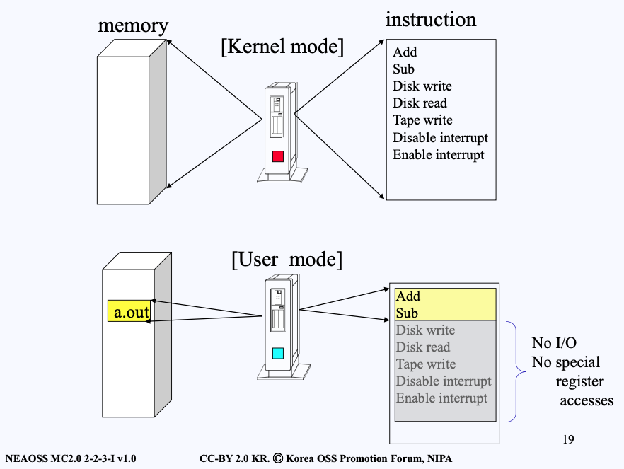
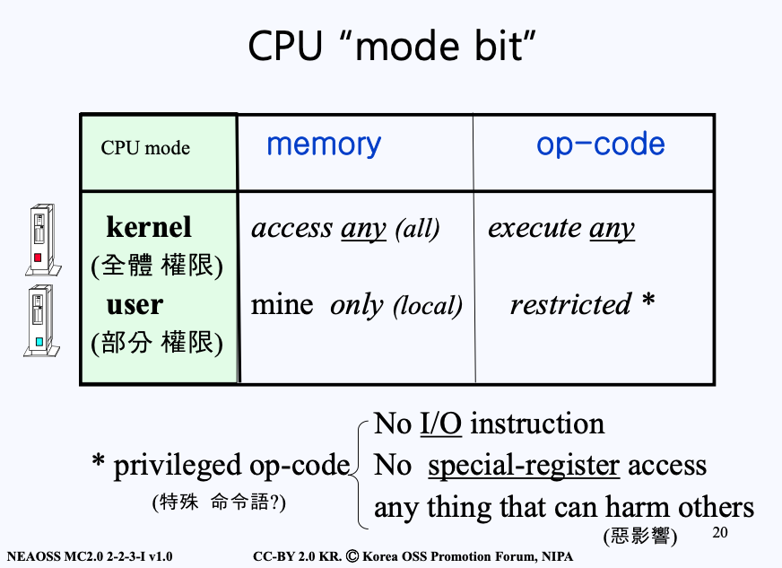
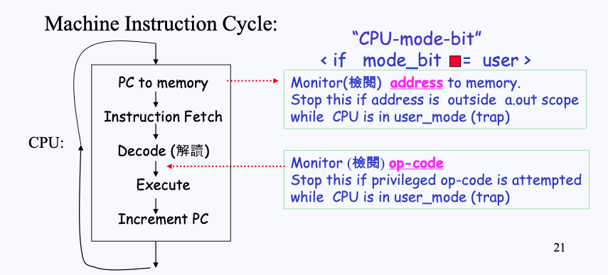

# Kernel of Linux
## Introduction : Level I

- Kernel
  - OS의 memory resident
  - 항상 메모리에 올라와
- utility
  - **command** 
  - OS의 disk resident
  - 디스크에 있다가 필요할 때 메모리에 올라왔다 내려가는 것
- shell
  - 유틸리티 중 하나로 Job Control
- file
  - sequence of bytes
  - I/O devices도 file 로 취급

## System Call : Level I
- Multi-user system : **Protection**
  - Private Information : stored in
    > Access to these should be prevented
    - memory
    - disk

- CPU_mode_bit
  - SW need HW‟s help to “prevents” illegal action
  - one HW bit : in CPU (usually part of PSW)
  - machine instruction (SW) can read/write this
  - Access to mode_bit : is privileged op-code

- Source : 
  - read next byte from disk file X into my variable Y
- Binary : 
  - prepare all parameters(for disk read)
  - execute chmodk instruction

- At run time (part I : hardware) 
