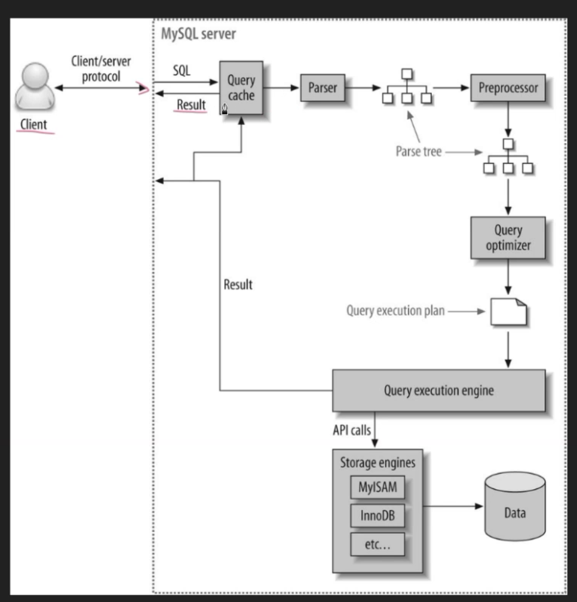

## MySQL
- MySQL(1995~)
  - 2008 | 썬 마이크로시스템즈가 인수
  - 2010 | 오라클이 인수
  - **싸다.**
  - 2000년대 중후반 부터 데이터의 특성이 변해가고 있음
    - SNS 서비스
    - 사물 인터넷
    - 빅 데이터 (모든 정보를 수집해서 분석)
  - 소규모 장비를 Scale-Out 해서 사용하는데 적합 (복제, 샤딩)
  - MySQL InnoDB의 성능, 기능은 타 DBMS와 비교해서 뒤쳐지지 않는다.
  - Plug-in 방식의 스토리지 엔진
  - MariaDB
  - MS-SQL에 비해서 다양한 플랫폼을 지원한다.

### InnoDB 스토리지 엔진
- 5.5부터 기본 스토리지 엔진으로 지정
- 트랜잭션 지원 (bulit-in 중에서는 유일)
- 레코드(row) 기반의 lock을 제공
  - 높은 동시성 처리 가능하고 안정적이면 성능이 뛰어남
- Primary key에 의한 클러스터링
  - InnoDB의 모든 테이블을 PK를 기준으로 클러스터링 되어 저장된다
    - 디스크 상에 저장될 때 PK 순서대로 저장한다.
- MVCC(Multi Version Concurrency Control) 기술을 사용해 락을 걸지 않고 일관된 읽기 작업을 수행
  - MVCC : 하나의 레코드(row)에 대해 여러 개의 버전이 동시에 관리된다.
  - 다른 트랜잭션이 가지고 있는 락을 기다리지 않고 읽을 수 있다.
  - 언두(Undo) 로그를 사용해서 지원
- MylSAM 에 비해 월등한 성능
- 외래 키 지원
  - 하지만 실무에서는 잘 사용되지 않음

### I/O
#### 디스크에서 데이터 읽기
- 디스크에서 데이터를 읽기 위해서는
  1. 데이터가 저장된 트랙으로 헤더 이동
  2. 플래터가 돌아갈 때 데이터가 저장된 섹터가 지나가기를 기다림
  3. 데이터를 읽음

#### 저장 장치별 성능
- 주요 저장 장치들이 요청된 작업르 처리하는데 소요되는 시간
  - 메모리 디스크의 처리 속도는 100,000배 이상의 차이
  - 메모리와 SSD는 1,000배 정도의 차이

#### 랜덤 I/O와 순차 I/O
- 3개의 페이지(16KB x 3)를 기록하기
  - 순차 I/O : 1번의 시스템 콜을 요청
    - 디스크 헤드를 1번 이동
  - 랜덤 I/O : 3번의 시스템 콜을 요청
    - 디스크 헤드를 3번 이동
- DBMS는 랜덤 I/O를 통한 작은 데이터 I/O가 대부분
> **데이터베이스의 성능을 높이기 위해서는 I/O (특히 랜덤)를 줄여야 함.**

### Index
- 책의 색인, 찾아보기
  - 책 내용은 "데이터 파일(테이블)"
  - "색인 항목"은 저장된 위치의 페이지 번호를 가짐.
- 테이블의 모든 내용을 검색하려면 시간이 오래 걸림
  - 컬럼(들)의 값과 저장된 주소를 key-value 쌍으로 저장
- 미리 정렬되어 있음 => 빠름
  - 데이터를 찾을 때는 이미 정렬되어 있어 => 빠른 검색(비용 감소)
  - 데이터를 저장할 때 마다 값을 정렬해야함 => 느림(비용 증가)
- 데이터를 저장(CUD) 성능을 희생하고 읽기(R) 성능을 높임
  - trade-off 관계이므로 인덱스의 추가는 상황에 맞게
- **B-Tree 알고리즘**
  - 가장 일반적으로 사용되는 인덱스 알고리즘. B??
  - InnoDB에서는 B+Tree를 사용
- Primary Key
  - == index, unique, not null
- Unique Key
  - == index, 보조 인덱스, unique, nullable
- Secondary Key
  - == index, 보조 인덱스

#### B+Tree
- MySQL에서 실제로 사용되는 트리 자료구조
- 모든 레코드들이 리프 노드에 정렬되어 있음
- 리프 노드들은 linked-list 형태로 서로 연결되어 있음.
- 블록 지향적인 스토리지 환경에서 효율적인 검색을 위해 데이터를 저장하는 방법

#### B-Tree 인덱스의 구조
- 루트 ㄷ 브랜치 ㄷ 리프
- 인덱스의 리프 노드는 실제 데이터 레코드를 찾아가기 위한 주소 값을 가짐
- 페이지(Page)
  - InnoDB가 디스크에 데이터를 읽고 쓰는 가장 기본적인 단위
  - (=16KB)
- 인덱스도 페이지 단위로 관리되며, 1개의 노드는 1개의 페이지 안에 포함될 수 있는 크기

#### 클러스터링 인덱스
- 테이블의 레코드는 디스크 상에 PK의 순서대로 저장됨
- 정렬되어 저장되어 있으므로 PK로 row를 찾는 것은 굉장히 빠름
- InnoDB의 모든 인덱스는 레코드 주소로 PK의 값을 가짐
  - PK의 값이 변경되는 경우 디스크에서의 위치가 바뀜(재 정렬)
    - 레코드 주소가 변경됨
    - 인덱스가 레코드의 주소를 가지고 있다면 모든 인덱스에 대해서도 갱신 작업 필요
    - 차라리 레코드 주소 대신 PK 값을 가지고 있는 것이 나음

#### 다중 컬럼 인덱스 (Multiple Column Index)
- 두 개 이상의 컬럼으로 구성된 인덱스 (=Concatenated Index)
- 오른쪽 컬럼은 왼쪽 컬럼 값에 의존해서 정렬됨
- 인덱스 내에서 각 컬럼의 위치(순서)가 매우 중요
- 선택도(기수성)이 높은 컬럼이 앞에 오는 것이 좋음

#### B-Tree 인덱스 사용에 영향을 미치는 요소
- 100% 일치 또는 값의 앞 부분(Left-most part)만 일치하는 경우에만 사용 가능
  - 부등호 비교(<>, !=, NOT ~)
  - 뒤 부분 값 일치(LIKE '%...)
  - 인덱스 값의 변형이 가해진 후 비교되는 경우(이미 인덱스에 존재하지 않는 값)
- 인덱스 키 값의 크기
  - B-Tree의 자식 노드 개수는 가변
  - InnoDB의 모든 페이지 크기는 16KB
  - 인덱스 키 값이 커지면 하나의 페이지에 저장할 수 있는 수가 줄어듦
    - 페이지 수가 늘어남 => 디스크 상의 블록 수가 늘어남
    - 디스크를 읽는 횟수가 증가 => 느려짐
    - 메모리(버퍼, 캐시)에 캐시해 둘 수 있는 인덱스 레코드 수가 줄어듬(메모리 효율 감소)
- 선택도(Selectivity) != 기수성(Cardinality)
  - 선택도 : 인덱스 내의 키 값 중 유니크한 값의 비율 (기수성 : 유니크 수)
    - A : SELECT COUNT(*) FROM users;
    - B : SELECT COUNT(DISTINCT user_name) FROM users;
    - user_name 컬럼의 selectivity = B/A
  - 이상적인 선택도는 1 (Unique, Not NULL 컬럼에서만 가능)
  - 인덱스의 선택도가 매우 낮은 경우에는 사용되지 않음
- 읽어야 하는 레코드의 건수
  - 인덱스를 통해 테이블의 레코드를 읽는 것은 인덱스를 거치지 않고 테이블의 레코드를 읽는 것보다 높은 비용(4~5배)이 드는 작업
    - 인덱스를 읽은(순차 I/O) 후 찾은 row 수 만큼 데이블을 읽어야(랜덤 I/O) 함
  - 인덱스를 읽은 후 대상 row를 테이블에서 찾기 VS 테이블만 읽어 대상 row를 찾기
    - 인덱스를 사용했을 때 예상되는 결과 row의 수가 테이블 전체의 row 수 중 20~25% 이상인 경우 인덱스를 사용하지 않고 테이블을 처음부터 끝까지 읽어서 처리함(순차 I/O의 효율성) 

#### 컬럼에 인덱스가 존재함에도 사용하지 않는 케이스
1. 부정형 조건
  - WHERE column <> 'N'
  - WHERE column != 'N'
  - WHERE column NOT IN (10, 11, 12)
  - WHERE column IS NOT NULL
  - WHERE column NOT BETWEEN 'B' AND 'C'
2. LIKE '%??' (후방일치)
  - WHERE column LIKE '%길동'
  - WHERE column LIKE '_길동'
  - WHERE column LIKE '%길%'
3. 인덱스 컬럼의 변형(함수, 연산자)
  - WHERE SUBSTRING(column, 1, 1) = 'A'
    - => WHERE column LIKE 'A%'
  - WHERE column + 1 > 10
    - => WHERE column > 9
4. 데이터 타입이 서로 다른 비교 (인덱스 컬럼의 형변환 발생)
  - WHERE char_column = 10
    - 문자 컬럼이 숫자와 비교되는 경우 문자 컬럼이 숫자로 자동 형변환 된 후 비교됨
    - WHERE char_column = '10'
5. 다중 컬럼 인덱스인 경우
  - INDEX idx_test(column1, column2, column3, ... columnN)
  - 맨 좌측 컬럼에 대한 조건이 없는 경우
    - WHERE column2 = 1 AND column3 = 2  -- column1 ??
  - 맨 좌측 컬럼의 비교 조건이 인덱스 사용 불가 조건 중 하나인 경우
    - WHERE column1 <> 1 AND column2 = 2
    - WHERE column1 + 1 = 3 AND column2 > 3
6. WHERE 조건이 없는 경우
  - SELECT user_name FROM users; -- WHERE ??
7. WHERE 절에 인덱스로 지정된 컬럼에 대한 조건이 없는 경우
  - 인덱스는 column1에만 존재할 때
  - WHERE column2 = 1 AND column3 = 2
8. 인덱스의 선택도가 나쁠 빼
  - status 컬럼에는 'YES'가 99건, 'NO'가 1건 존재할 때
  - WHERE status = 'YES'
    - 인덱스 99건을 읽은 후 테이블에서 99건을 다시 읽어야 함
  - 인덱스를 통해 읽어야 할 레코드 건수가 전체의 20~25% 이상이면 
9. WHERE 절의 조건을 만족하는 레코드가 너무 많은 경우
  - column1, column2 가 다중 컬럼 인덱스이고
  - 테이블에 100건의 데이터가 있을 때
  - WHERE column1 > AND column2 >0; -- 99건이 조회 되는 경우
10. 인덱스가 존재하는 컬럼에 IN (SELECT ...)를 사용
  - column1에 인덱스가 존재할 때 
  - WHERE column1 IN (SELECT value FROM table ...) AND column2 = 3  
    - IN 조건을 제외한 나머지 WHERE 조건을 만족하는 모든 row에 대해 루프를 돌면서 "SELECT ..."를 실행한 결과 값과 비교하는 형태로 대부분 실행됨
    > pseudo code:
    > 
    > for (row : 나머지 WHERE 조건을 만족하는 rows) {
    > 
    >     array[] values = (SELECT value FROM table ...)
    > 
    >     if (row.column1 IN (values) {    // true of false
    > 
    >         // row는 모든 조건을 만족
    >     }
    > 
    > }
    - WHERE column1 IN (1, 2, 3, ...) 형태로 변경해야함

#### 커버링 인덱스(Covering Index)
- SELECT를 수행할 때 테이블을 읽지 않고 인덱스만 읽어서 처리되는 것
- 인덱스만 읽어서 속도가 빠름
- WHERE 조건을 비교하기 위한 컬럼 값과 SELECT에 명시된 컬럼이 인덱스에 모두 존재하는 경우
  - > users 테이블에 idx_user(age, user_name, reg_date)가 존재
    > > SELECT user_name, reg_date
    > >
    > > FROM users
    > >
    > > WHERE age BETWEEN 10 AND 12
    > 
    > idx_user 인덱스에 모든 컬럼이 존재하므로 테이블을 읽을 필요가 없음

#### Duplicate/Redundant Index
- 테이블에 동일한 컬럼에 대해 여러 개의 인덱스가 존재하는 것
  - PRIMARY KEY(id)
  - UNIQUE KEY uk_id(id) => X
  - KEY key_id(id) => X
- 다중 컬럼 인덱스인 경우 컬럼 순서가 다르면 중복이 아님
  - index (a, b) != index(b,a)
- 다른 인덱스의 앞쪽 부분 집합으로 정의된 인덱스
  - index_a (A) => X
  - index_ab (A, B)
    - 컬럼수가 많은 인덱스가 사용될 가능성이 높음. 선택도 높거나 커버링 인덱스가 될 가능성이 큼
  - 만일 B 컬럼의 길이가 매우 긴 경우에는 index_a가 사용될 수 있음
    - A : int, B : varchar(255)
    - index_ab를 읽는 것 보다 index_a를 읽는 것이 훨씬 빠름

#### B-Tree 인덱스의 정렬 및 스캔 방향
- MySQL에서 인덱스의 키 값은 항상 오름차순으로만 정렬됨
  - MySQL에서 인덱스 생성 구문의 ASC, DESC는 의미 없으며, 미래의 호환성을 위해서 존재함.
- 인덱스를 거꾸로 끝에서부터 읽으면 내림차순으로 정렬된 인덱스처럼 사용할 수 있음.

#### Analyze(통계 정보 수집)의 필요성
- InnoDB 테이블의 경우, 인덱스에 대한 통계 정보를 관리하고 각 통계 정보를 기반으로 쿼리의 실행 계획을 수립
- 인덱스의 통계 정보 확인
  - mysql> SHOW INDEX FROM table;
- MySQL은 통계 정보를 자동으로 자주 갱신함
- analyze 명령으로 통계 정보를 수집할 수 있음
  - 테이블의 데이터가 별로 없는 경우 (주로 개발용 데이터베이스)
  - 단시간에 대량의 데이터가 늘거나 줄어든 경우
  - 주의 : InnoDB는 테이블이 잠겨서 읽기/쓰기 처리가 불가

#### 인덱스와 잠금
- InnoDB의 잠금은 레코드를 잠그는 것이 아니라 인덱스를 잠그는 방식으로 처리됨
  - 변경해야 할 레코드를 찾기 위해 검색한 인덱스의 레코드를 모두 잠금
  
## Excution Plan
### 쿼리 실행 구조 1
1. Client 가 Server에 SQL 요청
2. 쿼리 캐시에 동일한 SQL 문장에 대한 결과 집합이 존재하면 바로 반환
   - 쿼리 캐시는 "SQL 문장'-'결과 집합" (key-value) 형태
3. 파서는 SQL을 토큰으로 분리해 트리 형태의 구조로 만듦
   - 기본 문법 오류 체크
   - 토큰은 MySQL 엔진이 인식할 수 있는 최소 단위
4. 전처리기는 파스 트리의 각 토큰에 대한 구조적인 문제점이 있는지 확인
   - 객체 존재 여부
   - 객체 접근 권한
5. 옵티마이저는 쿼리 무장을 낮은 비용으로 가장 빠르게 처리할 수 있는 실행 계획 수립
6. 실행 엔진은 스토리지 엔진의 API를 호출하여 실행 계획을 실행
   - 스토리지 엔진은 데이터 저장소에서 데이터 조회
   - MySQL 엔진은 조인, 정렬 등 수행
7. 실행 결과를 사용자에게 반환
   - 쿼리 캐시에도 전달됨

### 옵티마이저(Optimizer)
- SQL을 가장 빠르고 효율적으로 수행할 최적(최소 비용)의 처리 경로(실행 계획)를 생성해 주는 DBMS 내부의 핵심 엔진
- 실행 계획 선택 과정
  - 사용자가 실행한 SQL의 수행을 위한 후보군 실행 계획을 찾음
  - 오브젝트 정보, 시스템 통계 정보 등을 이용해 각 실행 계획의 예상 비용을 산정
  - 각 실행 계획을 비교해서 최소 비용을 갖는 하나를 선택
- MySQL 옵티마이저는 SQL 파트 트리를 가지고
  - 불필요한 조건의 제거 및 복잡한 연산의 단순화
  - 여러 테이블의 조인이 있는 경우 어떤 순서로 테이블을 읽을지 결정
  - 각 테이블에 사용된 조건과 인덱스 통계 정보를 이용해 사용할 인덱스 결정
  - 가져온 레코드들을 임시 테이블에 넣고 다시 한번 가공해야 하는지 결정
    - 결과물은 실행 계획
- MySQL의 옵티마이저는 쫌 그렇다..

### 실행 계획(Execution Plan)
- 옵티마이저가 수립한 SQL을 실행하기 위한 최적의 방법
- MySQL에서는 EXPLAIN 명령어로 조회

### Explain 개요
- 쿼리 문장의 특성에 따라 표 형태로 된 1줄 이상의 결과가 표시
- 각 레코드는 쿼리 문장에서 사용된 테이블의 개수만큼 출력
   - 서브쿼리로 임시 테이블을 생성한 경우 그 임시 테이블까지 포함
- 실행 순서는 위에서 아래 순서
- 위쪽에 출력된 결과일수록(id 컬럼 값이 작을수록) 쿼리의 바깥(outer) 부분이거나 먼저 접근한 테이블
- 아래쪽에 출력된 결과일수록(id 컬럼 값이 클수록) 쿼리의 안쪽(Inner) 부분 또는 나중에 접근한 테이블
#### Explain - select_type 컬럼
- DEPENDENT SUBQUERY  
  - 서브 쿼리가 바깥쪽(outer) SELECT 쿼리에서 정의된 컬럼을 참조
  - 안쪽(inner)의 서브 쿼리가 바깥쪽 SELECT 쿼리의 컬럼에 의존적
  - 외부 쿼리가 먼저 수행된 후 결과 row 수 만큼 내부 쿼리(서브 쿼리)가 실행되어야 하므로 row 수가 많은 경우 속도가 느려진다.
    - 내부 쿼리가 "스칼라 서브 쿼리(Scalar SubQuery)"로 동작하고, 코드성 데이터를 조회하는 경우에는 내부적으로 캐시 된 데이터를 참조 하므로 속도 저하는 별로 없다
  - Example
    - > SELECT e.first_name,  (SELECT COUNT(*) FROM dept_emp de WHERE de.emp_no = e.emp_no) AS count FROM employees e WHERE e.emp_no = 10001

#### Explain - type 컬럼 1
- 각 테이블의 접근 방식(access type)
- 주요 type (성능이 빠른 순서)
- const
- eq_ref
- ref
- ref_or_null
- unique_subquery
- index_subquery
- range
- index_merge
- index
- ALL : 인덱스를 사용하지 않음

### Sub Query 결과 캐시
- 서브 쿼리는 외부(outer)의 결과 row 수 만큼의 수행됨
- "조건"이 똑같은 서브 쿼리가 실행될 때를 위해서, 이전의 실행 결과를 재사용할 수 있게 캐시에 저장
- 따라서 "조건"의 케이스가 많지 않다면 서브 쿼리의 수행 횟수가 많더라도 속도가 많이 느려지지 않음

### 풀 테이블 스캔
- 인덱스를 사용하지 않고, 테이블의 데이터를 처음부터 끝까지 읽어서 요청된 작업을 처리
- 개발자나 DBA 사이에서는 흔히 "풀 스캔" 으로 불림
- MySQL 옵티마이저가 풀 테이블 스캔을 선택하는 경우
  - 테이블의 레코드 건수가 너무 작아서 인덱스를 통해 읽는 것보다 풀 테이블 스캔이 빠른 경우(테이블이 페이지 1개로 구성된 경우)
  - WHERE 절이나 ON 절에 인덱스를 이용할 수 있는 적절한 조건이 없는 경우
  - 인덱스를 사용할 수 있는 쿼리라도 조건에 일치하는 레코드 건수가 너무 많은 것으로 예상 되는 경우(통계 정보 기준)
- 풀 테이블 스캔은 순차 I/O
  - 인덱스를 통해 테이블을 읽을 때는 랜덤 I/O

### MySQL 문자열 정렬 순서
- MySQL에서 문자열 컬럼의 정렬 순서
  - Null
  - 숫자
  - 영문자
  - 한글

#### 컬럼 값 비교시 대소문자 여부
- MySQL 에서는 컬럼 값 비교 시 대소문자를 구분하지 않음

#### DISTINCT vs GROUP BY
- SELECT DISTINCT ... GROUP BY .... => 중복
- **DISTINCT 와 GROUP BY 의 결과는 동일**
- 중복을 제거하려면 SELECT DISTINCT ...
- 집계(집합 함수)를 하려면 SELECT ... GROUP BY

#### Full GROUP BY
- MySQL은 GROUP BY에 포함되지 않은 컬럼이더라도 집합 함수의 사용 없이 SELECT 절이나 HAVING 절에 사용할 수 있음
- 다른 DBMS와 차이 (SQL 표준이 아닌지는 논란이 있음)
- Full GROUP BY를 사용하지 않으면 가독성 감소, 사용자 실수 증가
  - GROUP BY에 포함되지 않은 일반(집합 함수를 사용하지 않는) 컬럼들은 무슨 값이 조회될 지 예측할 수 없음
  - 실수로 GROUP BY에 포함하지 않은 것인지, 의도된 것인지 알 수 없음
- 집합 함수가 사용되지 않은 모든 컬럼은 반드시 GROUP BY에 포함해서 SQL을 작성해야 함

#### 정렬을 발생 시키는 구문
- 정렬은 성능에 나쁜 영향을 미침
- 정렬을 발생하는 것들
  - ORDER BY
  - GROUP BY
    - 정렬을 한 후 그루핑
  - DISTINCT
    - 정렬을 한 후 중복된 행을 제거함
  - UNION
    - 결과 집합들을 하나로 합침. 단, 중복 row는 하나만 표시
    - UNION ALL : 결과 집합을 하나로 합치지만 중복 row는 제거하지 않음

#### Query Cache 사용 방지 (테스트 목적)
- SQL 수행 시간을 측정하기 위해 여러 번 실행해 보는 경우 쿼리 캐시로 인해 정확하게 측정할 수 없음
- SQL_NO_CACHE 옵션을 사용
> SELECT SQL_NO_CACHE id, name FROM table; 

#### BIGINT(20)
- 우리가 테이블 생성할 때 숫자 타입에 자릿수를 지정해 주는데..
  - CREATE TABLE ... orderNo BIGINT(20) ...
- INT는 4 byte, BIGINT는 8 byte로 고정되어 있음
  - 사용할 수 있는 숫자의 범위(자릿수)가 이미 정해져 있다는 것!!
- 자릿수는 뭐임?
