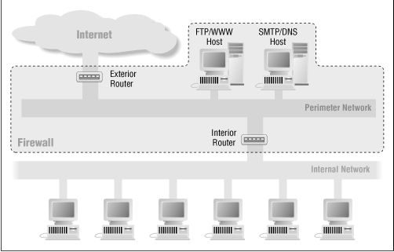
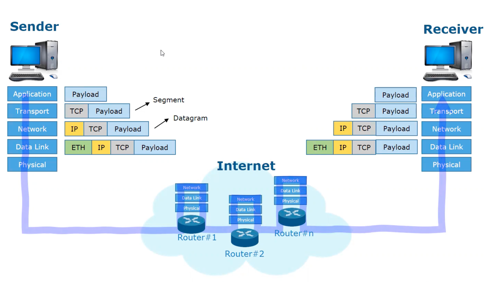
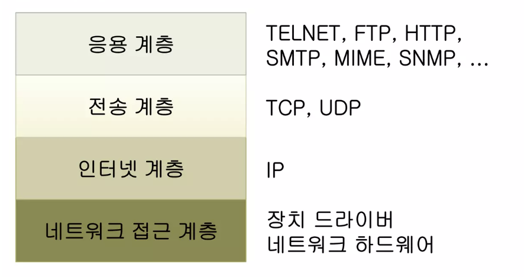
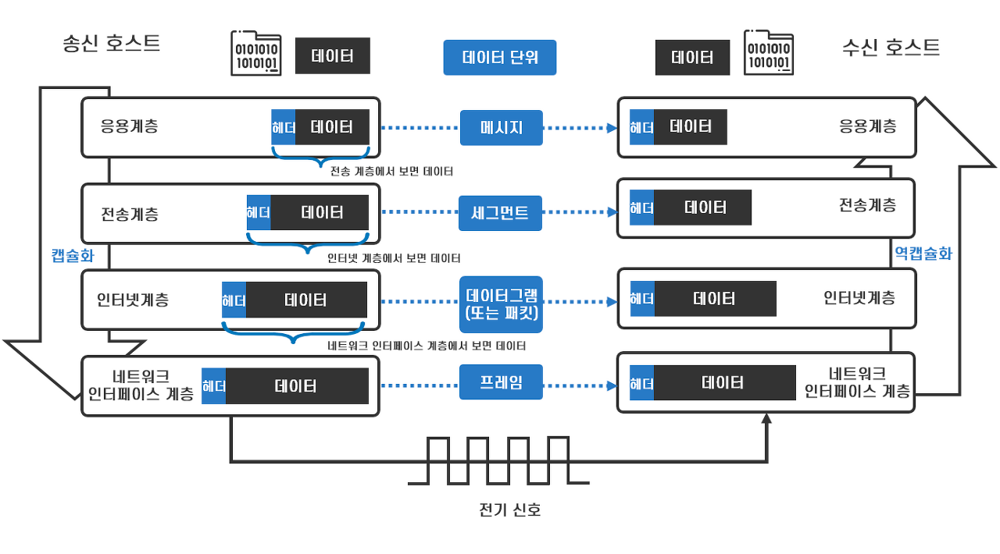
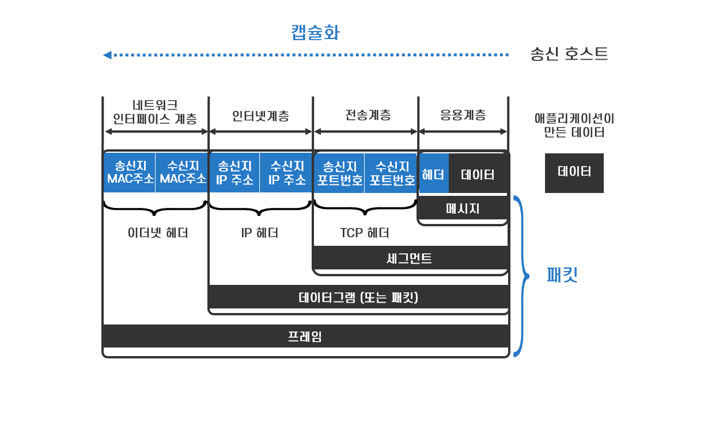
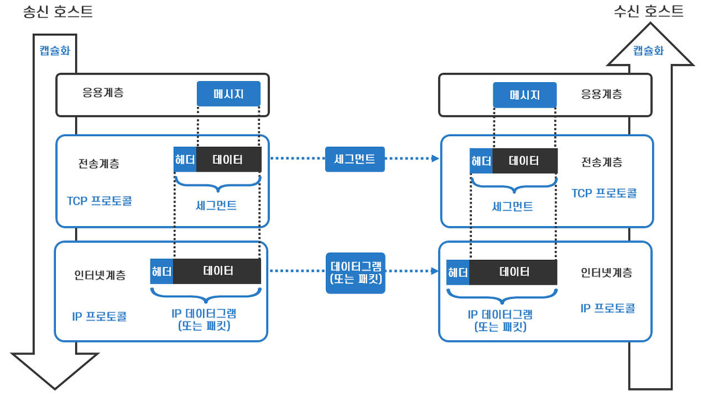
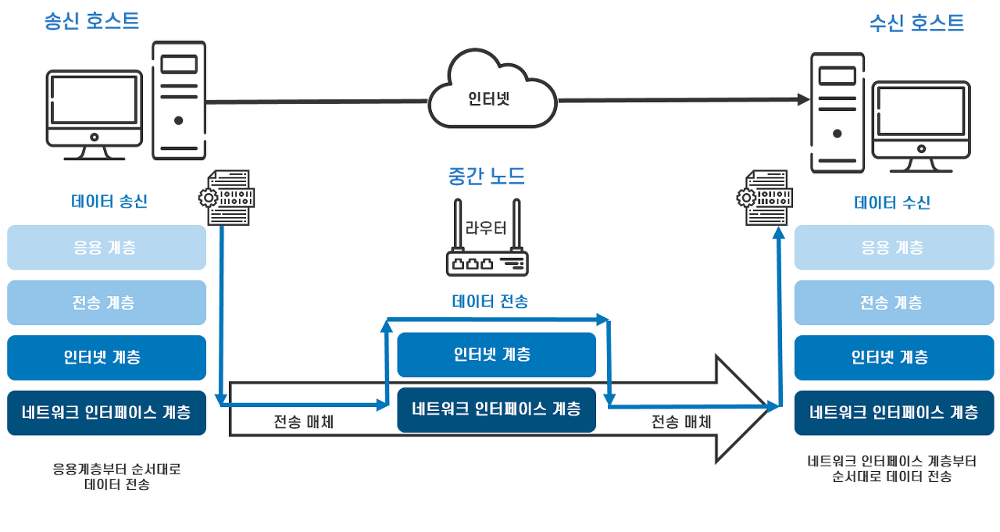
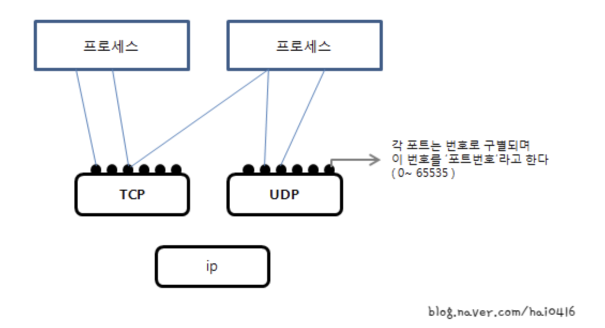

# Chapter 01. 네트워크와 소켓 프로그래밍
## 01. TCP/IP 프로토콜 개요
- 이 절에서는 네트워크 프로그래밍을 위한 준비 과정으로, 인터넷의 바탕을 이루는 TCP/IP 프로토콜을 살펴본다.
- 소켓 프로그래밍에 필요한 핵심 내용을 위주로 소개한다.
### 1.1. TCP/IP 프로토콜 구조
- 인터넷을 통해 통신을 수행하는 개체는 크게 호스트와 라우터로 나눌 수 있다.
  - 호스트(Host)는 최종 사용자(End-user)의 응용 프로그램을 수행하는 주체로, 인터넷에 연결된 PC, 노트북, 스마트폰, 태블릿 등이 여기에 속한다.
- 라우터(Router)는 호스트에서 생성된 데이터를 여러 네트워크를 거쳐 전송함으로써 서로 다른 네트워크에 속한 호스트 간에 데이터를 교환할 수 있도록 하는 장비이다.
- 호스트와 라우터, 라우터와 라우터 그리고 호스트와 호스트가 통신하려면 정해진 절차와 방법을 따라야 하는데,, 이를 통신 프로토콜(Coumunication Protocol, 이하 프로토콜)이라 부른다.
  
- 인터넷에서 사용하는 핵심 프로토콜은 TCP와 IP로, 이를 비롯한 각종 프로토콜을 총칭하여 TCP/IP 프로토콜이라고 부른다.
- TCP/IP 프로토콜은 아래와 같이 운영체제의 일부로 구현되어 제공되며, 응용 프로그램은 TCP/IP 프로토콜의 서비스를 사용하여 통신한다.
- 아래에서 통신을 수행하는 주체이자 통신의 최종 목적지는 호스트 자체가 아닌 호스트에서 수행하는 응용 프로그램이라는 점에 주목한다.
  
- 응푱 프로그램 간의 통신을 위해서는 다양한 요구 사항을 만족해야 한다.
  - 그 예로는 통신할 대생(호스트 자체와 호스트에서 수행하는 응용 프로그램)을 지정하는 상호 약속된 방법, 전송 오류 확인 기능, 오류 발생 시 재전송 기능, 데이터의 순서 관계 유지 등을 들 수 있다.
- 통신 프로토콜은 그 종류에 따라 이런 요구 사항 중 일부 또는 전체 기능을 제공해준다.
  - 따라서 응용 프로그래머는 각 프로토콜의 특성에 대한 이해를 토대로 적절한 프로토콜을 선택하고, 제공되지 않는 기능이 있다면 직접 구현할 수 있어야 한다.
- 통신 프로토클은 기능별로 나누어 계층적으로 구현하는 것이 일반적이며, TCP/IP 프로토콜도 이 구조를 따른다.

#### 네트워크 접근 계층
- **네트워크 접근 계층(Network Access Layer)**은 물리적 네트워크를 통한 실제 데이터 송수신을 담당한다.
  - 구성 요소로는 물리적 신호를 처리하여 데이터를 송수신하는 네트워크 하드웨어와 운영체제가 제공하는 장치 드라이버가 있다.
- 네트워크 접근 계층에서는 하드웨어적으로 정의된 물리적 주소(Physical Address)를 사용하여 통신한다.
  - 물리적 주소는 네트워크 방식에 따라 다르며 일반적으로 상호 호환되지 않는다.
  - 예를 들면 이더넷(Ethernet)에서는 48비트 물리적 주소를 사용하는데, 윈도우에서는 ipconfig /all 명령으로, 리눅스에서는 ifconfig 명령으로 확인할 수 있다.
> 48비트 물리적 주소가 16진수로 표시된다는 것에 유의한다. 리눅스는 설치 옵션에 따라 ifconfig 명령이 없을 수도 있는데, 이런 경우에는 패키지 관리자를 이용하여 적절한 패키지를 설치해 주어야 한다. 
#### 인터넷 계층
- 인터넷 계층(Internet Later)은 네트워크 접근 계층의 도움을 받아 데이터를 목적지 호스트까지 전달하는 역할을 한다.
  - 네트워크 접근 계층처럼 주소를 지정하는 방법이 필요한데, 하드웨어적으로 정의된 물리적 주소 대신 소프트웨어적으로 정의된 논리적 주소인 IP 주소(Internet Protocol Address)를 사용한다.
- IP 주소는 네트워크 접근 계층에서 사용하는 물리적 주소와는 별개로 정의하며, 전 세계적으로 유일성을 보장한다.
  - 서로 다른 기술에 기반한 물리적 네트워크를 연결하여 좀 더 규모가 큰 인터-네트워크(Inter-network)를 구성하려면 물리적 주소와 무관한 단일 주소 지정 방식이 필요한데, IP 주소가 이런 요구 사항을 만족한다.
    - 즉, IP 주소는 통신에 참여하는 개체 각각에 유일성을 지정하여 제공한다.
  - IP 주소의 유일성과 하드웨어의 독립성을 기반으로 TCP/IP 프로토콜은 다양한 네트워크 기술과 하드웨어에서 작동할 수 있으며, 이를 통해 전 세계적인 네트워크인 인터넷(Internet)을 만들 수 있게 되었다.
#### 전송 계층
- 전송 계층(Transport Layer)은 최종 통신 목적지를 지정하고 오류 없이 데이터를 전송하는 역할을 한다.
  - 앞서 언급한 인터넷 계층의 역할은 IP 주소와 라우팅을 이용하여 목적지 호스트에 데이터가 도달할 수 있도록 하는 것이다.
  - 그러나 통신의 최종 목적지는 호스트가 아닌 해당 호스트에서 실행되는 프로세스(응용 프로그램)다.
  - 전송 계층에서는 프로세스를 지정하는 16비트 주소를 사용하는데, 이를 포트 번호(Port Number)라고 한다.
- 인터넷 계층의 IP가 제공하는 전송 서비스는 최선을 다하지만(Best-effort) 신뢰성은 없다(Unreliable)는 특징이 있다.
  - 즉, 데이터에 문제가 생기면 목적지에 도달하지 못하는 상황이 발생할 수 있고, 목적지에 도달해도 실제 데이터의 내용이 손상되었을 가능성도 있다.
  - 전송 계층에서는 이런 데이터 손실 또는 손상을 검출하여 잘못된 데이터가 목적지에 전달되지 않도록 한다.
- 전송 계층에 해당하는 인터넷 프로토콜로는 TCP(Transmission Control Protocol)와 UDP(User Datagram Protocol)가 있다.
  - 응용 프로그램에서 데이터 전송을 위해 TCP를 사용할 때는 TCP/IP로, UDP를 사용할 때는 UDP/IP로 표기한다.
  - TCP와 UDP 프로토콜의 특징은 다음과 같다. 
##### TCP와 UDP의 특징
| 항목  | TCP                                          | IP                                              |
|-----|----------------------------------------------|-------------------------------------------------|
| 1   | 연결형(Connection-oriented) 프로토콜 : 연결 성절 후 통신 가능 | 비연결형(Connectionless) 프로토콜 : 연결 설정 없이 통신 가능      |
| 2   | 신뢰성 있는 데이터 전송 : 필요시 데이터 재전송                  | 신뢰성 없는 데이터 전송 : 데이터 재전송 하지 않음                   |
| 3   | 일대일 통신(Unicast)                              | 일대일 통신(Unicast) 일대다 통신(Broadcast, Multicast |
| 4   | 데이터 경계 구분 안 함 : 바이트 스트림(Byte-Stream) 서비스     | 데이터 경계 구분함 : 데이터그램(Datagram) 서비스                |
#### 응용 계층
- 응용 계층(Applcation Layer)은 전송 계층을 기반으로 하는 다수의 프로토콜(Telnet, FTP, HTTP, SMTP 등)과 이 프토토콜을 사용하는 응용 프로그램을 포괄한다.
### 1.2. 데이터 전송 원리
- 앞서 소개한 TCP/IP 프로토콜 구조를 토대로 데이터 전송 원리를 살펴보자.
  - 송신 측 호스트의 응용 프로그램이 보내는 데이터를 수신 측 호스트의 응용 프로그램에 전송하려면 각 프로토콜에서 정의한 제어 정보(IP 주소, 포트 번호, 오류 체크 코드 등)가 필요하다.
  - 제어 정보는 위치에 따라 앞쪽에 붙는 헤더(Header)와 뒤쪽에 붙는 트레일러(Trailer)로 나뉜다.
  - 데이터는 이런 제어 정보가 결합한 형태로 전송되며, 이를 패킷(Packet)이라 부른다.
    - 즉, 패킷은 '제어 정보 + 데이터'로 정의할 수 있다.

- 위와 같은 패킷 전송 형태를 각 계층의 관점에서 보면 아래와 같다.
  - 각 계층은 동일 위치의 상대편 계층과 통신하는 것으로 간주할 수 있다.
  - 예를 들면, 송신 측 응용 프로그램이 보낸 데이터는 TCP/IP/이더넷을 거쳐 제어 정보가 덧붙은 형태로 전송되지만, 궁긍적으로 수신 측 응용 프로그램은 모든 제어 정보가 제거된 데이터만 받는다.
    - 따라서 응용 프로그래머는 주고받을 데이터에만 집중하여 구현하고, 나머지는 운영체제가 제공하는 프로토콜이 처리하도록 맡기면 된다.

> 송신 측에서 보낸 이더넷 패킷이 그대로 수신 측에 도달하는 경우는 두 호스트가 같은 물리적 네트워크에 있을 때뿐이다.
- TCP/IP 프로토콜을 사용한 데이터 전송 원리를 일반화 하면 아래와 같다.
  - 응용 계층과 전송 계층은 종단에서만(End-to-end) 존재하고 작동하며, 하부 계층이 제공하는 기능을 통해 가상적인 연결이 존재하는 것으로 간주한다.
  - 반면, 인터넷 계층은 호스트와 라우터에 모두 존재하고 작동하며, IP 주소와 라우팅 기능을 통해 패킷 전송 경로를 결정한다.
  - 실제 패킷 전송에는 네트워크 접근 계층이 제공하는 물리적 주소를 사용하는데, 물리적 주소는 패킷이 라우터를 통과할 때마다 다음 지점의 물리적 주소로 계속 변경되면서 최종 목적지 호스트에 도달한다.
    
### 1.3. IP 주소, 포트 번호
- TCP/IP 프로토콜을 사용하여 통신할 때는 IP 주소와 포트 번호를 사용한다. 
  - IP 주소는 IPv4(IP 버전 4)와 IPv6(IP 버전 6) 두 종류가 있으며, 각각 32비트와 128비트 값을 사용한다.
    - 다음 예와 같이 IPv4는 8비트 단위로 점(.)으로 구분하여 10진수 네 개로 표기한다.(Dotted-decimal notation)
      - Ipv4 주소 - 147.46.114.70
    - IPv6는 16비트 단위로 클론(:)으로 구분하여 16진수 여덞 개로 표기한다.(Colon-hexadecimal notation)
      - Ipv6 주소 - 2001:0230:abcd:ffab:0023:eb00:ffff:1111
- 폐쇄된 네트워크이거나 IP를 공유하는 경우가 아니면 IP 주소는 전 세계적으로 값이 유일하다.
  - 라우터가 라우팅할 때는 IP 헤더에 포함된 고유한 수신자 IP 주소를 사용하며, 데이터를 받은 쪽에서 응답을 보낼 때는 IP 헤더에 퐇마한 고유한 송신자 IP 주소를 사용한다.
- IP 주소는 인터넷에 있는 호스트를 유일하게 구별할 수 있으나 통신의 최종 주체인 프로세스를 식별하지는 못한다.
  - 프로세스 식별자로는 16비트 포트 번호를 사용한다.
  - 흔히 포트 번호는 프로세스를 구별하는 번호로 알려져 있다.
  - 그러나 실제로 한 프로세스가 포트 번호를 두 개 이상 사용하는 경우가 종종 있으며, 둘 이상의 프로세스가 한 포트 번호를 사용할 수도 있다.
  - 따라서 포트 번호는 프로세스를 구별하는 번호라기보다 통신의 종착점(하나 혹은 여러 프로세스)을 나타내는 번호로 이해하도록 한다.
- TCP와 UDP는 부호 없는 16비트 정수를 포트 번호로 사용하기 때문에 0~65535 범위가 가능하다.
  - 하지만 모든 범위를 자유롭게 쓸 수 있는 것은 아니다.
  - 아래 표는 포트 번호를 영역 별로 나눈 것이다.
    - 주의할 점은 포트 번호 0~1023은 용도가 정해져 있으므로 함부로 사용하면 안 된다는 것이다.
    - 일반적으로 응용 서버를 작성할 때는 1024~49151 범위에서 하나 또는 일부를 선택하여 사용하는 것이 바람직하다.

| 포트 번호       | 분류                                     |
|-------------|----------------------------------------|
| 0~1023      | 알려진 포트(Well-known Ports)               | 
| 1024~49151  | 등록된 포트(Registered Ports)               | 
| 49152~65535 | 동적/사설 포트(Dynamic and/or Private Ports) |
- IP 주소와 포트 번호의 관계를 도식화하면 아래와 같다.
  - 아래 그림은 IP 주소 그 개를 보유한 호스트를 나타낸다.
  - 한 프로세스가 둘 이상의 TCP 혹은 UDP 포트를 사용하거나 한 포트 번호를 두 개 이상의 프로세스가 사용하는 상황을 보여준다.

### 1.4. 클라이언트-서버 모델
- 네트워크 프로그램은 일반적으로 클라이언트-서버 모델(Client-Server Model)로 작성한다.
  - 클라이언트-서버는 두 프로그램이상호 작용하는 방식을 나타내는 용어로, 서비스를 요청하는 쪽을 클라이언트(Client), 클라이언트가 요청한 서비스를 처리하는 쪽을 서버(Server)라고 부른다.
- 한 컴퓨터에서 실행되는 두 프로그램 사이의 데이터 교환에 클라이언트-서버 모델 모델을 적용할 떄는 다양한 프로세스 간 통신(IPC; Inter-Process Communication) 기법을 사용할 수 있다.
  - 반면, 네트워크로 연결된 컴퓨터에서 각각 실행되는 두 프로그램에 적용할 떄는 반드시 통신 프로토콜을 사용해야만 데이터를 주고받을 수 있다.
- 클라이언트-서버 모델의 필요성을 알아보기 위해 두 예를 들어보자.
  1. 서로 다른 호스트에서 실행되는 두 프로그램이 상호 접속하는 경우이다.
     - 접속이 성공하려면 반드시 상대 프로그램이 실행 중이어야 한다.
     - 즉, 동시 접속 모델을 사용하면 타이밍 문제 때문에 접속이 실패할 확률이 높아지고, 결과적으로 통신할 수 없는 경우가 발생하게 된다.
     - 클라이언트-서버 모델에서는 이와 같은 문제가 자연스럽게 해결된다. 2번을 보자.
  2. 한프로세스가 먼저 실행하여 대기하고 다른 프로세스가 나중에 실행하여 접속하는 경우이다.
     - 이때 먼저 실행하는 쪽이 서버, 나중에 실행하는 쪽이 클라이언트다.
     - 클라이언트 서버에 접속하려면 서버의 IP 주소(또는 도메인 이름)와 포트 번호를 알고 있어야 한다.
     - 반면, 서버는 클라이언트의 주소를 미리 알 필요가 없다.
     - 클라이언트가 보낸 패킷에는 클라이언트의 주소 정보가 모두 들어 있으로 서버는 이 정보를 이용하여 언제든지 클라이언트에 데이터를 보낼 수 있다.
- 클라이언트-서버 모델은 두 프로그램의 상호 작용 모델로 잘 어울리고 로컬 통신과 네트워크 통신에 모두 적합하여 널리 사용된다.
> ### 루프백 주소
> 네트워크 프로그래밍을 할 때 유용한 IP 주소로 루프백 주소(Loopback Address)가 있다.
> IPv4에서는 127.0.0.1, IPv6에서는 0:0:0:0:0:0:0:1(줄여서 ::1로 표기)로 정의되어 있다.
> 루프백 주소는 인터넷에 있는 호스트나 라우터의 고유 주소로는 할당되지 않으며, 시스템 자신을 나타내는 의미로 내부적으로만 사용된다.
> 예를 들어, 다음 그림과 같이 ping 프로그램을 사용하여 루프백 주소로 데이터를 보내면, ping을 실행하고 있는 해당 컴퓨터가 응답한다.
> 즉, 외부로는 데이터가 전송되지 않는다.
> 루프백 주소는 한 컴퓨터에서 네트워크 프로그램을 작성하고 테스트할 때 매우 유용하다.
> 루프백 주소로 데이터를 주고받을 때는 일반적인 통신 네트워크와 달리 전송 지연이나 오류가 생기지 않는다.
> 초기 개발 단계에서는 루프백 주소를 사용하더라도 최종 단계에서는 실제 네트워크 환경에서 프로그램을 테스트해야 한다.