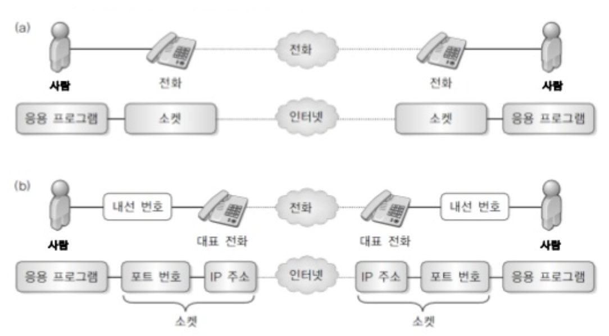

# Chapter 01. 네트워크와 소켓 프로그래밍
## 02. 소켓의 개념
- 소켓은 원래 버클리 유닉스(BSD UNIX)에서 개발한 네트워크 프로그래밍 인터페이스다.
  - 이를 윈도우에서 사용할 수 있게 만든 것을 윈도우 소켓(Windows Sockets), 줄여서 윈속(Winsock)이라고 부르며, 윈도우 95부터 API(Application Programming Interface)에 정식으로 포함하여 제공한다.
- 네트워크 통신을 하려면 하드웨어의 신호 처리, 장치 드라이버의 하드웨어 제어, 운영체제의 프로토콜 구현 등 여러 계층의 협력이 필요하다.
  - 하지만 네트워크 포로그램을 제작하는 데 있어 이 모든 분야의 지식을 다 알아야 하는 것은 아니다.
  - 가령 TV 등의 전자 제품은 내부 회로를 몰라도 벽면의 소켓에 전원 코드를 꽂고 버튼만 누르면 사용할 수 있는 것처럼 네트워크 프로그램 역시 통신의 내부 처리 과정을 알지 못해도 데이터를 초기화하고 정해진 절차에 따라 함수를 호출하는 작업만으로 만들 수 있다.
- 아래 그림에서는 사람은 응용 프로그램, 전화는 소켓, 전화망은 인터넷에 대응한다.
  - 그림 (a)과 같이 전화기에 대고 말한 내용이 상대방 전화기에서 들리듯이, 소켓에 넣은 데이터는 상대편 소켓을 통해 빠져나온다.
  - 이를 좀 더 세부적으로 살펴보면 그림 (b)와 같다.
    - 사람은 응용 프로그램, 내선 번호는 포트 번호, 대표 전화는 IP 주소, 전화망은 인터넷에 대응한다. 소켓은 포트 번호와 IP 주소 등의 통신 관련 정보를 포괄하는 개념으로 볼 수 있다.
      
### 2.1. 데이터 타입
- 소켓은 윈도우 프로그래밍에 사용되는 핸들(Handle), 또는 리눅스 프로그래밍에 사용되는 파일 디스크립터(File Descriptor)와 유사한 개념이다.
  - 일단 만들고 나면 함수를 호출하여 손쉽게 네트워크 통신을 수행할 수 있다.
```text
(a) 리눅스 파일 입출력
int fd = open("myfile", ...); // 파일 생성
...
read(fd, ...);      // 데이터 읽기
write(fd, ...);     // 데이터 쓰기

(b) 윈도우 소켓 통신
SOCKET sock = socket(...); // 소켓 생성
...
recv(sock, ...);     // 데이터 받기
send(sock, ...);     // 데이터 보내기
```
> 리눅스에서는 윈도우에서와 달리 소켓이 파일 디스크립터와 동등한 자격을 지닌다.
> 예를 들면, recv() 함수나 send() 함수 대신 read() 함수나 write() 함수로도 네트워크 통신을 할 수 있고, 데이터 타입도 파일 디스크립터와 마찬가지로 int 타입이다.
> 반면, 윈도우에서는 int 타입이 아닌 SOCKET이라는 별도 타입을 사용한다.
- 응용 포르그램이 통신하려면 다음과 같은 요수가 결정되어야 한다.
  - 사용할 프로토콜(TCP/IP, UDP/IP 등)
  - 송신 측 IP 주소
  - 송신 측 포트 번호
  - 수신 측 IP 주소
  - 수신 측 포트 번호
### 2.2. 통신 종단점
- 
### 2.3. 네트워크 프로그래밍 인터페이스
- 
