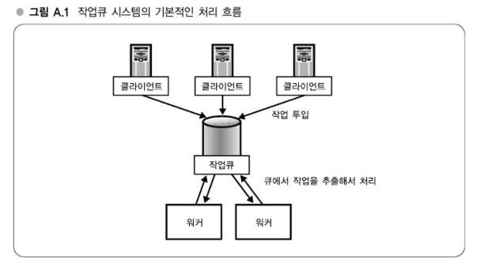

# APPENDIX A. 현대 웹 서비스 구축에 필요한 실전 기술

---
## 강의 1. 작업큐(Job-Queue) 시스템 - TheSchwartz, Gearman
### 웹 서비스와 요청
웹 서비스에서는 기본적으로 요청이 동기적으로 실행된다.   
즉, 요청에 기인하는 모든 처리가 끝난 다음에 응답이 반환된다.   
따라서 데이터가 서서히 축적되면서 데이터를 추가하고 갱신하는 처리가 점점 무거워진다.   
이런 경우, 작업큐 시스템을 사용함으로써 나중으로 미뤄도 되는 처리를 비동기로 실행할 수 있고 사용자 경험도 개선할 수 있다.

예를 들면 하테나 북마크에서는 사용자가 URL을 북마크했을 때의 처리를 작업 큐 시스템에서 처리하고 있다.    
이에 따라 URL의 개요를 얻거나 키워드 추출, 카테고리 판정 등 나중에 처리해도 되는 작업을 비동기로 실행하고 있다.   
만일 이러한 처리를 동기적으로 실행했다면 북마크할 때마다 수 초에서 수십 초 이상 대기해야 할 것이다.

### 작업큐 시스템 입문
웹 애플리케이션의 일부 처릴르 가장 간단하게 비동기화하는 방법은 비동기화하고자 하는 처리를 독립된 스크립트로 해서 해당 스크립트를 애플리케이션 내부에서 호출하는 방법이다.   
이렇게 함으로써 아주 간단하게 작업처리를 비동기화할 수가 있다.   
단, 이 방법에서는 스크립트 시작과 초기화의 오버헤드가 커서 성능이 좋지는 않다.   
또한 일시적으로 대량의 비동기 처리를 실행시키려 하면 그 수만큼의 프로세스를 실행시키려고 하기 때문에 이것도 성능상 단점이 된다.   
따라서 이 방법은 프로토타입이나 극히 소규모 애플리케이션에만 적용하는 게 좋을 것이다.

어느 정도 양이 있는 비동기 처리를 안정적으로 수행하려면 작업큐(Job-Queue)와 워커(worker)를 세트로 한 작업큐 시스템을 사용하는 것이 일반적이다.   
작업큐 시스템에서는 작업큐에 실행하고자 하는 처리(작업)를 등록하고, 워커가 큐에서 작업을 추출해서 실제로 처리한다.   
작업 큐를 통해서 일시적으로 대량의 처리가 등록되었을 때 부하의 변동을 흡수할 수가 있다.

- 클라이언트(웹 애플리케이션)
  - 작업을 투입한다. 
  - 작업을 투입한 다음 처리를 계속 진행할 수 있다.
- 작업큐
  - 작업을 쌓는다.
- 워커
  - 작업큐를 참조하고 미실행된 작업을 추출해서 작업을 실행한다.
  
### 하테나에서의 작업큐 시스템
#### TheSchwartz
TheSchwartz는 작업큐로 MySQL과 같은 RDBMS를 사용하는 작업큐 시스템이다.   
MySQL로 작업큐를 관리함으로써 매우 높은 신뢰성과 안정성을 확보하고 있다.   
비동기 처리에서는 작업을 확실하게 처리하는 것이 중요하므로 높은 신뢰성은 큰 장점이 된다.   
하지만 속도에서는 다소 희생이 따르므로 TheSchwartz에서 다루는 작업의 크기는 어느 정도 크게 하는 편이 좋을 것이다.

#### Gearman
Gearman은 TheSchwartz보다 가벼운 작업큐 시스템이다.   
작업큐로 RDBMS가 아닌 독자적인 데몬을 사용해서 작업의 정보를 메모리에 저장함으로써 성능을 확보하고 있다.    
그만큼 신뢰성에 희생이 따르므로 확실한 처리가 필요한 용도로는 적합하지 않다.

또한 Gearman은 클라이언트에서 작업을 투입할 때 다음의 세 가지 패턴을 취할 수가 있다.
- 동기적으로 순번대로 처리
- 동기적으로 병렬로 처리
- 비동기적으로 백그라운드로 처리

TheSchwartz는 비동기로만 사용할 수 있었던 데 비해 Gearman을 사용하면 보다 유연한 처리를 할 수 있게 된다.   
특히 비동기적으로 병렬로 처리시킴으로써 상호 의존하지 않는 처리를 병행해서 처리함으로써 전체 처리시간을 크게 단축시킬 수 있는 가능성을 이끌어낼 수 있다.

#### WorkerManger에 의한 워커 관리
Gearman나 TheSchwartz 둘 모두는 심플한 작업큐 시스템으로서는 충분한 기능을 갖추고 있다.   
그러나 워커 프로세스를 세세하게 제어하고자 한다면 Gearman나 TheSchwartz 개별 프로그램에서는 지원하지 않는다.   
하테나에서는 자체적으로 개발한 WorkerManger를 Gearman와 TheSchwartz의 워커 프로세스를 관리하기 위해 사용하고 있다.

- WorkerManger 기능
  - Gearman와 TheSchwartz을 래핑해서 최소한의 변경으로 양쪽에 대응할 수 있다.
  - 설정파일로 워커 클래스 정의, 설정파일만 수정해서 워커로서 사용할 클래스를 변경할 수 있다.
  - 워커 프로세스의 라이프사이클 관리, 프로세스 관리, 데몬화 수행
  - 워커 프로세스의 프로세스 개수 관리, 프로세스 개수를 관리하고 병행처리가 가능한 작업수를 제어한다.
  - 로그 출력, 작업을 처리한 타임스탬프 등을 로그에 기록한다.

워커 프로세스의 라이프사이클 관리에서는 Apache의 prefork 모델을 참고하여 부모 프로세스에서 지정된 수의 자식 프로세스를 생성하도록 하고 있다.   
또한 각각의 자식 프로세스별로 처리할 작업수를 지정시킬 수가 있다.   
워커 프로세스의 메모리가 서서히 증가할 경우, 일정한 횟수로 자식 프로세스를 재생성함으로써 메모리 낭비를 어느 정도 억제할 수 있다.

### 로그 분석
| 항목                         | 내용                                                                         |
| -------------------------- | -------------------------------------------------------------------------- |
| **로그 기록 위치**               | `Worker Manager`                                                           |
| **기록되는 정보**                | 워커의 작업 처리 시 타임스탬프 기록                                                       |
| **The Schwartz의 추가 기록 항목** | - `process`: 작업 처리 시간 - `delay`: 작업 투입 이후 실제 처리까지의 지연 시간                |
| **분석 목적**                  | - 작업 종류 및 양 대비 워커의 처리 능력 확인 - 처리 시간과 지연 시간 측정을 통해 성능 병목 분석              |
| **중요 포인트**                 | - 지연 시간이 길어질 경우, 비동기 처리라도 사용자 경험에 악영향 가능 - 이런 경우 워커의 튜닝 및 보강 필요 시점으로 판단 |
