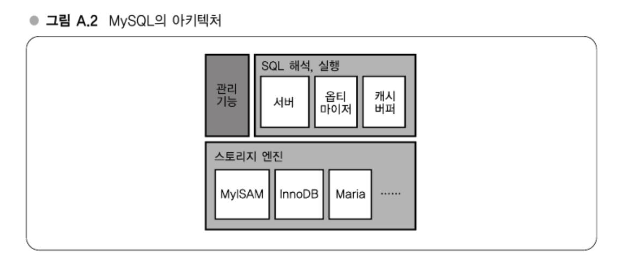

# APPENDIX A. 현대 웹 서비스 구축에 필요한 실전 기술

---
## 강의 2. 스토리지 선택 - RDBMS와 key-value 스토어
### 증가하는 데이터를 어떻게 저장할까?
웹 애플리케이션에 있어서 '증가하는 데이터를 어떻게 저장할 것인가?' 라는 문제는 영원환 과제다.   
수집 GB, TB를 넘는 데이터를 다루는 스토리지는 약간의 구성 변경이나 액세스 패턴 변화로 예상 밖으로 응답속도가 저하되는 경우가 있다.   
따라서 데이터량이나 스키마, 엑세스 패턴에 맞는 스토리지를 선택하는 것은 대단히 중요하다.

#### 웹 애플리케이션과 스토리지
여기서 스토리지란 '애플리케이션 데이터를 영속적으로 혹은 일시적으로 저장하기 위한 기능'이라는 의미로 사용하고 있다.   
한마디로 애플리케이션에서 다루는 데이터라고 해도 업로드된 디지털 카메라 사진 데이터나 블로그 본문과 같이 본질적으로 없어질 수 없는 원본 데이터로부터 원본 데이터를 가공함으로써 생성된 액세스 랭킹이나 검색용 인덱스 데이터 등 재생성 가능한 가공 데이터, 캐시와 같이 사라져도 성능상의 문제 이외에는 다른 문제가 없는 데이터까지 다양한 특성이 있다.   
특히 원본 데이터는 가장 중요해서 서브스의 근본적인 신뢰성과 관계되어 있으므로 그에 상응하는 비율을 들여서 최상급 신뢰성을 확보해야 한다.   
반면, 캐시와 같은 데이터는 신뢰성은 그다지 중요시되지 않고 성능을 높이거나 비용을 줄일 필요가 있다.   

#### 표 A.1 애플리케이션에 필요한 데이터의 예

| 데이터 유형             | 필요한 신뢰성 | 크기 | 갱신빈도 | 종류       |
|------------------------|----------------|------|-----------|------------|
| 블로그 본문            | 고             | 소   | 저        | 원본 데이터 |
| 디지털카메라 사진      | 고             | 대   | 저        | 원본 데이터 |
| 검색용 인덱스          | 중             | 중   | 고        | 가공 데이터 |
| HTML 처리 후 본문      | 저             | 소   | 저        | 캐시       |

#### 적절한 스토리지 선택의 어려움
스토리지의 설계와 그 구현은 과거부터 다양한 종류가 제안되어 왔으며, 오픈 소스도 다양하게 존재한다.   
저장하고자 하는 데이터의 특성에 맞는 스토리지를 선택하는 것이 비용과 성능, 안정성의 균형을 높인 차원으로 달성하기 위한 열쇠가 된다.    
스토리지를 잘못 선택한 채로 서비스를 시작하게 되면 나중에 알아차리더라도 스토리지 변경은 보통 방법으로는 뜻대로 이룰 수 없다.   
특히 서비스를 시작한 후에 순조롭게 인기를 얻어가면서 자주 이용하게된 서비스의 경우, 저장된 데이터량도 커지고 서비스 정지의 영향도 커서 더욱더 어려워진다.

테라바이트 규모의 데이터를 서비스에 영향을 주지 않고 다른 스토리지로 옮겨 간다는 것은 세심한 주의가 필요하며, 또한 시간도 많이 걸리는 작업이다.   
과거에 하테나 포토라이프의 스토리지를 DRBD 상의 파일시스템에서 보다 확정성이 높은 MogileFS로 이행했었다.   
이때의 작업은 준비를 포함해서 수 주의 시간이 걸렸고 상당히 어려운 작업이다.   
물론 서비스 성장을 예측하는 것은 어려우며 기술도 진화해가므로 스토리지 설계를 전혀 갱신하지 않고 가는 것도 어렵지만, 가능한 특성에 맞는 스토리지를 선택함으로써 하나의 스토리지를 오래도록 사용하는 게 더 바람직할 것이다.

### 스토리지 선택의 전제가 되는 조건
우선 스토리지를 선택할 때에는 애플리케이션에서의 액세스 패턴을 이해하는 것이 중요하다.   
액세스 패턴으로는 아래 여섯 가지 지표가 선택의 중요한 판단 포인트가 된다.
- 평균크기
- 최대크기
- 신규추가빈도
- 갱신빈도
- 삭제빈도
- 참조빈도

또한 크기에 요구되는 신뢰성, 허용할 수 있는 장애 레벨, 사용할 수 있는 하드웨어나 쓸 수 있는 예산과 같은 부분도 중요한 포인트다.

### 스토리지 종류
현재 사용가능한 스토리지를 큰 카테고리로 분류하면 다음과 같이 된다.
- RDBMS: MySQL, PostgreSQL §
- 분산 key-value 스토어: memcached, TokyoTyrant 등
- 분산 파일시스템: MogileFS, GlusterFS, Lustre
- 그 밖의 스토리지: NFS 계열분산파일시스템, DRBD, HDFS

### RDBMS
RDBMS란 표 형식으로 데이터를 저장하고 대부분은 SQL 언어로 데이터 조작을 수행하는 시스템이다.   
다양한 데이터를 저장한다거나 강력한 질의를 할 수 있어서 가장 범용성이 높은 스토리지다.

RDBMS의 오픈소스 구현은 MySQL이나 PostgreSQL 등이 있으며, 둘 다 실제 운용환경에서 널리 사용되고 있다.   
하네타에서도 MySQL을 범용 스토리지로 각 부문에 사용하고 있다.   
RDBMS 종류마다 각기 특성이 있는데, 최근에는 기능적, 성능적으로는 팽팽하게 경쟁하고 있으므로 지금까지 축적된 노하우 등을 기준으로 선택하면 될 것이다.

#### MySQL

MySQL의 아키텍처는 위 그림과 같이 SQL을 해석해서 실행하는 기으 블록과 실제로 데이터를 보관하는 기능 블록이 분리되어 있다.   
후자는 스토리지 엔진이라 불리며, 다양한 종류가 개발, 구현되고 있다.   

주요한 스토리지 엔진은 MyISAM과 InnoDB가 있다.

#### MyISAM
MyISAM은 과거 최신버전인 MySQL 5.1의 표준 스토리지 엔진으로 되어 있다.   
MyISAM은 심플한 구조를 한 스토리지 엔진으로, 1개의 테이블이 실제 파일 시스템 상에 3개의 파일(정의, 인덱스, 데이터)로 표현된다.   
과거에 update나 delete를 한 적이 없는 테이블에 대해 insert 조작(추가처리)을 빠르게 할 수 있다.   
또한 시작, 정지도 빠르며 테이블 이동이나 이름변경을 파일시스템 조작으로 직접 할 수 있는 등 DB 운용은 용이하다.

다만, DB 프로세스가 비정상 종료하면 테이블이 파손될 가능성이 높다거나 트랜잭션 기능이 없고
update, delete, insert가 테이블 락으로 되어 있어서 갱신이 많은 용도로는 성능적으로 불리하다.

#### InnoDB
InnoDB는 MyISAM과 대조적인 스토리지 엔진으로, 스토리지 엔진 전체에서 사전에 정의한 소수의 파일에 데이터를 저장하고, 트랜잭션을 지원하며, 비정상 종료시 복구 기능이 있고, 데이터 갱신이 로우 락으로 되어 있다.

다만 데이터량에 따라서는 시작, 정지가 수 분 정도 걸린다거나 테이블 조작을 모두 DB을 경유해서 수행해야 하는 등의 단점도 있다.

#### Maria 등
#### MyISAM vs. InnoDB

### 분산 key-value 스토어
#### memcached
#### TokyoTyrant

### 분산 파일시스템
#### MogileFS

### 그 밖의 스토리지
#### NFS 계열 분산 파일시스템
#### WebDAV 서버
#### DRBD
#### HDFS

### 스토리지의 선택전략