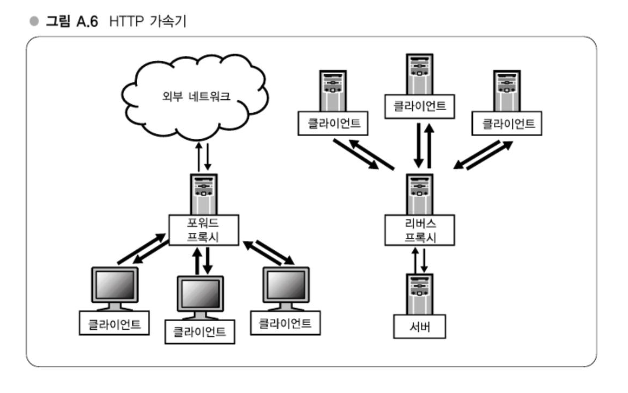
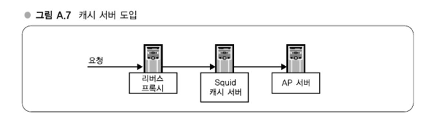
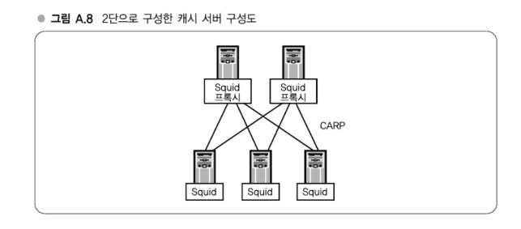
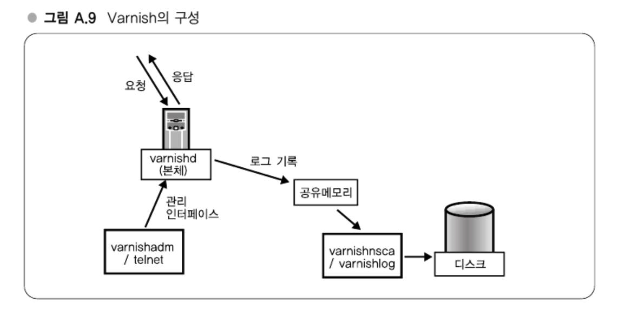

# APPENDIX A. 현대 웹 서비스 구축에 필요한 실전 기술

## 강의 3. 캐시 시스템

### 웹 애플리케이션의 부하와 프록시/캐시 시스템

웹 애플리케이션의 부하가 증가하면 AP 서버나 DB 서버 증설로 대응할 수 있지만, HTTP 캐싱을 수행하는 HTTP 가속기를 사용하면 저비용으로 효율적인 대책이 될 수 있다  
HTTP 액세스를 고속화하는 방식은 포워드 프록시와 리버스 프록시 두 가지가 있으며, 포워드 프록시는 클라이언트가 외부 서버에 접근할 때 사용되고 리버스 프록시는 외부의 클라이언트가 내부 서버에 접근할 때 사용된다  
리버스 프록시는 동일한 요청이 반복될 때 캐시된 응답을 반환함으로써 서버의 부하를 줄일 수 있다  
특히 리버스 프록시는 생산빈도가 낮은 정적 콘텐츠가 많은 경우에 매우 유효하다

#### 리버스 프록시 캐시 서버

리버스 프록시의 대표적인 구현으로 Squid가 있으며, 1990년대에 개발되어 현재도 널리 사용된다  
특히 Squid는 충분히 안정된 구현으로 빠르게 동작하나, 최신 멀티코어 활용에는 한계가 있어 nginx, pound, Varnish 등의 대체 구현도 존재한다  
이 중 Varnish는 성능 면에서 우수하며 현대적 설계를 채택하고 있다

### Squid - 기본적인 구성

리버스 프록시와 AP 서버, 클라이언트로 구성되며, 요청은 캐시 서버를 거쳐 AP 서버로 전달된다  
이때 캐시된 응답이 있다면 캐시 서버가 직접 응답하게 되어 시스템 부하를 줄일 수 있다  
정적인 콘텐츠 요청은 캐시 서버에서 처리하고, 동적인 요청은 AP 서버에서 처리하도록 분산할 수 있다

#### 여러 대의 서버로 분산하라

Squid 서버를 다중 구성하여 고가용성을 확보할 수 있으며, ICP 프로토콜을 통해 캐시 요청 간 협조가 가능하다  
서버 간 캐시 히트를 고려하여 부하를 분산할 수 있으며, 한 서버 장애 시에도 서비스 지속이 가능하다

#### 2단 구성 캐시 서버 - CARP로 확장

CARP는 요청 URL을 키로 하여 적절한 Squid 캐시 서버를 결정하는 방식이다  
캐시 서버 수가 많아질수록 유리하며, URL 기반 분산 덕분에 확장성도 뛰어나다  
한 서버 장애 시에도 다른 서버가 처리할 수 있도록 구성된다

#### COSS 크기 결정방법

캐시 용량은 너무 작으면 히트율이 떨어지고, 너무 크면 초기화 시간과 디스크 사용량이 커지므로 적정 크기 설정이 중요하다  
일반적으로 1차 장치 단위로 평균 크기의 오브젝트를 기준으로 산정한다  
하테나의 경우 수십~수백 GB 단위로 COSS 파일을 지정한다

#### 투입시 주의점

Squid는 물리 혹은 네트워크 장애 발생 시 서비스에 영향을 줄 수 있다  
특히 단일 서버 장애 시 전체 캐시 기능이 정지되는 상황이 발생할 수 있어 다중 구성과 무중단 배포 설계가 중요하다  
파일이 디스크에만 존재하고 메모리에 없는 경우 액세스 성능이 떨어질 수 있다

### Varnish

Varnish는 리버스 프록시 전용 캐시 서버로 Squid보다 높은 성능을 제공한다  
모던한 아키텍처와 효율적인 메모리 중심 설계를 채택하고 있으며, mmap을 사용해 디스크 대신 메모리를 적극 활용한다  
VCL이라는 독자적 설정 언어를 통해 유연한 캐시 정책 설정이 가능하다  
프로세스 재시작 시에도 캐시는 모두 사라지고 히트율이 0이 되므로 시스템 구성에 주의가 필요하다

