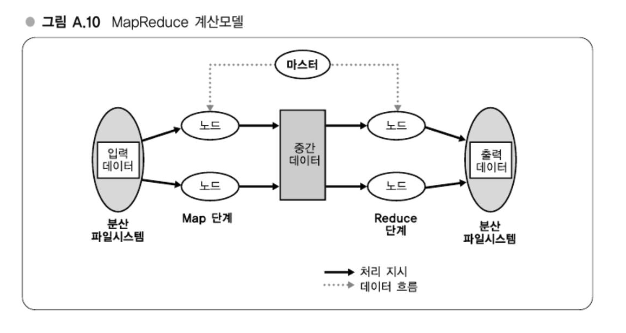
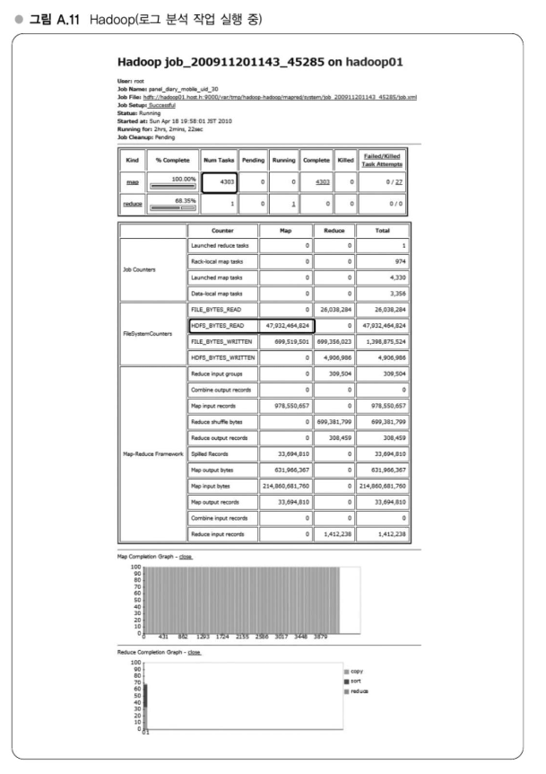

# APPENDIX A. 현대 웹 서비스 구축에 필요한 실전 기술

## 강의 4. 계산 클러스터 - Hadoop

### 대량로그 데이터의 병렬 처리
대규모 웹 서비스를 운영하다 보면 로그 데이터도 대량으로 쌓이게 된다  
이러한 로그 데이터를 분석하려면 단순히 읽어들이는 것만으로도 시간이 오래 걸리며, 통계나 분석을 하려면 매우 큰 계산 리소스를 요구한다  
예를 들어 하루 4GB의 액세스 로그가 월 30일 기준 120GB로 누적되며, 평균 50Mbps 속도로 HDD에서 읽을 경우 5시간 이상이 소요된다  
이러한 처리를 효율적으로 수행하기 위해서는 병렬처리가 가능한 계산 클러스터가 필요하다

### MapReduce의 계산모델
하테나에서는 Hadoop 기반의 오픈소스 구현인 MapReduce를 계산 클러스터로 활용하고 있다  
MapReduce는 Google이 2004년에 발표한 계산 모델로, key-value 쌍으로 구성된 대량 데이터를 분산 처리하기 위한 모델이다  
이 모델은 Map 단계와 Reduce 단계로 구성되어 있으며, 각 노드에서 데이터를 병렬로 처리한 뒤 결과를 다시 집계한다  
Map 단계에서는 데이터를 key 기준으로 정리하고, Reduce 단계에서는 해당 key에 대한 리스트를 처리하여 최종 결과를 도출한다

### Hadoop
Hadoop은 Apache 프로젝트 중 하나로, Java 기반으로 구성되어 있으며 Yahoo, Facebook 등의 기업에서 대규모 데이터를 처리하기 위해 널리 사용되고 있다  
Hadoop은 오픈소스 분산 파일시스템인 HDFS를 기반으로 하며, Google의 GFS에서 영향을 받은 설계를 갖고 있다  
하테나에서 사용하는 Hadoop은 로그 분석 작업을 위한 스크립트 기반으로 동작하며, 수천 개의 Map 작업이 분산되어 병렬 실행되고 그 결과는 Reduce 작업으로 집약된다

