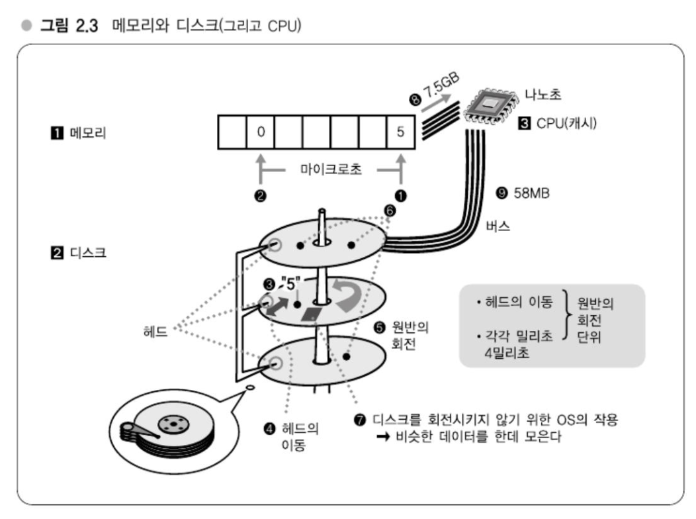
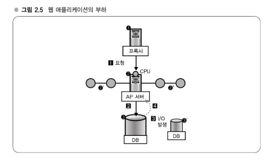

# Chapter 02 : 대규모 데이터 처리 입문
## 메모리와 디스크, 웹 애플리케이션과 부하
---
## 강의 4. 하테나 북마크의 데이터 규모
> 데이터가 많을수록 처리에 시간이 걸린다.

## 강의 5. 대규모 데이터 처리의 어려운 점
> 메모리와 디스크
### 대규모 데이터는 어떤 점이 어려운가?
> 메모리 내에서 계산할 수 없다.
- 데이터 건수가 많으면 그만큼 입력 데이터 건수가 늘어나므로 계산량이 많아진다.
  - 문제는 '디스크를 읽고 있다'는 점이다. 
- 수 억건의 규모가 되면 데이터가 너무 많아 메모리 내에서 계산할 수 없으므로 디스크에 두고 특정 데이털르 검색하게 된다.
  - **디스크는 메모리에 비해 상당히 느리다.**

### 메모리와 디스크의 속도차
> 메모리는 10^5 ~ 10^6배 이상 고속(10만 ~ 100만배)

### 디스크는 왜 늦을까?
> 메모리와 디스크
- 메모리는 전기적인 부품이므로 물리적 구조는 탐색속도와 그다지 관계가 없다.
- `1`의 메모리 그림에서 `1` 부분에 '5' 라는 숫자가 들어있다고 하고 `2`에 '0' 이라는 숫자가 들어 있을때, `2`부분을 탐색하다가 `1`부분을 확인하고하 할 때에도 마이크로초(10^-6) 단위로 포인터를 이동시킬 수 있다.

- 디스크는 동축 상에 '원반'(disk)이 쌓여 있다.
  - 이 원반이 회전하면서 데이터를 읽어낸다.
  - 즉, 메모리와 달리 회전 등의 물리적인 동작을 수반하고 있다.
    - 이 구조가 탐색 속도에 영향을 준다.

#### 탐색속도에 영향을 주는 다양한 요인
- 디스크에서는 헤드의 이동과 원반의 회전이라는 두 가지 물리적인 이동이 필요하지만, 오늘날의 기술로도 원반의 회전속도를 빛의 속도까지 근접시킬 수는 없다.
  - 디스크에서는 헤드의 이동과 원반의 회전 각각 밀리초 단위(10^-3) 단위, 합해서 수 밀리초나 걸린다. 
  - **메모리는 1회 탐색할 때 마이크로초면 되지만, 디스크는 수 밀리초가 걸리는 것이다.**
#### OS 레벨에서의 연구
- `7`과 같이 OS는 연속된 데이터를 같은 위치에 쌓는다.
  - 데이터를 읽을 때 4KB 정도를 한꺼번에 읽도록 되어 있다.
- 이렇게 비슷한 데이터를 비슷한 곳에 두어 1번의 디스크 회전으로 읽는 데이터 수를 많게 한다.
  - 그 결과로 디스크의 회전횟수를 최소화할 수 있게 된다.
  - 그러기에 디스크를 가능한 한 회전시키지 않아도 된다.
  - 그렇지만 결국 회전 1회당 밀리초 단위이므로 역시 메모리와의 속도차를 피할 수 있는 것은 아니다.
#### 전송속도, 버스의 속도차
- 메모리가 디스크에 비해 105 ~ 106배 이상 빠르다는 얘기였는데 사실은 이것뿐만이 아니다.
- 전송속도
  - 찾은 데이터를 디스크에서 메모리로 보내거나 메모리에서 CPU로 보내는 등 컴퓨터 내부에서 전송하기 위한 속도
  - 대략 100배 정도 차이가 난다.
    - 메모리 : 7.5GB/초
    - 디스크 58M/초
  - 데이터가 많아지면 많아질수록 디스크와 메모리의 차이도 나타나게 되므로 전송속도에서도 디스크는 늦어진다.

---

## 강의 6. 규모조정의 요소
### 규모조정, 확장성
- 대규모 환경이라 하면 서버를 여러 대 나열해놓고 그 서버로 부하를 분산한다라는 얘기를 들어보았을 것이다.
  - 규모조정(scaling)
    - 스케일업
      - 고가의 빠른 하드웨어를 사서 성능을 높이는 전략
    - 스케일 아웃
      - 저가이면서 일반적인 성능의 하드웨어를 많이 나열해서 시스템 전체 성능을 올리는 전략
      - 웹 서비스에 적합한 형태이고 비용이 저렴하다는 점과 시스템 구성에 유연성이 있다.
  - 확장성(scalability)
    - 부하가 적을 때는 최소한으로 투자하고 부하가 높아짐에 따라 확장해가기 쉽다는 것이다.
    - 상당한 용도의 서버도 저렴하고 간단하게 준비할 수 있다는 것이다.
### 규모조정의 요소- CPI 부하와 I/O 부하
- 스케일아웃은 하드웨어를 나열해서성능을 높이는 즉 하드웨어를 횡으로 전개해서 확장성을 확보해가게 된다.
  - 이떄 CPU 부하의 확장성을 확보하기는 쉽다.
### 웹 애플리케이션과 부하의 관계  

#### AP 서버 부하와 확장성
- AP 서버는 CPU 부하만 걸리므로 분산이 간단하다. 그 이유는 기본적으로 데이터를 로컬에서 갖고 있는 것이 아니므로 ②와 동일한 호스트가 동일하게 작업을 처리하기만 하면 분산할 수 있다. 따라서 대수를 늘리기만 하면 간단히 확장할 수 있다. 결국 새로운 서버를 추가하고자 하면 현재 있던 서버와 완전히 동일한 구성을 갖는 서버, 심하게 말하면 복사를 마련해서 추가하면 된다. 요청을 균등하게 분산하는 것은 로드밸런서(load balancer)라는 장치가 해결하는 것으로 가능하다.
#### I/O 부하 문제
- 한편, I/O 부하에는 문제가 있다. ③을 추가한다고 가정하면 DB③을 함께 늘리는 효과가 난다. 예를 들어 ②에서 쓰기가 발생했을 때 ③이 지닌 데이터를 ③의 데이터를 어떻게 동기화할 것인가라는 문제가 발생한다. ③의 데이터를 동기화하는 것은 쉽지 않으며, 동시에 읽기와 쓰기 내용이 일관되게 유지되도록 해야 한다. 따라서 ③을 추가하는 것이 간단한 분산 방식은 아니다.
### DB 확장성 확보의 어려움
- DB 확장성을 확보하는 것은 상당히 어렵다.
- 강의 5에서 설명한 바와 같이 디스크가 느려지는 문제도 여기서 영향을 미친다. 그림 2.5의 ②는 디스크를 거의 사용하지 않으므로 디스크에 관해서는 별로 생각하지 않아도 되지만, 그림 2.5 ③의 DB에서는 디스크를 많이 사용하므로 디스크 I/O를 많이 발생시키는 구조로 되어 있으면 속도 문제까지 발생한다.
- 게다가 데이터가 커질수록 캐싱보다 메모리에서 처리하지 못하고 디스크에서 처리할 수밖에 없는 요건이 늘어난다. 즉, 대규모 환경에서는 I/O 부하를 부담하고 있는 서버는 애초에 분산시키기 어려운데다 디스크 I/O가 많이 발생하면 서버가 급격히 느려지는 본질적인 문제가 있다.
- 서비스를 운영해보면 '서비스가 무거우니 서버를 늘리는 게 어때?'와 같은 제안을 하는 경우도 있는데, 사실 서버를 늘려서 해결할 수 있다면 간단한 것이다. 그래서 해결된다면 얼마든지 늘리면 된다. 하지만 매우 쉽게 인프라를 조절할 수 있는 환경을 갖추고 있는 경우가 드물다.
- 예를 들어 하루 이틀에 50대 정도의 서버를 도입하는 것은 인프라 부서에 맡기면 문제가 아닐 수도 있지만, 그것만으로는 문제가 해결되지 않기 때문에 더욱 어려운 것이다.
- 따라서 어느 시스템을 이용하면서 무겁게 느껴진다고 해서 '서버를 늘리자'라고 생각하는 것은 위험하다. 혹시 그렇게 말한다면, 순간에 기술적인 지식의 배경이 희미해 보일 수도 있다. '적당히 늘리면 되지 않겠냐'라고 쉽게 생각할 수 있지만, 무책임한 접근일 수 있다.
- 우스갯소리로 한 이야기지만, 어쨌든 이렇게 어려운 I/O 부하의 규모 조정에 대해 확실하게 파악해야 한다.
---
## 강의 7. 대규모 데이터를 다루기 위한 기초지식
### 프로그래머를 위한 대규모 데이터 기초
- 대규모 데이터는 메모리에서 처리하기 어렵고 디스크는 느리다.
- 또한 분산하기도 곤란하다는 어려움이 있다.

### 대규모 데이터를 다루는 세 가지 급소 - 프로그램을 작성할 떄의 요령
- 대규모 시스템을 고민할 때, 대규모 데이터를 다룰 때 중요한 요소는 다음과 같다:
1. 어떻게 하면 메모리에서 처리를 마칠 수 있을까?
    - 디스크 seek 횟수를 최소화해야 함
    - 메모리를 활용한 알고리즘 필요
2. 데이터 압축 활용
    - 데이터를 압축하여 저장 및 전송
    - 디스크와 네트워크 부하 감소
3. 검색 최적화 기법 적용
    - O(n)보다 효율적인 검색
    - O(log n) 또는 O(1) 기법 사용
> 메모리를 적극 활용하는 것이 중요한데, 예를 들어 Log Order와 같은 알고리즘을 사용하면 검색 비용을 크게 줄일 수 있다. 또한, 데이터가 크면 캐싱을 통해 디스크 접근을 줄이는 것이 성능 최적화에 필수적이다.
### 대규모 데이터를 다루는 전 3대 전체 지식 - 프로그램 개발의 한층 아래 기
- 프로그램을 만들기 전에 고려해야 할 세 가지 핵심 전제지식은 다음과 같다:
    1. OS 캐시 활용
    2. 분산을 고려한 RDBMS 운영
    3. 대규모 환경에서의 알고리즘과 데이터 구조 이해
> 대규모 시스템에서는 AP 서버와 DB 서버 간의 부하 균형을 맞추는 것이 중요하다. AP 서버의 수를 늘려도 DB 서버의 확장성 문제를 해결하기 어렵기 때문에, 단순히 서버 수를 증가시키는 것만으로는 성능 향상을 보장할 수 없다.
---