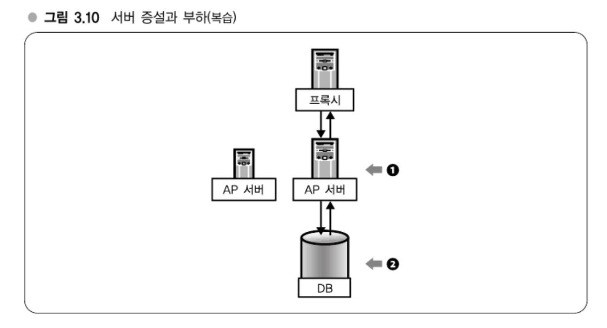

# Chapter 03 OS 캐시와 분산 - 대규모 데이터를 효율적으로 처리하는 원리
## 대규모 데이터를 다룰 때의 포인트
> I/O 대책에 대한 기반은 OS에 있다.
###  OS 캐시와 분산
- OS 캐시
- 캐시를 전제로 한 I/O 부하 줄이는 방법
- 캐시를 고려한 국소성을 살리는 분산

## 강의 8. OS의 캐시 구조
### 메모리, 디스크, OS 캐시구조

- 디스크와 메모리 간 속도 차는 10^5 ~ 10^10배 이상
- 메모리를 이용해서 디스크 액세스를 줄이고자 한다.
- OS는 캐시 구조를 갖추고 있다.

---

## OS의 캐시 구조

OS는 메모리를 이용해 디스크 액세스를 줄이는 구조를 갖추고 있습니다. 이러한 구조가 바로 **OS 캐시**입니다. 디스크는 메모리에 비해 훨씬 느리므로, 데이터를 빠르게 읽고 쓸 수 있도록 하는 방법이 필요합니다. OS는 이를 해결하기 위해 캐시 시스템을 사용합니다.

### 페이지 캐시(Page Cache)

- **페이지 캐시**는 Linux 운영 체제에서 사용되는 주요 캐시 구조입니다.
- 페이지 캐시는 디스크의 데이터를 메모리에 저장하여, 다음에 같은 데이터에 접근할 때 디스크를 직접 읽지 않고 메모리에서 빠르게 읽을 수 있도록 합니다.
- 이 방식으로 디스크 접근 횟수를 줄이고 시스템 성능을 향상시킬 수 있습니다.

### 파일 캐시와 버퍼 캐시

- Linux에서는 페이지 캐시뿐만 아니라 **파일 캐시(file cache)**와 **버퍼 캐시(buffer cache)**라는 캐시 구조도 존재합니다.
- 하지만 **파일 캐시**라는 용어는 페이지 캐시와 비슷한 개념을 포함하고 있어 정확한 의미로 사용하기에 부적절한 경우가 많습니다.
- 파일 캐시와 버퍼 캐시는 메모리에서 파일이나 데이터 블록을 캐시하여 디스크 I/O를 줄이는 역할을 하지만, 페이지 캐시가 이들보다 더 중요한 역할을 합니다.

## 강의 9. I/O 부하를 줄이는 방법
### 캐시를 전제로 한 I/O 줄이는 방법
- 강의 8에서 살펴본 바와 같이 캐시에 의한 I/O 경감 효과는 매우 크다. 캐시를 전제로 I/O를 줄이기 위한 대책을 세우는 것이 유효하다는 것을 알 수 있을 것이다. 이것이야말로 I/O 대책의 기본이다. 이 기본으로부터 도출할 수 있는 포인트를 두 가지 소개한다.
- 첫 번째 포인트는 데이터 규모에 비해 물리 메모리가 크면 전부 캐싱할 수 있으므로 이 점을 생각할 것. 다루고자 하는 데이터의 크기에 주목하는 것이다.
- 또한 대규모 데이터 처리에는 데이터 압축이 중요하다고 했는데, 압축해 저장해둔 디스크 내용을 전부 그대로 캐싱해둘 수 있는 경우가 많다. 예를 들어 LZ* 등 일반적인 압축 알고리즘의 경우, 압축률을 보통이라면 텍스트 파일을 대략 절반 정도로 압축할 수 있다. 4GB의 텍스트 파일이라면 메모리 2GB만 쓰도록 뒷받침 정도는 거의 캐싱할 수 없었던 것이, 압축해서 저장해두면 2GB로 캐싱할 수 있는 비율이 상당히 늘어나게 된다.
- 또 하나는 경제적인 비용과의 밸런스를 고려하고자 한다는 점이다. 최근에는 메모리가 8GB~16GB 정도가 일반적인 서버 한 대의 메모리 구성이다. 최근의 서버는 남들게 대체적으로 메모리가 8GB~16GB 정도 탑재되어 있다. AP 서버는 메모리가 그렇게 많이 필요하지는 않으므로 4GB 정도지만, DB 서버는 그 정도의 메모리가 탑재되어 있다.
- 이 부분을 짚질해 보고 있는 시점이 2009년 9월에 메모리의 시장 가격은 2GB 단품 모듈이 2,000엔 정도이므로 8GB를 탑재해도 1만 엔이 되지 않는다. 굉장한 시대인 것 같다. 필자가 인프라 관련 일을 중점적으로 하고 있을 때가 2년쯤 전인데 그 당시에는 8GB는 좀 비싸서 3~4만 엔 정도였는데, 지금은 1만 엔에 채 안 된다. 열심히 소프트웨어를 개발해서 "그래, 이건 데이터 크기를 엄청 줄여서 캐싱하도록 할 수 있을 거야" 라며 5명을 반 년 정도 투입해서 대단한 압축 알고리즘을 생각해냈다. 그런데 애초에 8GB 메모리만 더 들어갔다면 사실 1만 엔 정도밖에 들지 않으므로 비용적으로 굳이 그렇게까지 하지 않아도 되는 일이었다. 따라서 시장에서는 어느 정도 성능의 서버가 일반적인 제품인지도 중요하다.
- 한편, 요즘은 하나에 2GB의 메모리와 4GB의 메모리의 가격이 전혀 다르다. 그러므로 메모리가 32GB나 64GB 정도 되어야 캐싱할 수 있다고 할 때, 하드웨어 비용이 급격히 높아지므로 소프트웨어로 메모리 사용을 줄일 수 있도록 노력할 필요도 있다.
> ### Memo
> - 데이터 규모 < 물리 메모리이면 전부 캐싱할 수 있다.
> - 경제적 비용과의 밸런스 고려
> - 현재 일반적인 서버 메모리: 8GB~16GB 

### 복수 서버로 확장시키기 - 캐시로 해결될 수 없는 규모일 경우
- 메모리를 늘려서 전부 캐싱할 수 있다면 좋겠지만, 당연히 데이터를 전부 캐싱할 수 없는 규모가 될 수 있다. 그렇게 되면 어떻게 할 것인가? 여기서 먼저 복수 서버로 확장시키는 방안을 생각해볼 필요가 있다.
- 강의 6의 그림 2.5에서 언급한 것처럼, AP 서버, DB 서버라는 3단 구조에 대한 복수화. 그림 3.10을 보기 바란다. 그림 3.10의 ① AP 서버를 늘려야 하는 이유는 기본적으로 CPU 부하를 낮추고 분산시키기 위함이다. 한편, 그림 3.10 ②의 DB 서버를 늘려야 할 때는 반드시 부하 때문만은 아니고 오히려 캐시 용량을 늘리고자 할 때 혹은 효율을 높이고자 할 때일 경우가 많다.
- 따라서 그림 3.10 ① AP 서버를 늘리는 것과 ② DB 서버를 늘리는 것은 둘 다 서버를 늘리는 것이지만 필요한 리소스, 요구되는 리소스가 전혀 다르다. DB 서버는 '늘리면 좋다'라는 논리가 들어맞지 않는다. 그림 3.10 ② 부분에 DB 서버를 엄청나게 늘려서 100대로 늘린 사람의 방식에 따라서는 생각보다 효과를 거둘 수 없게 된다.

> #### 전부 캐싱할 수 없는 구조가 되면
> - 복수 서버로 확장시키기
>     - CPU 부하 분산에는 단순히 늘린다.
>     - I/O 분산에는 국소성을 고려한다.