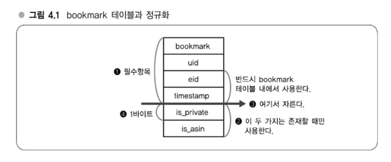
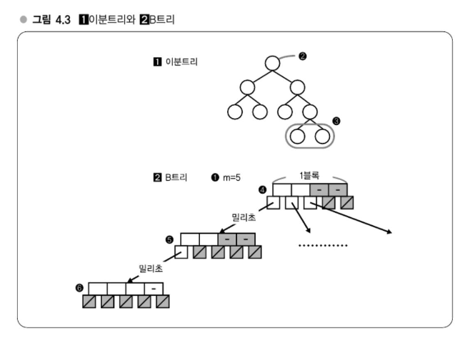

# Chapter 04 분산을 고려한 MySQL 운용
## 분산된 시스템 알기
> 애플리케이션을 만들기 전에 알아두어야 할 MySQL 분산 노하우
- 분산할 때는 국소성 을 고려하고, 데이터 규모에 맞게 탑재 메모리를 조정하고, 메모리 증설로도 대응할 수 없을 경우에는 분산하라는것이 지금까지 한 설명의 주된 흐름이었다. 
  - 메모리와 디스크의 속도차와 그로인한 I/O 분산의 어려움, 그리고 이를 전제로 시스템을 어떻게 구축/운용할 것인가가 서서히 분명해지는 것 같다.

> #### DB 스케일아웃 전략
> - 인덱스의 중요성 ( -> 강의 11)
> - MySQL 분산(-> 강의12)
> - 스케일아웃과 파티셔닝(-> 강의 13) 

## 강의 11. 인덱스를 올바르게 운용하기
> 분산을 고려한 MySQL 운용의 대전제
### 분산을 고려한 MySQL 운용, 세 가지 포인트
- 첫 번째 포인트 'OS 캐시 활용'이라는 것은 이전 장의 설명과 관련된 얘기로 그 연장선상에 있다. 
- 두 번째 포인트는' 인덱스(index, 색인)이다.
- 세번째 포인트는 확장을 한다는 전제로 시스템을 설계해둔다
> #### 분산을 고려한 MySQL 운용의 포인트
> - OS 캐시 활용
> - 인덱스 를적절하게 설정하기 
> - 확장을 전제로 한 설계

### OS 캐시 활용
- 대량의 데이터를 저장하려는 테이블은 레코드가 가능한 한 작아지도록 컴팩트하게 설계하도록 하자. 
- 정수int형은 32비트이므로 4바이트, 문자열이 8비트니까 1바이트와 같이 기본적인 수치는 머리에 새겨두도록 하자.
#### [보충] 정규화
- 정규화란, 데이터 중복을 줄이고, 데이터 무결성을 높이기 위해 테이블을 분해하여 구조를 재조정하는 과정입니다. 정규화를 통해 저장 공간을 절약하고, 관리가 쉬운 데이터 구조를 만들 수 있습니다.
##### 북마크 시스템 (Bookmark Table)
| 컬럼명       | 설명                                   |
|-------------|----------------------------------------|
| uid         | 어떤 유저인지 (user ID)                |
| eid         | 어떤 엔트리를 북마크했는지 (entry ID) |
| timestamp   | 북마크 시각                             |
| is_private  | 공개/비공개 여부                        |
| is_asin     | Amazon 상품 여부 플래그                |
- `is_private`와 `is_asin`은 선택적 컬럼이며, 필요할 때만 사용합니다.
- 특히 `is_asin`은 Amazon 상품 북마크를 추출할 때 유용합니다.

- `is_private`, `is_asin`과 같은 플래그성 데이터는 별도의 테이블로 분할할 수 있습니다.
- 각 플래그는 1바이트만 사용하므로, 수천만 레코드에서 이를 본체 테이블에서 제거하면 상당한 용량 절감 효과가 있습니다.
  - 예: 1바이트 × 수천만 레코드 = 수십 MB ~ 수백 MB 절감
##### 정규화의 트레이드오프 (Trade-off)
> 정규화는 저장 효율성과 쿼리 성능 사이의 균형을 고려해야 합니다.
- 장점: 용량 절감, 데이터 구조 명확화
- 단점: 쿼리 복잡성 증가로 인한 속도 저하 가능성

### 인덱스의 중요성 - B트리
- 알고리즘, 데이터 구조에서 탐색을 할때는 기본적으로 트리(탐색트리)가 널리 사용된다. 
  - 인덱스는 주로 탐색을 빠르게 하기 위한 것으로, 그 내부 데이터 구조로는 트리가 사용된다.

- MySQL의 인덱스는 기본적으로 B+트리(B Plus Tre)라는 데이터 구조다. 
  - B+ 트리는 B트리(B Tree)에서 파생된 데이터 구조다.
  - 위 그림의 B트리는 트리를 구성하는 각 노드가 여러 개의 자식을 가질 수 있는 '다분트리' 다. 
  - 또 한 데이터 삽입이나 삭제를 반복한 경우에도 트리의 형태에 치우침이 생기지않는 '평형트리'이기도 하다. 
  - B트리는 하드 디스크 상에 구축하기에 알맞은 데이터 구조이므로 DB에서 자주 사용된다.
- B트리에 데이터를 삽입할 때는 일정한 규칙에 따라 삽입할 필요가 있는데, 그 규칙 덕분에 검색할 때 일부 노드를 순회하는것만으로 자연스럽게 찾고자 하는 데이터 에도달하게 된다.
- 먼저 루트(Root, 뿌리)에서 시작해서 각 노드에 찾고 있는 값이 저장되어 있는지를 확인한다.
  - 없으면 자식을 찾아간다.
  - 이때 찾는 값의 대소관계로 어떤 자식을 찾아가면 될지가 한 번에 결정될 수 있는 규칙이 상둉된다.
  - **이에 따라 검색을 할 때 최대 트리 높이만큼의 횟수만 자식을 찾아가면 되므로 탐색이 빨라지는 것이다.**
- 트리의 높이는 데이터 건수 n에 대해 반드시 log n이 되므로 계산량은 O(log n)이다.
#### 이분트리와 B트리 비교해보기

- 이분트리는 노드의 자식이 반드시 두 개 이하다.
  - 반면 (2) B트리는 노드의 자식이 여러 개 있으며, 2보다 훨씬 많다.
  - 실제로 B트리의 노드 수는 'm=몇개' 라는 상수로 결정된다.
- **(1) 이분트리와 (2) B트리 차이점**
  - 이분트리는 2️⃣ 노드가 반드시 하나로 정해져 있고 3️⃣은 두 개로 정해져 있지만, B트리는 m=5처럼 개수가 정해진다.
  - B트리는 이 수를 조정함으로써 4️⃣의 크기를 4KB 등으로 할 수 있다.
    - 즉, 각 노드의 크기를 적당한 사이즈로 정할 수 있다.(B트리의 장점)
- 여기서 노드의 크기라는 것이 제 3장에서 설명한 디스크의 페이지와 매우 밀접한 관계가 있다.
  - 4️⃣의 노드 1개로 디스크의 1블록만큼을 할당하면, B트리로 디스크 상에 저장했을 때 5️⃣를 1블록, 6️⃣을 1블록 ... 과 같이 각 노드를 딱 1블록만큼으로 해서 저장할 수 있다.

### 확장을 전제로 한 설계

