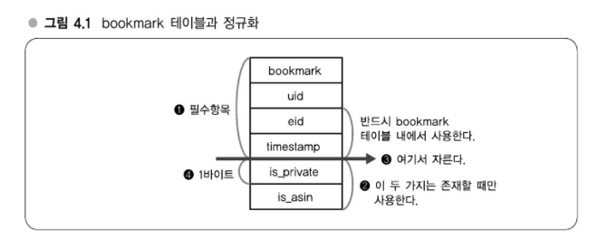
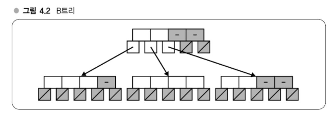
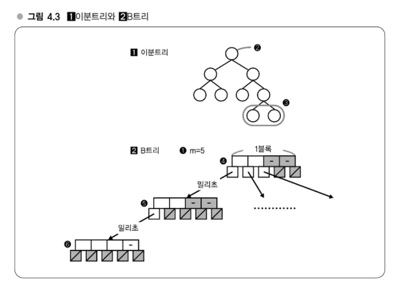
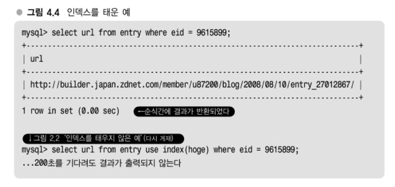

# Chapter 04 분산을 고려한 MySQL 운용
## 분산된 시스템 알기
> 애플리케이션을 만들기 전에 알아두어야 할 MySQL 분산 노하우
- 분산할 때는 국소성 을 고려하고, 데이터 규모에 맞게 탑재 메모리를 조정하고, 메모리 증설로도 대응할 수 없을 경우에는 분산하라는것이 지금까지 한 설명의 주된 흐름이었다. 
  - 메모리와 디스크의 속도차와 그로인한 I/O 분산의 어려움, 그리고 이를 전제로 시스템을 어떻게 구축/운용할 것인가가 서서히 분명해지는 것 같다.

> #### DB 스케일아웃 전략
> - 인덱스의 중요성 ( -> 강의 11)
> - MySQL 분산(-> 강의12)
> - 스케일아웃과 파티셔닝(-> 강의 13) 

## 강의 11. 인덱스를 올바르게 운용하기
> 분산을 고려한 MySQL 운용의 대전제
### 분산을 고려한 MySQL 운용, 세 가지 포인트
- 첫 번째 포인트 'OS 캐시 활용'이라는 것은 이전 장의 설명과 관련된 얘기로 그 연장선상에 있다. 
- 두 번째 포인트는' 인덱스(index, 색인)이다.
- 세번째 포인트는 확장을 한다는 전제로 시스템을 설계해둔다
> #### 분산을 고려한 MySQL 운용의 포인트
> - OS 캐시 활용
> - 인덱스 를적절하게 설정하기 
> - 확장을 전제로 한 설계

### OS 캐시 활용
- 대량의 데이터를 저장하려는 테이블은 레코드가 가능한 한 작아지도록 컴팩트하게 설계하도록 하자. 
- 정수int형은 32비트이므로 4바이트, 문자열이 8비트니까 1바이트와 같이 기본적인 수치는 머리에 새겨두도록 하자.
#### [보충] 정규화
- 정규화란, 데이터 중복을 줄이고, 데이터 무결성을 높이기 위해 테이블을 분해하여 구조를 재조정하는 과정입니다. 정규화를 통해 저장 공간을 절약하고, 관리가 쉬운 데이터 구조를 만들 수 있습니다.
##### 북마크 시스템 (Bookmark Table)
| 컬럼명       | 설명                                   |
|-------------|----------------------------------------|
| uid         | 어떤 유저인지 (user ID)                |
| eid         | 어떤 엔트리를 북마크했는지 (entry ID) |
| timestamp   | 북마크 시각                             |
| is_private  | 공개/비공개 여부                        |
| is_asin     | Amazon 상품 여부 플래그                |
- `is_private`와 `is_asin`은 선택적 컬럼이며, 필요할 때만 사용합니다.
- 특히 `is_asin`은 Amazon 상품 북마크를 추출할 때 유용합니다.


- `is_private`, `is_asin`과 같은 플래그성 데이터는 별도의 테이블로 분할할 수 있습니다.
- 각 플래그는 1바이트만 사용하므로, 수천만 레코드에서 이를 본체 테이블에서 제거하면 상당한 용량 절감 효과가 있습니다.
  - 예: 1바이트 × 수천만 레코드 = 수십 MB ~ 수백 MB 절감
##### 정규화의 트레이드오프 (Trade-off)
> 정규화는 저장 효율성과 쿼리 성능 사이의 균형을 고려해야 합니다.
- 장점: 용량 절감, 데이터 구조 명확화
- 단점: 쿼리 복잡성 증가로 인한 속도 저하 가능성

### 인덱스의 중요성 - B트리
- 알고리즘, 데이터 구조에서 탐색을 할때는 기본적으로 트리(탐색트리)가 널리 사용된다. 
  - 인덱스는 주로 탐색을 빠르게 하기 위한 것으로, 그 내부 데이터 구조로는 트리가 사용된다.


- MySQL의 인덱스는 기본적으로 B+트리(B Plus Tre)라는 데이터 구조다. 
  - B+ 트리는 B트리(B Tree)에서 파생된 데이터 구조다.
  - 위 그림의 B트리는 트리를 구성하는 각 노드가 여러 개의 자식을 가질 수 있는 '다분트리' 다. 
  - 또 한 데이터 삽입이나 삭제를 반복한 경우에도 트리의 형태에 치우침이 생기지않는 '평형트리'이기도 하다. 
  - B트리는 하드 디스크 상에 구축하기에 알맞은 데이터 구조이므로 DB에서 자주 사용된다.
- B트리에 데이터를 삽입할 때는 일정한 규칙에 따라 삽입할 필요가 있는데, 그 규칙 덕분에 검색할 때 일부 노드를 순회하는것만으로 자연스럽게 찾고자 하는 데이터 에도달하게 된다.
- 먼저 루트(Root, 뿌리)에서 시작해서 각 노드에 찾고 있는 값이 저장되어 있는지를 확인한다.
  - 없으면 자식을 찾아간다.
  - 이때 찾는 값의 대소관계로 어떤 자식을 찾아가면 될지가 한 번에 결정될 수 있는 규칙이 상둉된다.
  - **이에 따라 검색을 할 때 최대 트리 높이만큼의 횟수만 자식을 찾아가면 되므로 탐색이 빨라지는 것이다.**
- 트리의 높이는 데이터 건수 n에 대해 반드시 log n이 되므로 계산량은 O(log n)이다.
#### 이분트리와 B트리 비교해보기

- 이분트리는 노드의 자식이 반드시 두 개 이하다.
  - 반면 (2) B트리는 노드의 자식이 여러 개 있으며, 2보다 훨씬 많다.
  - 실제로 B트리의 노드 수는 'm=몇개' 라는 상수로 결정된다.
- **(1) 이분트리와 (2) B트리 차이점**
  - 이분트리는 2️⃣ 노드가 반드시 하나로 정해져 있고 3️⃣은 두 개로 정해져 있지만, B트리는 m=5처럼 개수가 정해진다.
  - B트리는 이 수를 조정함으로써 4️⃣의 크기를 4KB 등으로 할 수 있다.
    - 즉, 각 노드의 크기를 적당한 사이즈로 정할 수 있다.(B트리의 장점)
- 여기서 노드의 크기라는 것이 제 3장에서 설명한 디스크의 페이지와 매우 밀접한 관계가 있다.
  - 4️⃣의 노드 1개로 디스크의 1블록만큼을 할당하면, B트리로 디스크 상에 저장했을 때 5️⃣를 1블록, 6️⃣을 1블록 ... 과 같이 각 노드를 딱 1블록만큼으로 해서 저장할 수 있다.
- 트리에서 검색을 할 때는 노드에서 노드로 트리를 순회한다.
  - B트리의 경우, **각 노드를 1블록에 모아서 저장되도록 구성할 수 있으므로 디스크 Seek 발생횟수를 노드를 찾아갈 때만으로 최소화**할 수 있다.
  - OS가 한 번에 읽어내서 메모리에 캐싱하게 되므로 같은 노드 내의 데이터는 디스크 Seek 없이 탐색할 수 있다.
- 한편, 이분트리는 특정 노드를 모아서 1블록에 저장하는 등의 작업이 어렵다.
  - 그러므로 이분트리를 디스크 상에 저장하는 데 있어서 디스크 구조에 최적화할 수가 없다.
  - 그 결과, 디스크 상의 이분트리를 검색하려고 하면 여기저기 블록에 분산되어 있는 데이터를 읽어야 하므로 디스크 Seek 횟수가 많아지게 된다.
- 즉, B+트리는 각 노드 내에 자식 노드로의 포인터만 가지고 있고 포인터 이외에 데이터로서의 실제 값 등은 제일 마지막인 잎 노드(leaf node)에만 가지고 있는 구조이다.
  - B+트리가 DB에 데이터를 저장하는 데 좀 더 최적화된 데이터 구조라는 것을 알아두자.
#### MySQL에서 인덱스 만들기
- MySQL에서 인덱스를 만들면 B트리의 변종인 B+트리에 의한 트리 데이터 구조가 생긴다.
  - **탐색에서 처음부터 실 데이터를 살펴가는 것보다 인덱스의 트리플 순회하는 편이 더 빠르기에 이런 구조를 만들어 주는 B+트리는 이론저긍로 탐색 계산량이 O(log n)으로 보장되어 선형 탐색에서 O(n)으로 찾는 것보다 B트리로 찾는게 더 빠르다.**
> #### 인덱스의 중요성
> - 인덱스 = 색인
> - B+트리
>   - 외부기억장치 탐색시에 Seek 횟수를 최소화하는 트리 구조
>   - 색인의 계산량 : O(n) => O(log n)

### 인덱스의 효과
> - 4,000만 건 태그 테이블에서의 탐색
> - 인덱스 없음 = 선형 탐색
>   - O(n) => 최대 4,000만 번 탐색 
> - 인덱스 있음 = B트리로 이분탐색
>   - O(log n) => log 4,000만 = 최대 25.25번 
- 계산량 측면에서 개선될 뿐만 아니라 디스크 구조에 최적화 된 인덱스를 사용해서 탐색함으로써 디스크 Seek 횟수면에서도 개선된다.
> #### 인덱스의 효과
> - 계산량 측면에서 개선될 뿐만 아니라 디스크 Seek횟수면에서도 개선된다.
>   - 같은 O(log n)이라도 B트리와 다른 트리 간에는 서로 다르다. 
#### 인덱스 효과의 예

- 인덱스를 태우지 않으면 200초를 기다려도 결과가 반환되지 않던 것이, 인덱스를 걸어서 검색하면 0.00초로 순식간에 반환된다.
- 대규모가 되면 될수록 인덱스를 준비해놓느냐 아니냐에 따라 차이가 나게 된다.
  - 데이터 건수가 1,000건 정도라면 오히려 트리를 먼저 순회하는 오버헤드가 더 커서 처음부터 찾아 내려가는 편이 더 빠른 경우가 많다.
  - 그러나 크기가 커지면 인덱스 없이는 시작부터 액세스할 수 없는 상황이 되므로 인덱스는 중요하다.
#### [보충]인덱스의 작용 - MySQL의 특성
- 인덱스를 걸어놓고 있는 칼럼을 대상으로 한 쿼리라도 던지는 SQL에 따라서는 그것이 사용되거나 사용되지 않기도 한다.
> - 기본적으로 인덱스가 사용되는 것
>   - where, order by, group by의 조건에 지정된 컬럼
- 예를 들면 `select * from entry where url = 'http://...'`라는 쿼리는 where 절에 url 칼럼을 지정하고 있다.
> - 인덱스로 작용하는 것
>   - 명시적으로 추가한 인덱스
>   - Primary Key, UNIQUE 제약
- MySQL은 `alter table` 명령 등으로 명시적으로 인덱스를 추가한 경우 이외에도 Primary Key나 UNIQUE 제약을 건 칼럼에도 인덱스를 가지고 있다.
> - 인덱스의 함정
>   - 복수 칼럼에 동시에 인덱스를 태우고자 할 경우는 복합 인덱스를 사용해야만 한다.
- 문제는 바로 복수의 칼럼이 인덱스 작용의 대상이 되는 경우다.
- 예를 들어 `select * from entry where url like http://d.hatena.ne.jp/%' order by timestamp` 라는 쿼리가 있다고 가정하자.
  - url과 timestamp 각각에 인덱스를 설정했다고 하면 어떻게 될까?
    - url과 timestamp의 인덱스 양쪽이 모두 사용되어 url 인덱스에서 고속으로 url을 검색하고 범위가 좁혀진 레코드를 timestamp 인덱스에서 고속으로 정렬해주는 걸 기대했지만 그렇게 되지는 않는다.
    - 이 경우 한쪽의 인덱스만 사용된다.
    - 즉, 검색이나 정렬 중 어느 한쪽은 인덱스를 사용하지 않는 처리가 수행된다.
- MySQL은 한 번의 쿼리에서 하나의 인덱스만 사용한다는 특성을 갖고 있는 것이 그 원인이다.
  - 위 쿼리에서 Url과 timestamp 양쪽의 인덱스를 태우고자 할 경우는 (url, timestamp)를 쌍으로 한 복합 인덱스를 설정해둘 필요가 있다.

### 인덱스가 작용하는지 확인하는 방법 - explain 명령
- 인덱스가 작용하는지 확인하는 법  
  - explain 명령알맞은 시점인지는 모르겠으나 강의11의 마지막으로 explain 명령을 소개해두겠다.  
- SQL을 던지기 전에 explain 명령을 실행하면 MySQL이 인덱스가 작용하는지 여부를 전부 조사해준다.  
  - 그림4.5를 보면 그림4.5가 인덱스가 작용하고 있는 패턴이다. 
  - 1️⃣은 라는 쿼리를 던진 경우의 결과다.   
  - eid는 엔트리 번호다. 
  - 표에 나타난 견해로는 이 쿼리로 검색했을 때 키로서 가능성이 있는 키의 이름(possible_keys)은 eid, 실제로 사용되고 있는 것(ey)은 키인 cid의 인덱스로, 조사한 것은 (rows의) 1행뿐이라는 평가 결과다. 이는 최고속도 등급이다.
- 그림4.5B는 SQL 내에 use index로 탐색 조건으로 하고자 하는 cid와는 굳이 다른 칼럼의 인덱스를 일부러 사용하고 있는 예다.  
  - 당연히 인덱스가 작용하지 않으므로 2의 쿼리에 대해 작용하는 인덱스는 없다 (possible_keys 가 NULL).  
  - 결과적으로 얼만큼 탐색했는지를 보면 96245만 이상의 레코드를 탐색해서 (rows가 9,620,451) 겨우 1건 발견한 셈이다.

#### 그림4.5 explain 명령
```sql
mysql> explain select url from entry where eid = 9615899;
+-------+-------+----------------+------+---------+-------+------+-------------+
| table | type  | possible_keys  | key  | key_len | ref   | rows | Extra       |
+-------+-------+----------------+------+---------+-------+------+-------------+
| entry | ref   | eid            | eid  | 4       | const | 1    | Using where |
+-------+-------+----------------+------+---------+-------+------+-------------+
1 row in set (0.04 sec)
    
 mysql> explain select url from entry use index(cname) where eid = 9615899;
+-------+-------+---------------+------+---------+------+---------+-------------+
| table | type  | possible_keys | key  | key_len | ref  | rows    | Extra       |
+-------+-------+---------------+------+---------+------+---------+-------------+
| entry | ALL   | NULL          | NULL | NULL    | NULL | 9620451 | Using where |
+-------+-------+---------------+------+---------+------+---------+-------------+
```

#### explain 명령에서 속도에 유의하라
- 자신이 SQL을 수반하는 프로그램을 개발할 때, 속도에 신경 쓰고자 한다면 **explain** 명령으로 자신이 던지려는 SQL에 제대로 인덱스가 작용하는지 여부를 확인하면서 개발하면 좋다.  
- 인덱스의 작용법이라는 의미에서는 **Extra** 열도 중요하다.  
  - Extra 열에는 그림4.5의 *Using where* 이외에 *Using filesort*나 *Using temporary*와 같은 항목이 나올 경우가 있다.  
  - 각각 레코드 정렬에 외부 정렬(외부 파일을 사용한 정렬)이나 임시 테이블이 필요하다는 의미이다.  
  - 기본적으로는 *Using filesort*와 *Using temporary*가 나오는 것은 그 자체로 좋은 쿼리라고 할 수 없으므로, 가능한 한 나오지 않도록 쿼리나 인덱스를 튜닝해갈 필요가 있다.  
  - 이 책에서는 지면 관계상 생략하지만, 왜 파일 정렬이나 임시 테이블을 사용하지 않는 편이 좋은가에 관한 이유는 별도의 참고서적 등을 보고 이해하도록 해보기 바란다.

> **학생:** 그림4.5의 rows 부분을 비교하면 위쪽이 더 느린 건가요?  
> **답변:** 오호, 실제로는 위쪽이 더 빠르다. 그림4.5-2의 표시는 **explain** 명령자 체의 결과이므로 실제로 SQL을 던졌을 때의 평가가 아니다.

---

> 이상 인덱스의 구조, 인덱스의 효과, 약간의 노하우가 묻어나는 부분을 설명했다.  
> 인덱스가 제대로 작용한 쿼리를 던진다는 것은 MySQL을 사용함에 있어서 기초 중에 기초다.  
> 다음은 인덱스가 올바르게 설정되었다는 전제로 분산이나 파티셔닝은 어떻게 해야 하는지를 생각해보도록 하자.

> #### 인덱스의 간과 찾기 쉬운 구조로 커버  
> - 인덱스의 중요성은 개발자라면 모두 알고 있는 것이지만, 오랫동안 서비스를 운용하면 아무래도 인덱스가 작용하지 않는 쿼리를 알게 모르게 사용하게 되는 경우도 있다.  
>   - 요즘에는 O/R 매퍼가 SQL을 생성하는 경우도 있어서 실제로 어떤 SQL이 실행되는지를 사전에 자세히 보지 않고 코드를 커밋해버리는 경우도 많다.
> - 이 문제에 대해서는 세련되지는 못하지만 **"감시방안을 늘림"** 으로써 사후 대응하는 것이 의외로 유효한 방법이다.  
>   - DB 관리자가 처리가 시간을 요하는 로그(slow-log)를 발견했을 때 개발자에게 리포트한다거나, 실행된 SQL의 로그가 개발자의 화면에 표시되도록 라이브러리를 수정한다거나,  
>   - O/R 매퍼로 SQL을 매번 **explain**해서 의심스러운 쿼리가 있으면 개발자에게 보고하는 처리를 자동화하는 등 적당한 구조를 가해서 커버하도록 하고 있다.  
> - 사전에 아무리 노력하더라도 다 막지 못하는 구멍은 열린 구멍을 발견하기 쉽도록 함으로써 대처하는 것이 유효한 경우도 많다.

