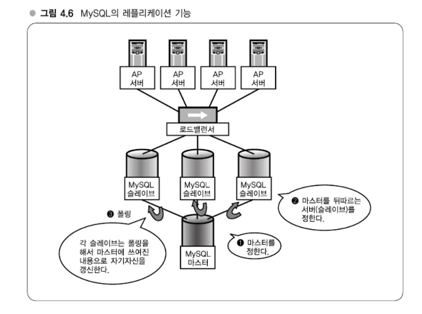

# Chapter 04 분산을 고려한 MySQL 운용
## 강의 12. MySQL의 분산 - 확장을 전제로 한 시스템 설계
### MySQL의 레플리케이션 기능
> MySQL은 기본적으로 **레플리케이션** 기능을 제공하여 분산 환경에서 데이터베이스 서버를 확장할 수 있다. 주요 개념은 다음과 같다:
- **마스터-슬레이브 구성**
  - **마스터 서버**에 모든 갱신(쓰기) 작업이 수행된다.
  - **슬레이브 서버**는 마스터의 데이터를 주기적으로 복제하여 동일한 데이터 상태를 유지한다.
- **데이터 복제 방식**
  - 슬레이브는 마스터의 변경 내용을 폴링(polling) 방식으로 확인 후 자신을 갱신한다.
  - 이를 통해 동일한 데이터의 서버를 여러 대 마련할 수 있으며, 읽기 전용 쿼리를 분산시킬 수 있다.
- **애플리케이션 분산 처리 전략**
  - **참조(SELECT) 쿼리**는 로드밸런서를 통해 슬레이브 서버로 분산하여 처리한다.
  - **갱신(INSERT, UPDATE, DELETE) 쿼리**는 반드시 마스터 서버에서 처리해야 한다.
    - 슬레이브에 갱신 쿼리를 전달하면 데이터 불일치가 발생할 수 있고, MySQL은 이를 감지하여 레플리케이션을 중지할 수 있다.

#### 시스템 구현 시 고려사항
- **O/R 매퍼 활용**
  - 일부 시스템에서는 O/R 매퍼(예: DBIx:MoCo)를 사용하여, 갱신 쿼리와 참조 쿼리를 자동으로 분리하여 처리한다.
- **로드밸런싱**
  - 슬레이브 앞단에 로드밸런서를 두어 읽기 쿼리의 분산 처리를 구현할 수 있다.
  - 로드밸런서를 사용하지 않고 애플리케이션에서 직접 분배하거나 MySQL Proxy와 같은 솔루션을 활용할 수도 있다.
> #### MySQL의 레플리케이션 기능
> - 마스터/슬레이브 구성
> - 참조 쿼리는 슬레이브로, 갱신 쿼리는 마스터로
> - O/R 매퍼로 제어한다.

### 마스터/슬레이브의 특징 
> 참조계열은 확장하고 갱신계열은 확장하지 않는다.

위 그림에서는 마스터를 분산할 수 없다라는 문제가 있다.   
참조계열 쿼리는 확장을 위해 서버를 늘리면 되는데, 그렇다고 서버를 늘린다고는 해도 대수를 늘리기보다 메모리에 맞추는 것이 중요하다.   
마스터를 반드시 확장할 수 없는 것은 아니지만, 갱신계열 쿼리가 늘어나면 상당히 험난해진다.   
웹 애플리케이션에서 대략 90% 이상이 참조계열 쿼리이다.
#### 갱신/쓰기계열을 확장하고자 할 때 
> 테이블 분할, key-value 스토어

드물게 마스터에 엄청난 쓰기작업이 발생하는 애플리케이션을 개발한느 경우가 있다. 이런 경우 마스터 테이블이 과부하 걸리는 경우가 있다.      
그렇지만 테이블을 분할해서 테이블 크기를 작게 해준다면 분할로 인해 쓰기작업이 분산된다. 테이블 파일이 분산되면 동일 호스트 내에서 여러 디스크를 가지고 분산시킬 수도 있으며, 서로 다른 서버로 분산할 수도 있다.   
key-value 스토어 방식에서는 단순히 값을 저장하고 꺼낼 뿐이므로 RDB가 갖는 복잡한 통계처리나 범용적인 정렬처리가 필요하지 않다면 key-value 스토어는 오버헤드도 적고 압도적으로 빠르고 확장하기 쉽다.

> #### 마스터/슬레이브의특징 •
> - 참조계열 쿼리는 확장
>   -  서버를 늘리기만 하면 된다.
>   - 단, 대수를 늘리기보다도 메모리에 맞추는 것이 중요
> - 마스터는 확장하지 않는다.
>   - 갱신 계열 쿼리가 늘어나면 험난해진다.
>   - 단, 웹 애플리케이션은 대부분의 경우 90% 이상이 참조 쿼리 
>   - 마스터 부하는 테이블 분할이나 다른 구현 등으로 연구


