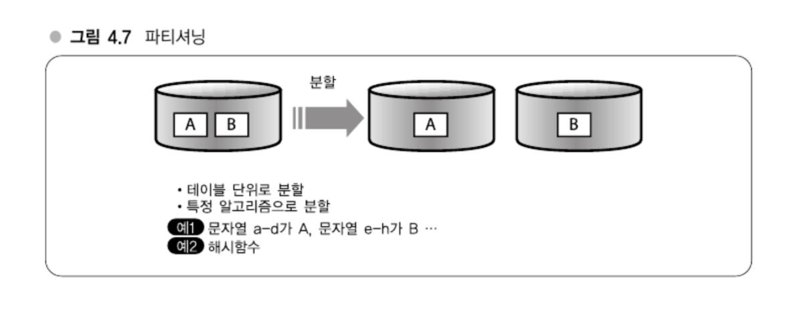
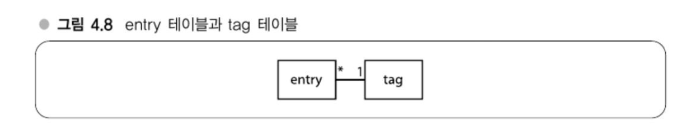
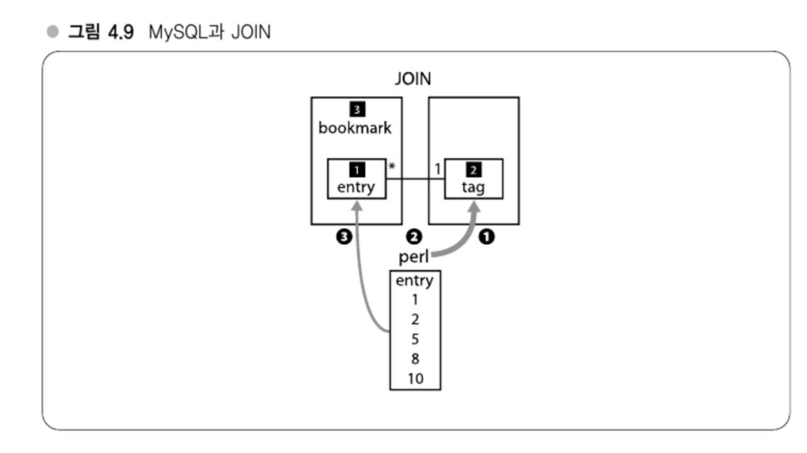
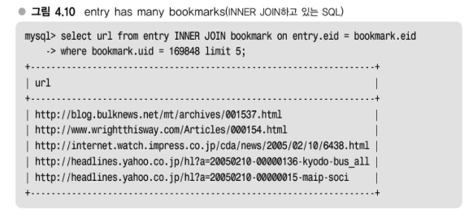
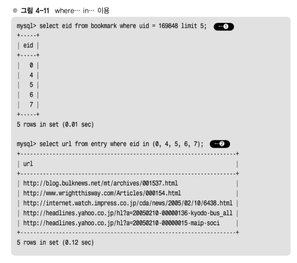
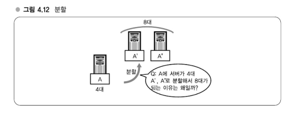
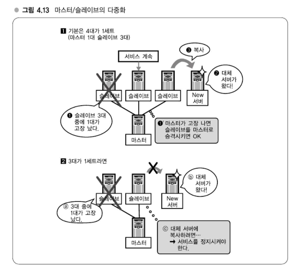

# Chapter 04 분산을 고려한 MySQL 운용
## 강의 13. MySQL의 스케일아웃과 파티셔닝
### MySQL의 스케일아웃 전략
MySQL의 기본적인 스케일아웃 전략으로는 데이터가 메모리에 올라가는 크기이면 메모리에 올리고 올라가지 않으면 메모리를 증설하는 것이다.

> #### MySQL의 스케일아웃 전략
> - 데이터가 메모리에 올라가는 크기?
>   - YES
> - 메모리에 올린다.
>   - NO
> - 메모리 증설
> - 메모리 증설이 불가능하면 파티셔닝

### 파티셔닝(테이블 분할)에 관한 보충
   
파티셔닝(테이블 분할)이란 테이블 A와 테이블 B를 서로 다른 서버에 놓아 분리하는 방법이다.   
파티셔닝은 국소성을 활용해서 분산할 수 있으므로 캐시가 유효하고 그렇기에 파티셔닝은 효과적이다.

### 파티셔닝을 전제로 한 설계

하테나 북마크의 테이블은 entry와 tag가 나뉘어져 있다.   
가끔 이 두 테이블을 함께 사용한다. 예를 들면 어떤 태그를 포함하는 엔트리 목록을 뽑으려고 한다.   
위 그림과 같이 entry와 tag는 1대 n의 관계로 RDB에서는 JOIN 쿼리를 던진다.   
> Q : 여기서 말하는 분할은 다른 머신으로 나눈다는 의미인가요?   
> A : 그렇다.


그림에서 1️⃣entry 테이블과 , 2️⃣tag 테이블을 다른 머신에 올리고 싶은데 MySQL에서는 서로 다른 서버에 있는 테이블을 JOIN하는 기능이 기본적으로 없다.   
그러므로 JOIN을 사용한다면 tag 테이블과 entry 테이블을 다른 서버에 위치시킬 수 없다.   
하지만 JOIN을 사용하지 않는다면 (1)과 같이 tag 테이블에 질의해서 (2)처럼 'perl'이라는 태그를 포함하는 엔트리의 eid를 1, 2, 5, 8, 10과 같이 쭉 뽑아내서 이 ID를 포함하는 entry 테이블의 레코드를 뽑아 내는 것(3)과 같은 식으로 둘(1), (2)로 나눠서 하면 뽑아낼 수 있다. 

### JOIN 배제 
> where ... in ... 이용



INNER JOIN bookmark를 하고 있는 쿼리가 있고 이것으로 정확하게 얻을 수 있다.   
in 으로도 동일한 데이터를 얻을 수 있다. 

### 파티셔닝의 상반관계
#### 파티셔닝의 장점
- **부하 분산:**  
  파티셔닝을 통해 데이터베이스를 여러 서버에 분산시키면, 각 서버의 부하가 줄어듭니다.
- **국소성 증가 및 캐시 효과:**  
  데이터가 분산되어 국소성이 증가함에 따라 캐시 효율이 높아집니다.

#### 파티셔닝의 단점
- **운용 복잡성 증가:**
    - 서버가 둘로 나뉘거나 용도가 다른 여러 서버가 생성됨에 따라 전체 시스템 구조를 파악하기 어려워집니다.
    - 예를 들어, 같은 한 테나 북마크의 데이터베이스라도 서로 다른 역할을 하는 서버가 존재할 수 있으며, 이를 머릿속에 모두 기억하고 관리하는 것이 복잡해집니다.
    - 다이어리와 같이 여러 데이터베이스를 분할하여 사용하는 경우, 어느 DB가 어디에 위치하는지 파악하는 것이 매우 어려워집니다.
- **장애 대응 어려움:**
    - 장애 발생 시, 어느 서버에서 문제가 발생했는지 신속하게 파악하는 것이 힘들어집니다.
    - 운용 복잡성으로 인해 장애 복구에 소요되는 시간이 늘어나고, 결과적으로 고장률이 높아질 수 있습니다.

#### 파티셔닝과 서버 대수 증가

- 파티셔닝을 진행할 때 단순히 한 대의 서버를 늘리는 것이 아니라, 서버 수가 배로 증가하는 경우가 많습니다.
- 예를 들어, 그림 4.12에서 A라는 호스트(DB)를 분할하여 A'와 A"로 나누면, 기존 1대였던 서버가 2대로 늘어납니다.
- 그러나 실제 운영에서는 A 서버가 4대 있을 때 분할 후에는 8대로 늘어나게 됩니다.
- **퀴즈:**
    - 서버가 4대 있을 때 분할하면 총 몇 대의 서버가 필요한가?  
      → **답:** 8대
> 이와 같이 파티셔닝은 부하 분산과 캐시 효과 등 여러 이점을 제공하지만, 운용의 복잡성 증가와 장애 대응의 어려움이라는 단점을 동반합니다. 따라서 파티셔닝을 적용할 때는 전체 시스템의 운용 및 관리 측면에서 신중한 고려가 필요합니다.#

#### 다중화에 필요한 서버 대수는 몇 대?
- **학생 질문:**  
  "4대나 필요하지 않나요? 운용 경험이 없으면 복잡한 건가요?"
- **답변:**
  - **핵심:** 다중화(Multi-Redundancy)
    - DB 서버처럼 중요한 시스템은 **단일 서버**에 의존할 경우, 그 서버가 고장나면 전체 서비스가 중단됩니다.
  - **예:**
    - 그림 4.13에서는 마스터 1대와 슬레이브 3대로 구성하는 다중화 구조를 제시합니다.
    - 만약 슬레이브가 1대 고장나더라도, 마스터나 다른 슬레이브가 살아 있으므로, 슬레이브 중 한 대를 마스터로 승격시켜 운영할 수 있습니다.
> 왜 마스터 1대 + 슬레이브 2대가 아닌 3대인가?
- **의문 제기:**  
  "마스터 1대 + 슬레이브 2대, 즉 총 3대로도 충분하지 않나요?"
- **설명:**
  - 단순히 3대 구성으로도 운영은 가능할 수 있으나, 실제 운용에서는 **서비스의 연속성과 무정지 복구**를 보장하기 위해 4대 구성이 필요합니다.
  - **문제 상황:**
    - 3대로 구성된 시스템에서 슬레이브 1대가 고장났다고 가정하면,
      - 남은 슬레이브 중 1대를 중지하고 새로운 서버에 데이터를 복사하는 동안,
      - **서비스 중지** 문제가 발생합니다.
    - 마스터를 중지하면 쓰기 작업이, 슬레이브를 중지하면 참조 작업이 불가능해지기 때문에, 무정지 복구가 어려워집니다.
> 4대 구성이 주는 이점
- **안정성 극대화:**
  - 마스터 1대와 슬레이브 3대를 구성하면,
    - 슬레이브 중 1대가 고장나더라도, 남은 2대 중 1대를 중지하여 새로운 서버로 데이터 복사 후 고장난 슬레이브를 대체할 수 있습니다.
  - 이를 통해 **무정지 복구**가 가능해지며, 장애 발생 시에도 서비스 연속성을 유지할 수 있습니다.
> 결론
- **다중화의 중요성:**
  - DB 서버와 같이 고가용성이 요구되는 시스템에서는 단일 서버 구성보다 다중화 구성을 통해 장애 발생 시 신속하고 원활한 복구가 필수적입니다.
  - 4대를 한 세트로 구성하는 것은 **완벽한 다중화**를 위해 필요하며, 이는 운영 경험을 쌓으면서 깨닫게 되는 중요한 점입니다.


#### 애플리케이션의 용도와 서버 대수
- **분할에 따른 서버 수 증대:**
  - 초기에는 4대였던 서버 구성이, 분할 방법에 따라 8대, 3개 분할 시 12대 등으로 늘어날 수 있음.
- **무정지 서비스의 필수 조건이 아님:**
  - 모든 애플리케이션에서 반드시 4대 이상의 서버가 필요한 것은 아님.
  - 애플리케이션의 용도에 따라, 일부 서비스 기능만 일시 중지하면서 유지보수를 할 수도 있음.
    - 예를 들어, 하테나북마크의 경우 태그 테이블과 같이 일부 페이지만 유지보수 중 서비스 중단 없이 운영 가능.
    - 반면, 하테나다이어리의 일기 DB처럼 사용자에게 항상 보여져야 하는 중요한 서비스라면, 백업 등을 포함해 여러 대의 서버가 필요할 수 있음.
#### 서버 대수와 고장률
- **분할 시 서버 대수 증가와 고장 확률:**
  - 서버 분할을 진행하면 서버 대수가 급증하며, 이로 인해 각 서버의 고장 확률도 자연스럽게 올라감.
  - 분할을 무작정 진행한다고 해서 항상 좋은 결과를 보장하는 것은 아님.
- **제품 가격대 및 운용 편의성 고려:**
  - 서버를 늘리는 대신, 메모리 등 다른 자원을 업그레이드 하는 것이 더 경제적일 수 있음.
  - 분할 방식이 운용에 복잡성을 더할 경우, 관리 측면에서 불리할 수 있으므로 제품의 가격대와 운용 편의성을 종합적으로 고려해야 함.
