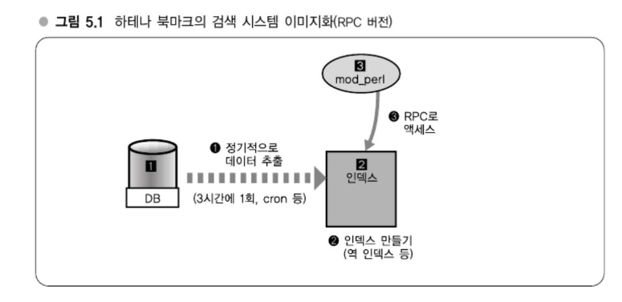
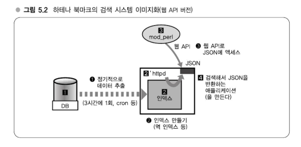

# Chapter 05 대규모 데이터 처리 실전 입문

---
### 굳이 대규모 데이터에 액세스하고자 하는 경우란?
#### 대규모 데이터 처리 애플리케이션의 사고방식과 대책
운용에 대한 생각에서 개발에 대한 생각으로 전환하면서 대규모 데이터 애플리케이션 개발에 대해 얘기를 해나가도록 하자.   
지금까지는 데이터가 대량으로 있더라도 국소성을 발견하고 그에 맞는 시스템 구성을 변경해서 속도를 내는 형태였다.
본질적으로 대량의 데이터에 액세스하고자 하는 경우에 어떻게 할 것인가?   
5장에서는 RDBMS, 즉 MySQL 등에서 처리할 수 없는 규모의 데이터의 대상으로 계산하고 할 경우는 어떠한 대책이 있는지 살펴보자.

> #### 대규모 데이터를 처리하는 애플리케이션
> - 용도특화형 인덱싱 (강의 14)
> - 이론과 실전 양측과 맞붙어 싸우기 (강의 15)

## 강의 14. 용도특화형 인덱싱
### 대규모 데이터를 능수능란하게 다루기

---
### 인덱스와 시스템 구성 - RDBMS의 한계가 보일 때
대규모 데이터를 다룰 경우로서 전문 검색이나 유사문서계열 탐색, 데이터마이닝의 경우 RDBMS로는 한계가 있다.      
배치 처리로 RDBMS에서 데이터를 추출해서 별도의 인덱스 서버와 같은 것을 만들고, 이 인덱스 서버에 웹 애플리케이션 RPC(Remote Procedure Call) 등으로 액세스하는 방법을 사용한다.

#### RPC, 웹 API

1️⃣ DB에서 정기적으로 3시간에 1번처럼 cron 등으로 데이터를 추출해서(1) 2️⃣인덱스 서버로 넘기는 것이다.   
인덱스로는 2️⃣ 에서 검색용 역 인덱스을 만들어준다. 3️⃣AP 서버에서는 인덱스를 갖고 있는 2️⃣인덱스 서버에 RPC로 액세스한다(3). 
RPC는 Remote Procedure Call을 의미하고, 요즘은 RPC보다는 웹 API라고 부른다.
3️⃣AP 서버에 인덱스를 직접 저장하지 않는 이유는  3️⃣에 충분한 메모리가 탑재되어 있지 않은 경우가 많고 AP 서버의 아키텍처 면에서 볼 때 커다란 검색 인덱스를 여러 프로세스와 같이 사용하도록 구성하는 것은 적합하지 않다. 그래서 인덱스 전용 서버에서 처리하도록 한다.


대체적으로 원격에 놓인 데이터 구조나 파일을 검색하고자 할 때는 RPC라고 하는, 네트워크를 경유해서 프로토콜이 독자적으로 정해져 있는 것을 사용하는 경우가 많았다.   
그러나 최근에는 이 프로토콜을 JSON + HTTP, 즉 웹 API로 처리하는 일이 더 많은 것 같다.

> #### RDBMS로는 한계, 그럴 때는?
> - 배치 처리로 데이터 추출
> - 별도 인덱스 서버를 만들어서 웹 API 등으로 처리

### 용도특화형 인덱싱 - 튜닝한 데이터 구조 사용하기
용도특화형 인덱싱을 하면 RDBMS에서는 어려운 일이 가능해진다.   
RDBMS라는 것은 데이터를 정렬하거나, 통계처리가 가능하거나, JOIN 하는 등 범용적인 용도로 만들어져 있따. 다시 말해, 다양한 목적에 사용할 수 있도록 만들어져 있다.   
뭔가 특정한 목적으로만 사용하고자 할 때에는 특정한 목적으로 사용할 수 있도록 튜닝한 데이터 구조를 사용하면 압도적으로 빠르다.

#### [예] 하테나 키워드에 의한 링크 

특정 문서가 20만이상의 키워드 중에 무엇을 포함하는지를 찾아야만 할 때 일일이 DB 내에 있는 키워드 목록과 사용자가 작성한 내용을 맞춰보게 되면 DB에 과부하가 걸리게 된다.   
그래서 배치 처리로 20만 건의 키워드를 추출해둔다.   
예전에는 거대한 정규표현을 만들어 10만 건의 정규표헌이 들어간 거대한 파일을 메모리에 읽어들인 후 매칭시켜 나갔는데 정규표현에는 오토마톤 중에 NFA(Nondeterministic Finite Automaton, 비결정성 유한 오토마톤) 특성으로 인해 OR로 연결하면 매칭할 떄 계산량이 방대해져 속도가 나지 않았다.   

#### [예] 하테나 북마크의 텍스트 분류기

Complement Naive Bayes라는 알고리즘을 사용해서 자동으로 기계학습을 분류하고 있다.   
CNB 알고리즘을 사용할 때에는 문서에 포함된 단어의 출현확률이 필요한데 출현확률, 실제로는 출현빈도만을 저장하는 서버를 가동하여 카테고리 판정시 부하를 줄였다.

#### 전문 검색엔진
전문 검색엔진은 이와 관련된 것 중 가장 좋은 예시로, 아래 포인트를 어떻게 쿼리할 것인가라고 하는 점이 문제가 된다.
- 대량의 데이터에서 검색하고자 한다.
- 빠르게 검색하고자 한다.
- '좋은 느낌(Feeling Lucky)'과 같은 문서를 상위로

세 번째 '좋은 느낌(Feeling Lucky)'에 해당하는 문장을 상위로 가져오는 것이 제일 어려운데 이를 위해서는 '스코어링' 처리를 수행한다.      
스코어링에서는 검색대상인 문서가 가지고 있는 다양한 정보를 복합적으로 이용하는데 이것도 특정 컬럼으로 정렬할 수 있는 RDBMS에서는 무리다.   
반대로 검색 인덱스를 직접 만들면, 즉 전문 검색엔진을 직접 구현한다면 스코어링 알고리즘도 자유롭게 선택할 수 있으므로 검색결과를 나열하는 방법은 RDBMS를 사용하는 것보다 훨씬 유연하게 구성할 수 있다.

