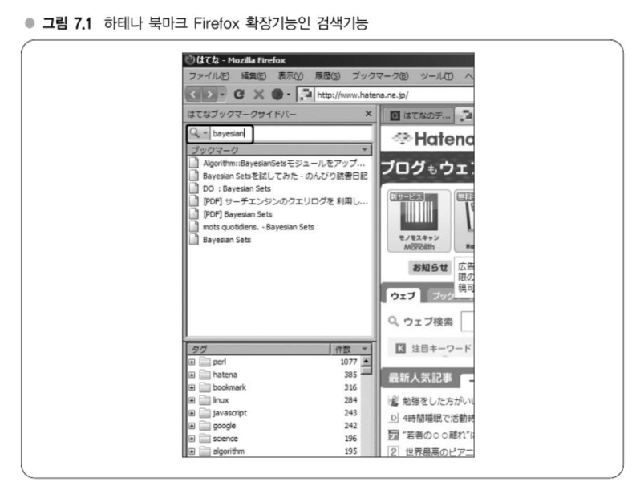

# Chapter 07 알고리즘 실용화 - 가까운 예로 보는 이론, 연구의 실전 투입

---
## 강의 19. 알고리즘과 평가
### 데이터 규모와 계산량 차이
대상이 되는 데이터가 크면 클수록 알고리즘이나 데이터 구조 선택이 속도에 영향을 미친다.   
예들 들어 데이터 내에서 필요한 데이터를 처음부터 순차적으로 찾아가는 '선형탐색(Linear Search)'은 1,000건의 데이터가 있을 때 원하는 데이터를 찾기까지 탐색을 반복하면서 최대 1,000번을 탐색하는 알고리즘이다. O(n)   
이분탐색(Binary Search)은 n건의 데이터에서 log n번만에 목적 데이터를 찾는 알고리즘으로 O(log n)이다.
이 최대 탐색횟수는 계산횟수의 기준이 되는 수로 '계산량'이라고 한다.   
일반적으로 계산량이 적을수록 속도가 빠르다.   

### 알고리즘이란?
> 알고리즘은 어떤 값 또는 값의 집합을 입력(input)으로 하고 어떤 값 또는 값의 집합을 출력(output)으로 하는, 명확하게 정의된(well-defined) 계산절차다.

적당한 값을 입력하면 명확하게 정의된 계산절차에 따라 값이 출력으로 반환되는 것이 알고리즘이다.   
탐색하고자 하는 값과 대상 데이터를 입력하면 탐색이 이뤄져서 목적 데이터의 위치가 반환된다.

#### 좁은 의미의 알고리즘, 넓은 의미의 알고리즘
예를들어 '프로그램에서 그 부분 알고리즘이 어떻게 되어 있지?'라는 질문에서 질문자가 알고자 하는 것은 아마도 처리(도메인 로직, Domain Logic)의 흐름이 넓은 의미의 알고리즘이다.   
한편, 좁은 의미에서의 알고리즘은 '명확하게 정의된 계산문제에 대해 정의된 계산절차를 수행하는 것'이다.

### 알고리즘을 배우는 의의 - 컴퓨터의 자원은 유한, 엔지니어의 공통언어
컴퓨터의 자원은 유한합니다.     
따라서 알고리즘을 배우는 것은 매우 중요하며, 제한된 자원(CPU, 메모리 등)을 효과적으로 활용하여 문제를 해결하는 방법에 대한 사고방식을 기르는 데 도움이 됩니다. 또한, 알고리즘은 엔지니어 간의 공통 언어로 작용하여,     
예를 들어 "해시 함수는 이렇다"와 같은 간단한 언급만으로도 상호 이해를 돕는 역할을 합니다.
#### 알고리즘 학습의 주요 이점
- **제한된 자원의 효율적 활용:**  
  컴퓨터의 자원이 유한하다는 사실을 인식하고, 한정된 자원 내에서 문제를 해결하는 방식을 배울 수 있습니다.
- **공통 언어로서의 역할:**  
  알고리즘은 개발자와 엔지니어들이 서로의 생각을 빠르게 공유할 수 있는 공통 언어입니다.  
  이를 통해 "해시로 해결"과 같이 짧은 커뮤니케이션 만으로도 정확한 의미 전달이 가능합니다.
- **새로운 문제에의 대응력 향상:**  
  알고리즘을 익히면, 이전에 배운 지식을 토대로 새로운 문제에도 효과적으로 대처할 수 있습니다.  
  예를 들어, **베이지안 필터(Bayesian Filter)** 알고리즘을 활용하면 데이터를 자동으로 분류하는 프로그램 또는 메일 스팸 필터를 만들 수 있습니다.
- **대규모 데이터 처리:**  
  적절한 데이터 구조를 사용하면 수억 건의 레코드를 수 MB 단위로 압축하여 저장할 수 있습니다.  
  최근 Google 일본어 입력 주에서는 사전 데이터를 **LOUDS**라는 데이터 구조로 50MB까지 압축, 대용량 데이터를 손쉽게 배포할 수 있음을 보여주었습니다.
#### 결론
대규모 데이터 처리 및 애플리케이션의 성능 개선은 알고리즘의 효율성에 크게 의존합니다.  
따라서 알고리즘 학습은 개발자에게 있어 필수적이며, 제한된 자원에서 최적의 성능을 끌어내기 위한 중요한 기반이 됩니다.

### 알고리즘의 평가 - Order 표기
알고리즘의 계산량은 보통 **Order 표기법**을 사용하여 정량적으로 평가한다. 이는 입력 크기 *n*에 대해 대략적인 계산량을 나타내며, 알고리즘 간의 성능 비교에 유용하다.   
#### 기본 개념
- **Order 표기법**은 알고리즘의 수행 시간이 입력 크기 *n*에 따라 어떻게 증가하는지를 나타낸다.
- 입력 크기와 관계없이 일정한 시간 내에 처리가 완료되면 **O(1)**로 표현된다.
  - 예: 해시 테이블에서 데이터를 조회하는 경우 (해시 함수 계산 등에서 *n*에 의존하지 않음)
- 평균 또는 최대 계산량을 표현하는 데 주로 사용하며, 특정 상황(예: 첫 번째 탐색에서 종료)에는 변동이 있지만, 평가는 일반적인 케이스를 반영한다.
#### 예시: 선형 탐색 vs. 이분 탐색
- **선형 탐색**:
  - 모든 원소를 순차적으로 검사할 수 있으므로 최대 **O(n)** 번의 탐색이 필요하다.
- **이분 탐색**:
  - 데이터가 정렬되어 있을 경우, 탐색 범위를 반씩 줄여나가므로 **O(log n)**의 계산량을 가진다.
  - 단, 이분 탐색은 데이터가 정렬되어 있어야 하며, 정렬 과정이 필요할 수 있으므로 항상 선형 탐색보다 빠르다고 보장되진 않는다.
#### 다양한 Order 표기의 비교
알고리즘의 계산량은 일반적으로 아래와 같이 표현된다. 오른쪽으로 갈수록 계산량이 많아진다.
- **O(1) < O(log n) < O(n) < O(n log n) < O(n²) < O(n³) < … < O(2ⁿ)**
대규모 데이터를 다룰 때 실제로 실용적인 알고리즘은 **O(n log n)** 정도의 효율을 보여주는 경우가 많다.     
예를 들어, 정렬 알고리즘의 경우 아무리 최적화해도 이론상 **O(n log n)**보다 빠르게 동작할 수 없음을 증명되어 있다.   
#### 계산량의 범위
- **시간 계산량**:  
  실행 시간 또는 단계 횟수를 나타내며, 주요 알고리즘 평가 척도이다.
- **공간 계산량**:  
  알고리즘 실행 시 사용되는 메모리의 양을 평가하는 데에도 Order 표기가 사용된다.
#### 결론 및 참고사항
Order 표기를 통해 다양한 알고리즘의 효율성을 비교할 수 있으며,     
한계가 있는 자원을 효율적으로 활용할 수 있는 알고리즘 설계에 도움을 준다.     
더 자세한 내용은 알고리즘 해설서나 심화 자료를 참고할 수 있다.

### 티슈를 몇 번 접을 수 있을까? - O(log n)과 O(n)의 차이
O(log n)과 O(n)은 셀제로 n이 커졌을 때 계산량이 얼마나 차이가 날까?   
종이를 접을 떄 필요한 노력은 아마도 접으려고 하는 대상의 두께 등에 의존한다.   
이 두께가 최초에 1mm였다면 한 번 접은 직후에는 2mm다.   
1 => 2 => 4 => 8 => 16 => 32 ...   
즉, 접는 횟수를 n이라고 보면 2^n 이다.
#### 알고리즘에 있어서 지수적, 대수적 감각
계산량이 지수적으로 증가하는 알고리즘은 이와 같이 데이터량이 적어도 계산량이 매우 커져버린다.   
한편 지수의 역인 대수적으로 증가하는 O(log n)인 알고리즘은 데이터량이 꽤 커져도 적은 계산량으로 문제를 해결할 수 있다.   

### 알고리즘과 데이터 구조 - 뗄래야 뗄 수 없는 관계?
데이터 구조는 배열, 트리구조와 같이 대상이 되는 데이터를 저장 또는 표현하기 위한 구조를 말한다.   
데이터 구조와 알고리즘이 세트로 논의되는 것은 알고리즘에서 자주 사용하는 조작에 맞춰 데이터 구조를 선택할 필요가 있기 때문이다.   
RDBMS에서는 인덱스를 구현할 때는 B+트리라는 트리구조가 자주 사용된다.   
B+트리는 2차 기억장치에 트리구조를 배치할 때 공간적으로도 적합한 구조이고 이 트리를 사용하여 인덱스를 저장해두면 탐색에 수반되는 단계 횟수도 조금 줄일 수 있고 디스크를 읽는 횟수도 최소화할 수 있다는 특성이 있다.

### 계산량과 상수항 - 역시 측정이 중요
간단한 구현에서 상수항은 해당 알고리즘의 계산량에 거의 영향을 주지 않지만, 복잡한 구현이 되면 상수항을 무시할 수 없게 된다.   
또한 구현이 복잡하지 않더라고 CPU 캐시에 올리기 쉬운지, 분기예측이 발생하지 않는지 등 계산량의 구조적인 특성에 의존하는 형태로 상수항에서 차이가 나는 경우도 있다.   
예를 들어, 정렬 알고리즘은 이론적으로 O(n log n)이 하한으로, 평균 계산량 O(n log n)을 달성하는 알고리즘은 여러 개 존재한다.   
그러나 같은 O(n log n)이라도 일반적으로 퀵정렬이 가장 빠르다고 한다.   
쿽정렬은 그 특성상 CPU 캐시를 사용하기 쉽다는 장점이 있어서 이 점이 비교할 때 유리하게 작용한다.
#### 구현시 유의하고픈 최적화 이야기
반면, 유의했으면 하는 점은 알고리즘뿐만 아니라 뭔가를 구현하는 데 있어서 상수항을 줄이기 위해 처음부터 최적화를 수행하는 것은 대체로 잘못된 방침이다.   
계산량이 O(n^2)인 알고리즘을 나름대로 노력해서 상수항을 줄이는 연구를 하더라도 이를 대체해서 O(n log n)
계산량이 O(n^2)인 알고리즘을 나름대로 노력해서 상수항을 줄이는 연구를 하더라도 이를 대체해서 O(n log n)인 알고리즘이 있다면 후자를 사용하는 편이 개선 효과가 더 클 것이다.

### 알고리즘의 실제 활용 - 단순한 게 더 낫기도?

하테나 북마크의 Firefox 확장기능에는 과거에 사용자가 북마크한 데이터를 증분 검색할 수 있는 기능이 있었다. 이를 구현하기 위해 팀 내에서는 검색이 자주 발생하고 클라이언트에서 계산된다는 점에서 계산량이 적은 구조를 택해야 한다는 결론에 도달했고, 데이터가 많을 경우를 고려해 Suffix Array를 사용하기로 했다.   
Suffix Array는 검색은 빠르지만 전처리에 시간이 걸리는 구조였고, 당시에는 IS법이라는 방법을 사용해 JavaScript로 구현했다. 하지만 북마크할 때마다 전처리를 수행하면 시스템 부하가 컸고, 통합에 어려움이 있었다.   
결국 Suffix Array를 포기하고 Firefox 확장기능 내부의 SQLite를 사용해 LIKE를 통한 선형 탐색 방식으로 전환했다. 사용자에 따라 수만 건의 데이터도 현재 컴퓨터 성능으로는 문제가 되지 않아, 이 방식으로도 충분히 사용할 수 있었다.
#### 여기서 배운 점
예측이나 측정이 중요하다는 점, 그리고 단순한 구현이 오히려 실용적인 경우가 많다는 점을 배웠다. 데이터가 많을 것이라는 가정 하의 최적화보다 실제 사용 환경에 맞는 간단한 구조가 더 적절할 수 있으며, 데이터가 적다는 판단 역시 직감이 아니라 측정을 기반으로 해야 함을 깨달았다.

### 써드파티 소스를 잘 활용하자 - CPAN 등
CPAN 등에서 검증된 알고리즘은 제3자가 쉽게 활용할 수 있도록 오픈소스로 공개된 경우가 많다. 앞서 IS법의 예에서는 당시 JavaScript로 된 Suffix Array 구현체가 없어서 직접 만들었지만, Perl에서는 CPAN처럼 잘 정리된 라이브러리가 존재한다.   
이런 소스를 잘 활용하면 공수를 줄일 수 있지만, 구현 내용을 모른 채 사용하는 것은 권장되지 않는다. 내부 구조를 이해하지 못한 채 사용할 경우, 잘못된 선택을 할 수 있기 때문이다.   
예를 들어 CPAN에는 다양한 압축 알고리즘 구현이 있다. 짧은 문서에 적합한 것, 시간이 걸리지만 압축률이 높은 것, 반대로 빠르지만 압축률이 낮은 것 등 각각의 특성이 다르므로, 상황에 맞게 선택해야 한다. 이를 위해서도 알고리즘에 대한 안목과 지식을 넓히는 것이 중요하다.   
한편, 써드파티 라이브러리는 우리가 원하는 API 형태가 아니거나, 불필요하게 많은 기능을 포함해 과도한 경우도 있다. 이럴 때는 필요한 부분만 직접 구현하는 것이 비용과 효과 면에서 더 나은 선택이 될 수 있다. 결국 중요한 것은 ‘밸런스’다.

> ### 데이터 압축과 속도
> 압축이라고 하면 일반적으로 큰 파일을 작은 크기로 만드는 유틸리티를 떠올리기 쉽다. 예를 들어 Windows의 ZIP 아카이버, GNU gzip 등이 있다. 이러한 도구를 사용할 때, 많은 사람들은 "압축 해제는 무겁고 느리다"고 생각하기도 한다.   
> 하지만 전체적인 **처리량 관점**에서는 오히려 데이터를 압축해두는 편이 더 빠른 경우도 많다. 컴퓨터에는 CPU 부하와 I/O 부하가 있다. 어떤 처리를 하면서 I/O 대기 시간이 길면, 그 동안 CPU는 유휴 상태가 된다.   
> 파일을 압축해두면 CPU에 약간 부담이 생기지만, 대신 I/O 대기를 줄일 수 있다. 특히 CPU는 여유 있고 I/O가 바쁜 경우가 많기 때문에, **압축을 통해 I/O 부하를 줄이고 CPU에 처리를 맡기면 전체 처리량이 향상될 수 있다.**   
> 이런 구조는 HTTP 통신에서 deflate 압축을 사용하는 방식과 유사하다. 압축은 오래된 기술처럼 느껴질 수 있지만, 여전히 시스템 효율을 높이는 데 중요한 역할을 한다.




