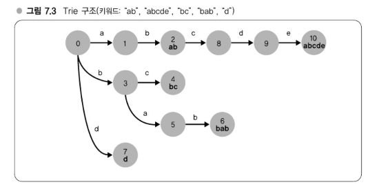
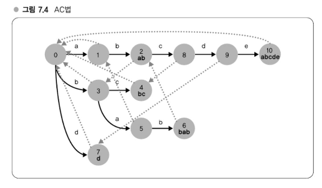

# Chapter 07 알고리즘 실용화 - 가까운 예로 보는 이론, 연구의 실전 투입

---
## 강의 20. 하테나 다이어리의 키워드 링크
### 키워드 링크란?
하테나 다이어리(http://d.hatena.ne.jp/)에는 독특한 기능인 **키워드 링크**가 존재한다. 이는 블로그 글 작성 시, 특정 키워드에 자동으로 링크가 걸리는 기능으로, 링크는 해당 키워드를 설명하는 별도의 페이지로 연결된다.   
이 기능은 Wiki에서 자동으로 WikiWord에 링크를 거는 방식과 유사하다.   
링크 대상 키워드는 **하테나 키워드(http://k.hatena.ne.jp/)**에 사용자들이 등록한 단어들이다. 2009년 8월 기준, 약 27만 개의 키워드가 등록되어 있으며 하루 평균 100개 정도가 새롭게 추가되고 있다.   
작성된 글의 본문(X)에 대해 이 27만 개 단어로 구성된 키워드 사전과 매칭하여, 키워드가 등장하는 부분을 링크로 치환하는 것이 이 기능의 핵심이다. 실제로는 키워드 문자열을 HTML anchor 태그로 변환하는 텍스트 치환 문제라고 볼 수 있다.   
#### **예시:**
입력:
```
하테나다이어리는 블로그다.
```
치환 결과:
```
<a href="...">하테나다이어리</a>는 <a href="...">블로그</a>다.
```
이처럼 키워드 링크는 사용자 경험을 풍부하게 해주는 자동 링크 기능이다.

### 최초 구현방법
하테나 다이어리가 공개된 초창기에는 키워드 링크 기능을 특별한 검색 알고리즘 없이 **정규표현식 기반**으로 단순하게 구현했다. 방법은 사전에 포함된 모든 키워드를 OR 조건으로 연결한 정규표현식을 생성하여 텍스트를 치환하는 방식이다.   
예를 들어, 사전에 `foo`, `bar`, `baz`라는 키워드가 있다면 다음과 같은 정규표현식을 만든다:   
```perl
(foo|bar|baz)
```
그리고 Perl에서는 `eval` 옵션과 `ge` 플래그를 활용해 문자열 내 키워드를 링크로 치환하는 코드를 작성할 수 있다:
```perl
use URI::Escape;

$text =~ s/(foo|bar|baz)/&replace_keyword($1)/ge;

sub replace_keyword {
    my $w = shift;
    return sprintf('<a href="/keyword/%s">%s</a>', uri_escape($w), $w);
}
```
이 코드는 `$text` 내의 키워드를 자동으로 하이퍼링크된 HTML 태그로 변환한다. `uri_escape`는 URL 인코딩을 위해 사용되며, 링크 대상이 되는 키워드에 안전하게 적용된다.   
이와 같은 단순한 방식은 구현이 빠르지만, 키워드 수가 많아질수록 정규표현식이 커져 성능 저하의 문제가 발생할 수 있다.

### 문제발생 - 키워드 사전의 대규모화
#### 키워드 수 증가에 따른 성능 문제와 대응
하테나 다이어리에서 키워드는 사용자가 등록하기 때문에, 서비스 오픈 초기에는 어휘 수가 적었다. 따라서 DB에서 실시간으로 정규표현을 생성해 키워드 링크를 처리해도 문제가 없었다.   
그러나 키워드 수가 증가함에 따라 성능 문제가 발생하기 시작했다. 특히 **정규표현 처리 시간**이 주요 병목이 되었다.   
문제가 된 두 가지 지점은 다음과 같다:
1. **정규표현을 컴파일하는 처리**
2. **정규표현에서 실제로 패턴 매칭을 수행하는 처리**
##### 대응 방법
- **정규표현 컴파일 처리(1)**는, 미리 정규표현을 만들어 메모리나 디스크에 저장(캐싱)함으로써 어느 정도 회피할 수 있었다.
- **패턴 매칭 처리(2)**는 본문 텍스트에 대해 키워드 링크를 적용한 결과를 캐싱하는 방식으로 대응했지만, 다음과 같은 한계가 있었다:
  - 새로운 키워드가 추가될 경우, 기존 캐시에는 반영되지 않기 때문에 일정 주기로 재생성해야 함
  - 트래픽이 적은 블로그의 경우 캐시 재생성의 효과가 낮아 운영 효율이 떨어짐

이처럼 키워드 수가 많아질수록 단순 정규표현 기반 방식은 유지 관리와 성능 양면에서 한계에 도달하게 된다.

### 패턴매칭에 의한 키워드 링크의 문제점
#### 정규표현 기반 키워드 링크의 한계와 성능 저하 원인
하테나 다이어리의 키워드 수가 10만 개를 넘어서고, 전체적인 서비스 트래픽도 증가하면서 키워드 링크 처리의 부하가 급격히 증가했다. 결국 시스템이 과부하 상태에 이르게 되었다.
#### 병목의 근본 원인: 정규표현 알고리즘의 한계
이 문제의 핵심 원인은 Perl의 정규표현 엔진에 있다. Perl에서는 **NFA(Nondeterministic Finite Automaton)** 방식의 정규표현 구현을 사용하며, 이는 실용적인 언어 대부분에서도 채택되는 방식이다.
NFA 기반 정규표현의 매칭 방식은 다음과 같다:
- 정규표현이 `(foo|bar|baz)`와 같은 형태일 경우,
- 입력 텍스트를 앞에서부터 차례로 살펴보며
  - `foo` 매칭 시도 → 실패
  - `bar` 매칭 시도 → 실패
  - `baz` 매칭 시도 → ...
- 이 과정을 반복하며 순차적으로 시도한다.

이 방식은 키워드의 개수가 많아질수록 성능이 선형적으로 저하된다. 즉, **매칭 대상 키워드 수에 비례한 계산량**이 발생하게 되는 것이다.   
서비스 초기에는 키워드 개수가 적었기 때문에 이러한 성능 문제는 드러나지 않았지만, 시간이 지나 키워드가 누적되고 액세스가 많아지면서 근본적인 한계에 도달한 것이다.

### 정규표헌 => Trie - 매칭 구현 변경
#### Trie 기반 매칭으로의 전환
정규표현 기반 키워드 매칭의 계산량 문제를 해결하기 위해, 하테나 다이어리는 기존의 정규표현 방식에서 **Trie(트라이)** 구조를 이용한 매칭 구현으로 전환하였다.
#### Trie 입문
Trie는 **트리 구조의 일종인 탐색용 데이터 구조**로, 탐색 대상 데이터의 공통 접두사를 모아 트리 구조를 형성하는 것이 특징이다.   
예를 들어 키워드가 다음과 같다고 하자:
- `"ab"`, `"abcde"`, `"bc"`, `"bab"`, `"d"`
  

이 키워드를 기반으로 생성된 Trie는 다음과 같은 구조(예시적으로 표현된 그림 7.3)로 구성된다. 각 노드는 번호가 붙어 있으며, 트리의 엣지(edge)는 문자를 나타낸다.   
탐색 방법은 루트 노드에서 시작하여 엣지를 따라 문자 단위로 탐색한다:
- 예를 들어 `0 → 1 → 2` 노드 순서로 이동하면 `'a' → 'b'` 경로를 따라가며, 노드 2에 `"ab"`가 종단(terminal)임이 기록되어 있으면 `"ab"` 키워드가 존재함을 의미한다.
- 반대로 `'a' → 'b' → 'c'`를 순회했지만 해당 노드가 종단으로 표시되지 않았다면, `"abc"`는 키워드에 포함되지 않은 것이다.
#### Trie의 장점
- `"ab"`와 `"abcde"`는 `"ab"`라는 **공통 접두사**를 갖고 있으므로 Trie 내에서 효율적으로 하나의 경로로 정리된다.
- `"bc"`와 `"bab"`는 `"b"`를 공통 접두사로 공유한다.

이처럼 **공통 접두사를 정리하여 불필요한 반복을 줄이는 것**이 Trie의 핵심적인 장점이다. 이를 통해 다량의 키워드에 대한 검색 속도를 대폭 향상시킬 수 있게 된다.

#### Trie 구조와 패턴 매칭
Trie 구조를 키워드 사전으로 활용하여 패턴 매칭을 수행하면, 정규표현 기반 방식보다 계산량을 크게 줄일 수 있다.     
입력 문자열을 Trie에 문자 단위로 순차 입력하며, 트리의 엣지를 따라 탐색을 진행하고 **종단 노드에 도달하면 해당 키워드가 존재하는 것**으로 간주한다.   
이 방식은 `(foo|bar|baz)` 형태의 정규표현보다 훨씬 효율적이다. **공통 접두사는 한 번만 탐색하면 되기 때문**이다.
예를 들어, `"hogefoo"`라는 단어를 Trie에서 탐색할 경우:   
1. `"h"`로 시작하는 경로가 없으므로 매칭 실패.
2. `"o"`, `"g"`, `"e"`로 시작하는 경우도 경로 없음 → 모두 실패.
3. `"f"`로 시작하면 경로 존재 → `"f → o → o"`로 순회하며 `"foo"` 키워드 매칭 성공.

이 방식은 입력 문자열의 길이만큼만 계산하면 되므로, **키워드 수에 관계없이 일정한 처리 시간**이 보장된다.   
반면, 정규표현식 기반 방식은 입력의 각 문자에 대해 모든 키워드와 매칭 시도를 반복하기 때문에 **키워드 수에 비례한 연산량**이 발생한다.     
따라서 키워드 사전이 커질수록 Trie 기반 매칭 방식이 압도적으로 효율적임을 알 수 있다.   

### AC법 - Trie에 의한 매칭을 더욱 빠르게
#### Aho-Corasick(AC) 알고리즘을 활용한 키워드 링크 처리
하테나 다이어리에서는 Trie 기반 매칭의 효율을 극대화하기 위해 **Aho-Corasick(AC) 알고리즘**을 도입했다. 이 방법은 1975년 Alfred V. Aho와 Margaret J. Corasick의 논문 「Efficient String Matching: An Aid to Bibliographic Search」에서 제안된 고전적인 문자열 검색 알고리즘이다.   
AC법은 **사전 크기에 관계없이 선형 시간 안에 모든 키워드 패턴 매칭이 가능한 구조**를 제공한다.   
#### AC법의 핵심 원리

기본적으로 AC법은 Trie 구조를 기반으로 하며, 탐색 중 매칭에 실패했을 때 **루트로 돌아가지 않고 중간 노드로 점프할 수 있는 '실패 링크(failure link)'를 추가**한다. 이 링크는 Trie의 전처리 과정에서 생성되며, 이를 통해 중복 탐색을 방지하고 속도를 비약적으로 향상시킨다.   
예시적으로 `"babcd"`라는 입력이 주어졌고 Trie에 `"bab"`와 `"ab"`가 포함되어 있다면, `"bab"`까지 탐색한 후 `"ab"`가 포함된 부분을 자동으로 이어서 탐색할 수 있도록 경로가 구성된다. 이 연결은 전처리 과정에서 너비 우선 탐색(BFS)을 통해 설정된다.
#### 도입 배경 및 실제 적용
AC법을 키워드 링크에 도입하는 방법은 당시 하테나 팀에서 직접 고안한 것은 아니며, 일본어 형태소 분석기 **MeCab**의 개발자이자 당시 Google 일본어 입력기 개발자였던 **쿠도 타쿠**로부터 블로그 '변덕일기'를 통해 아이디어를 얻었다.   
형태소 분석 엔진도 문서 내에서 사전에 포함된 모든 단어를 매칭해야 하므로, 키워드 링크 처리와 매우 유사한 문제를 해결하고 있었다. 자연어 처리 분야에서는 **Trie 기반 검색에 AC 알고리즘을 조합하는 것이 사실상 표준**으로 자리 잡고 있다.   
하테나 다이어리도 이러한 접근을 통해 대규모 키워드 링크 처리를 안정적으로 수행할 수 있게 되었다.   
※ 구체적인 구현 과제는 제8장에서 다뤄진다.

###  Regexp::List로의 치환
#### Regexp::List 라이브러리 도입과 하테나 다이어리의 진화
AC법 도입으로 하테나 다이어리의 키워드 링크 처리에 대한 **계산량 문제는 성공적으로 해결**되었다. 이후 일정 기간은 자체 구현한 AC 라이브러리를 사용했으나, **후에는 Perl의 CPAN 라이브러리인 `Regexp::List`로 전환**하였다.
#### Regexp::List란?
`Regexp::List`는 고가이단(小飼弾)이 개발한 Perl 정규표현 라이브러리로, **Trie 기반의 정규표현을 생성**하는 것이 특징이다. 하테나 다이어리 초기처럼 단순히 모든 키워드를 OR로 연결하는 방식이 아니라, 공통 접두사와 접미사를 구조화하여 **최적화된 정규표현으로 변환**해준다.   
예시 입력:
```perl
qw/foobar fooxar foozap fooza/
```
→ 변환된 정규표현:
```perl
foo(?:[bx]ar|zap?)
```
이처럼 구조화된 정규표현을 사용하면, 단순 OR 연결보다 **매칭 시도 횟수가 크게 줄어든다.** 이는 Trie 구조의 이점과 동일한 원리다.
#### Regexp::List의 장점
- **성능 향상**: 최적화된 정규표현 덕분에 매칭 속도가 개선됨.
- **유연성 회복**: 정규표현식 기반이기 때문에 기존 Perl 정규표현의 다양한 옵션이나 기능과 쉽게 결합 가능.
- **AC법의 대체 가능성**: 순수 AC 구현보다 프로그래밍적으로 더 많은 자유도를 제공.

결과적으로, 하테나 다이어리는 `Regexp::List` 도입을 통해 **AC법의 효율성과 정규표현 기반의 유연성이라는 두 장점을 모두 확보**하게 되었다.

### 키워드 링크 구현, 변이 및 고찰
#### 키워드 링크 구현의 진화와 그로부터 얻은 교훈
하테나 다이어리의 키워드 링크 구현은 다음과 같은 과정을 거쳐 발전해왔다:
1. **단순 정규표현 기반 구현**
2. **Trie 기반 Aho-Corasick(AC) 알고리즘 도입**
3. **정규표현 최적화 라이브러리 Regexp::List로의 전환**

이 과정을 통해 얻은 주요 교훈은 다음과 같다:
- **초기의 단순 구현이 주효했던 이유**  
  초기에는 간단한 정규표현으로 구현했기 때문에 개발 공수가 적고 유연성이 뛰어났다.  
  기능 실험이나 사용자 요청에 따른 빠른 변경이 가능했으며, 키워드 수가 적었던 시기에는 큰 문제가 없었다.
- **데이터가 커짐에 따라 발생하는 복합적 문제**  
  데이터 증가로 인해 정규표현의 성능 한계가 명확해졌으며, 단순한 캐시 등의 기법으로는 본질적인 문제를 해결할 수 없었다.  
  **알고리즘 자체의 병목을 해결해야만 실질적인 성능 향상이 가능**하다는 점을 체감했다.
- **계산량 관점에서 문제를 평가할 필요성**  
  문제 해결에는 계산량 분석이 중요하며, 처음부터 완벽한 알고리즘을 쓰는 것이 반드시 정답은 아니다.  
  데이터가 작을 때는 간단한 방식이 더 효과적일 수도 있고, 데이터가 대규모로 확장될 시기를 대비해 **근본적인 해결책을 염두에 두는 전략적 사고가 필요**하다.

이 사건은 하테나의 기술력을 되돌아보고, **실용적인 알고리즘 적용과 시스템 설계의 본질**을 재확인하는 좋은 기회가 되었다.


