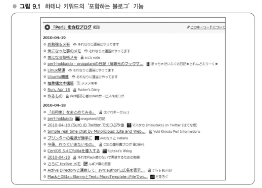
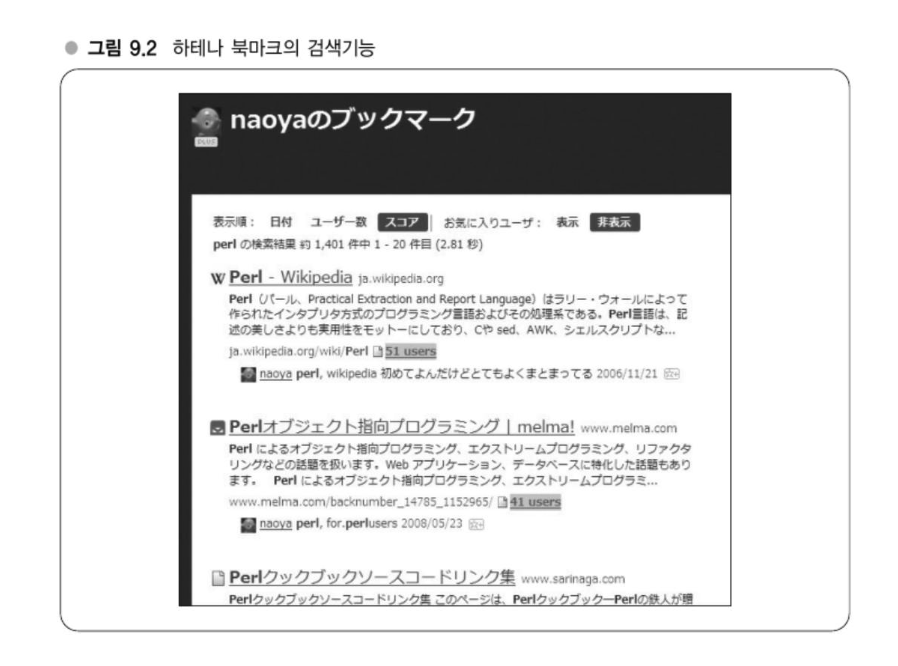

# Chapter 09 전문 검색기술 도전 - 대규모 데이터 처리의 노하우

검색엔진의 원리를 알고 있으면 요구사양을 만족하도록 직접 인덱스를 만들어서 이 문제를 해결할 수 있다.   
즉, 대규모 데이터를 다 떠안지 못하게 된 데이터베이스의 한계를 검색 시스템으로 돌파하는 것이다.

---
## 강의 24. 전문 검색기술의 응용범위
### 하테나의 다이어리의 전문 검색 - 검색 서비스 이외에 검색 시스템 이용
하테나 다이어리를 대상으로 한 검색엔진이란, 하테나 다이어리의 전문을 검색 대상으로 해서 하테나 키워드로 이를 검색 가능하게 하는 시스템이다.   
하테나 키워드에 포함되어 있는 단어만을 검색할 수 있는 시스템이다.   
#### 전에는 RDB로 처리했다.
과거에는 검색기능을 RDB로 처리했고 누군가가 블로그에 새로운 글을 작성할 때 해당 글에 포함되어 있는 키워드를 추출하여 데이터베이스 레코드에 저장하였다.   
그러나 이 방식은 확장성 측면에서 완전한 파탄을 가져왔다.   
레코드 수가 너무 많았기에 무거워지거나 특정 데이터 이후에는 보이지 않는 등의 문제가 발생하였다.
#### 검색기술의 응용

그렇기에 검색엔진을 만들어서 검색함으써 문제를 해결하였다.   
사용자가 검색쿼리(검색어)를 날리는 게 아니라 다른 곳(이 경우, 사용자가 보고 있는 페이지의 키워드명)에서 날려지고 이를 검색 시스템에 입력해서 결과를 얻는다.   
실제로는 검색 서비스와 하는 일은 동일하지만 보여주는 방법이 다르다.

이 시스템의 특징은 출력이 일자순으로만 나오면 되기에 '포함하는 블로그' 기능은 애초에 일자순 이외의 정렬방법은 필요 없었기에 그렇게 결정하였고 일자순으로 출력하는 것을 특화함으로써 빠르고 컴팩트하게 구현할 수 있었다.   
그리고 하테나 다이어리의 문서만을 검색하는 시스템으미로, 예를 들어 문서 ID(기사의 unique id)를 하테나 다이어리의 사양에 특화시킨 방법으로 저장함으로써 빠른 속도를 도모하고 있다.

### 하테나 북마크의 전문 검색 - 세세한 요구를 만족시키는 시스템

**학생 : 앞에 나온 다이어리 전문 검색과 다른 점이 있습니까?**
다이어리 전문 검색과 다른 점 중 가정 큰 것은 시스템의 규모나 이용목적이다.
검색엔진의 기능적인 면에서는 스니핏(snippet)도 나타나도록 되어 있다는 점이 다르다.   
스니핏을 실현하려면 검색어가 문서 내의 어느 위치에 있는 단어와 매칭 되는지를 기록할 필요가 있는데, 이를 고속으로 수행하려고 하면 데이터 구조가 약간 복잡해진다.

시스템의 규모나 이용목적이 다르다는 점에 대해 말하자면, 이 검색 시스템은 하테나 북마크에 저장된 모든 데이터로부터 검색하는 것이 아니라 각 개인이 북마크한 개인 데이터로부터 검색하는 시스템이다.   
따라서 비교적 작은 데이터를 검색하는 엔진이다.

검색 시스템을 별도로 만들어 사용자가 북마크를 추가하는 타이밍에 맞춰 각 사용자별로 검색 인덱스를 준비하고 이를 갱신한다.   
검색할 때는 해당 사용자의 인덱스에서만 검색하면 된다.
