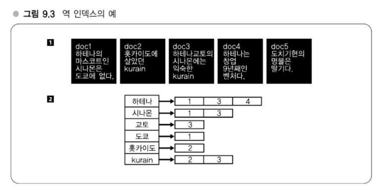
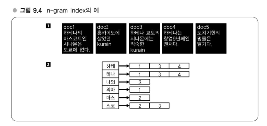

# Chapter 09 전문 검색기술 도전 - 대규모 데이터 처리의 노하우

---
## 강의 26. 검색엔진의 내부구조
### 역 인덱스의 구조 - Dictonary + Postings

- 예를 들어, "하테나"라는 단어를 검색하면 postings 리스트 `[1, 3, 4]`을 통해 해당 단어를 포함하는 문서를 찾을 수 있습니다.
- 이와 같은 **term → 문서**의 매핑 구조를 **역인덱스(Inverted Index)**라고 합니다.
- 역인덱스는 검색 엔진에서 **빠르게 검색 결과를 찾아주는 핵심 데이터 구조**입니다.
#### 용어 정리
- **Term**: 문서에서 추출한 단어 (형태소 분석이나 전처리를 통해 생성)
- **Dictionary**: 모든 term의 집합
- **Postings**: 각 term이 나타나는 문서 ID의 목록
> #### 요약
> 역인덱스 = **Dictionary + Postings**
> - 단어 중심으로 문서를 역참조할 수 있도록 구성된 검색 인프라의 핵심 구조
> - 단어를 기준으로 어떤 문서에 포함되어 있는지 즉시 확인 가능

### Dictionary 만드는 법 - 역 인덱스 작성법
#### 1. 사전과 AC법을 이용하는 방법
사전이 곧 검색 시스템의 단어공간이 된다. 즉, 사전에 들어 있는 단어만 검색할 수 있다.   
이 사전으로는 무엇을 사용할지에 따라 달라지는데 예를 들면 하테나 키워드의 27만 단어가 검색 가능한 검색엔진이 된다.   
또는 Wikipedia가 배포하고 있는 데이터를 사용해서 표제어만을 사용하여 검색할 수 있도록 할 수 도 있다.
#### 2. 형태소 분석을 이용하는 방법(형태소를 단어로 간주해서 term으로 한다)
형태소 분석기는 실제로 무슨 기능을 하는 것일까?   
가장 요구되는 것은 '유형파악과 분리' 기능이다. 이 원리에 따라 세세하게 나눈 각 단어를 '형태소'라고 한다.   
'유형파악과 분리'에 의해 텍스트를 형태소로 분할하는 것이 형태소 분석기의 주된 기능 중 하나다.
> - すもももももももものうち
>   - すもも 명사
>   - も 조사
>   - もも 명사
>   - も 조사
>   - もも 명사
>   - の 조사
>   - うち 명사

위와 같이 형태소 분석기는 문잔을 형태소로 나눠서 그 품사를 추정한다.   
품사를 어떻게 추정하느냐는 구현에 따라서도 달라지지만 대부분의 경우에는 내부에 형태소 분석용 사전을 가지고 있어 그것을 토대로 판별한다.

단어가 명사인지 아닌지는 사전만으로는 알 수 없지만, **단어의 배열(문맥)**을 통해 어느 정도 예측이 가능합니다. 예를 들면 다음과 같은 규칙을 기계학습 모델이 학습하게 됩니다:
- “**명사 다음에는 조사가 온다**”
- “**조사와 동사 사이에 포함되어 있는 것은 명사일 수 있다**”

이러한 규칙을 바탕으로 모델은 긴 텍스트 내에서 특정 단어가 명사인지 동사인지, 또는 어느 정도 길이의 명사인지 등을 판단할 수 있습니다.

##### 예시: ‘すもももももももものうち’
| 단어                | 품사       |
|---------------------|------------|
| すもももももももも | 명사 (만화) |
| もも               | 명사       |
| の                 | 조사       |
| うち               | 명사       |

- 첫 번째 `すもももももももも`는 분석기에 따라 하나의 명사로 판단되며, 그 뒤의 `もも`, `の`, `うち`도 각기 명사와 조사로 분리됩니다.

#### 검색누락
형태소 분석에 대한 설명을 마친 뒤, 다시 Dictionary 방식의 검색 구조로 돌아오면  
**단어를 term 단위로 나누어 인덱싱**하는 경우, 때때로 **검색 누락 문제**가 발생할 수 있다.

> **🎮 예시: 'Gears of War' 검색 문제**

게임 타이틀 **"Gears of War"** 에 대해 발매일 정보를 검색하려 할 때:

- **"Gears 발매일"**로 검색하면 Metal Gear 관련 결과가 나오는 경우가 있다.
- 반면 **"Gears of War 발매일"**은 정확히 원하는 문서를 찾아준다.

#### 이유:
- 검색엔진은 `'Gears of War'`를 **하나의 term으로 등록**해두었고,
- `"Gear"`는 별도의 term으로 인덱싱되어 있지 않다.
- 따라서 `"Gear"` 키워드로는 `'Gears of War'`를 포함한 문서를 찾을 수 없음

→ **부분 단어 포함 여부**가 인덱스 단위(term 분리 방식)에 따라 누락될 수 있음

> **언어 활용 형태에 따른 문제**
#### 일본어 및 영어 공통 문제:

- **활용형(변형된 단어)** 가 다양하게 존재함  
  예:
    - 일본어: `食べる → 食べた, 食べない, 食べよう`
    - 영어: `run → running, ran, runs`

→ 이 경우, 원형을 기준으로 검색하려면 **형태소 분석 및 어간 추출**이 필요

#### 해결 방법:

- **일본어**: MeCab 같은 형태소 분석기를 통해 **원형 추출(term normalization)** 가능
- **영어**: `Stemming`, `Lemmatization` 알고리즘 활용
    - `run`, `running`, `ran` 등 → `run`으로 통합

#### Dictionary를 만들 때 원형 기준으로 term을 구성하면:
- `"ran"`이 적혀 있는 문서도 `"run"`으로 검색 가능해짐
- **검색 범위를 확장하면서 누락을 방지할 수 있음**

>  **설계에 따른 판단**

이러한 동작은 검색엔진의 설계 철학에 따라 달라질 수 있다:

- **엄격한 일치 기반** → 노이즈 줄이기 용이하지만 누락 위험 있음
- **부분 매칭/활용어 통합** → 검색 유연성은 증가하나 정밀도는 다소 저하 가능

#### n-gram을 term으로 다루기

> **n-gram이란?**

**n-gram**은 텍스트를 **n개의 문자 단위로 연속적으로 잘라낸 단위**를 의미한다.
- 예: `"abracadabra"`의 **3-gram** → `"abr"`, `"bra"`, `"rac"`, `"aca"`, `"cad"` ...
- 문자 단위를 **한 글자씩 밀면서** n개의 조합을 만들어낸다.
- 일반적으로:
    - 2-gram → **bi-gram** ("바이그램")
    - 3-gram → **tri-gram** ("트라이그램")

#### 예시:
- 텍스트: `"하테나의마스코트"`
- 2-gram 결과: `"하테"`, `"테나"`, `"나의"`, `"의마"`, `"마스"`, `"스코"`, `"코트"`

> **역인덱스 구성 방식 (n-gram 기반)**

- 텍스트를 n-gram으로 분할
- 각 n-gram이 **어떤 문서에 등장하는지** 역방향으로 매핑
- 예:
  ```plaintext
  "하테나의마스코트인시나몬은도쿄에없다"
  → 2-gram 단위로: 하테, 테나, 나의, 의마, 마스, 스코, 코트, ...
  → 역인덱스: "하테" → doc1, "테나" → doc1, "나의" → doc1 ...
  ```
  
#### 쿼리도 동일한 규칙으로 분할하기

n-gram을 기반으로 Dictionary(역인덱스)를 구성하는 경우,  
**사용자의 검색 쿼리도 동일한 n-gram 규칙으로 분할하여 처리**해야 한다.

> **예시: "하테나" 검색**

- 사용자가 `"하테나"`를 검색할 경우, 2-gram 기준으로 쿼리를 나누면:
    - `"하테"`, `"테나"` → 이 두 개의 term이 생성됨
- 각각의 term에 대해 역인덱스를 조회하여 **postings list**(문서 번호 목록)를 얻는다.

예:
- `"하테"` → `[1, 3, 4]`
- `"테나"` → `[1, 3, 4]`

> **교집합(intersection) 계산**

각 n-gram term이 포함된 문서 ID 리스트의 **교집합**을 계산한다.

- `하테 ∩ 테나 = [1, 3, 4]`
- → 즉, `"하테나"`가 포함된 문서는 1, 3, 4번 문서

이런 방식으로 쿼리도 n-gram 규칙에 따라 동일하게 분할하면,  
**정확히 검색어가 포함된 문서만 추출**할 수 있다.

- 사용자가 `"하테나"`를 검색할 경우, 2-gram 기준으로 쿼리를 나누면:
    - `"하테"`, `"테나"` → 이 두 개의 term이 생성됨
- 각각의 term에 대해 역인덱스를 조회하여 **postings list**(문서 번호 목록)를 얻는다.

예:
- `"하테"` → `[1, 3, 4]`
- `"테나"` → `[1, 3, 4]`

>  **교집합(intersection) 계산**

각 n-gram term이 포함된 문서 ID 리스트의 **교집합**을 계산한다.

- `하테 ∩ 테나 = [1, 3, 4]`
- → 즉, `"하테나"`가 포함된 문서는 1, 3, 4번 문서

이런 방식으로 쿼리도 n-gram 규칙에 따라 동일하게 분할하면,  
**정확히 검색어가 포함된 문서만 추출**할 수 있다.

#### n-gram 분할 문제와 필터링
n-gram 방식은 텍스트를 n개의 문자 단위로 나눠서 검색하는 기법으로, 다양한 언어에 대한 일반적인 접근을 제공하지만 다음과 같은 **검색 정확도 문제**가 발생할 수 있다.

예: `東京都`를 2-gram으로 나누면 `東京`, `京都`로 분리된다. 만약 "東京都와 京都"가 포함된 문서가 있다면, 사용자가 "東京都"만 검색했음에도 검색 결과에 포함될 수 있다. 이는 잘못된 검색 결과다.

- 문제 원인
  - 실제로는 `東京都`라는 연속된 문자열이 문서 내에 없기 때문.
  - n-gram 인덱스는 분리된 term 단위로 처리되므로, 연속된 단어가 아닌데도 결과로 포함될 수 있다.


- 필터링의 개념과 해결 방법
  - 이를 보완하기 위해 보통 다음과 같은 **필터링**을 수행한다:
    - **후처리 필터링**: n-gram 검색 결과 중 실제 문서에 검색어가 포함되어 있는지를 다시 조사하여 확인.
    - 예: n-gram 인덱스는 `東京都와 京都`라는 문서도 `東京都` 관련 문서로 반환하지만, 실제 문자열이 없으면 필터링 단계에서 제거.


- 단점
  - 검색 결과 수가 많아지면 필터링에 드는 비용이 커지고 성능 저하 초래
  - 결과적으로 `grep` 등 전통적인 방법과 동일한 수준의 계산량이 소요될 수 있음


- 하테나 북마크 에서의 사례
  - 하테나북마크는 **단어 기반 역 인덱스**와 **n-gram 기반 역 인덱스**를 병행하여 사용
  - title, content, URL 등 다양한 항목을 대상으로 각각 인덱싱
  - 필터링을 간단히 할 수 있도록 `200~300 byte` 수준의 문서만 사용하는 등 **사전 제한 조건** 활용


- 최신 연구 동향
  - 단어 인덱스와 n-gram 인덱스를 함께 사용하고
  - 두 결과를 `merge`하여 필터링 비용과 검색 정확도를 동시에 확보하려는 연구가 진행 중

#### 재현률(Recall)과 적합률(Precision)
#### 검색 시스템 평가와 재현률/적합률

### Postings 작성법 - 역 인덱스 작성법 #2 
#### 출현 위치를 저장하지 않고 문서ID만을 저장하는 타입

### 스코어링에 대한 보충
