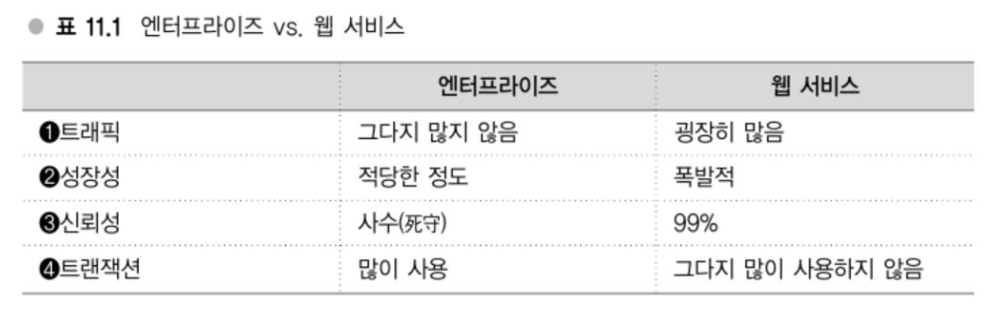

# Chapter 11 대규모 데이터 처리를 지탱하는 서버,인프라 입문 - 웹 서비스의 백엔드

---
## 강의 29. 엔터프라이즈 vs. 웹 서비스
### 엔터프라이즈 vs. 웹 서비스 - 응용범위로 보는 차이
돈이나 생명 같은 것과 관련된 영역이 많은 것이 엔터프라이즈 특징이다.   
시스템해야 할 대상 영역의 차이에 따라 내부에 요구되는 조건도 달라지게 되고, 이런 사항이 실제 세부적인 기술에도 반영된다.
#### 웹 서비스의 특징 - 엔터프라이즈와 비교

트래픽의 경우 엔터프라이즈에서는 극히 거대한 규모가 되는 경우가 드물지만 웹 서비스의 경우 글로벌하게 전개되고 있는 서비스에서는 어마어마한 트래픽이 발생할 가능성이 있다.

성장성의 경우 엔터프라이즈에서는 실제 비즈니스와 연계되어 있으므로 그다지 급격하게 성장하는 것은 아니다.   
예를 들어 전화 네트워크가 전년대비 수년% 증가하는 등의 일은 거의 일어나지 않는다.   
엔터프라이즈 계열에서 성장은 어느 정도 한정되어 있고 성장할 때에도 착실하게 늘어나는 경향이 있다.   
반면, 웹 서비스의 경우는 폭발적으로 성장할 가능성이 있어 전년대비 100% ~ 300% 증가와 같은 일도 드물지 않다.

신뢰성의 경우, 엔터프라이즈는 '사수'라고 적혀있는 데 장애가 발생해서 데이터가 없어지면 실제로 돈이 사라지기도 한다.   
그렇기에 만일 장애가 발생하면 피해자로부터 손해배상청구를 받게 되거나 구해야 하는 사람 목숨을 구하지 못하는 등의 사태가 발생할 수 있다.   
그런 의미에서 굉장히 높은 신뢰성이 요구된다.

트랜잭션의 경우, 엔터프라이즈에서는 데이터 간 정합성을 정확히 유지해야만 한다.

### 웹 서비스의 인프라 - 중요시되는 세 가지 포인트
첫 번쨰는 저비용 고휴일이 중시된다.   
단순히 저비용만을 외치기만 해서는 비용이 실제로 내려가지 않는다.   
이를 위해서 뭔가 희생해야만 하는 등 상반관계가 있게 되는데, 가장 이해하기 쉽게 100%의 신뢰성은 목표로 하지 않는다.   
이 부분은 과감히 접고 오히려 비용을 낮춰서 효율을 높이는 방향으로 추진하고 있다.

두 번째 포인트로는 확정성이나 응답성 등에 대한 설계를 중요시한다.   
서비스의 성장속도를 모르거나 사용자 경험를 위해 서비스의 응답성이 중요한 경우도 있다.   
따라서 100% 신뢰성을 추구하기보다 장래를 위해 제대로 확장해야 한다.   

마지막으로 세 번째 포인트, 웹 서비스에서는 서비스 사양이 이리저리 바뀌는 경우가 있다.
하테나 다이어리나 하테나 북마크 등에서는 기능이 빈번하게 추가되고 있으므로 여기에 유연하게 대응할 수 있는 인프라여야만 한다.
개발속돌르 중시한 인프라로 구성해나가는 것도 매우 중요하다. 예를 들면 애플리케이션 배포를 가능한 한 간편하게, 또한 배포할 때 마침 처리 중인 요청에 영향이 없도록 하고, 필요한 서버를 즉시 추가할 수 있도록 하며 배포한 코드에 문제가 발견됐을 때에는 곧바로 이전 상태로 돌아갈 수 있도록 대처해야 한다.

