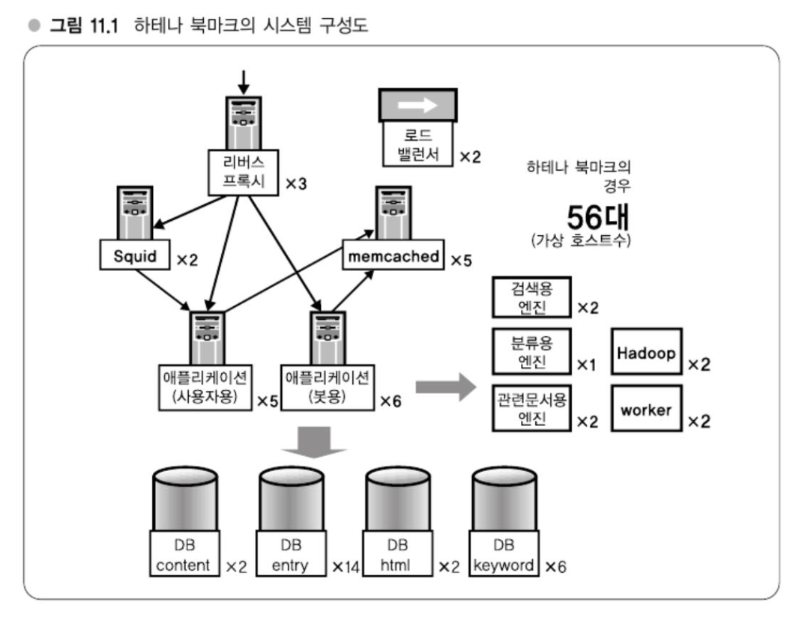

# Chapter 11 대규모 데이터 처리를 지탱하는 서버,인프라 입문 - 웹 서비스의 백엔드

---
## 강의 30. 클라우드 vs. 자체구축 인프라
### 클라우드 컴퓨팅
웹 서비스는 저비용 고효율이 중시된다. 이 점에서 클라우드 컴퓨팅, 클라우드가 주목해야할 키워드로 대두되고 있다.

클라우드 컴퓨팅이란 Google의 회장 겸, 에릭 슈미트가 언급하며 시작되었다.   

### 클라우드의 장단점
> 너무 옛날 내용이라 제거
클라우드 컴퓨팅은 저가로 사용하면서 확장해나갈 수 있다는 특징이 았다.

### 하테나에서의 클라우드 서비스 사용
하테나에서는 미디어 파일 전송을 위해 Amazon Cloudfront 라는 서비스를 사용하고 있다.

미디어 저장소로 클라우드 서비스를 사용하는 경우는 현시점에서도 많이 있지만 애플리케이션이나 DB를 본격적으로 저장하는 것은 하테나 시기 당시 시기상조라 표현하고 있다.   
클라우드 컴퓨팅이 발전해가면서, 물론 자체구축 인프라도 발전하겠지만 클라우드 컴퓨팅 쪽이 발전속도가 빠를 것으로 예상된다.

이와 같은 규모 면에서 EC2가 갖춘 인터페이스를 경유할지 자체구축으로 가져갈지를 판단할 떄 어느 정도 규모 이상에서는 자체구축으로 가는 편이 좋을 것이라 생각한다.   
따라서 문제는 그 영역이 어디까지이고 하테나의 성장속도가 어떻게 될 것인지에 달렸다.

### 자체구축 인프라의 장점
1. 하드웨어 구성을 유연하게 할 수 있다.
2. 서비스로부터의 요청을 유연하게 대응할 수 있다.
3. 병목현상을 제어할 수 있다.

유연한 하드웨어 구성의 예(1)로 메모리 탑재량을 늘렸으면 하는 요구가 높아지고 있다는 점일 들 수 있다.
강의 9('캐시를 전제로 한 I/O 줄이법 방법')에서 메모리가 8~16GB라는 얘기가 있었는데, 메모리를 탑재해야 핵려할 수있는 문제 영역이 의외로 존재한다.   
소프트웨어 분산처리를 하는 것도 중요하지만, 막상 때가 되면 메모리를 얼마든지 탑재할 수 있다는 옵션이 마려되어 있으면 안심할 수 있다.   
책 출판 당시 클라우드 컴퓨팅의 경우는 상한성이 정해져 있어 해당 부분을 자유롭게 제어할 수 없다.

서비스로부터의 요청에 대한 유연한 대응(2)에 관련된 예로 단순히 대수를 늘리는 것뿐 아니라, 예를 들어 네트워크 측면에서 가까운 구성으로 갖추고 싶다거나 데이터를 대량으로 쌓을 수 있도록 하는 등의 요청에 대한 대응이 있을 수 있다.   
하지만 이 부분은 클라우드 컴퓨팅에서도 개선해갈 수 있는 부분이므로 반드시 자체구축만이 좋다라고 할 수는 없겠지만, 하테나 구축 시점에서는 자체구축의 장점으로 생각해도 된다.

마지막으로 병목현상 제어(3)이다.   
로드밸런서나 네트워크 등에서 발생하는 문제로 시스템 규모가 커지면 무시할 수 없는 영역이 된다.   
클라우드 컴퓨팅 내의 내부서버간 통신이 어느 정도가 되면 병목이 되는지, 로드밸런서에 큰 부하를 주었을 때 실제 어떤 거동을 하고 어디에서 병목이나 지연이 발생하는지는 Amazon을 시작으로 해서 클라우드 환경을 제공하는 측의 기술에 의존할 수 밖에 없게 된다.   
반대로 자체구축 인프라에서는 이 병목현상에 대한 제어가 가능하다.

### 자체구축 인프라와 수직통합 모델
기술 모델로 서 수직통합 모델, 수평분산 모델이라는 개념이 있다. 

수직통합 모델이란 물리적 계층부터 서비스 설계까지 몯느 것을 한 회사에서 구축하는 모델이다.   
예를 들면 Google이나 Amazon과 같은 기업이 해당한다.

반면, 수평분산 모델은 각 계층마다 다른 기업이 제공하는 것으로 각각이 모여 전체 시스템이 구축되는 모델이다.

시대가 변해감에 따라 이러한 모델이 서로 번갈아 가며 나타나면서 전체적으로 세련되어져 가고 있다.

### 하테나의 서비스 규모
원고집필시점인 2010년 4월에 등록한 사용자 수 150만명, 1,900만 UU, 트래픽은 피크 시 850Mbps 정도 나오는 중견 서비스 규모다.

서버 대수는 600대로, 가상화해서 1,300대 정도의 규모다

### 하테나 북마크의 시스템 구성도

리버스 프록시가 3대, AP 서버가 11대, DB 서버가 24대, 캐시 서버가 7대, 로드밸런서 2대, 그 밖의 엔진이 9대로 합계 56대로 구성되어 있다.   
각각의 서버는 가상화되어 있으므로 물리적인 대수는 실제로는 좀 더 적은 수로 되어있다.

전체적인 구조는 (리버스) 프록시와 애프리케잉션과 DB라는 3층 구조로 되어 있다.   
AP 서버와 DB 서버 비율이 1:2 정도가 되고 이 비율은 애플리케이션 로직의 복잡성이나 DB로 오는 쿼리의 복잡성에 따라 변하지만 핻아 비율이 적정하다고 여기고 있다.
