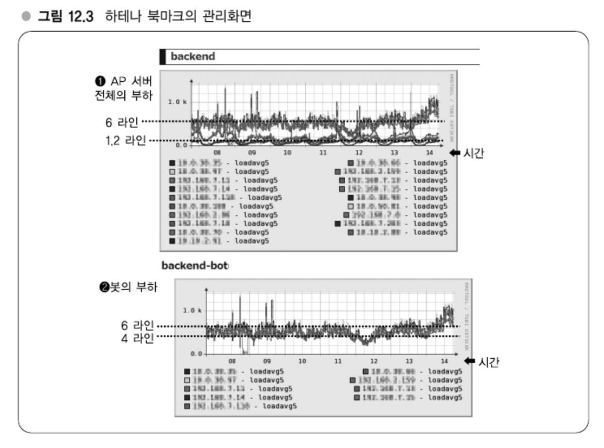
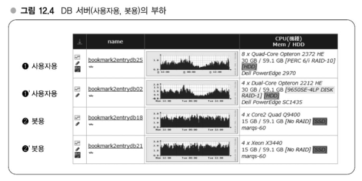

# Chapter 12 확장성 확보에 필요한 사고방식 - 규모 증대와 시스템 확장

---
## 강의 32. 부하 파악, 튜닝
### 부하 파악 - 가시화한 관리화면
어떻게 확장해갈 것인지를 검토하기 위해서는 먼저 서버 부하를 파악할 수 있어야 한다.   
각 서버 부하를 파악하기 위해서 서버군을 관리하고 각각의 부하를 적절하게 그래프화하는 것이 중요하다.   

### 부하를 측정하기 위한 항목 - Load Average, 메모리 관련, CPU 관련
부하를 볼 때는 먼저 Load Average 부터 본다.   
Linux 커널 내에는 프로세스가 다수 동작하고 있다.   
Load Average란 이러한 **프로세스가 언제든지 동작할 수 있는 상태지만, 아직 실제 CPU가 할당되지 않아서 대기상태에 있는 프로세스 수의 평균치**다.   
예를 들면 5분간 Load Average가 1이라고 한다면, 5분 동안 평균 1개의 프로세스가 대기상태로 되어 있다는 것을 의미한다.   
CPU가 깔끔하게 할당되면 이 값이 0에 가까워지고, CPU 코어 수 이하이면 양호한 편이다.

부하를 측정하기 위한 항목은 Load Average 이외에도 많이 있는데, 예를 들면 메모리 사용처에 관해서는 사용자 공간이 소비되고 있는 메모리나 공유되고 있는 메모리, 그리고 커널이 사용하고 있는 버퍼의 메모리 등이 있다.   
이러한 항목을 통해 '이런 거동을 하고 있으니 이런 동작을 보이고 있어'와 같이 파악함으로써 서버의 성능을 더 끌어내 고성능 시스템을 실현할 수 있게 되는 것이다.

### 용도에 맞는 튜닝 - 사용자용 서버, 봇용 서버

[1] 이 AP 서버 전체의 부하, [2]가 봇(bot)용 서버의 부하이다.    

봇은 응답시간이 그다지 중요하지 않으므로 요청 처리 수를 최대화시키는 방향으로 튜닝하고 있으며, 실제 Load Average 도 높게 나타난다.   
[2]를 보면 4에서 6 정도 라인으로 유지되고 있으며, 실제 이 부분에서 상세한 CPU 부하를 살펴보면 CPU도 항상 절반 정도는 이용 중인 상태로 동작하고 있고, 메모리도 절반 이상 사용 중인 상태로 유지되고 있으므로 서버 리소스는 다 소진하고 있다고 할 수 있는 상태로 되어 있다.

### AP 서버/ DB 서버의 튜닝 정책과 서버 대수

bookmark2entrydbXX는 메인 DB다.   
[2]와 [2]' 봇용은 약간 부하가 높은 것에 비해 [1]과 [1]' 사용자용은 부하가 낮게 엉ㄱ제되어 있다.   
사용자용 DB 서버는 전체적으로 부하를 낮게 함으로써 해당 DB 서버로의 질의도 가능한 한 빠르게 반환하도록 하고 있다.

### 서비스 규모와 튜닝
서버 용도나 계층에 입각한 튜닝은 서비스별로 수행되고 있다.   

튜닝 작업을 반복하다 보면 서버 대수가 늘어났을 때 비정상적인 거동을 하고 있는 서버를 찾을 수 있는 방법을 알아내는 게 과제가 된다.   
다이어리에는 30대 정도의 AP 서버가 있는데, 30대 중에 1대에 이상이 발생했을 때 해당 서버를 어떻게 파악할 수 있을까가 과제다.

### 확장성 확보
확장성 확보를 위해 로드밸런서를 이용하거나 파티셔닝(DB분할)을 하고 있다.
