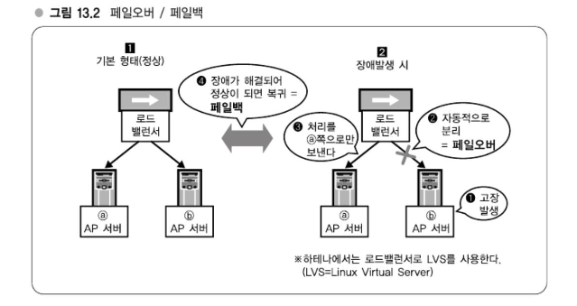
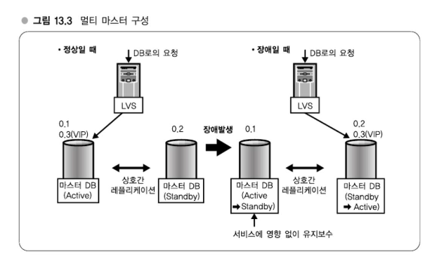
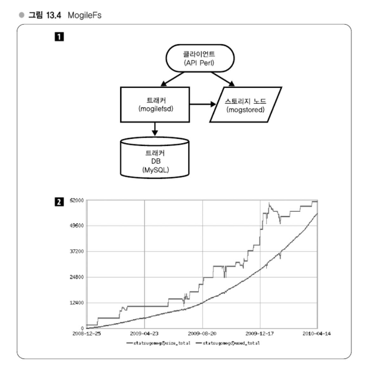

# Chapter 13 다중성 확보, 시스템 안정화 - 100%에 근접한 가동률을 실현하는 원리

> ### 다중화와 가동률 - 시스템을 얼마나 멈추지 않도록 할 것인가?
> 흔히 말하길 24시간 365일 100% 가동률이라고 한다.   
> 하테나에서도 100% 가동률이라고 말하면서 실제로는 100%를 반드시 달성할 수 있는 시스템으로 구성하고 있지 않다.   
> 가장 중요시 하는 것은 SPOF(Single Point of Failure), 즉 단일장애점을 제거하는 것이다.

---
## 강의 33. 다중성 확보
### 다중성 확보 - AP 서버
AP 서버에서는 실제적으로 확장성은 서버 여러 대를 늘어 놓는 것이다.   
서버를 늘어놓을 때 중요한 것은 1대나 2대 정도 정지하더라도 충분히 처리할 수 있도록 처리능력을 확보해두는 것이다.   

서버는 다양한 요인으로 멈춘다.   
이에 대한 대응으로 로드밸런서로 페일오버(failover, 장애극복), 페일백(failback, 정상복귀)하여 고장 난 서버를 자동적으로 분리하고, 서버가 복구되면 원 상태로 복귀시키는 작업을 수행하고 있다.   
페일오버는 자동으로 분리하는 것, 페일백은 정상이 되면 복귀시키는 처리를 말한다.


### 다중성 확보 - DB 서버
멀티 마스터는 구체적으로 말하면 쌍방으로 래플리케이션, 즉 서로가 서로의 슬레이브가 되는 상태로 해두고 한쪽에 쓰기작업을 하면 다른 한쪽으로 전달하고 반대쪽에 쓰더라도 다른 쪽으로 전달하는 양방향 래플리케이션 방법이다.   

다만 MySQL은 실제로 한쪽에 쓰기작업을 하면 반대쪽으로 전달되는 흐름이기 때문에 약간이나마 지연이 있다.   
따라서 밀리초 단위로 보면 데이터가 일치하지 않는 상태가 항상 존재한다.   
이 타이밍에 한쪽이 다운되어 분리되면 DB로 쓰기 작업을 하려던 AP 서버에서 볼 때, 쓰기 작업을 하려고 했던 것이 실제로는 쓰이지 않는 등의 모순이 발생하는 경우가 생겨서 동기가 맞지 않는 리스크가 항상 존재하게 된다.

엔터프라이즈에서는 이 부분에 대한 대책으로서 레플리케이션을 동기적으로 처리함으로써 대처하고 있다.   
이에 따라 슬레이브까지 쓰여졌다는 것을 확인한 다음에 클라이언트에 결과를 반환하도록 할 수 있다.   
이 경우에는 동기는 확실하게 보장하지만 성능면에서 큰 손실이 발생한다.   
따라서 웹 서비스에서는 동기가 맞지 않는 리스크에 대해 어느 정도 받아들임으로써 성능을 중시하는 경우가 많다.

#### 멀티 마스터

멀티 마스터는 최근 수년 내 MySQL 서버 구축에 있어 주류가 되었고, 여러 부문에 실적도 있는 숙련된 방법이 되었다.   
페일오버에 대해 구체적인 동작을 설명하면, 상호간에 VRRP(Virtual Router Redundancy Protocol)라는 프로토콜로 감시를 하고 있다.   
VRRP에 의해 한쪽이 분리된 것을 알게되면 자신이 Active 마스터로 승격한다.

멀티 마스터 구성에서 서버는 기본적으로 2대가 있으며, Active/StandBy 구성을 하고 있다.

### 다중성 확보 - 스토리지 서버

하테나에서는 이미지 파일과 같은 미디어 파일을 저장하기 위한 분산 스토리지 서버로 MogileFS를 사용하고 있다.   
분산 파일 시스템을 사용함으로써 대량의 파일을 보존할 수 있는 확장성과 일부 서버가 다운되더라고 전체 장애가 되지 않도록 다중성을 확보할 수 있다.      
MogileFs는 위 그림의 [1]과 같은 구성으로 트래커, 스토리지 노드, 메타 정보를 저장하는 트래커 DB라는 세 가지 요소로 구성되어 있다.   
실제파일은 스토리지 노드에 위치하며, 특정 URL에 대한 실제 파일의 위치를 나타내는 메타 정보를 DB로 관리하는 형태의 심플한 설계로 되어 있다.

