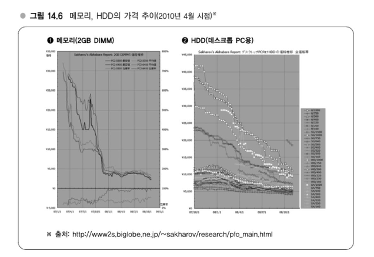
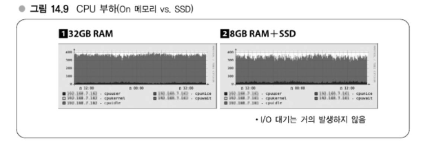
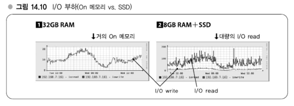
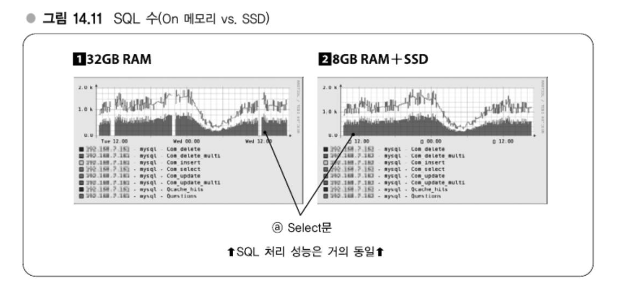

# Chapter 14 효율향상전략 - 하드웨어의 리소스 사용률 높이기

---
## 강의 37. 하드웨어와 효율향상 - 저비용을 실현하는 요소기술
### 프로세서의 성능향상
   
무어의 법칙은 '집적회로 상의 트랜지스터 수는 18개월마다 2배로 증가한다.   
무어의 법칙은 트랜지스터의 집적도에 대한 얘기로 이 분야는 기술적으로 계속 성장하고 있다.   
반면, 개별 코어의 성능은 이미 한계에 다다른 것이라고들 하는데, 코어 수의 경우에는 앞으로 더 늘어날 것이므로 적어도 서버 용도로 사용하고 있는 한 성능은 현재로선 증가해갈 것이라 기대할 수 있다.

### 메모리, HDD의 비용저하
메모리나 HDD는 급속하게 저렴해지고 있다.   
예를 들어 3년 전에 2GB에 3만엔 정도였던 것이 최근에는 5천엔 정도다.

#### 메모리, HDD 가격추이
   
가격추이 경향을 보면 기본적으로 급격하게 우하향으로 내려가고 있다.   

하테나와 같은 웹 서비스 제공업자로서는 이와 같은 가격 하락이라는 변화를 자신들의 인프라에 즉각적으로 잘 반영하면서 가격 메리트를 살려가는 것이 결과적으로 경쟁우위에 이어진다고 생각한다.

### 저가 하드웨어의 유용한 이용법 - 가상화를 전제로 한 하드웨어 사용
하테나에서는 저가 하드웨어를 가능한 한 유용하게 이용하려고 하고 있는데, 관리기능은 최소한으로 억제하고, 코어는 가능한 한 많을 것을 채택하며, 메모리는 충분히 저렴하므로 상한선까지 탑재하고 있다.   
또한 I/O 성능에 관해서는 용도별로 요구되는 레벨이 많이 다르므로 디스크가 없는 서버(Diskless Server)를 준비하거나, 하드웨어 RAID를 통한 RAID-10을 구성하거나, SSD로 RAID-0 등을 구성하는 등 다양한 패턴을 갖추고 있다.   

최소한의 관리기능이라는 점에서는 IPMI와 같은 관리용 하드웨어는 불필요한 비용이 된다.    
Intel AMT라는 테스크톱용 마더보드에도 포함되어 있는 기능으로 이를 대체하고, 가상화 기술로 게스트 OS를 소프트웨어적으로 분리함으로써 리소스 제어를 가능하게 해서 IPMI 기능을 갖추는 데 드는 1~2만 엔 정도의 비용을 절감하고 있다.

### SSD
- Q : SSD는 어디에 사용하고 있습니까?
- A : 하테나 북마크의 경우는 다수의 DB 슬레이브 서버에서 사용하고 있다.



   
위 그래프에서 I/O read 와 I/O write 를 확인할 수 있다.   
[1] 이 벤더 서버용 하드웨어로 대략 30~40만 엔 정도 하는 하드웨어다.   
[2] 는 Intel의 SSD 를 탑재하고 있으며 대략 10~12만 엔이다. 

가장 주목할 부분은 14.10의 I/O 부하이다.   
32GB의 메모리를 탑재하고 있으면 데이터가 전부 메모리에 올라가 있으므로 I/O read 가 전혀 발생하지 않고, 갱신에 대한 I/O write 만 발생하고 있는 형태의 그래프로 되어 있다.   
반면, SSD 쪽은 메모리가 8GB, 가상 OS에는 7GB만 할당했으므로 데이터가 메모리에 거의 올라가지 않아서 I/O read 가 상당부분 발생하고 있다는 차이를 볼 수 있다.

SSD를 사용하고 있는 서버의 14.9를 보면 14.10처럼 I/O read 가 상당히 발생하고 있음에도 불구하고 I/O 대기는 거의 발생하지 않고, I/O read 는 매우 낮은 부하만 유발하며 잘 처리되고 있음을 알 수 있다.

실제로 처리하고 있는 SQL 수를 보면 14.11의 (a)가 SELECT SQL 수이며, 대략 매초 500쿼리 정도 처리하고 있다.   
SSD 쪽도 거의 비슷한 정도로 처리하고 있다.   
하드웨어 비용을 1/4 정도로 내리면서 성능면에서는 거의 변함없다는 것이 SSD 덕분에 실현되고 있는 결과다.

