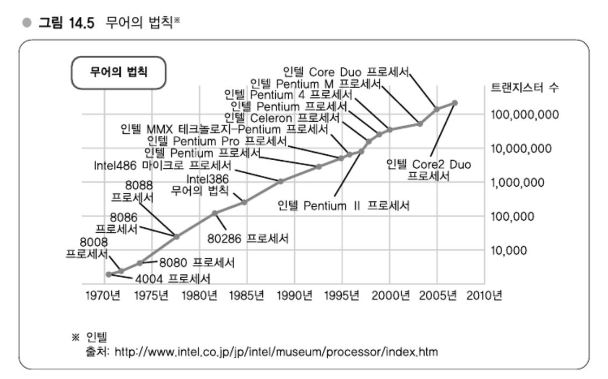

# Chapter 14 효율향상전략 - 하드웨어의 리소스 사용률 높이기

---
## 강의 37. 하드웨어와 효율향상 - 저비용을 실현하는 요소기술
### 프로세서의 성능향상

무어의 법칙은 '집적회로 상의 트랜지스터 수는 18개월마다 2배로 증가한다.   
무어의 법칙은 트랜지스터의 집적도에 대한 얘기로 이 분야는 기술적으로 계속 성장하고 있다.   
반면, 개별 코어의 성능은 이미 한계에 다다른 것이라고들 하는데, 코어 수의 경우에는 앞으로 더 늘어날 것이므로 적어도 서버 용도로 사용하고 있는 한 성능은 현재로선 증가해갈 것이라 기대할 수 있다.

### 메모리, HDD의 비용저하
메모리나 HDD는 급속하게 저렴해지고 있다.   
예를 들어 3년 전에 2GB에 3만엔 정도였던 것이 최근에는 5천엔 정도다.

#### 메모리, HDD 가격추이

가격추이 경향을 보면 기본적으로 급격하게 우하향으로 내려가고 있다.   

하테나와 같은 웹 서비스 제공업자로서는 이와 같은 가격 하락이라는 변화를 자신들의 인프라에 즉각적으로 잘 반영하면서 가격 메리트를 살려가는 것이 결과적으로 경쟁우위에 이어진다고 생각한다.

### 저가 하드웨어의 유용한 이용법 - 가상화를 전제로 한 하드웨어 사용
하테나에서는 저가 하드웨어를 가능한 한 유용하게 이용하려고 하고 있는데, 관리기능은 최소한으로 억제하고, 코어는 가능한 한 많을 것을 채택하며, 메모리는 충분히 저렴하므로 상한선까지 탑재하고 있다.
