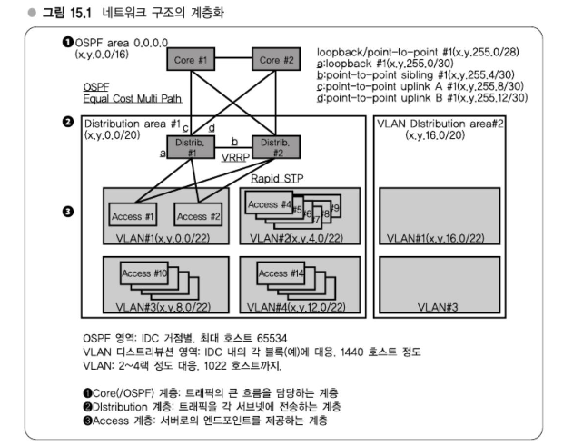

# Chapter 15 웹 서비스의 네트워크 - 서비스의 성장

> ### 1Gbps를 넘어, 500 호스트를 넘어, 태평양을 넘어 - 트래픽, 호스트 수, 서비스 전개
> 트래픽이 Gbit 단위, 1Gbps가 되면 여러 문제가 발생하기 시작한다.   
> 라우터의 성능 관점에서는 bps보다는 패킷/초인 pps가 중요하다.   
> 
> 그 밖에도 호스트수가 500을 넘어서는 상태에서 하나의 서브넷으로 구성하게 되면, 여러 가지로 문제가 생기고 패킷 손실이 많이 발생하게 된다.

---
## 강의 38. 네트워크 분기점
### 서비스 성장과 네트워크 분기점
작은 트래픽이라면 아무것도 생각하지 않아도 되지만, 서비스가 성장해감에 따라 네트워크의 분기점을 알아두어야만 한다.
- 1Gbps(라우터 성능 관점에서 사실은 30만 pps(300Kpps)) 이상
  - => PC 라우터의 한계
- 500호스트 이상 => 1 서브넷의 한계
- 글로벌화 => 1 데이터 센터의 한계

### 1Gbps의 한계 - PC 라우터의 한계
500 호스트의 한계는 구체적으로 스위치의 ARP 테이블과 관련해서 한계가 있을 듯하다.

Ethernet 통신이라는 것은 MAC 주소를 기반으로 한다.   
ARP 테이블이란 IP 주소와 MAC 주소 간 대응관계표로 스위치는 이 테이블을 갖고 있다.   
IP 통신을 할 때는 먼저 IP 주소로 통신대상을 지정하면 이에 대응하는 MAC 주소를 검색한 후, Ethernet 계층에서 이 MAC 주소를 사용해서 통신하게 된다.   
받아들이는 쪽은 그 내용을 IP 계층까지 확인해서 다른 서브넷으로 보낼지 서브넷 내에서 통신을 마칠지 결정해서 통신을 실현하고 있다.

이 IP 주소와 MAC 주소 간 관계를 나타내는 ARP 테이블이 있는데, 이를 사용하고 있는 스위치에서는 이 테이블의 크기가 대략 수백 건 정도라는 것을 최근에 알게 되었다.   
ARP 테이블의 크기 상한선이 900건 전후였는데, 실제로 ARP 테이블의 내용이 800 건 이상까지 늘어나자 갑자기 특정 호스트로만 ping이 가지 않게 되는 등 통신을 할 수 없게 되었다. => 원인 : ARP 테이블의 한계   

또한 서비넷 내에 호스트를 많이 두면 브로드캐스팅 패킷이 서서히 증가한다.   
점차 이 트래픽이 무시할 수 없을 정도가 되어 브로드캐스팅 패킷을 수신하는 것 만으로도 CPU를 약간 잡아먹게 된다.

따라서 1 서브넷 내의 서버 대수는 어느 정도로 억제하는 편이 현명하다.   
그 분기점이 대략 500호스트 정도라는 것을 경험을 바탕으로 알게 되었다.

### 네트워크 구조 계층화
지금까지 언급해온 문제애 대한 대책으로는 네트워크 구조의 계층화라는 것이 '최선의 관행'으로 확립되어 있으며, 3단 구조로 구성하는 것이 일반적인 의견이다.
1. 가장 작은 것은 Access 계층(액세스 영역)
2. 그 다음이 Distribution 계층(디스트리뷰션 영역)
3. 가장 위가 Core 계층(코어 영역) 또는 OSPF(Open Shortes Path First) 영역

이와 같은 3단 구주로, 가장 작은 서브넷에서 100대, 200대로 억제하고 디스트리뷰션을 1,000대 정도, 코어 전체로는 10,000대 단위를 다룰 수 있다는 계층구조를 설계하는 것이 입란적이다.

   
또한 디스트리뷰션 영역 간 트래픽을 제어해서 너무 증가하지 안도록 한다거나 서브넷 간 통신량을 제어하는 등 이런 부분도 신경을 쓰게 되는 것이 대략 수백 대 잇아이 되었을 때 주의해야 할 부분이다.

### 글로벌화
하테나의 데이터 센터에 우고메모의 FLV 파일(Flash Video, 최대 5~6 MB 정도의 크기)을 세계 각지에서 HTTP로 가져가려고 한다면 대략 20~30초 걸리게 될 것이다.      
테스트 시 타임 아웃을 30초로 했을 때 타임아웃 비율이 5할을 넘을 정도로 타임아웃이 자주 발생한다.   
우고메모와 같은 MB를 넘는 용량의 미디어를 다수 전송하려는 용도로는, 하나의 데이터 센터에서 전송하는 것은 비현실적이다.  

반면 CDN을 사용하면 상황은 크게 달라진다.    
CDN을 사용하면 대략 5~6초 만에 파일을 받을 수 있으며, 타임아웃도 거의 발생하지 않고 양호한 응답시간을 유지할 수 있다.   
따라서 글로벌하게 서비스를 운영하려 한다면 CDN을 사용하는 것이 거의 필수적이다.

#### CDN 선택방안
CDN은 Content Delivery Network를 뜻한다.

CDN은 세계 각지에 서버를 두고 거기에 미디어를 캐싱시켜서 사용자가 가지러 갈 때에는 가장 가까운 서버로 액세스해서 미디어를 다운로드하도록 하는 것이 기본적인 동작원리이다.

#### Amazon Cloudfront
Amazon Cloudfront는 원본 데이터를 일본 내 데이터 센터에 두고 있다.   
그리고 참조빈도가 높은 파일을 Amazon S3에 업로드하고 다운로드는 Amazon Cloudfront로 전송하는 형태의 구성으로 되어 있다.   

- 구체적인 동작 방식
  - 우고메모에 미디어를 올리면 포맷 변환을 수행한다.
  - 변환한 미디어 파일을 S3에도 동시에 업로드한다.
  - 우고메모의 HTML을 출력할 때 Amazon Cloudfront의 URL로 지정한다.

실제 Flipnote Hatena에서 출력되고 있는 미디어 파일의 URL을 보면 cloudfront.net 도메인으로 되어 있다.   
즉, Cloudfront를 경유해서 전송되고 있는 것이다.   
이것을 사용함으로써 일본에서 전송되면 30초 정도 걸리는 미디어의 다운로드가 대략 수초 만에 전송도ㅢ므로 유럽과 미국 사용자도 만족하리라 생각한다.