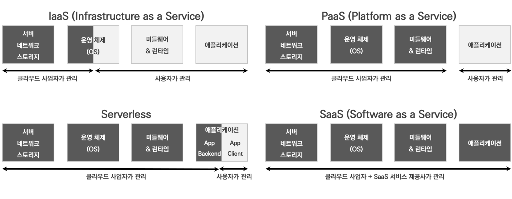
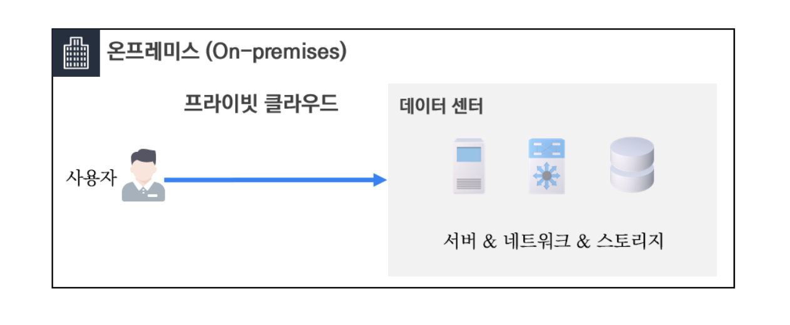
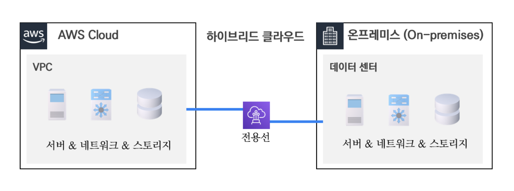
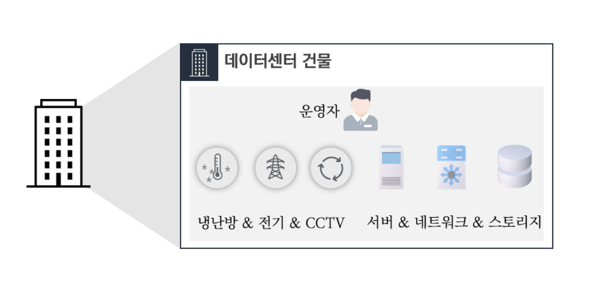
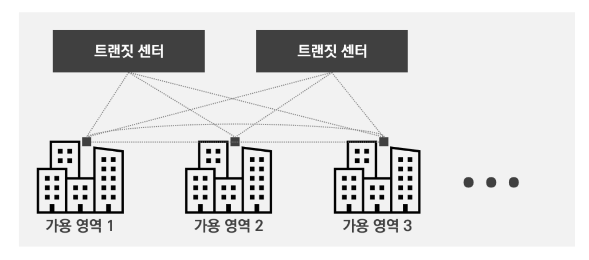
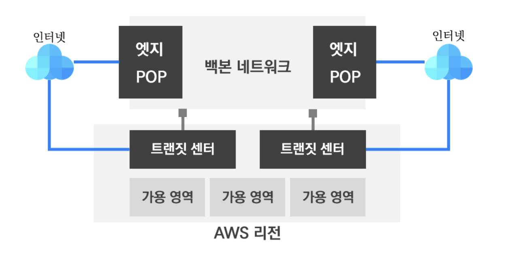
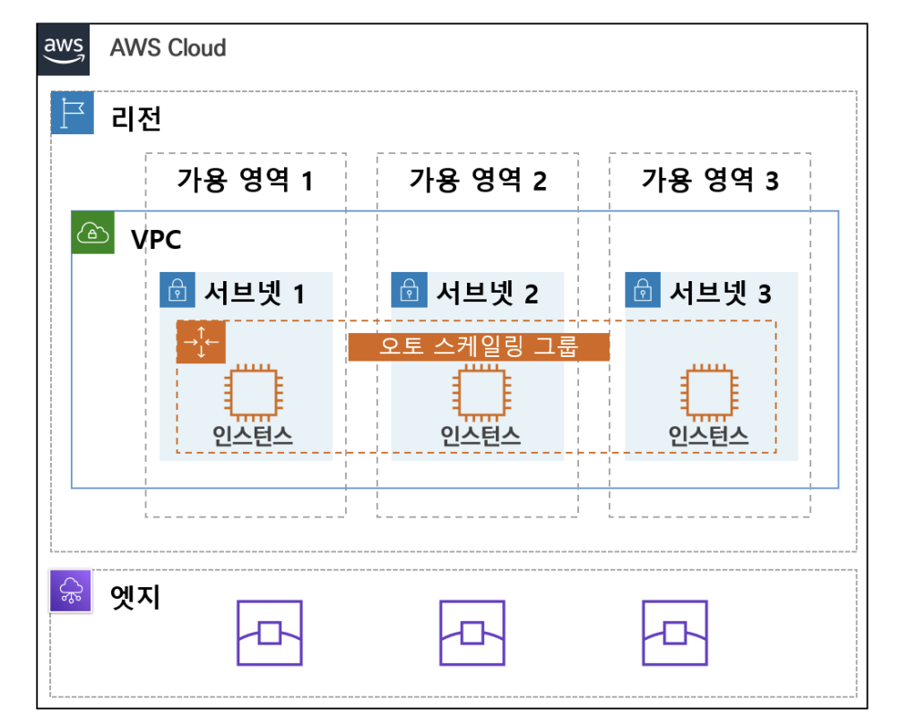

# 01장 AWS 인프라
## 01. AWS 소개

### 1.1. 클라우드란
- 클라우드는 인터넷을 통해서 언제 어디서든지 원하는 때 원하는 만큼의 IT 리소스(컴퓨팅, 스토리지, 네트워크)를 손쉽게 사용할 수 있게 하는 서비스를 말한다.

#### 1.1.1 클라우드 서비스 종류
- 전통적인 클라우드 서비스 분류 대신, AWS 클라우드 기준 서비스 종류를 알아보겠습니다.
  - 클라우드 종류는 크게 4가지로 분류할 수 있다.

- **IaaS(Infrastructure as a Service)**
  - 가장 기본적인 IT 자원인 '서버, 네트워크, 스토리지' 자원을 클라우드 사업자가 제공하고 운영 관리를 한다.
  - 사용자는 가상 서버에 필요한 프로그램을 설치하여 사용 및 운영 관리를 한다.
  - > #### 관련 AWS 주요 서비스
    > - EC2(컴퓨팅), VPC(네트워크), EBS(스토리지)
- **PaaS(Platform as a Service)**
  - 클라우드 사업자는 IT 자원 이외에도 운영 체제와 개발에 필요한 미들웨어(Middleware)와 런타임(RunTime)을 제공한다.
  - 사용자는 사업자가 제공하는 미들웨어와 런타임 환경에서 개발에 집중해서 사용할 수 있다.
  - > #### 관련 AWS 주요 서비스
    > - AWS Elastic Beanstalk(애플리케이션 배포)
- **Serverless 플랫폼**
  - 애플리케이션 개발에 필요한 대부분을 클라우드 사업자가 제공하고 운영 관리를 한다.
  - 사용자는 개발(코드)에만 집중해서 사용할 수 있다.
  - > #### 관련 AWS 주요 서비스
    > - Lambda(컴퓨팅), API Gateway(API 프록시)
- **SaaS(Software as a Service)**
  - 클라우드 사업자는 SaaS 서비스 개발을 원할히 할 수 있는 리소스 제공 및 다양한 지원을 한다.
  - SaaS 서비스 제공사는 해당 클라우드 사업자의 리소스와 지원을 토대로 SaaS 형태의 서비스를 개발 및 제공하여 사용자에게 서비스한다.

#### 1.1.1 클라우드 구현 모델
- 클라우드 구현 모델은 3가지 유형이 있다.
1. **퍼블릭 클라우드**
   - 일반적으로 클라우드 서비스 제공 업체가 운영 관리하며, 사용자는 해당 클라우드의 리소스를 사용하는 모델이다.
   
2. **프라이빗 클라우드**
   - 사용자가 자신의 온프레미스(기업 데이터센터) 내에 클라우드 플랫폼을 구축하여 직접 사용하는 모델이다.
   
3. **하이브리드 클라우드**
   - 퍼블릭 클라우드와 온프레미스 모두에 서비스하는 모델이다.
   

### 1.2. AWS 클라우드 소개
- AWS(Amazon Web Service)는 전 세계적으로 분포한 데이터 센터에서 다양한 서비스를 제공하고 있는 클라우드 플랫폼이다.
  - AWS 글로벌 네트워크를 통하여 대용량 서비스 처리가 가능하며, 이중화된 네트워크 연결로 안정적인 서비스를 제공할 수 있다.

#### 1.2.1. AWS 글로벌 인프라
- 현재 AWS 는 전 세계 24개의 리전과 77개의 가용 영역과 216개의 엣지 POP 을 운영하고 있다.
  - 각각의 리전은 이중화된 100GbE 케이블로 연결되어 있으며, 암호화되어 전달되고 있다.(2020년 9월 기준)

#### 1.2.2. 데이터 센터
- AWS 데이터 세터는 3가지 영역으로 분류하여 볼 수 있다.

- **물리 영역**
  - 보안 요원, 울타리, 출입 통제 등 물리적인 보안과 전력, 냉난방 등 건물을 운영하는 설비와 시스템을 말한다.
- **IT 인프라 영역**
  - 서버, 네트워크, 스토리지, 로드 밸런서, 라우터 등 일반적인 IT 인프라 디바이스를 말한다.
- **운영 영역**
  - 데이터센터를 운영 및 유지 관리하는 인원을 말한다.

#### 1.2.3. 가용 영역
- 가용 영역(AZ: Availability Zone)은 한 개 이상의 데이터 센터들의 모음을 말한다.
  - 각 데이터 센터는 분산되어 있으며, 초고속 광통신 전용망(Metro Fiber)으로 연결되어 있다.
  - 참고로 서울 리전은 현재 4개의 가용 영역이 있다.

#### 1.2.4. 리전
- 리전(Region)은 해당 지리적인 영역 내에서 격리되고 물리적으로 분리된 여러 개의 가용 영역의 모음을 말한다.
  - 리전은 최소 2개의 가용 영역으로 구성되고 최대 6개의 가용 영역으로 구성된 리전도 있다.
- 예를 들어 가용 영역이 위치한 특정 지역에 물리적인 재난이나 재해로 서비스 이용이 불가능 할 수가 있다.
  - 이를 극복하기 위해 AWS 에 서비스를 구성할 때 가용 영역을 분산하여 구성하는 것을 권장한다.

#### 1.2.5. 엣지
- 엣지(Edge POP(Point of Presense))는 외부 인터넷과 AWS 글로벌 네트워크망과 연결하는 별도의 센터이다.
  - 엣지는 엣지 로케이션(Edge Location)과 리전별 엣지 캐시(Regional Edge Cache)로 구성되며, CloudFront와 같은 CDN 서비스의 데이터 캐시 기능을 제공한다.
- 참고로 CloudFront(CDN서비스), Direct Connect, Route 53(DNS 서비스), AWS Shield(DDoS Protection), AWS Global Accelerator가 엣지에서 동작한다.
- 백본 네트워크는 AWS 글로벌 네트워크망과 연결을 하며, 중국 리전을 제외한 모든 AWS 리전과 연결된다.
  - 서울 리전은 1개의 리전별 엣지 캐시와 4개의 엣지 로케이션으로 총 5개의 엣지가 구성되어 있다.

  
#### 1.2.6. AWS 인프라 구조
- AWS 사용자는 서비스 구성 시 여러 가용 영역에 분산하여 처리할 수 있도록 구성을 권장한다.

> #### 참고사항
> - 오토 스케일은 특정 조건에 따라 자동으로 EC2 인스턴스를 추가 혹은 제거를 해주는 서비스이다.

### 1.3. AWS 제품
- AWS 주요 제품(서비스)에 대해서 간략하게 알아보자.

#### 1.3.1. 컴퓨팅 서비스
- **EC2 (Elastic Compute Cloud)**
  - 물리 환경의 서버 컴퓨터와 유사하게 컴퓨팅 리소스를 제공하는 서비스이다.
    - 가상 머신으로 제공되며 인스턴스라고 부른다.
    - 사용목적에 따른 다양한 인스턴스 타입과 스펙(CPU, 메모리, 디스크 등)으로 구분되며, 사용한 만큼 비용을 지불(pay-as-you-go)한다.
- **오토 스케일링(Auto Scaling)**
  - EC2 인스턴스의 조건에 따라 자동으로 서버를 추가 혹은 제거를 해주는 서비스이다.
- **람다 (AWS Lambda) - 서버리스 컴퓨팅**
  - 람다(Lambda)는 프로그램을 실행하는 컴퓨팅 엔진이다.
    - AWS가 컴퓨팅 엔진 전반을 관리하기 때문에 사용자는 코드만으로 서비스를 실행할 수 있다.

#### 1.3.2. 네트워킹 서비스
- 네트워킹 서비스는 바로 뒤에 나오는 2절에서 설명한다.

#### 1.3.3. 스토리지 서비스
- **EBS(Elastic Block Store)**
  - 가용 영역 내의 EC2 인스턴스에 연결되어서 사용될 수 있는 블록 스토리지(Block Storage)이다.
  - 필요 시 블록 스토리지를 생성하고 연결할 수 있으며, 용량 증가도 할 수 있다.
- **S3(Simple Storage Service)**
  - 객체 기반(Object Storage)의 무제한 파일을 저장할 수 있는 스토리지이다.
  - 사용자는 URL을 통해 손쉽게 파일을 사용이 가능하며, 여러 가용 영역에 걸쳐 99.9999999%의 뛰어난 내구성을 제공한다.

#### 1.3.4. 데이터베이스 서비스
- **Amazon RDS(Relational Database Service)**
  - Amazon RDS 는 관계형 데이터베이스를 이용할 수 있는 서비스이다.
    - 하드웨어 프로비저닝, 데이터베이스 설정, 패치 및 백업과 같은 시간 소모적인 관리 작업을 AWS 에서 처리를 해준다.
    - 데이터베이스 인스턴스 유형을 제공하여, 6개의 데이터베이스 엔진을 선택하여 사용할 수 있다.
- **Amazon DynamoDB**
  - Amazon DynamoDB 는 어떠한 규모에서도 10밀리초 미만의 성능을 제공하는 키-값 및 NoSQL 데이터베잉스 서비스이다.
  - 대규모의 데이터 저장 및 처리를 할 수 있으며, 서버리스 서비스로서 사용자는 서버 전반에 운영 관리를 할 필요가 없다. 

#### 1.3.5. 그 외 서비스
- **AWS CloudFormation**
  - 프로그래밍 언어나 텍스트 파일을 사용하여 AWS 리소스를 자동으로 배포할 수 있다.
- **AWS CloudWatch**
  - AWS 리소스 및 온프레미스의 자원을 모니터링 할 수 있는 서비스이다.
  - 데이터를 수집하여 로그 저장을 할 수 있으며, 특정 조건에 만족 시 알람을 제공할 수 있다.

---