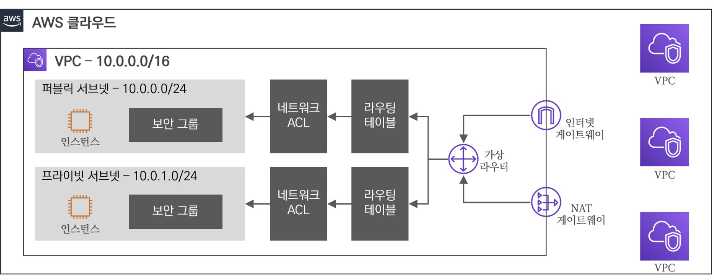
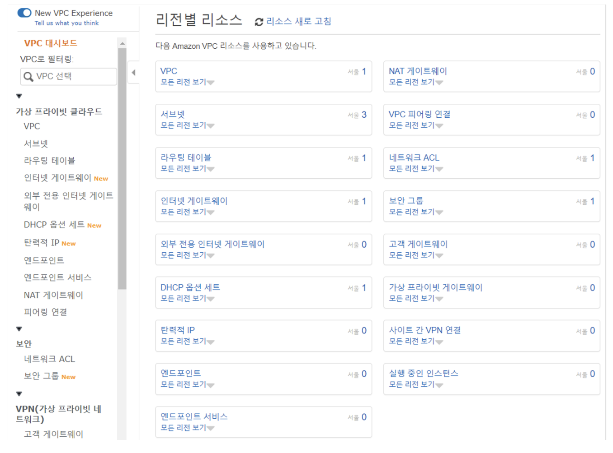

# 02장 VPC 기초
## 01. VPC (Virtual Private Cloud)

### 1.1. VPC 란? 

#### 1.1.1. VPC 정의
- VPC 는 Virtual Private Cloud 의 약자로 AWS 클라우드 내 논리적으로 독립된 섹션을 제공하여, 사용자가 정의한 가상 네트워크상에서 다양한 AWS 리소스를 실행할 수 있게 지원한다.
  - 한마디로 **독립된 가상의 클라우드 네트워크** 라고 볼 수 있다.
- AWS 클라우드 서비스는 사용자에 따라 네트워크 환경을 직접 설계를 할 수 있다는 특징을 가지고 있다.
  - 2011년 8월에 AWS VPC 가 최초 정식 서비스되어, 사용자는 VPC 내 IP 대역, 인터페이스, 서브넷, 라우팅 테이블, 인터넷 게이트웨이, 보안 그룹, 네트워크 ACL 등을 생성하고 제어할 수 있다.

- AWS 콘솔에서 VPC 대시보드(Dashboard)에 접근하면 다양한 VPC 리소스들을 확인해 볼 수 있다.
#### 1.1.2. VPC 종류
- VPC 는 사용자의 관여에 따라 기본 VPC(Default VPC)와 사용자 VPC(Custom VPC)로 나누어 질 수 있다.
  - 기본 VPC 는 리전별로 1개씩 생성이 되어 있으며 기본 VPC 내에 AWS 리소스가 미리 정해져 있다.
  - 반면에 사용자 VPC 는 사용자 정의에 의해 수동으로 AWS 리소스 리소스를 생성하고 제어할 수 있다.

- 기본 VPC와 사용자 VPC 차이

| 구분        | 기본 VPC        | 사용자 VPC     |
|-----------|---------------|-------------|
| 생성 주체     | AWS           | 사용자         |
| AWS 리소스   | 정해진 리소스 미리 생성 | 수동으로 생성     |
| 리전 별 생성 수 | 1개            | 최대 5개 (기본값) |
- 기본 VPC 는 별도의 작업 없이 기본적인 클라우드 네트워크를 제공하지만, 향후 실습을 진행할 때는 사용자 VPC 를 통해 원하는 환경에 맞게 구성을 할 것이다.

## 1.2. VPC 특징
- **확장성**
  - 클라우드 기반에 손쉽게 VPC 자원을 생성하고 삭제가 가능하며, 설정 및 관리에 편의성을 제공한다.
- **보안**
  - 인스턴스 레벨과 서브넷 레벨에서 인바운드(Inbound) 및 아웃바운드(Outbound) 필터링을 수행할 수 있도록 보안 그룹과 네트워크 ACL 을 제공하여 보안을 강화할 수 있다.
- **사용자 중심**
  - VPC 내 리소스에 대해 사용자가 원하는 대로 손쉽게 제어할 수 있으며, 네트워크 지표 및 모니터링 툴을 활용하여 사용자에게 높은 가시성을 제공한다.
- **제약 사항**
  - 전통적인 네트워크 환경에서 사용가능 했던 기능이 제한되어 있거나 일부분만 사용 가능하여 기술적 제약(브로드캐스트, 멀티캐스트, IP 기반 Fallover 프로토콜(VRRP, HSRP) 등) 이 따르게 된다.
  
> #### 참고 사항
> - 물론 위에서 나열한 제약 사항들은 AWS에서 지속적인 기능 추가로 개선해 나가고 있다.

---