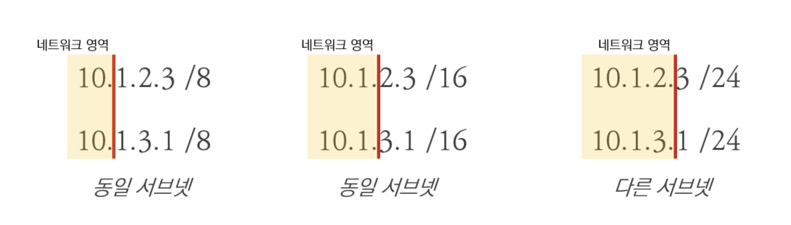
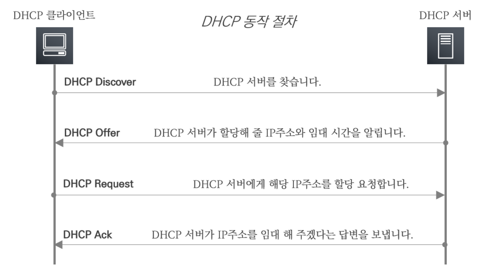
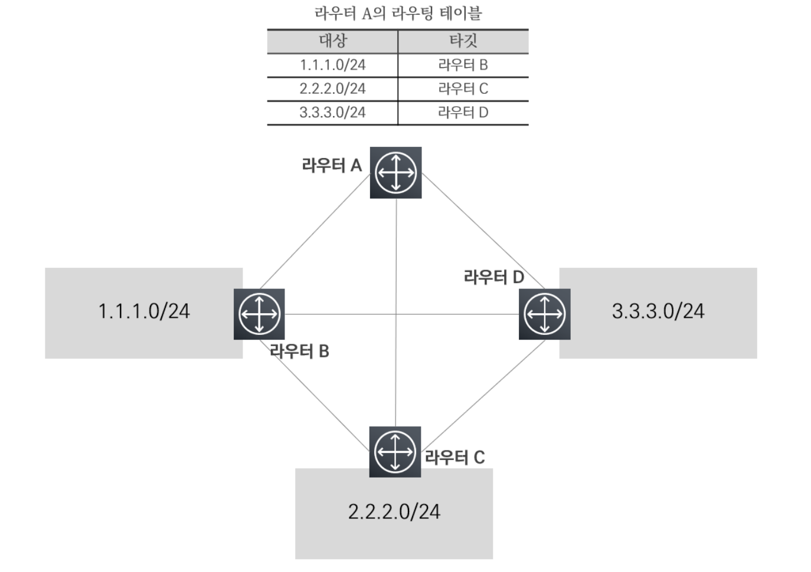

# 02장 VPC 기초
## 02. 기본 네트워크 개념 이해

### 2.1. OSI 7 레이어 모델 

#### 2.1.1. OSI 7 레이어 모델 개념
- OSI 7 레이어 모델은 국제표준화기구(ISO: International Organiization for Standardization)에서 개발한 모델로 복잡한 네트워크 동작 과정을 7개의 계층으로 나누어 네트워크 통신 흐름을 한눈에 알아보고 이해할 수 있게 도와주는 역할은 한다.
  - 계층별로 하위 계층의 기능을 이용하고 상위 계층으로 기능을 제공하는 상하 관계를 맺고 있다.

#### 2.1.2. OSI 7 레이어 계층 설명

- OSI 7 레이어의 계층별 구분과 함께 TCP/IP 프로토콜 간 계층별 비교를 보여 주고 있다.
  - 우선 TCP/IP 프로토콜이란 네트워크를 통해 통신하는데 쓰이는 통신 규약의 모음을 말한다.
  - OSI 7 레이어 계층별로 TCP/IP 의 어떤 프로토콜이 해당하는지 확인해 볼 수 있다.
- OSI 7 레이어 계층별로 간략하게 정의해 보면 아래와 같다.
- **1 Layer - Physical 계층**
  - Physical 계층은 물리 계층으로 네트워크의 하드웨어 전송 기술을 말한다.
  - 물리적인 링크의 연결, 유지, 해제를 담당한다.
- **2 Layer - Data Link 계층**
  - Data Link 계층은 Physical 계층에서 송수신되는 정보의 오류와 흐름을 관리하여 데이터의 전달을 수행하는 역할을 한다.
  - OSI 1 계층과 OSI 2 게층을 TCP/IP 프로토콜 상 Network Interface 계층으로 분류하며, 해당 계층에는 Ethernet, Wi-Fi, 물리적인 케이블 등이 포함된다.
- **3 Layer - Network 계층**
  - Network 계층의 핵심은 데이터를 목적지까지 빠르고 안전하게 전달(라우팅)하기 위한 것으로 여러 노드를 거칠 때마다 최적의 경로를 찾아주는 역할을 한다.
  - OSI 3 계층을 TCP/IP 프로토콜 상 Internet 계층으로 분류하며, 해당 계층에는 IP, ARP, ICMP 등의 프로토콜이 포함된다.
- **4 Layer - Transport 계층**
  - Transport 계층은 전송 계층으로 종단의 사용자 간 데이터를 통신을 다루는 최상위 계층으로 데이터 전달의 유효성과 효율성을 보장 받는다.
  - OSI 4계층을 TCP/IP 프로토콜 상에서도 Transport 계층으로 분류하며, 해당 계층에는 TCP, UDP 등의 프로토콜이 포함된다.
- **5 Layer - Session 계층**
  - Session 계층은 종단의 사용자 간의 응용 프로세스 통신을 관리하기 위한 방법을 제공한다.
  - 데이터의 통신을 위한 논리적인 연결을 말한다.
- **6 Layer - Presentation 계층**
  - Presentation 계층은 데이터의 형식상 차이에 대해 송/수신자간 이해할 수 있는 형태로 데이터를 표현하는 기능을 담당한다.
  - 데이터의 암호화 및 압축 등을 수행한다.
- **7 Layer - Application 계층**
  - Application 계층은 응용 프로세스와 직접 연계하여 실제 응용 프로그램을 사용하게 하는 계층이다.
  - OSI 5~7 계층을 TCP/IP 프로토콜 상 Applcation 계층으로 분류하며, 해당 계층에는 HTTP, SSH, FTP, DHCP 등이 포함된다.

### 2.2. IP와 서브넷 마스크

#### 2.2.1. IP 개념
- IP 는 Internet Protocol 의 약자로 인터넷상의 네트워크 자원들을 구분하는 고유한 주소이다.
  - 참고로 IP는 OSI 7 계층에서 3계층에 해당한다.
  - IP 주소는 버전에 따라 IP 버전 4(IPv4)와 IP 버전 6(IPv6)로 구분 지을 수 있다.

| 구분    | IPv4                                         | IPv6                                                                   |
|-------|----------------------------------------------|------------------------------------------------------------------------|
| 주소 길이 | 32bit                                        | 128bit                                                                 |
| 표기 방법 | 8비트씩 4개의 파트로 10진수 표현   예) 39.118.188.233 | 16비트씩 8개의 파트로 16진수 표현   예) 2002:0221:ABCD:CDEF:0000:0000:FFFF:1234 |
| 주소 개수 | 약 43억개                                       | 약 43억 x 43억 x 43억 x 43억                                                |
- IPv4와 IPv6은 구조적으로 다른 형태로 표기되며 가용 숫자도 큰 차이를 보인다.
  - 물론 IPv4와 IPv6 간 차이는 많은 요소가 있지만 간략하게 구조의 차이 정도만 이해하고 넘어가자.
  - 예전부터 IPv4는 가용 숫자의 문제와 효율성 문제가 제기되고 있고 이에 IPv6가 문제에 대해 진보된 특성을 보이지만, 여전히 IPv4를 주로 쓰이고 있다.

#### 2.2.2. 퍼블릭 IP와 프라이빗 IP
- **퍼블릭 IP(공인 IP)**
  - 인터넷 구간의 통신 대상을 식별하기 위해 ISP(Internet Service Providor: 인터넷 서비스 공급자)에서 제공하는 IP 주소이다.
  - 해당 퍼블릭 IP 는 전 세계의 인터넷 구간에서 유일한 주소를 갖는다.
- **프라이빗 IP(사설 IP)**
  - 일반 가정이나 회사 등의 독립된 네트워크에서 사용되는 내부 IP 주소이다.
  - 해당 프라이빗 IP 는 프라이빗 네트워크 관리자에 의해 할당되며, 독립된 네트워크상에서 유일한 주소를 갖는다.
  - 그리고 프라이빗 IP 주소를 통해 외부 인터넷 구간과 통신이 불가능하다.
  - 이러한 프라이빗 IP 주소는 아래와 같이 3가지 대역(Class)으로 고정되엉 있다.
    - Class A : 10.0.0.0 ~ 10.255.255.255
    - Class B : 172.16.0.0 ~ 172.31.255.255
    - Class C : 192.168.0.0 ~ 192.168.255.255

#### 2.2.3. 서브넷과 서브넷 마스크
- 먼저 서브넷이란 부분적인 네트워크를 의미한다.
  - 모든 네트워크망이 거대한 하나의 망으로 이루어진 형태는 아니다.
  - 네트워크망에서 서브넷을 통해 부분적인 네트워크망으로 나누어지고 서로 연결되어 있다.
  - 즉, 서로 간에 서브넷으로 분리된 부분 네트워크망이다.
- 그렇다면 이렇게 나누어진 서브넷은 서로 간에 어떻게 구분을 할 수 있을까?
  - 이때 사용되는 것이 서브넷 마스크이다.
  - 서브넷 마스크는 IP 주소에 네트워크 ID 와 호스트 ID를 구분하는 기준값이다.
    - 네트워크 ID 는 서브넷을 식별하는 영역이고, 호스트 ID 는 서브넷에서 대상을 식별하는 영역이다.
    - 즉, 동일한 서브넷에 속한 IP 주소의 네트워크 ID 의 값은 모두 동일하며 호스트 ID 를 통해 개별 구분한다.
    - 서브넷 마스크는 IPv4와 마찬가지로 32bit 구조이며, 이진 수 값이 1인 영역이 네트워크 ID, 0인 영역이 호스트 ID이다.(비트 값은 연속성을 취하고 있다.)
  - 예를 들면 서브넷 마스크는 이진수로 11111111.11111111.11111111.00000000 형태로 표현될 수 있다.
    - 물론 이진수로 표현하는 것보다 255.255.255.0 처럼 10진수로 표현하거나 /24로 프리픽스(Prefix) 형태로 표현한다.(/24는 1의 개수, 네트워크 ID의 비트 수이다.)

- 보편적으로 많이 쓰이는 프리픽스를 통해 2개의 IP 가 동일한 서브넷인지 다른 서브넷인지 보여주고 있다.
  - 참고로 /8은 8bit가 네트워크 영역으로 10진수 첫 번째 자리가 네트워크 영역이다.
  - 이렇게 네트워크 영역을 구분하고 서로 비교하여 동일 서브넷인지 아닌지 판단할 수 있다.
  - 10.0.0.0/8, 10.1.0.0/16, 10.1.1.0/24와 같이 표기하는 방법을 **IP CIDR(Classless Inter Domain Routing)** 표기법이라 한다.

> #### 참고 사항
> 위와 같이 /8, /16, /24에서 세부적으로 서브넷팅을 할 수 있지만, 서브넷과 서브넷 마스크와 IP CIDR가 무엇인지 정도만 이해하고 넘어가자.

### 2.3. TCP와 UDP 그리고 포트 번호

#### 2.3.1. TCP와 UDP
- TCP 와 UDP 는 OSI 7 레이어 중 4계층에 사용되는 대표적인 전송 프로토콜이다.
  - TCP 와 UDP 는 신뢰성 있는 전송의 여부에 따라 차이를 두고 있다.

| 구분     | TCP              | UDP                  |
|--------|------------------|----------------------|
| OSI 모델 | 4계층(전송 계층)       | 4계층(전송 계층)           |
| 연결     | 연결 지향성           | 비연결 지향성              |
| 신뢰성    | 신뢰성 보장           | 신뢰성 보장하지 않음          |
| 순서     | 데이터 순서 보장        | 데이터 순서 보장하지 않음       |
| 제어     | 혼잡 제어, 흐름 제어 제공  | 혼잡 제어, 흐름 제어 제공하지 않음 |
| 속도     | 상대적으로 느림         | 상대적으로 빠름             |
| 서비스    | HTTP, SSH, FTP 등 | DNS, DHCP 등          |
- 위와 같이 TCP 는 종단 간의 연결을 맺고 연결이 이루어지면 신뢰성 있는 전송을 보장하는 프로토콜로 그로 인해 UDP 보다 상대적으로 느린 통신이 이루어진다.
  - 대표적인 서비스로 HTTP, SSH, FTP 등의 연결성과 신뢰성이 필요한 서비스가 있다.
- 반대로 UDP 는 종단 간의 연결 없이 통신이 이루어지며 신뢰성 있는 전송을 보장 받을 수 없다.
  - 연결이나 제어를 위한 작업이 없기 때문에 TCP 보다 상대적으로 빠른 통신이 이루어진다.
  - 대표적인 서비스로 DNS, DHCP 등이 있다.

#### 2.3.2. 포트 번호
- 위 설명과 같이 TCP 와 UDP 의 특성에 따라 제공되는 응용 프로그램 서비스가 있다.
  - 이런 서비스를 구분할 때 포트 번호를 통해 구분할 수 있다.
  - IANA 라는 단체에서 TCP 와 UDP의 포트 번호 범위를 정의하고 있으며, 범위에 따라 크게 3가지로 구분 지을 수 있다.
1. **잘 알려진 포트(Well-Known Port)** : 0~1023
2. **등록된 포트(Registered Port)** : 1024~49151 
3. **동적 포트(Dynamic Port)** : 49152~65535
- 예를 들어 TCP 의 포트 번호 80은 HTTP 서비스로 예약된 잘 알려진 포트이며, UDP 의 포트 번호 53은 DNS 서비스로 예약된 잘 알려진 포트를 의미한다.

### 2.4. DHCP (Dynamic Host Configuration Protocol)
#### 2.4.1. DHCP 개념
- DHCP(Dynamic Host Configuration Protocol)는 동적으로 IPv4 주소를 일정 기간 임대를 하는 프로토콜이다.
  - 해당 DHCP 는 UDP 프로토콜을 사용하며, 포트 번호는 67,68을 사용하여 동작한다.
  - 네트워크상 호스트가 IPv4 주소를 할당할 때 수동으로 지정할 수도 있고, DHCP 를 통해 자동으로 지정할 수도 있다.
  - IP 주소를 임대하는 개념하에 임대 시간(Lease Time)이 존재하며 임대 시간이 만료되면 반환하거나 갱신을 수행한다.

#### 2.4.2. DHCP 절차
- DHCP 는 중앙집중형 서버/클라이언트 방식으로 동작한다.
  - 즉, DHCP 서버가 존재하고 네트워크 호스트가 클라이언트가 되어 서버에게 IP 할당을 요청하는 구조이다.

- 위 그림과 같이 DHCP 는 4단계의 절차를 통해 동적으로 IP 를 할당 받을 수 있다.
  - **DHCP Discover** : DHCP 클라이언트에서 DHCP 서버를 찾기 위한 메시지
  - **DHCP Offer** : DHCP 서버에서 할당할 IP 주소와 임대 시간을 알림
  - **DHCP Request** : DHCP 클라이언트에서 DHCP 서버로 할당받은 IP 를 요청
  - **DHCP Ack** : DHCP 서버에서 최종적으로 할당 IP 를 승인하여 알림

### 2.5. DNS (Domain Name System)
#### 2.5.1. DNS 개념
- DNS(Domain Name System)는 도메인 네임을 제공하기 위한 기술이다.
  - 여기서 도메인 네임이란 IP 주소의 복잡한 주소 체계를 해소하기 위해 형태로 구성된 이름이다.
  - 예를 들어 구글 서버에 대한 주소는 IP 형태로 구성되어 있겠지만, 우리는 google.com 이라는 문자 형태로 접근한다.
  - 즉, google.com 이라는 것이 도메인 네임이며 google.com 과 IP 주소를 매핑하여 제공하는 기술을 DNS 라고 한다.
  - 해당 DNS 는 UDP 프로토콜을 사용하며, 포트 번호 53을 사용하여 동작한다.

### 2.6. 라우팅 (Routing)
#### 2.6.1. 라우팅 개념
- 라우팅이란 네트워크 통신을 수행할 때 거쳐 가는 경로를 잡아 주는 OSI 7 Layer 에서 3계층인 Network 계층의 핵심적인 기능을 수행한다.
- 위에서 설명했다시피 네트워크는 여러 개의 서브넷으로 이루어져 있고, 목적지 IP 로 향할 때 여러 노드를 거쳐서 통신이 되고 있다.
  - 복잡하게 연결된 네트워크망에서 최적의 경로를 잡아 통신하는 것이 바로 라우팅이다.
  - 네트워크 입장에서 최적의 라우팅을 통해 안정적이고 빠른 통신을 하는 것은 중요한 지향점이다.

#### 2.6.1. 라우터와 라우팅 테이블
- 이렇게 라우팅을 수행하는 장비를 라우터라 하며, 해당 라우터는 라우팅 테이블을 통해 경로를 파악하고 원하는 목적지 대상으로 데이터를 전달한다.

- 위 그림과 같이 네트워크망에서 라우터는 라우팅 테이블을 통해 목적지 IP 가 어느 경로로 향하는지 기록하고 해당 경로로 데이터를 전달한다. 
---