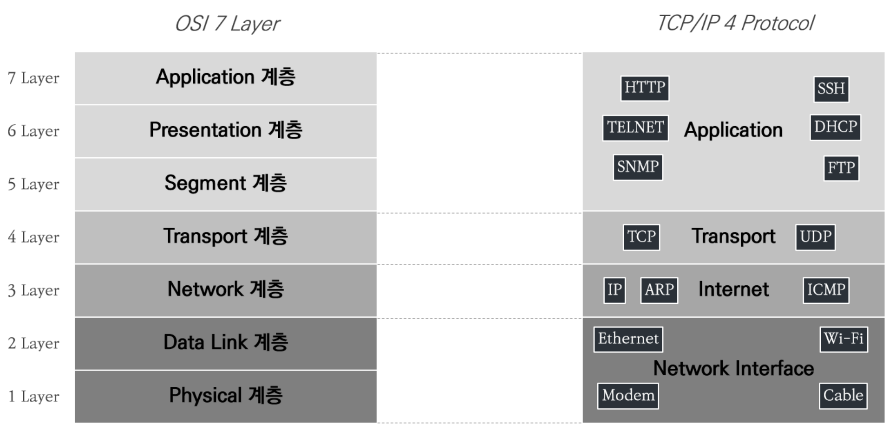

# 02장 VPC 기초
## 02. 기본 네트워크 개념 이해

### 2.1. OSI 7 레이어 모델 

#### 2.1.1. OSI 7 레이어 모델 개념
- OSI 7 레이어 모델은 국제표준화기구(ISO: International Organiization for Standardization)에서 개발한 모델로 복잡한 네트워크 동작 과정을 7개의 계층으로 나누어 네트워크 통신 흐름을 한눈에 알아보고 이해할 수 있게 도와주는 역할은 한다.
  - 계층별로 하위 계층의 기능을 이용하고 상위 계층으로 기능을 제공하는 상하 관계를 맺고 있다.

#### 2.1.2. OSI 7 레이어 계층 설명

- OSI 7 레이어의 계층별 구분과 함께 TCP/IP 프로토콜 간 계층별 비교를 보여 주고 있다.
  - 우선 TCP/IP 프로토콜이란 네트워크를 통해 통신하는데 쓰이는 통신 규약의 모음을 말한다.
  - OSI 7 레이어 계층별로 TCP/IP 의 어떤 프로토콜이 해당하는지 확인해 볼 수 있다.
- OSI 7 레이어 계층별로 간략하게 정의해 보면 아래와 같다.
- **1 Layer - Physical 계층**
  - Physical 계층은 물리 계층으로 네트워크의 하드웨어 전송 기술을 말한다.
  - 물리적인 링크의 연결, 유지, 해제를 담당한다.
- **2 Layer - Data Link 계층**
  - Data Link 계층은 Physical 계층에서 송수신되는 정보의 오류와 흐름을 관리하여 데이터의 전달을 수행하는 역할을 한다.
  - OSI 1 계층과 OSI 2 게층을 TCP/IP 프로토콜 상 Network Interface 계층으로 분류하며, 해당 계층에는 Ethernet, Wi-Fi, 물리적인 케이블 등이 포함된다.
- **3 Layer - Network 계층**
  - Network 계층의 핵심은 데이터를 목적지까지 빠르고 안전하게 전달(라우팅)하기 위한 것으로 여러 노드를 거칠 때마다 최적의 경로를 찾아주는 역할을 한다.
  - OSI 3 계층을 TCP/IP 프로토콜 상 Internet 계층으로 분류하며, 해당 계층에는 IP, ARP, ICMP 등의 프로토콜이 포함된다.
- **4 Layer - Transport 계층**
  - Transport 계층은 전송 계층으로 종단의 사용자 간 데이터를 통신을 다루는 최상위 계층으로 데이터 전달의 유효성과 효율성을 보장 받는다.
  - OSI 4계층을 TCP/IP 프로토콜 상에서도 Transport 계층으로 분류하며, 해당 계층에는 TCP, UDP 등의 프로토콜이 포함된다.
- **5 Layer - Session 계층**
  - Session 계층은 종단의 사용자 간의 응용 프로세스 통신을 관리하기 위한 방법을 제공한다.
  - 데이터의 통신을 위한 논리적인 연결을 말한다.
- **6 Layer - Presentation 계층**
  - Presentation 계층은 데이터의 형식상 차이에 대해 송/수신자간 이해할 수 있는 형태로 데이터를 표현하는 기능을 담당한다.
  - 데이터의 암호화 및 압축 등을 수행한다.
- **7 Layer - Application 계층**
  - Application 계층은 응용 프로세스와 직접 연계하여 실제 응용 프로그램을 사용하게 하는 계층이다.
  - OSI 5~7 계층을 TCP/IP 프로토콜 상 Applcation 계층으로 분류하며, 해당 계층에는 HTTP, SSH, FTP, DHCP 등이 포함된다.
---