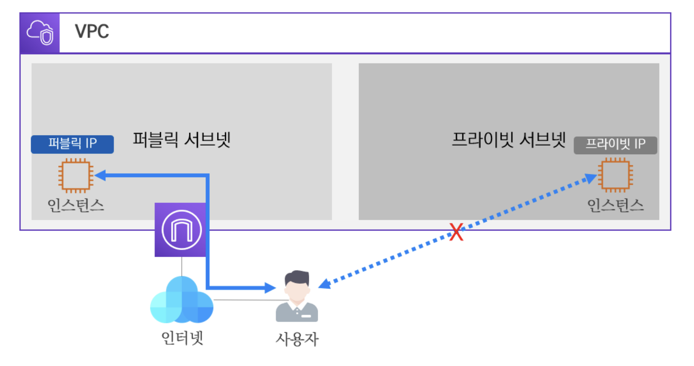

# 02장 VPC 기초
## 03. VPC 리소스 소새

### 3.1. 서브넷 (Subnet) 
#### 3.1.1. 서브넷 개념
- 서브넷(Subnet)의 일반적인 개념은 네트워크 영역을 부분적으로 나눈 망으로 정의할 수 있다.
  - 클라우드 환경의 VPC 에서도 서브넷을 통해 네트워크를 분리하여 나눌 수 있다.

- 위 그림과 같이 VPC 내에 서브넷을 통해 네트워크망을 분리하고 있는 모습이다.
  - 추가로 알아야 할 것은 서브넷의 IP 대역은 VPC 의 IP 대역에 속해 있어야 하며, 서브넷은 1개의 가용 영역에 종속되어야 한다.
  - AWS 에서는 서브넷에 할당할 수 있는 IP 대역에서 미리 예약되어 있는 IP 주소가 있다.
  - 이러한 예약된 IP 주소들은 AWS 자원에게 할당할 수 없다.
- **AWS에서 서브넷의 IP 대역마다 예약된 IP 주소**
  - 서브넷 IP 대역에서 첫번째에서 네번째까지 IP 주소는 예약되어 있다.
  - 그리고 마지막 IP 주소도 예약되어 있다. 
  - > 예를 들어 서브넷에 할당할 IP 대역이 10.0.0.0/24이라면 10.0.0.0 ~ 10.0.0.255 중에서
    > - 첫번째 주소 : 10.0.0.0 -> 네트워크 주소
    > - 두번째 주소 : 10.0.0.1 -> AWS VPC 가상 라우터 주소
    > - 세번째 주소 : 10.0.0.2 -> AWS DNS 서버 주소
    > - 네번째 주소 : 10.0.0.3 -> 향후 새로운 기능에 활용할 주소
    > - 마지막 주소 : 10.0.0.255 -> 네트워크 브로드캐스트 주소
  - > #### 참고 사항
    > - 기본적으로 예약된 IP 주소를 고려하여 생성해야 한다.
    >   - 특정 서비스에 대해 IP 주소가 부족하면 문제가 발생할 수 있어, 어느 정도 여유를 두고 생성하는 것을 권장한다.
    > - 그리고 VPC 내 여러 서브넷이 존재할 경우 첫번째 서브넷의 세번째 주소를 DNS 서버 주소로 사용한다.
    >   - 나머지 서브넷의 세번째 주소는 AWS에서 예약되어 있다.

#### 3.1.2. 퍼블릭 서브넷과 프라이빗 서브넷
- 서브넷은 크게 퍼블릭 서브넷과 프라이빗 서브넷으로 나눌 수 있다.
  - 퍼블릭 서브넷은 공인 네트워크 개념으로 외부 인터넷 구간과 직접적으로 통신을 할 수 있는 공공 네트워크이다.
  - 반면에 프라이빗 서브넷은 사설 네트워크 개념으로 외부 인터넷 구간과 직접적인 통신을 할 수 없는 폐쇄적인 네트워크이다.

- 위 그림과 같이 퍼블릭 서브넷은 퍼블릭 IP 를 가지고 인터넷 게이트웨이를 통해 인터넷 구간의 사용자와 통신이 가능하나, 프라이빗 서브넷은 프라이빗 IP 만 가지고 있어 자체적으로 외부 인터넷 구간의 사용자와 통신이 불가능하다.

> #### 참고사항
> - 프라이빗 서브넷은 원론적으로 외부 인터넷 구간과 통신이 불가능하지만, 프라이빗 IP를 퍼블릭 IP로 변환해 주는 NAT 게이트웨이가 있으면 통신이 가능하다.

### 3.2. 가상 라우터와 라우팅 테이블
- VPC를 생성하면 자동으로 가상 라우터가 생성된다.
  - 이 가상 라우터는 라우팅 테이블을 가지고 있어 목적지 네트워크로 라우팅하여 통신한다.

  - 위 그림과 같이 10.0.0.0/16 대역의 VPC 를 생성하면, 자동으로 가상 라우터가 생성된다.
  - 가상 라우터는 최초에 기본 라우팅 테이블을 보유하고 있으며 로컬 네트워크에 대한 라우팅 경로만 잡혀있다.
  - 여기서 로컬 네트워크는 VPC 의 자체 대역으로 VPC 내에 생성된 서브넷은 라우팅 테이블의 로컬 네트워크에 의해 통신이 가능하다.

  - 위와 같이 가상 라우터에서는 서브넷별로 라우팅 테이블을 매핑을 시켜 줄 수 있다.
  - 기본 라우팅 테이블을 사용할 수도 있지만, 새로운 라우팅 테이블을 생성하고 매핑하여 서브넷 당 개별적인 라우팅 테이블을 가질 수 있다.

### 3.3. 인터넷 게이트웨이
- 인터넷 게이트웨이는 VPC 와 인터넷 간의 논리적인 연결이다.
  - 간략하게 VPC 구간으로 나가는 관문이라 생각할 수 있다.
  - 이러한 인터넷 게이트웨이는 VPC 당 1개만 연결이 가능하다.
  - 인터넷 게이트웨이를 통해 외부 인터넷 구간으로 통신할 수 있는 대상은 퍼블릭 IP 를 사용하는 퍼블릭 서브넷 내의 자원이다.
  - 이러한 퍼블릭 서브넷은 자신의 라우팅 테이블에 외부 인터넷 구간으로 나가는 타깃을 인터넷 게이트웨이로 지정해 주어야 한다.

  - 위와 같이 퍼블릭 서브넷 내의 인스턴스가 외부 인터넷 구간과 통신하기 위하여 인터넷 게이트웨이가 관문이 되어 이를 통해 통신이 되고 있다.
  - 인터넷 게이트웨이는 양방향으로 연결을 지원하기에 외부 인터넷 구간에서 퍼블릭 서브넷의 퍼블릭 IP 로도 정상적인 통신이 가능하다.

### 3.4. NAT 게이트웨이
- NAT 게이트웨이도 인터넷 게이트웨이처럼 외부 인터넷 구간과 연결하는 관문 역할을 하고 있다.
  - 차이점은 NAT 이라는 명칭에서 알아볼 수 있는데, NAT 은 Network Address Translation 의 약자로 네트워크 주소 즉, IP 주소를 변환해 주는 기술이다.
  - 인터넷 구간은 공공 네트워크 구간으로 퍼블릭 IP를 통해 통신이 이루어진다.
  - 프라이빗 IP 는 인터넷 구간으로 넘어올 수가 없는데, 이때 NAT 게이트웨이가 프라이빗 IP 를 퍼블릭 IP 로 변환하여 통신을 도울 수 있다.

  - 인터넷 게이트웨이는 퍼블릭 서브넷의 외부 인터넷 구간을 연결하는 반면에 NAT 게이트웨이는 위와 같이 프라이빗 서브넷 인스턴스의 프라이빗 IP 를 퍼블릭 IP 로 변환하여 외부 인터넷 구간으로 연결할 수 있다.
  - 추가로 NAT 게이트웨이는 한쪽 방향으로만 동작한다.
  - 즉, 프라이빗 서브넷에서 외부 인터넷으로 통신이 가능하지만 반대로 외부 인터넷에서 프라이빗 서브넷으로 통신은 불가능하다.
> #### 참고사항
> - AWS에서 NAT 기능은 NAT 게이트웨이와 NAT 인스턴스로 구분 짓고 있다.

### 3.5. 보안 그룹과 네트워크 ACL
- VPC 는 인스턴스 레벨과 서브넷 레벨 상에서 대상을 필터링 할 수 있는 보안 기술을 사용할 수 있다.
  - 인스턴스 레벨에서의 보안 기술은 보안 그룹(Security Group)이며, 서브넷 레벨에서의 보안 기술은 네트워크 ACL(Access Control List)이다.

  - 위와 같이 보안 그룹은 인스턴스 별로 지정하는 보안 기술이며, 네트워크 ACL 은 서브넷 별로 지정하는 보안 기술로 구분 지어 볼 수 있다.
  - 이러한 보안 기술들은 인바운드 및 아웃바운드되는 데이터에 대해 허용 규칙과 거부 규칙을 수립하여, 원하는 데이터만 수용할 수 있게 필터링 할 수 있다.

---