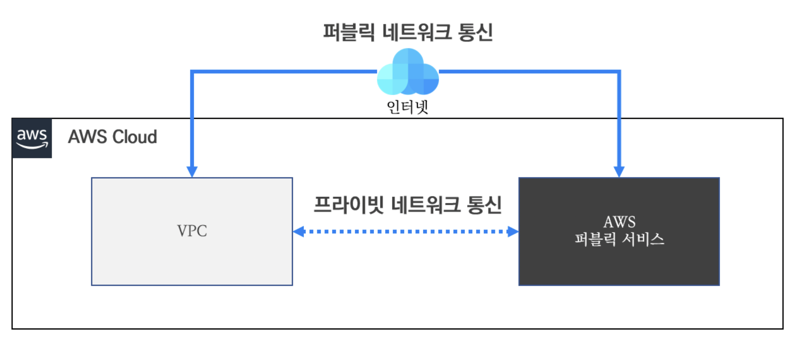

# 03장 VPC 고급
## 01. VPC 엔드포인트 (Virtual Endpoint)

### 1.1. VPC 엔드포인트 란? 

#### 1.1.1. VPC 엔드포인트 개요
- 사용자가 생성한 VPC 에서 AWS 퍼블릭 서비스와 통신을 하거나 다른 VPC 로 통신이 필요할 경우 일반적으로 외부 인터넷 구간인 퍼블릭 네트워크를 통해 통신이 이루어진다.

  - AWS 에서 제공하는 대부분의 서비스에 접근하기 위해서는 퍼블릭 네트워크 통신이 필요하다.
  - 하지만 금융 서비스처럼 강력한 보안 요건을 만족하기 위해서 격리된 프라이빗 서브넷에 자원이 생성되어야 하며, 이 경우 퍼블릭 네트워크를 통해 통신이 불가능하다.
  - 이에 따라 위 그림과 같이 격리된 프라이빗 서브넷에서도 AWS 퍼블릭 서비스와 프라이빗 네트워크 통신으로 안전한 통신을 제공하는 VPC 엔드포인트 기능에 대하여 알아보자.
- VPC 엔드포인트(VPC Endpoint)는 AWS 의 퍼블릭 서비스나 직접적으로 생성한 AWS 서비스에 대해 외부 인터넷 구간을 통한 접근이 아닌 직접적으로 접근할 수 있는 프라이빗 액세스 기능이다.
  - 예를 들어 S3라는 AWS 스토리지 서비스에 대해 우리가 생성한 VPC 에서 접근을 하려고 할 때, 인터넷 게이트웨이나 NAT 게이트워이를 통해 외부 인터넷으로 접근하는 방식이 아닌 VPC 엔드포인트 기능을 통해 AWS 내부의 프라이빗 연결이 가능해진다.

#### 1.1.2. VPC 엔드포인트 유형
- VPC 엔드포인트는 연결 대상 서비스에 따라 엔드포인트와 엔드포인트 서비스로 구분 지을 수 있다.
  - 엔드포인트는 AWS 퍼블릭 서비스에 대상으로 연결을 하고, 엔드포인트 서비스는 사용자가 직접 생성한 서비스에 대해 연결을 한다는 차이이다.
  - 이 중에 엔드포인트는 연결 대상 서비스 종류에 따라 게이트웨이 엔드포인트(Gateway Endpoint)와 인터페이스 엔드포인트(Interface Endpoint) 유형으로 나뉘어 진다.
  - 아래 그림에서 엔드포인트 종류에 대해 정리하고 있다.
    
> #### 참고 사항
> - 인터페이스 엔드포인트에 대한 연결 대상이 S3와 DynamoDB를 제외한 모든 AWS 서비스를 지칭하는 것은 아니다.

  - 위 그림을 통해 VPC 엔드포인트 종류별 차이를 확인해 볼 수 있다.
  - 물론 VPC 엔드포인트 유형 별 차이는 연결 대상이 무엇인지 만이 아니며, 동작 방식이 조금씩 다르다.
> #### 참고 사항
> - VPC 엔드포인트 유형 중에 인터페이스 엔드포인트와 엔드포인트 서비스를 통한 연결을 AWS에서는 프라이빗 링크(Private Link)라고 부른다.

#### 1.1.3. VPC 엔드포인트 특징

  - 위 그림은 VPC 엔드포인트 적용과 미적용에 따른 통신 흐름의 차이를 보여주고 있다.
  - 대표적인 특징은 외부 인터넷 구간을 통한 퍼블릭 통신에서 프라이빗 링크를 통한 프라이빗 통신으로 볼 수 있다.
  - 이에 따라 VPC 엔드포인트는 아래와 같은 특징을 가지고 있다.
    - **보안 측면 강화** : 프라이빗 연결을 통한 외부 구간으로 노출이 되지 않는다. 
    - **서비스 제약** : 연결 대상 서비스는 동일 리전에 속한 서비스만 가능하다.
    - **VPC 종속** : 오직 VPC 하나에만 연결할 수 있다. (다수의 VPC에 종속 불가)
    - **권한 제어** : AWS IAM 기능을 통해 정책을 수립하여 VPC 엔드포인트에 대한 권한 부여가 가능하다.
> #### 필자의 생각
> - VPC 엔드포인트는 보안적인 측면에서 유용한 기능으로 활용도가 높은 서비스라 생각한다.
> - 따라서 본 장을 통해 VPC 엔드포인트를 이해하고 다양하게 활용하였으면 한다.

---