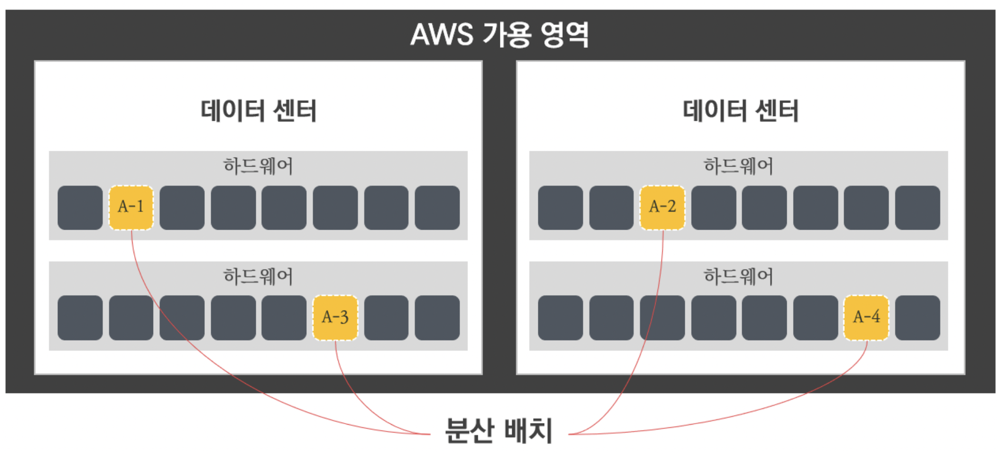

# 03장 VPC 고급
## 04. 배치 그룹 (Placement Group)

### 4.1. 배치 그룹 이란?
- 새로운 인스턴스가 시작되면 AWS 에서도 하드웨어에 최대한 분산하여 배치한다.
  - 이유는 물리 호스트의 장애에 대해 상호 간 영향도를 최소화하고 장애를 줄이는 데 도움이 되기 때문이다.
  - 물론 인스턴스의 배치가 분산되는 상황이 모두 좋은 것은 아니다.
  - 워크로드(Workload)에 따라 인스턴스의 배치 위치를 조정하는 것이 유리한 경우가 있다.
  - 이러한 필요에 따라 배치 그룹(Placement Group)은 그룹 내 인스턴스의 배치를 조정하는 기능이다.
 

### 4.2. 배치 그룹 종류? 
- AWS 배치 그룹은 워크로드 형태에 따라 3가지 전략의 배치 그룹이 있다.
- **클러스터 배치 그룹**
  - 클러스터 배치 그룹(Cluster Placement Group)은 인스턴스의 하드웨어 배치를 서로 근접하게 위치한다.
  - 일반적으로 고성능 컴퓨팅 환경에서는 수많은 애플리케이션이 서로 긴밀한 통신을 요구하여 낮은 지연 시간과 높은 네트워크 성능이 필요하다.
  - 이와 같은 환경에서 클러스터 배치 그룹으로 서로 인접하게 배치하여 지연과 성능을 보장한다.
  - 클러스터 배치 그룹은 하나의 가용 영역에 종속되는 제약이 있으며, 그룹 내 인스턴스는 동일한 인스턴스 유형을 사용하는 것을 권고한다.
  - 
- **파티션 배치 그룹**
  - 파티션 배치 그룹(Partition Placement Group)은 인스턴스를 논리적인 세그먼트로 분산하며, 하나의 파티션에 존재하는 인스턴스는 다른 파티션의 인스턴스와 하드웨어를 공유하지 않아 상호 영향을 미치지 않는다.
  - 파티션 배치 글부은 가용 영역당 파티션을 최대 7개 까지 가질 수 있으며, 파티션 배치 그룹에서 실행할 수 있는 인스턴스 숫자는 계정 제한의 적용을 받는다.
  - 
- **분산형 배치 그룹**
  - 분산형 인스턴스 그룹(Spread Placement Group)은 서로 다른 하드웨어로 분산하여 배치하여 인스턴스 간의 상호 장애 영향도를 최소화 하는 방법이다.
    - 보통 중요한 애플리케이션의 고가용성을 보장받기 위해 사용한다.
  - 분산형 배치 그룹은 각각 고유한 랙에 배치된 인스턴스 그룹이며 랙마다 자체 네트워크 및 전원이 있다.
  - 분산형 배치 그룹은 가용 영역당 7개의 인스턴스로 제한된다.
  - 

---