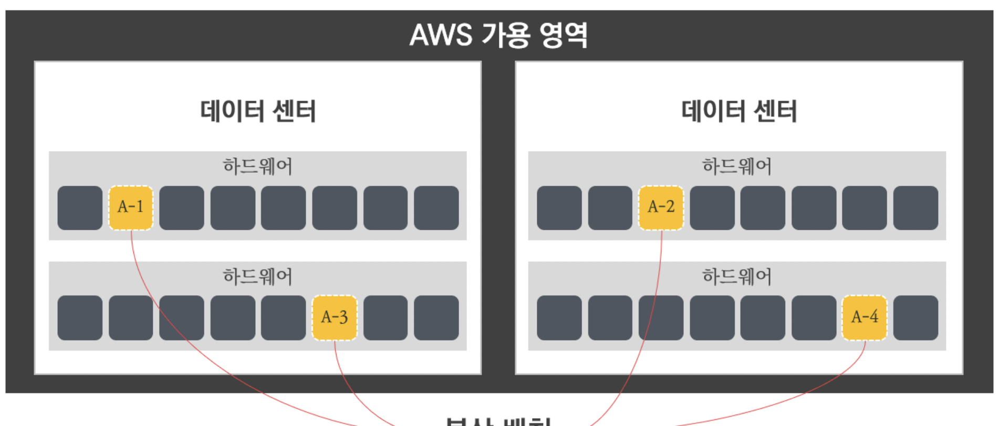
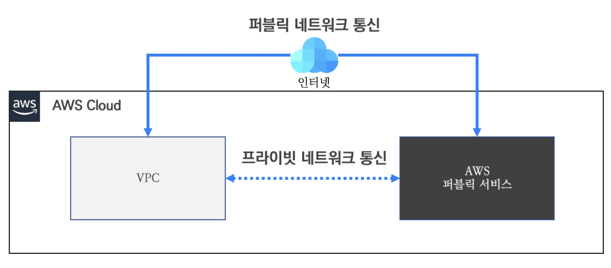

# 03장 VPC 고급
## 04. 배치 그룹 (Placement Group)

### 4.1. 배치 그룹 이란?
- 새로운 인스턴스가 시작되면 AWS 에서도 하드웨어에 최대한 분산하여 배치한다.
  - 이유는 물리 호스트의 장애에 대해 상호 간 영향도를 최소화하고 장애를 줄이는 데 도움이 되기 때문이다.
  - 물론 인스턴스의 배치가 분산되는 상황이 모두 좋은 것은 아니다.
  - 워크로드(Workload)에 따라 인스턴스의 배치 위치를 조정하는 것이 유리한 경우가 있다.
  - 이러한 필요에 따라 배치 그룹(Placement Group)은 그룹 내 인스턴스의 배치를 조정하는 기능이다.
 

### 4.2. 배치 그룹 종류? 
- AWS 배치 그룹은 워크로드 형태에 따라 3가지 전략의 배치 그룹이 있다.
- **클러스터 배치 그룹**
- **파티션 배치 그룹**
- **분산형 배치 그룹**

#### 4.2.1. 
- 

---