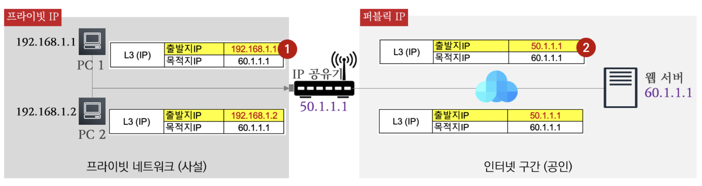

# 04장 인터넷 연결
## 01. AWS의 인터넷 연결

### 1.1. AWS의 인터넷 연결 소개

#### 1.1.1. 인터넷 연결을 위한 4가지 조건
1. **인터넷 게이트웨이**
  - 외부 인터넷과 연결을 해주는 장비로 1.1.3항에서 소개하는 3가지 방안이 최종적으로 인터넷 게이트웨이를 통하여 통신하게 된다.
2. **네트워크 라우팅 테이블 정보 (외부와 네트워크 통신을 위한)**
  - 일종의 목적지를 가기 위한 지도 정보로, 모든 네트워크 대역(0.0.0.0/0) 통신은 인터넷 게이트웨이로 전달하기 위해 경로를 지정한다. 
3. **공인 IP**
  - 일종의 집 주소와 같이 전 세계에서 유일한 주소의 개념이다.
  - AWS 에 사용 가능한 공인 IP는 퍼블릭 IP 나 탄력적 IP(Elastic IP) 가 있다.
  - 현재 IPv4 주소 개수가 부족하기 떄문에 프라이빗 IP 를 가진 대상이 인터넷 사용을 위해서 공인 IP 로 변환(NAT : Network Address Translation)이 필요하다.
4. **보안 그룹과 네트워크 ACL**
  - 보안 그룹과 네트워크 ACL 에 의해서 외부 네트워크와 통신이 허용되어야 한다.

#### 1.1.2. NAT 동작
- 보통 가정집의 경우에 내부의 단말(PC, 스마트폰 등)은 프라이빗 IP 를 가지고 있다.
  - 내부의 단말들이 외부 인터넷 사용 시 IP 공유기의 NAT를 통하여 인터넷을 연결하는 과정을 소개해본다.
  
    1. PC 1(192.168.1.1)과 PC 2(192.168.1.2)는 프라이빗 IP를 가지고 있다. 외부 웹서버(60.1.1.1)를 연결 시 출발지 IP는 자신의 프라이빗 IP로 지정되어 IP 공유기로 향한다.
    2. IP 공유기는 출발지 IP(프라이빗 IP)를 인터넷이 가능하도록 IP 공유기 자신에게 할당된 퍼블릭 IP를 출발지 IP로 변환하여 웹서버로 연결을 한다.
  - 이처럼 IP를 변환하는 것을 NAT(Network Address Translation)라고 부르며, IP 와 포트 번호를 동시에 변화하는 것을 PAT(Port Address Translation)라고 부른다.
  
#### 1.1.3. 인터넷 연결을 위한 3가지 방안 비교
| 특징    | 인터넷 게이트웨이                              | NAT 디바이스                        | Proxy 인스턴스                 |
|-------|----------------------------------------|---------------------------------|----------------------------|
| 동작    | Layer 3 계층 동작                          | Layer 4 계층 동작                   | Layer 7 계층 동작              |
| 주소 변환 | 프라이빗 IP 를 퍼블릭 IP 혹은 탄력적 IP 로 1:1 주소 변환 | IP 주소와 포트 번호 변환                 | IP 주소와 포트 번호 변환(TCP 신규 연결) |
| 특징    | 1개의 프라이빗 IP 마다 1개의 공인 IP 매칭            | 여러 개의 프라이빗 IP 가 1개의 공인 IP 사용 가능 | 어플리케이션 수준 제어(통제) 가능        |

### 1.2. 인터넷 게이트웨이
#### 1.2.1. 인터넷 게이트웨이 (Internet Gateway) 소개
- 인터넷 게이트웨이는 확장성과 가용성이 있는 VPC 구성 요소로 VPC 와 인터넷 간에 통신할 수 있게 해준다.
  - 인터넷 게이트웨이는 퍼블릭 IPv4 주소가 할당된 인스턴스에 대해 1:1 IPv4 주소 변환을 수행한다.
  - 참고로 인터넷 게이트웨이는 IPv4 및 IPv6 트래픽을 지원한다.
---