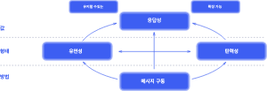

# 스프링으로 시작하는 리액티브 프로그래밍
## Chapter 01. 리액티브 시스템과 리액티브 프로그래밍
### 1.1. 리액티브 시스템(Reactive System) 이란?
- Q : 리액티브 시스템에서 리액티브(Reactive)란 용어는 무엇을 뜻하는 것일까요?
- A : 'reactive' 의 사전적 의미에는 '반응을 하는'이라는 뜻이 있다. 
  - 즉, 어떤 이벤트나 상황이 발생했을 때, 반응을 해서 **그에 따라 적절하게 행동하는 것을 의미**한다.
- 리액티브 시스템에서 반응을 잘한다는 것의 의미
  - 클라이언트의 요청에 머뭇거리지 않고 반응을 잘해서 즉시 응답해 주는것을 의미한다.
  - 즉, **클라이언트의 요청에 즉각적으로 응답함으로써 지연 시간을 최소화한다**고도 볼 수 있다.

### 1.2. 리액티브 선언문으로 리액티브 시스템 이해하기
- 리액티브 선언문(The Reactive Manifesto) 은 리액티브라는 용어의 의미를 올바르게 정의하기 위해 노력하는 사람들이 만든 리액티브 시스템 구축을 위한 일종의 설계 원칙이자 리액티브 시스템의 특징이라고 할 수 있다.
  
- 방법(MEANS)는 리액티브 시스템에서 주요 통신 수단으로 무엇을 사용할 것인지 표현한 것이다.
  - **비동기 메시지 기반의 통신**을 통해서 구성요소들 간의 느슨한 결합, 격리성, 위치 투명성을 보장한다.
- 형태(FORM)은 메시지 기반 통신을 통해서 어떠한 형태를 지니는 시스템으로 형성되는지를 나타낸다.
  - 그림에서는 리액티브 시스템이 비동기 메시지 통신 기반하에 탄련성과 회복성을 가지는 시스템이어야 함을 보여준다.
  - 리액티브 시스템에서 **탄련성(Elastic)** 이란 시스템의 작업량이 변화하더라도 일정한 응답을 유지하는 것을 의미한다.
    - 즉, 시스템으로 유입되는 입력이 많든 적든 간에 시스템에서 요구하는 응답성을 일정하게 유지하는 것을 말한다.
    - 일정한 응답성을 유지하기 위해서 입력을 처리하기 위한 시스템 자원을 그때 그때 적절하게 추가하거나 감소시켜서 작업량의 변화에 대응하는것이라고 이해하면 된다.
  - 리액티브 시스템에서 **회복성(Resilient)** 이란 시스템에 장애가 발생하더라도 응답성을 유지하는 것을 의미한다.
    - 회복성이 없다면 장애 발생 시 시스템이 응답하지 못하는 심각한 문제에 직면하기 때문에 이를 방지하기 위해서 회복성은 리액티브 시스템의 중요한 설계 원칙이다.
    - **이러한 회복성을 확보하기 위해서 리액티브 시스템의 구성요소들은 비동기 메시지 기반 통신을 통해 느슨한 결합과 격리성을 보장한다.**
    - 즉, 시스템의 구성요소들이 독립적으로 분리되기 때문에 장애가 발생하더라도 전체 시스템은 여전히 응답 가능하고 장애가 발생한 부분만 복구하면 된다는 의미이다.
- 값(VALUE)는 비동기 메시지 기반 통신을 바탕으로 한 회복성과 예측 가능한 규모 확장 알고리즘을 통해 시스템의 처리량을 자동으로 확장하고 축소하는 탄력성을 확보함으로써 즉각적으로 응답 가능한 시스템을 구축할 수 있음을 의미한다.
  - 값은 바로 리액티브 시스템의 핵심 가치를 보여 준다고 할 수 있다.
> 지금까지 설명한 리액티브 시스템은 리액티브 시스템의 설계 원칙에 따라 대규모 분산 시스템 또는 멀티코어 기반의 클라우드 시스템, 모바일 시스템 등 **빠른 응답성을 바탕으로 유지보수와 확장이 용이한 시스템** 을 구축하는 데 활용할 수 있다.

### 1.3. 리액티브 선언문으로 리액티브 시스템 이해하기
- 리액티브 프로그래밍은 **리액티브 시스템을 구축하는 데 필요한 프로그래밍 모델** 입니다.
- '리액티브 시스템은 비동ㄱ이 메시지 통신을 기반으로 한다.'고 설명한 것처럼, 리액티브 시스템에서의 비동기 메시지 통신은 Blocking I/O 방식이 아닌 Non-Blocking I/O 방식의 통신이다.
  - Blocking I/O 방식의 통신에서는 해당 스레드가 작업을 처리할 때까지 남아 있는 작업들은 해당 작업이 끝날 때까지 차단되어 대기한다.
    - 그렇기 때문에 뒤에 남아 있는 작업들을 대기 없이 처리하려면 별도의 추가 스레드를 할당해야 해서 그만큼의 비용이 더 들게 된다.
  - 반면에 Non-Blocking I/O 방식의 통신에서는 말 그대로 스레드가 차단되지 않는다.

### 1.4. 리액티브 프로그래밍의 특징
> - Q: What is Reactiv Programming?
> - A : In computing, reactive programming is a **declarative programming** paradigm concerned with **data streams** and **the propagation of change.**

#### 1.4.1. declarative programming
- declarative programming 은 **선언형 프로그래밍** 이라는 의미이다.
  - 우리가 흔히들 사용하는 전통적인 프로그래밍 방식은 C 언어나 Java 같은 명령형 프로그래밍 방식이다.
  - 즉, 실행할 동작을 구체적으로 명시하는 프로그래밍 코드 형태라고 볼 수 있다.
- 반면에 선언형 프로그래밍 방식은 명령형 프로그래밍 방식과 달리 실행할 동작을 구체적으로 명시하지 않고 이러이러한 동작을 하겠다는 목표만 선언한다.

#### 1.4.2. data streams 와 the propagation of change
- data streams 라는 것은 데이터 흐름, 즉 데이터가 지속적으로 발생한다는 의미이고, the propagation of change 는 지속적으로 데이터가 발생할 때마다 이것을 변화하는 이벤트로 보고, 이 이벤트를 발생시키면서 데이터를 계속적으로 전달하는 것을 의미한다.

### 1.5. 코드로 보는 명령형 프로그램이 vs 선언형 프로그래밍
- 명령형 프로그래밍 방식은 어떤 작업을 처리하기 위해 실행할 동작을 코드에 구체적으로 명시하는 방식이고, 선언현 프로그래밍 방식은 실행할 동작을 구체적으로 명시하지 않고 목표만 선언하는 방식이다.
#### 1.5.1. 명령형 프로그래밍
```java
public class Example1_1 {
    public static void main(String[] args) {
        List<Integer> numbers = Arrays.asList(1, 3, 21, 10, 8, 11);
        int sum = 0;
        
        for(int number : numbers) {
            if(number > 6 && (number % 2 != 0)) {
                sum += number;
            }
        }

        System.out.println("합계 : " + sum);
    }
}
// 실행 결과
// 합계 : 32
```
- 명령형 프로그래밍 방식은 어떤 작업을 처리하기 위해 실행할 동작을 코드에 구체적으로 명시한다고 했다.
  - numbers 라는 List 에 포함된 숫자들 중에서 6보다 더 크고 홀수인 숫자들의 합계를 구하는 것이다.
- 해당 작업을 처리하기 위해 여러 개의 동작을 코드에 명시한다.
  1. 먼저 for 문을 돌아서 numbers 에서 각각의 숫자들에 접근하는 동작을 한다.
  2. 다음으로 if 문을 사용해서 6보다 더 큰 숫자이면서 나머지가 0이 아닌 즉, 홀수인 숫자만 선택하기 위한 동작을 한다.
  3. 마지막으로 이렇게 조건문으로 선택된 수자들을 sum 이라는 변수에 차례 차례 더하는 동작을 한다.

#### 1.5.2. 선언형 프로그래밍  
```java
public class Example1_1 {
    public static void main(String[] args) {
        List<Integer> numbers = Arrays.asList(1, 3, 21, 10, 8, 11);
        int sum = numbers.stream()
                .filter(number -> number > 6 && (number % 2 != 0))
                .mapToInt(number -> number)
                .sum();

        System.out.println("합계 : " + sum);
    }
}
// 실행 결과
// 합계 : 32
```
- 가장 눈에 띄는 차이점은 numbers List 에 포함된 각각의 숫자에 접근하는 동작을 하는 for 문이 사라진다 것이다.
  - for 문이 사라진 이유는 바로 for 문에서 하는 구체적인 동작을 Java 의 스트림이 내부에서 직접 해 주기 떄문이다.
- 마치 'for 문을 돌면서 numbers List 에 포함된 숫자들에 하나씩 접근하겠어' 라고 내가 할 동작을 직접 설명하기 보다는 'numbers List 포함된 숫자들에 접근을 좀 해줘'라고 내가 아닌 다른 누군가에게 부탁하는 것과 비슷하다.
- 선언형 프로그래밍 방식의 특징은 아래와 같다.
  1. 선언현 프로그래밍 방식에서는 **동작을 구체적으로 명시하지 않고 목표만 선언한다.**
  2. 선언형 프로그래밍에서는 여러 가지 동작을 각각 별도의 코드로 분리하지 않고 각 동작에 대해서 메서드 체인을 형성해서 한 문장으로 된 코드로 구성한다.
     - '.'을 기준으로 stream(), filter(), mapToInt(), sum() 이 하나의 체인처럼 연결된 것을 볼 수 있다.
     - 물론 각 동작을 분리해서 코드로 표현할 수도 있지만, 이렇게 연결하면 입력으로 돌아오는 데이터를 어떤 식으로 처리할지 한눈에 알아볼 수 있기 때문에 **코드가 간결해지고 가독성도 좋아 진다.**
  3. 선언형 프로그래밍 방식은 함수형 프로그래밍으로 구성된다.
     - Java 에서는 Java 8부터 함수형 프로그래밍 방식을 비슷하게 지원하는데 선언형 프로그래밍 방식으로 짜인 코드의 메서드 파라미터들이 바로 함수형 프로그래밍 방식으로 구성되어 있다.
     - filter 메서드의 파라미터가 바로 함수형 프로그래밍 방식의 코드라고 보면 된다.
> ### 일상에서 찾아볼 수 있는 명령형 프로그래밍 방식과 선언형 프로그래밍 방식 비교
> - 식당에 가서 음식을 주문하기 전에 물 한잔 마시는 상황을 떠올려 보자. 내가 직접 식당 한쪽에 있는 정수기로 걸어가서 차가운 물을 컵에 따르는 것은 명령형 프로그래밍 방식이라 할 수 있고, "여기 차가운 물 한잔 주세요"라고 종업원에게 부탁하는 것은 선언형 프로그래밍 방식이라 할 수 있다.

### 1.6. 리액티브 프로그래밍 코드 구성
- 우리가 실제로 작성하는 리액티브 프로그래밍 코드는 크게 Publisher, Subscriber, Data Source, Operator 등으로 구성된다.
- **Publisher**
  - Publisher 는 발행인, 발행자 정도로 해석할 수 있다.
  - 리엑티브 프로그래밍에서 발행자, 게시자, 생산자, 방출자 등 여러 가지 용어를 사용하지만 이 용어들의 공통점은 입력으로 들어오는 데이터를 제공하는 역할을 한다는 것이다.
- **Subscriber**
  - Publisher 가 데이터를 제공하는 역할을 한다면, Subscriber 는 Publisher 가 제공한 데이터를 전달받아서 사용하는 주체라고 할 수 있다.
  - Subscriber 는 발행자의 반대 의미로 구독자라고도 불리고, 생산자의 반대 의미로 데이터를 소비하는 관점에서 소비자라고도 불린다.
    - 두 용어의 공통점은 Publisher 로부터 전달받은 데이터를 사용하는 역할을 한다는 것이다.
- **Data Source**
  - Data Source 는 Publisher 의 입력으로 들어오는 데이터를 대표하는 용어인데, 이 Data Source 를 리액티브 프로그래밍에서는 Data Stream 이라고도 표한한다.
    - 엄밀히 따지자만 둘의 의미는 조금 다르지만, 둘 다 Publisher 의 입력으로 전달되는 데이터라고 알고 있어도 무방하다는 것이다.
    - > ### Data Source vs Data Stream
      > - Data Source 는 말 그대로 원천 데이터, 즉 최초로 생성되는 데이터 그 자체라고 할 수 있고, Data Stream 은 Publisher 의 입력으로 들어오는 데이터의 형태라고 보면 된다.
      > - Stream 은 '연속적으로 흐른다'라는 의미가 있는데, 데이터가 연속적으로 끊임없이 입력으로 들어오는 것을 의미한다.
      >   - Stream으로 표현할 수 있는 대표적인 데이터로는 IOT 디바이스에서 발생하는 데이터를 들 수 있다.
      >   - IOT 디아비스의 센서로부터 측정된 데이터는 연속적으로 끊임없이 발생하기 때문에 Stream 형태로 서버 측에 지속적으로 전달될 수 있다.
- **Operator**
  - Publisher 로부터 전달된 데이터가 순수하게 아무런 처리를 거치지 않고 그대로 Subscriber 에 전달되는 경우는 거의 없다.
    - 애플리케이션의 요구사항에 맞게 Publisher 와 Subscriber 사이에서 적절한 가공 처리가 이루어지는데, 이 가공 처리를 담당하는 것이 바로 Operator 이다.
  - 사실 리액티브 프로그래밍은 Operator 로 시작해서 Operator 로 끝난다고 해도 과언이 아니다.
    - 데이터를 생성하는 Operator 부터 시작해서 데이터 필터링(Filtering), 데이터 변환(Transformation) 등 리액티브 프로그래밍에는 수많은 Operator 가 존재하기 때문이다.

> ### 정리
> - **리액티브 시스템의 설계**
>   - 비동기 메시지 기반 통신으로 동작해야 한다.
>   - 탄력적이고 회복성을 지녀야 한다.
>   - 높은 응답성을 지녀야 한다.
>   - 유지보수와 확장이 용이해야 한다.
> - **리액티브 프로그래밍의 특징**
>   - 리액티브 프로그래밍은 선언형 프로그래밍 방식이다. 그렇기 때문에 실행할 동작을 구체적으로 명시하지 않고 목표만 선언한다.
>   - 데이터 소스의 변경이 있을 때마다 데이터를 전파한다.
>   - 리액티브 프로그래밍 코드는 코드의 간결함과 가독성에 유리한 메서드 체인의 형태로 표현된다.
>   - 리액티브 프로그래밍 코드에서 파라미터를 가지는 메서드는 함수형 프로그래밍 방식의 코드 형태의 파라미터를 가진다.
> - **리액티브 프로그래밍 코드의 구성 요소**
>   - **Publisher**는 입력으로 들어오는 데이터를 Subscriber 에서 제공하는 역할을 한다.
>   - **Subscriber**는 Publisher 로부터 전달받은 데이터를 사용하는 역할을 한다.
>   - **Data Source**는 Publisher 의 입력으로 전달되는 데이터를 의미한다.
>   - **Operator**는 Publisher 와 Subscriber 중간에서 데이터를 가공하는 역할을 한다.

