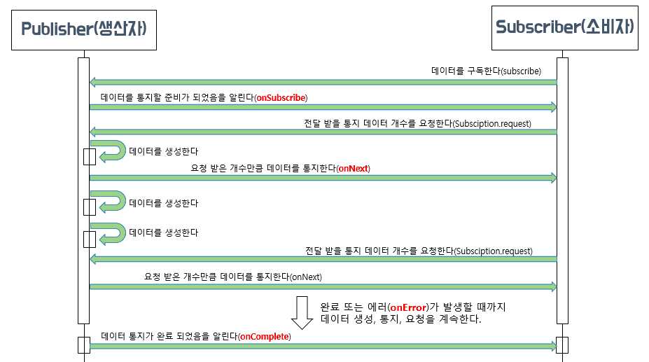

# 스프링으로 시작하는 리액티브 프로그래밍
## Chapter 02. 리액티브 스트림즈(Reactive Streams)
> Chatper 2에서는 리액티브 스트림즈가 무엇인지 살펴보고, 리액티브 스트림즈의 핵심 컴포넌트인 Publisher 와 Subscriber 의 동작 과정을 자세히 알아보자.
### 2.1. 리액티브 스트림즈(Reactive Streams)란?
- 리액티브 라이브러리를 어떻게 구현할지 정의해 놓은 별도의 표준 사양을 **리액티브 스트림즈**라고 부른다.
- 리액티브 스트림즈는 한마디로 **'데이터 스트림을 Non-Blocking 이면서 비동기적인 방식으로 처리하기 위한 리액티브 라이브러리의 표준 사양'** 이라고 표현한다.

### 2.2. 리액티브 스트림즈 구성요소
| 컴포넌트         | 설명                                                                                                                         |
|--------------|----------------------------------------------------------------------------------------------------------------------------|
| Publisher    | 데이터를 생성하고 통지(발행, 게시, 방출)하는 역할을 한다.                                                                                         |
| Subscriber   | 구독한 Publisher 로부터 통지(발행, 게시, 방출)된 데이터를 전달받아서 처리하는 역할을 한다.                                                                  |
| Subscription | Publisher 에 요청할 데이터의 개수를 지정하고, 데이터의 구독을 취소하는 역할을 한다.                                                                       |
| Processor    | Publisher 와 Subscriber 의 기능을 모두 가지고 있다. 즉, Subscriber 로서 다른 Publisher 를 구독 할 수도 있고, Publisher 로서 다른 Subscriber 가 구독할 수 있다. |

- 리액티브 스트림즈의 컴포넌트인 Publisher 와 Subscriber 간에 데이터가 전달되는 동작 과정을 그림으로 표현한 것이다.
  1. 먼저 Subscriber 는 전달받을 데이터를 구독한다.(**Subscribe**)
  2. 다음으로 Publisher 는 데이터를 통지(발행, 게시, 방출)할 준비가 되었음을 Subscriber 에 알린다.(**onSubscribe**)
  3. Publisher 가 데이터를 통지할 준비가 되었다는 알림을 받은 Subscriber 는 전달받기를 원하는 데이터의 개수를 Publisher 에게 요청한다.(**Subscription.request**)
  4. 다음으로 Publisher 는 Subscriber 로부터 요청받은 만큼의 데이터를 통지한다.(**onNext**)
  5. 이렇게 Publisher 와 Subscriber 간에 데이터 통지, 데이터 수신, 데이터 요청의 과정을 반복하다가 Publisher 가 모든 데이터를 통지하게 되면 마지막으로 데이터 전송이 완료되었음을 Subscriber 에게 알린다.(**onComplete**) 만약에 Publisher 가 데이터를 처리하는 과정에서 에러가 발생하면 에러가 발생했음을 Subscriber 에게 알린다.(**onError**)
- Q : Subscriber 가 Subscription.request 를 통해 왜 굳이 데이터의 요청 개수를 지정할까?
- A : 그림상으로 Publisher 와 Subscriber 가 마치 같은 스레드에서 동기적으로 상호작용하는 것처러 보이지만 실제로 Publisher 와 Subscriber 는 각각 다른 스레드에서 비동기적으로 상호작용하는 경우가 대부분이다. 
  - 이럴 경우 **Publisher 가 통지하는 속도가 Publisher 로부터 통지된 데이터를 Subscriber 가 처리하는 속도보다 더 빠르면 처리를 기다리는 데이터는 쌓이게 되고, 이는 결과적으로 시스템 부하가 커지는 결과를 낳는다.**
  - 이러한 문제를 방지하기 위해 Subscription.request 를 통해 데이터 개수를 제어하는 것이다.

### 2.3. 코드로 보는 리액티브 스트림즈 컴포넌트
- 리액티브 스트림즈의 컴포넌트는 실제 코드에서 인터페이스 형태로 정의되며, 이 인터페이스들을 구현해서 해당 컴포넌트를 사용하게 된다.
#### 2.3.1. Publisher
```java
public interface Publisher<T> {
    public void subscribe(Subscriber<? super T> s);
}
```
- Publisher 인터페이스 코드인데, 코드 형태는 subscribe 메서드 하나만 구현하면 되는 수준으로 매우 단순하다.
  - subscribe 메서드는 파라미터로 전달받은 Subscriber 를 등록하는 역할을 한다.
- 그런데 Publisher 인터페이스 코드를 보면서 다음과 같은 의문이 들 수 있다.
- Q: 'Publisher 는 데이터를 생성하고 통지하는 역할을 하고, Subscriber 는 Publisher 가 통지하는 데이터를 전달받기 위해 구독을 한다고 이해하고 있는데, 왜 Subscriber 가 아닌 Publisher 에 Subscribe 메서드가 정의되어 있을까?'
- A : Kafka 같은 메시지 기반의 시스템에서 Pub/Sub 모델을 이해하고 있는 분이라며, 아마도 이런 의문이 드는것이 당연하다.
  - 리엑티브 스트림즈에서의 Publisher/Subscriber 와 Kafka 에서의 Publisher/Subscriber 는 의미가 조금 다르다.
  - Kafka 의 경우 Publisher 와 Subscriber 중간에 메시지 브로커(Message Broker)가 있고 이 브로커 내에 여러 개의 토픽(Topic)이 존재하는데, Publisher 와 Subscriber 는 브로커에 있는 특정 토픽을 바라본느 구조로 이루어져 있다.
    - 그래서 Kafka 에서의 Publisher 와 Subscriber 는 각각 브로커 내의 특정 토픽만 바라보면 되기 때문에 Publisher 는 특정 토픽으로 메시지 데이터를 전송하기만 하면 되고, Subscriber 는 특정 토픽을 구독하고 해당 토픽에 전달되는 메시지 데이터를 전달받기만 하면 된다.
    - 이는 Publisher 와 Subscriber 의 느슨한 결합 구조라고 볼 수 있다.
  - 반면의 리액티프 스트림즈에서의 Publisher 와 Subscriber 는 개념상으로는 Subscriber 가 구독하는것이 맞는데 실제 코드상에서 Publisher 가 subscribe 메서드를의 파라미터인 Subscriber 를 등록하는 형태로 구독이 이루어진다.
#### 2.3.2. Subscriber
```java
public interface Subscriber<T> {
    public void onSubscribe(Subscription s);
    public void onNext(T t);
    public void onError(Throwable t);
    public void onComplete();
}
```
- Subscriber 인터페이스 코드이다. Subscriber 인터페이스는 총 네 개의 메서드를 구현해야 한다.
  - **onSubscribe** 메서드는 구독 시작 시점에 어떤 처리를 하는 역할을 한다.
    - 여기서의 처리는 Publisher 에게 요청할 데이터의 개수를 지정하거나 구독을 해지하는 것을 의미하는데, 이것은 onSubscribe 메서드의 파라미터로 전달되는 Subscription 객체를 통해서 이루어진다.
  - **onNext** 메서드는 Publisher 가 통지한 데이터를 처리하는 역할을 한다.
  - **onError** 메서드는 Publisher 가 데이터 통지를 위한 처리 과정에서 에러가 발생했을 때 해당 에러를 처리하는 역할을 한다.
  - **onComplete** 메서드는 Publisher 가 데이터 통지를 완료했음을 알릴 때 호출되는 메서드이다.
    - 데이터 통지가 정상적으로 완료될 경우에 어떤 후처리를 해야 한다면 onComplete 메서드에서 처리 코드를 작성하면 된다.
#### 2.3.3. Subscription
```java
public interface Subscription {
    public void request(long n);
    public void cancel();
}
```
- Subscription 인터페이스는 Subscriber 가 구독한 데이터의 개수를 요청하거나 또는 데이터 요청의 취소, 즉 구독을 해지하는 역할을 한다.
- Subscription 인터페이스는 두 개의 메서드를 구현해야 한다.
  - Request 메서드를 통해서 Publisher 에게 데이터의 개수를 요청할 수 있고, cancel 메서드를 통해서 구독을 해지할 수 있다.
> 정리
> - Publisher 와 Subscriber 의 동작 과정을 리액티브 스트림즈의 컴포넌트 코드 관점에서 설명
>   - Publisher 가 Subscriber 인터페이스 구현 객체를 subscribe 메서드의 파리미터로 전달한다.
>   - Publisher 내부에서는 전달받은 Subscriber 인터페이스 구현 객체의 onSubscribe 메서드를 호출하면서 Subscriber 의 구독을 의미하는 Subscription 인터페이스 구현 객체를 Subscriber 에게 전달한다.
>   - 호출된 Subscriber 인터페이스 구현 객체의 onSubscribe 메서드에서 전달 받은 Subscription 객체를 통해 전달받을 데이터의 개수를 Publisher 에게 요청한다.
>   - Publisher 는 Subscriber 로부터 전달받은 요청 개수만큼의 데이터를 onNext 메서드를 호출해서 Subscriber 에게 전달한다.
>   - Publisher 는 통지할 데이터가 더 이상 없을 경우 onComplete 메서드를 호출해서 Subscriber 에게 데이터 처리 종료를 알린다.

#### 2.3.4. Processor
```java
public interface Processor<T, R> extends Subscriber<T>, Publisher<R> {
}
```
- 다른 인터페이스들과 다른 점은 Subscriber 인터페이스와 Publisher 인터페이스를 상속한다는 것이다.
  - Processor 가 Publisher 와 Subscriber 의 기능을 모두 가지고 있기 때문이다.