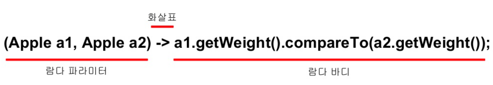
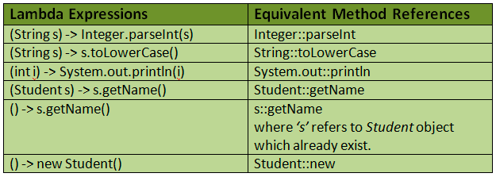

# Part01. 리액티브 프로그래밍(Reactive Programming)
## Chapter04. 리액티브 프로그래밍을 위한 사전 지식
> - 리액티브 프로그래밍을 잘 사용하기 위해서 기본적으로 알아야 하는 최소한의 사전 지식이 함수형 프로그래밍 기법이다.
>   - Java 8 이전까지는 함수형 프로그래밍이라는 개념이 없었으나, Java 8에 람다 표현식이 도입됨으로써 Java 에서도 함수형 프로그래밍 기법을 사용할 수 있게 되었다.
>   - 더 정확히 얘기하자면 함수형 인터페이스를 이용해서 함수형 프로그래밍과 같은 효과를 낼 수 있게 되었다.
### 4.1. 함수형 인터페이스(Functional Interface)
- Java 에서 인터페이스는 명세 또는 사양이라고 표현할 수 있다.
  - 리액티브 스트림즈에서 정의해 놓은 네 개의 인터페이스 처럼, Java 의 인터페이스는 몸체가 없는 추상 메서드로만 이루어져 있다.
  - 물론 Java 8 부터 지원하는 default 메서드는 예외이다.
  - 아무튼 이 인터페이스를 사용하기 위해서는 해당 인터페이스에 정의된 메서드들을 구현하는 구현 클래스가 필요하다.
> - Q : Java 8 부터 지원하는 함수형 인터페이스란 무엇일까?
> - 함수형 인터페이스 역시 인터페이스이다.
>   - 다만 기존 인터페이스에 비해 함수형 인터페이스는 단 하나의 추상 메서드만 정의되어 있다.
>   - 그렇다면 왜 그냥 인터페이스라고 부르지 않고 굳이 함수형 인터페이스라고 부를까?
>     - 함수형 프로그래밍 세계에서 함수를 일급 시민으로 취급한다.
>     - 여기서 말하는 입급 시민이란 함수를 값으로 취급한다는 의미를 조금 더 고급스럽게 표현한 것인데, 함수를 값으로 취급하기 때문에 어떤 함수를 호출할 때 함수 자체를 파라미터로 전달할 수 있다.
>   - Java 에서도 이렇게 함수를 값으로 취급할 수 있는 기능이 Java 8 부터 추가되었는데, 그것이 바로 함수형 인터페이스이다.
```java
import java.util.Collections;
import java.util.Comparator;
import java.util.List;

/**
 * 기존에 사용되던 단 하나의 추상 메서드를 가지는 인터페이스 예제
 */
public class Example4_1 {
    public static void main(String[] args) {
        List<CryptoCurrency> cryptoCurrencies = SampleData.cryptoCurrencies;

        Collections.sort(cryptoCurrencies, new Comparator<CryptoCurrency>() {
            @Override
            public int compare(CryptoCurrency cc1, CryptoCurrency cc2) {
                return cc1.getUnit().name().compareTo(cc2.getUnit().name());
            }
        });

        for(CryptoCurrency cryptoCurrency : cryptoCurrencies)
            System.out.println("암호 화폐명: " + cryptoCurrency.getName() +
                    ", 가격: " + cryptoCurrency.getUnit());
    }
}
```
- Comparator 인터페이스는 Java 1.2 버전부터 많이 사용해 오던 인터페이스인데, 이 Comparator 인터페이스가 바로 compare() 라는 단 하나의 추상 메서드를 가지는 인터페이스, 바로 함수형 인터페이스가 되는 것이다.
```java
@FunctionalInterface
public interface Comparator<T> {
    int compare(T o1, T o2);
    ...
    default Comparator<T> reversed() {
        return Collections.reverseOrder(this);
    }
    
    default Comparator<T> thenComparing(Comparator<? super T> other) {
        Objects.requireNonNull(other);
        return (Comparator<T>) & Serializable) (c1, c2) -> {
            int res = compare(c1, c2);
            return (res != 0) ? res : other.compare(c1, c2);
        }
    }
    ...
}
```
- Comparator 내부에는 compare()라는 단 한나의 추상 메서드가 정의된 것이 보인다.
- compare() 외에 reversed(), thenComparing() 같은 메서드들이 보이는데 이 메서드들은 Java 8 부터 지원하는 이미 구현된 default 메서드이기 때문에, 추상 메서드는 하나만 정의되어 있으므로 함수형 인터페이스가 맞다.
  - @FunctionalInterface 애너테이션을 추가해서 이 인터페이스는 함수형 인터페이스라고 아예 명시적으로 지정해 둔 것을 볼 수 있다.
- 그리고 인터페이스 자체를 익명 구현 객체로 전달받는 방식은 코드 자체가 길어져서 지저분하게 보이기도 한다.
  - 그래서 Java 8 버전부터 기존에 이미 사용하던 인터페이스의 익명 구현 객체를 전달하던 방식을 조금 더 함수형 프로그래밍 방식에 맞게 표현할 수 있는 방법을 추가했는데 그것이 **람다 표현식(Lambda Expression)** 이다.
### 4.2. 람다 표현식(Lambda Expression)
- Javascript 나 Scala 같은 언어에서는 이미 함수가 값으로 취급되어 어떤 함수 호출 시 파라미터로 전달할 수 있다.
  - 그런데 이렇게 함수를 값으로 전달할 수 있는 언어에서는 함수를 조금 더 간결한 표현으로 전달하는 방법이 있다.
  - ```javascript
    const CryptoCurrencyUtils = [
        'BTC',
        'ETH',
        'DOT',
        'ADA',
        'SOL'
    ];
    
    console.log(CryptoCurrencyUtils.map(unit => unit.length));
    ```
    - Javascript 에서는 화살표로 표현하는 함수를 화살표 함수(Arrow Function)라고 부른다.
    - Java 에서도 인터페이스의 익명 구현 클래스를 화살표 함수처럼 간결하게 표현하는 방법을 Java 8 부터 지원하는데, 이것이 람다 표현식이다.


- 람다 표현식은 단 하나의 추상 메서드를 가지는 인터페이스, 즉 함수형 인터페이스를 구현한 클래스의 메서드 구현을 단순화한 표현식이다.
- 따라서 함수형 인터페이스의 메서드를 람다 표현식으로 작성해서 다른 메서드의 파라미터로 전달할 수 있다.
- 위 그림과 같이 람다 표현식은 가운데 화살표를 기준으로 좌측의 람다 파라미터와 우측의 람다 몸체로 구성된다.
  - 그리고 람다 몸체는 이 추상 메서드에서 구현되는 메서드 몸체를 의미한다.
  - 우리가 일반적으로 알고 있는 메서드의 문법처럼 람다 몸체에서 람다 파라미터로 전달받은 값들을 사용하게 된다.
> 함수형 인터페이스의 추상 메서드를 람다 표현식으로 작성해서 메서드의 파라미터로 전달한다는 의미는 메서드 자체를 파라미러도 전달하는 것이 아니라 **함수형 인터페이스를 구현한 클래스의 인스턴스를 람다 표현식으로 작성해서 전달한다**는 것이다.
##### 람다 캡처링
- 람다 표현식 외부에서 정의된 자유 변수를 람다 표현식에 사용하는 것을 **람다 캡쳐링(Lambda Capturing)** 이라고 한다.
```java
import java.util.List;

import static com.itvillage.CryptoCurrency.CurrencyUnit;

/**
 * 람다 캡처링 예제
 */
public class Example4_5 {
    public static void main(String[] args) {
        List<CryptoCurrency> cryptoCurrencies = SampleData.cryptoCurrencies;

        String korBTC = "비트코인";
//        korBTC = "빗코인";
        cryptoCurrencies.stream()
                .filter(cc -> cc.getUnit() == CurrencyUnit.BTC)
                .map(cc -> cc.getName() + "(" + korBTC + ")" )
                .forEach(cc -> System.out.println(cc));
    }
}
```
- 6번 라인의 주석을 해제하고 코드를 실행하면 오류가 발생한다.
  - 그 이유는 람다 표현식에서 사용되는 자유 변수는 final 또는 final 같은 효력을 지녀야 하는데, 6번 라인의 주석을 해제하면 final 의 효력을 잃기 때문이다.

### 4.3. 메서드 레퍼런스(Method Reference)
- 우리말로 해석해보면 메서드 참조 정도이다.
  - 여기서 말하는 메서드는 람다 표현식의 몸체에 기술되는 메서드를 의미하여 메서드의 이름만 사용하여 메서드 레퍼런스를 표현한다.


> **메서드 레퍼런스를 표현하기 위해서는 구분자(::)를 사용한다.** <br/>
> 이미지 출처 : https://javaconceptoftheday.com/java-8-method-references/ 
- **ClassName : : static method 유형** 
  - 메서드 레퍼런스로 표현할 수 있는 가장 흔한 유형은 클래스의 static 메서드이다.
  ```java 
  import org.apache.commons.lang3.StringUtils;
  import java.util.List;
  
  /**
   * ClassName :: static method 형태의 메서드 레퍼런스 예제
   */
  public class Example4_6 {
    public static void main(String[] args) {
      List<CryptoCurrency> cryptoCurrencies = SampleData.cryptoCurrencies;
  
      cryptoCurrencies.stream()
              .map(cc -> cc.getName())
  //                .map(name -> StringUtils.upperCase(name))
              .map(StringUtils::upperCase)
              .forEach(name -> System.out.println(name));
    }
  }
  ```
  - `.map(StringUtils::upperCase)`에 메서드 레퍼런스가 사용되었다.
  - `.map(StringUtils::upperCase)`과 위의 주석 처리된 라인과 같다.
    - 컴파일러가 내부적으로 람다 표현식의 파라미터 형식을 추론할 수 있기 때문에 람다 파라미터와 upperCase 메서드의 파라미터 부분을 생략할 수 있게 된다.
- **ClassName : : instance method 유형** 
  - 메서드 레퍼런스로 표현할 수 있는 두 번째 유형은 클래스에 정의된 인스턴스 메서드이다.
  ```java
  import java.util.List;
  
  /**
   * ClassName :: instance method 형태의 메서드 레퍼런스 예제
   */
  public class Example4_7 {
      public static void main(String[] args) {
          List<CryptoCurrency> cryptoCurrencies = SampleData.cryptoCurrencies;
  
          cryptoCurrencies.stream()
                  .map(cc -> cc.getName())
  //                .map(name -> name.toUpperCase())
                  .map(String::toUpperCase)
                  .forEach(name -> System.out.println(name));
      }
  }
  ```
- **object : : instance method 유형**
  - 람다 표현식 외부에서 정의된 객체의 메서드를 호출할 때 사용된다.
  ```java
  import org.apache.commons.lang3.tuple.ImmutablePair;
  
  import java.util.List;
  
  import static com.itvillage.CryptoCurrency.CurrencyUnit;
  
  /**
   * object :: instance method 형태의 메서드 레퍼런스 예제
   */
  public class Example4_8 {
      public static void main(String[] args) {
          List<CryptoCurrency> cryptoCurrencies = SampleData.cryptoCurrencies;
          int btcPrice = cryptoCurrencies.stream()
                  .filter(cc -> cc.getUnit() == CurrencyUnit.BTC)
                  .findFirst()
                  .get()
                  .getPrice();
  
          int amount = 2;
  
          PaymentCalculator calculator = new PaymentCalculator();
          cryptoCurrencies.stream()
                  .filter(cc -> cc.getUnit() == CurrencyUnit.BTC)
                  .map(cc -> new ImmutablePair(cc.getPrice(), amount))
  //                .map(pair -> calculator.getTotalPayment(pair))
                  .map(calculator::getTotalPayment)
                  .forEach(System.out::println);
      }
  }
  ```
- **ClassName : : new 유형**
  - 메서드 레퍼런스로 표현할 수 있는 네 번째 유형은 바로 생성자이다.
    - 람다 표현식 내부에서 어떤 클래스의 생성자를 사용해야 될 경우, 람다 표현식에서 형식 추론이 가능해지면 ClassName::new 와 같이 축약할 수 있다.
  ```java
  import org.apache.commons.lang3.tuple.ImmutablePair;
  
  import java.util.List;
  import java.util.Optional;
  
  import static com.itvillage.CryptoCurrency.CurrencyUnit;
  
  /**
   * ClassName :: new 형태의 메서드 레퍼런스 예제
   */
  public class Example4_9 {
      public static void main(String[] args) {
          List<CryptoCurrency> cryptoCurrencies = SampleData.cryptoCurrencies;
  
          int amount = 2;
  
          Optional<PaymentCalculator> optional =
                  cryptoCurrencies.stream()
                                  .filter(cc -> cc.getUnit() == CurrencyUnit.BTC)
                                  .map(cc -> new ImmutablePair(cc.getPrice(), amount))
  //                                            .map(pair -> new PaymentCalculator(pair))
                                  .map(PaymentCalculator::new)
                                  .findFirst();
  
          System.out.println(optional.get().getTotalPayment());
      }
  }
  ```
### 4.4. 함수 디스크립터(Function Descriptor)
- 리액티브 프로그래밍 학습을 본격적으로 진행하다 보면 람다 표현식의 파라미터 개수나 파리미터 타입, 리턴 타입 등을 보면서 이 람다 표현식이 Java 에서 지원하는 어떤 함수형 인터페이스에 해당되는지 알아야 할 때가 있다.
- 함수 디스크립터(Function Descriptor)는 함수 서술자, 함수 설명자 정도로 이해할 수 있는데, 실제로는 일반화된 람다 표현식을 통해서 이 함수형 인터페이스가 어떤 파라미터를 가지고, 어떤 값을 리턴하는지 설명해 주는 역할은 한다.

| 함수형 인터페이스(Functional Interface) | 함수 디스크립터(Function Descriptor) |
|---------------------------------|-------------------------------|
| Predicate<T>                    | T -> boolean                  |
| Consumer<T>                     | T -> void                     |
| Function<T, R>                  | T -> R                        |
| Supplier<T>                     | () -> T                       |
| BiPredicate<L, R>               | (L, R) -> boolean             |
| BiConsumer<T, U>                | (T, U) -> void                |
| BiFunction<T, U, R>             | (T, U) -> R                   |
- 함수형 인터페이스에 대한 개념을 설명하면서 기존에 이미 정의된 단 하나의 메서드를 구현햐야 하는 인터페이스에 대해서만 설명했는데, Java 8 부터 함수형 인터페이스를 지원하게 되면서 새롭게 정의된 함수형 인터페이스들이 추가 되었다.
- **Predicate**
  - Java 에서는 함수형 인터페이스 중에서 구현해야 되는 추상 메서드가 하나의 파라미터를 가지고, 리턴 값으로 boolean 타입의 값을 반환하는 함수형 인터페이스를 Predicate 이라고 정의했다.
  ```java
  @FunctionalInterface
  public interface Predicate<T> {
      boolean test(T t);
      ...
  }
  ```
  - 보이는 것처럼 test()라는 하나의 메서드를 구현해야 되는데 이 test() 메서드는 파라미터가 T 타입이고, boolean 값을 리턴한다.
    - Predicate 을 가장 흔하게 볼 수 있는 코드는 바로 아래 예제 코드의 스틤의 filter 메서드이다.
      - filter 메서드는 파라미터로 Predicate 을 가지며 filter 메서드 내부에서 이 Predicate 을 사용하여 test 메서드의 리턴 값이 true 인 데이터만 필터링하게 된다.
  ```java
  import java.util.ArrayList;
  import java.util.List;
  import java.util.function.Predicate;
  
  /**
   * Predicate 사용 예제
   */
  public class Example4_11 {
      public static void main(String[] args) {
          List<CryptoCurrency> cryptoCurrencies = SampleData.cryptoCurrencies;
          List<CryptoCurrency> result = filter(cryptoCurrencies, cc -> cc.getPrice() > 500_000);
  
          for (CryptoCurrency cc : result) {
              System.out.println(cc.getName());
          }
      }
  
      private static List<CryptoCurrency> filter(List<CryptoCurrency> cryptoCurrencies,
                                                 Predicate<CryptoCurrency> p){
          List<CryptoCurrency> result = new ArrayList<>();
          for (CryptoCurrency cc : cryptoCurrencies) {
              if (p.test(cc)) {
                  result.add(cc);
              }
          }
          return result;
      }
  }
  ```
  - filter() 메서드의 역할은 첫 번째 매개 변수로 전달받은 암호 화폐 목록에서 특정 조건에 해당되는 암호 화폐만 필터링 해주는 것이다.
  - filter() 메서드의 두 번째 매개 변수로 Predicate 객체를 전달받고 있는데 , 이 Predicate 을 통해서 특정 조건을 설정할 수 있고 이 특정 조건은 바로 람다 표현식으로 전달된다.
    - 그리고 Predicate 의 test() 메서드에 이 람다 표현식을 전달해서 해당 조건에 맞는지를 true/false 로 리턴하게 되는데, Predicate 을 사용하는 영역에서는 이 결과 값으로 데이터를 필터링하게 되는 것이다.
- **Consumer**
  - Consumer 함수형 인터페이스는 단어의 의미처럼 데이터를 소비하는 역할을 한다.
    - 데이터를 소비한다는 의미는 리턴 값이 없다는 의미와 같다.
  ```java
  @FunctionalInterface
  public interface Consumer<T> {
      void accept(T t);
      ...
  }
  ```
  - Consumer 는 accept()라는 하나의 메서드를 구현해야 되는데, accept() 메서드는 파라미터가 T 타입이고 리턴하는 값은 없다.
    - **Consumer 는 전달받은 데이터로 어떤 처리를 하지만 결과 값을 반환할 필요가 없을 경우에 사용할 수 있다.**
  - Consumer 를 사용하기 좋은 대표적인 예로, 일정 주기별로 특정 작업을 수행한 후, 결과 값을 리턴할 필요가 없는 경우가 대부분인 배치 처리를 들 수 있다.
  ```java
  import java.util.ArrayList;
  import java.util.List;
  import java.util.function.Consumer;
  import java.util.function.Predicate;
  
  /**
   * Consumer 사용 예제
   */
  public class Example4_13 {
      public static void main(String[] args) {
          List<CryptoCurrency> cryptoCurrencies = SampleData.cryptoCurrencies;
          List<CryptoCurrency> filtered =
                  filter(cryptoCurrencies,
                          cc -> cc.getUnit() == CryptoCurrency.CurrencyUnit.BTC ||
                          cc.getUnit() == CryptoCurrency.CurrencyUnit.ETH);
  
          addBookmark(filtered, cc -> saveBookmark(cc));
      }
  
      private static List<CryptoCurrency> filter(List<CryptoCurrency> cryptoCurrencies,
                                                 Predicate<CryptoCurrency> p){
          List<CryptoCurrency> result = new ArrayList<>();
          for (CryptoCurrency cc : cryptoCurrencies) {
              if (p.test(cc)) {
                  result.add(cc);
              }
          }
          return result;
      }
  
      private static void addBookmark(List<CryptoCurrency> cryptoCurrencies,
                                      Consumer<CryptoCurrency> consumer) {
          for (CryptoCurrency cc : cryptoCurrencies) {
              consumer.accept(cc);
          }
      }
  
      private static void saveBookmark(CryptoCurrency cryptoCurrency) {
          System.out.println("# Save " + cryptoCurrency.getUnit());
      }
  }
  ```
  - 즐겨찾기 추가 기능은 상황에 따라 리턴 값이 필요할 수도 있겠지만, 예제 코드에서는 리턴 값이 필요 없다고 가정했기 떄문에 Consumer 사용이 적절하다.
- **Function**
  - Function 함수형 인터페이스는 구현해야 되는 추상 메서드가 하나의 파라미터(T 타입)를 가지며, 리턴 값으로 R 타입의 값을 반환한다.
  ```java
  @FunctionalInterface
  public interface Function<T, R> {
      R apply(T t);
      ...
  }
  ```
  - apply 메서드는 파라미터가 T 타입이고, 리턴 타입이 R 타입인 값을 반환한다.
  - Function 함수형 인터페이스는 함수 내에서 어떤 처리 과정을 거친 후에 그 결과로 특정 타입의 값을 반환하는 전형적인 함수 역할
  ```java
  import java.util.ArrayList;
  import java.util.List;
  import java.util.function.Function;
  import java.util.function.Predicate;
  import java.util.function.Supplier;
  
  /**
   * Function 사용 예제
   */
  public class Example4_15 {
      public static void main(String[] args) {
          List<CryptoCurrency> cryptoCurrencies = SampleData.cryptoCurrencies;
          List<CryptoCurrency> filtered =
                  filter(cryptoCurrencies,
                          cc -> cc.getUnit() == CryptoCurrency.CurrencyUnit.BTC ||
                          cc.getUnit() == CryptoCurrency.CurrencyUnit.ETH);
  
          int totalPayment = calculatePayment(filtered, cc -> cc.getPrice() * 2);
  
          System.out.println("# 구매 비용: " + totalPayment);
      }
  
      private static List<CryptoCurrency> filter(List<CryptoCurrency> cryptoCurrencies,
                                                 Predicate<CryptoCurrency> p) {
          List<CryptoCurrency> result = new ArrayList<>();
          for (CryptoCurrency cc : cryptoCurrencies) {
              if (p.test(cc)) {
                  result.add(cc);
              }
          }
          return result;
      }
  
      private static int calculatePayment(List<CryptoCurrency> cryptoCurrencies,
                                          Function<CryptoCurrency, Integer> f) {
          int totalPayment = 0;
          for (CryptoCurrency cc : cryptoCurrencies) {
              totalPayment += f.apply(cc);
          }
          Supplier s = () -> "";
          return totalPayment;
      }
  }
  ```
  - 
- **Supplier**
  - 추상 메서드가 파라미터를 갖지 않으며 리턴 값으로 T 타입의 값만 반환한다.
  ```java
  @FunctionalInterface
  public interface Supplier<T> {
      T get();
      ...
  }
  ```
  - Supplier 는 get 이라는 하나의 메서드를 구현해야 되는데, 보이는 것처럼 get 메서드는 파라미터가 없으며, 리턴 타입이 T 타입인 값을 반환한다. 
  - Supplier 는 이름 그대로 어떤 값이 필요할 때 데이터를 제공하는 용도로 사용할 수 있다.
  ```java
  import java.util.Arrays;
  import java.util.Collections;
  import java.util.List;
  import java.util.stream.Collectors;
  import java.util.stream.Stream;
  
  /**
   * Supplier 사용 예제
   */
  public class Example4_17 {
      public static void main(String[] args) {
          String mnemonic = createMnemonic();
          System.out.println(mnemonic);
      }
  
  
      private static String createMnemonic() {
          return Stream
                  .generate(() -> getMnemonic())
                  .limit(12)
                  .collect(Collectors.joining(" "));
      }
  
      private static String getMnemonic() {
          List<String> mnemonic = Arrays.asList(
                      "alpha", "bravo", "charlie",
                      "delta", "echo", "foxtrot",
                      "golf", "hotel", "india",
                      "juliet", "kilo", "lima",
                      "mike", "november", "oscar",
                      "papa", "quebec", "romeo",
                      "sierra", "tango", "uniform",
                      "victor", "whiskey", "xray",
                      "yankee", "zulu"
                  );
          Collections.shuffle(mnemonic);
          return mnemonic.get(0);
      }
  }
  ```
  - Supplier 함수형 인터페이스를 사용하는 10번 라인이 핵심이다.
    - 10번 라인에서는 Java 스트림의 generate() 메서드를 사용해서 데이터를 계속적으로 생성하게 되는데, 이때 generate() 메서드의 파라미터인 Supplier 를 통해서 데이터를 제공한다.
  - 즉, 어떤 데이터를 제공할지에 대한 동작을 정의하는 것이다.
    - generate() 메서드는 무한 스트림을 발생시키기 때문에 12개의 니모닉 워드를 생성하기 위해 limit 메서드를 통해서 니모닉 워드의 수를 12개로 제한한다.
- **Bixxxxx**
  - BiPredicate, BiConsumer, BiFunction 과 같이 Bi 로 시작하는 함수형 인터페이스는 함수형 인터페이스에서 구현해야 하는 추상 메서드에 전달하는 파라미터가 하나 더 추가되어 두 개의 파라미터를 가지는 함수형 인터페이스인데, Java 에서 지원하는 기본 함수형 인터페이스의 확장형이라 보면 된다.
> #### 정리하기
> - 함수형 인터페이스는 Java 에서 함수형 프로그래밍 방식을 지원하기 위해 Java 8부터 지원하는 인터페이스 이다.
> - 함수형 인터페이스는 단 하나의 추상 메서드를 가진다.
> - 람다 표현식은 함수형 인터페이스에 정의된 추상 메서드를 표현식으로 구현한 것이다.
> - 메서드 레퍼런스를 통해 람다 표현식을 조금 더 간결하게 표현할 수 있다.
> - 함수 디스크립터를 통해 함수형 인터페이스의 파라미터 형식과 리턴 값의 형태를 알 수 있다.