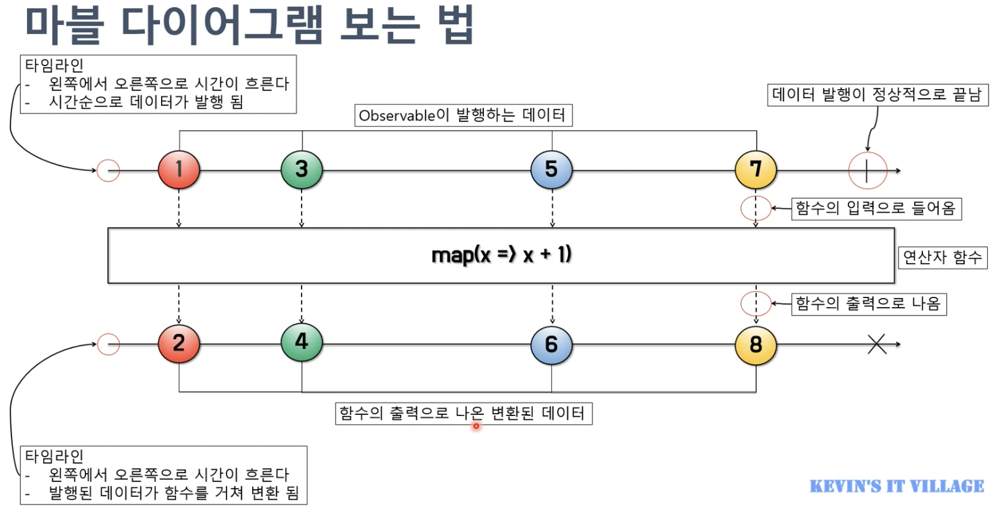

# Part02. Project Reactor
## Chapter06. 마블 다이어그램(Marble Diagram)
> - Chapter 6에서는 마블 다이어그램이 무엇인지 살펴보고 마블 다이어그램을 통해 Reactor의 Publisher와 Operator를 이해해보자.
### 6.1. 마블 다이어그램(Marble Diagram)이란?
- 마블은 우리말로 구슬이라는 의미가 있고, 다이어그램은 여러 가지 도형들로 그려진 도표를 뜻한다.
  - 즉, 마블 다이어그램은 여러 가지 구슬 모양의 도형으로 구성된 도표로(실제로는 구슬 모양 이외의 다양한 도형들이 사용된다.)
  - Reactor 에서 지원하는 Operator 를 이해하는데 중요한 역할은 한다.

