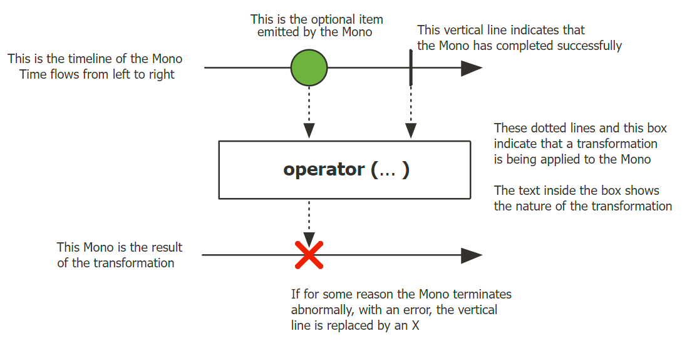
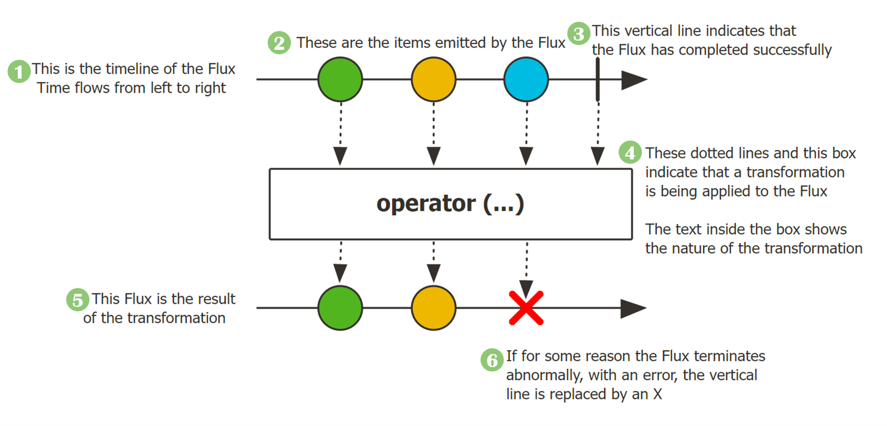
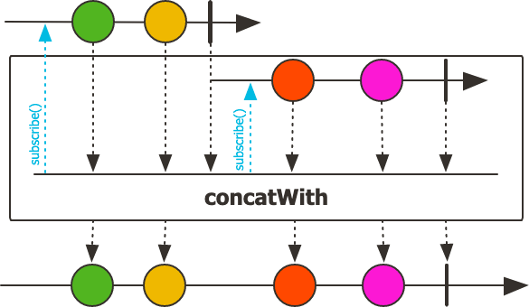

# Part02. Project Reactor
## Chapter06. 마블 다이어그램(Marble Diagram)
> - Chapter 6에서는 마블 다이어그램이 무엇인지 살펴보고 마블 다이어그램을 통해 Reactor의 Publisher와 Operator를 이해해보자.
### 6.1. 마블 다이어그램(Marble Diagram)이란?
- 마블은 우리말로 구슬이라는 의미가 있고, 다이어그램은 여러 가지 도형들로 그려진 도표를 뜻한다.
  - 즉, 마블 다이어그램은 여러 가지 구슬 모양의 도형으로 구성된 도표로(실제로는 구슬 모양 이외의 다양한 도형들이 사용된다.)
  - Reactor 에서 지원하는 Operator 를 이해하는데 중요한 역할은 한다.


- 마블 다이어그램은 구슬 모양의 도형을 사용하는 도표라고 이야기하는 대신에 비동기적인 데이터 흐름을 시간의 흐름에 따라 시각적으로 표시한 다이어그램이다.

### 6.2. 마블다이어그램으로 Reactor의 Publisher 이해하기
#### 6.2.1. Mono

- Mono 는 단 하나의 데이터를 emit 하는 Publisher 이기 때문에 위 그림에서도 단 하나의 데이터만 표현한다.
  - 마블 다이어그램상에서는 잘 표현되지 않았지만, 정확히 말하자만 Mono 는 0개 또는 1개의 데이터를 emit 하는 Publisher 이다.
  - 따라서 3이라고 적혀 있는 구슬 데이터가 emit 되지 않고 onComplete signal 만 전송될 수 있다.
- Reactor 의 Mono 가 RxJava 의 Maybe 와 같은 기능을 한다.
  - RxJava 에서는 데이터를 한 건만 emit 하는 Single 이라는 Publisher 타입과 데이터를 0건 또는 1건만 emit 하는 Maybe 라는 Publisher 타입이 함께 지원되기 때문에 사용성에 있어 조금 헷갈리는 측면이 있다.
  - 반면에 RxJava 와 달리 Reactor 에서는 1건 또는 1건의 데이터를 emit 하기 위해서는 Mono 하나만 사용하면 되도록 단순화되었다는 사실을 기억해 두면 좋다.
```java
import reactor.core.publisher.Mono;

/**
 * Mono 기본 개념 예제
 *  - 1개의 데이터를 생성해서 emit한다.
 */
public class Example6_1 {
  public static void main(String[] args) {
    Mono.just("Hello Reactor")
            .subscribe(System.out::println);
  }
}
```
- "Hello Reactor"를 출력하는 예제이다.
- just() Operator 는 한 개 이상의 데이터를 emit 하기 위한 대표적인 Operator 로서 2개 이상의 데이터를 파라미터로 전달할 경우, 내부적으로 fromArray() Operator 를 이용해서 데이터를 emit 한다.
#### 실행결과
> Hello Reactor

```java
import reactor.core.publisher.Mono;

/**
 * Mono 기본 개념 예제
 *  - 원본 데이터의 emit 없이 onComplete signal 만 emit 한다.
 */
public class Example6_2 {
    public static void main(String[] args) {
        Mono
            .empty()
            .subscribe(
                    none -> System.out.println("# emitted onNext signal"),
                    error -> {},
                    () -> System.out.println("# emitted onComplete signal")
            );
    }
}
```
- 데이터를 0건, 즉 데이터를 한 건도 emit 하지 않은 예제 코드이다.
  - 4번 라인에서 empty() Operator 를 사용하면 데이터를 emit 하지 않고 onComplete Signal 을 전송한다.
#### 실행 결과
> `#` emitted onComplete signal
- 실행 결과를 보면, 9번 라인의 첫 번째 람다 표현식이 실행되는 것이 아니라 11번 라인의 세 번째 람다 표현식이 실행되는 것을 알 수 있다.
- 이처럼 데이터를 한 건도 emit 하지 않는 empty() Operator 는 주로 어떤 특정 작업을 통해 데이터를 전달받을 필요는 없지만 **작업이 끝났음을 알리고 이에 따른 후처리를 하고 싶을 때** 사용할 수 있다.
> #### subscribe()의 람다 표현식 파라미터
> - subscribe() 메서드의 첫 번째 람다 표현식은 Publisher 가 onNext Signal 을 전송하면 실행됩니다. 즉, Subscriber 가 Publisher 로부터 데이터를 전달받기 위해 사용된다.
> - 두 번째 람다 표현식은 Publisher 가 onError Signal 을 전송하면 실행되는데, 이는 Publisher 가 데이터를 전송하는 도중에 에러가 발생할 경우 해당 error 를 Exception 형태로 전달받기 위해 사용된다.
> - 세 번째 람다 표현식은 Publisher 가 onComplete Signal 을 전송하면 실행된다. 세 번째 람다 표현식을 통해서 Publisher 의 데이터 emit 이 종료되었음을 알 수 있고, 이에 따른 후처리를 진행하는 데 사용할 수 있다.
```java
import com.jayway.jsonpath.DocumentContext;
import com.jayway.jsonpath.JsonPath;
import org.springframework.http.HttpEntity;
import org.springframework.http.HttpHeaders;
import org.springframework.http.HttpMethod;
import org.springframework.http.MediaType;
import org.springframework.web.client.RestTemplate;
import org.springframework.web.util.UriComponentsBuilder;
import reactor.core.publisher.Mono;

import java.net.URI;
import java.util.Collections;

/**
 * Mono 활용 예제
 *  - worldtimeapi.org Open API를 이용해서 서울의 현재 시간을 조회한다.
 */
public class Example6_3 {
    public static void main(String[] args) {
        URI worldTimeUri = UriComponentsBuilder.newInstance().scheme("http")
                .host("worldtimeapi.org")
                .port(80)
                .path("/api/timezone/Asia/Seoul")
                .build()
                .encode()
                .toUri();

        RestTemplate restTemplate = new RestTemplate();
        HttpHeaders headers = new HttpHeaders();
        headers.setAccept(Collections.singletonList(MediaType.APPLICATION_JSON));


        Mono.just(
                    restTemplate
                            .exchange(worldTimeUri,
                                    HttpMethod.GET,
                                    new HttpEntity<String>(headers),
                                    String.class)
                )
                .map(response -> {
                    DocumentContext jsonContext = JsonPath.parse(response.getBody());
                    String dateTime = jsonContext.read("$.datetime");
                    return dateTime;
                })
                .subscribe(
                        data -> System.out.println("# emitted data: " + data),
                        error -> {
                            System.out.println(error);
                        },
                        () -> System.out.println("# emitted onComplete signal")
                );
    }
}
```
- 애플리케이션 외부 시스템의 API 호출을 통해서 데이터를 요청하도록 한 예제이다.
- Mono.just() Operator 에 애플리케이션 내부에서 생성한 데이터를 인위적으로 전달하는 것이 아니라 외부 시스템의 API 를 호출해서 응답으로 수신한 데이터를 전달한다.
#### 실행 결과
> emitted data: 2022-02-08T16:15:15.859465+09:00 <br/>
> emitted onComplete signal
- Mono 는 단 한 건의 데이터를 응답으로 보내는 HTTP 요청/응답에 사용하기 아주 적합한 Publisher 타입이다.
- 위 6-3 예제 소스는 Non-Blocking I/O 방식의 통신이 아니기 때문에 Non-Blocking 통신의 이점을 얻을 수 없다.
  - 하지만 Mono 를 사용하여 HTTP 요청/응답을 처리하면 요청과 응답을 하나의 Operator 체인으로 깔끔하게 처리할 수 있는 장점이 있다.
#### 6.2.2. Flux

- Mono 의 마블 다이어그램에서는 emit 되는 구슬 모양의 데이터가 하나인 반면, Flux 의 마블 다이어그램에서는 emit 되는 구슬 모양의 데이터가 여러 개라는 것이다.
- 즉, **Flux**는 여러 건의 데이터를 emit 할 수 있는 Publisher 타입이다.
  - 정확히 얘기하자면 Flux 는 0개 또는 1개 이상의 데이터를 emit 할 수 있기 때문에 Mono 의 데이터 emit 범위를 포함한다고 볼 수 있다.
```java
import reactor.core.publisher.Flux;

/**
 * Flux 기본 예제
 */
public class Example6_4 {
    public static void main(String[] args) {
        Flux.just(6, 9, 13)
                .map(num -> num % 2)
                .subscribe(System.out::println);
    }
}
```
#### 실행 결과
> 0 <br/>
> 1 <br/>
> 1 <br/>
```java
import reactor.core.publisher.Flux;

/**
 * Flux 에서의 Operator 체인 사용 예제
 */
public class Example6_5 {
    public static void main(String[] args) {
        Flux.fromArray(new Integer[]{3, 6, 7, 9})
                .filter(num -> num > 6)
                .map(num -> num * 2)
                .subscribe(System.out::println);
    }
}
```
- 배열 데이터를 처리하기 위해 fromArray() Operator 를 사용한다.
- 이렇게 전달받은 배열의 원소를 하나씩 차례대로 emit 하면 filter() Operator 에서 이 배열 원소를 전달받아서 6보다 큰 숫자만 필터링한 후, 다시 map() Operator 로 전달한다.
#### 실행 결과
> 14<br/>
> 18<br/>
```java
import reactor.core.publisher.Flux;
import reactor.core.publisher.Mono;

/**
 * 2개의 Mono를 연결해서 Flux로 변환하는 예제
 */
public class Example6_6 {
    public static void main(String[] args) {
        Flux<String> flux =
                Mono.justOrEmpty("Steve")
                        .concatWith(Mono.justOrEmpty("Jobs"));
        flux.subscribe(System.out::println);
    }
}
```
- 두 개의 Mono 를 연결해서 Flux 로 변환한 예제 코드이다.
- justOrEmpty()라는 새로운 Operator 를 사용했다.
  - just() Operator 의 경우 파라미터의 값으로 null 을 허용하지 않지만 justOrEmpty()는 null 을 허용한다.
  - justOrEmpty()으 파라미터로 null 이 전달되면 내부적으로 empty() Operator 를 호출하도록 구현되어 있다.
- 그리고 concatWith() Operator 는 concatWith()를 호출하는 Publisher 와 concatWith()의 파라미터로 전달되는 Publisher 가 각각 emit 하는 데이터들을 하나로 연결해서 새로운 Publisher 의 데이터 소스로 만들어 주는 Operator 이다.
  - 
    - concatWith() 위쪽에 있는 Publisher 의 데이터 소스와 concatWith 내부에 있는 Publisher 의 데이터 소스를 연결하는 것을 볼 수 있다.
    - 이렇게 연결된 데이터 소스는 새로운 Flux 의 데이터 소스가 되어 차례대로 emit 된다.
#### 실행 결과
> steve<br/>
> Jobs

> - Java 의 String 클래스에는 문자열을 처리하는 많은 메서드들이 있는데, 그중에서 concat() 메서드를 사용해 본 적이 있는 분들은 코드 6-6의 실행 결과를 예상할 수 있다.
>   - concat()은 두 개의 문자열을 서로 이어서 붙여 주는데 concatWith() Operator 도 비슷한 역할을 한다.
> - 다만 문자열처럼 데이터 자체를 이어 붙여서 하나의 데이터를 emit 하는 게 아니라 emit 할 데이터를 일렬로 줄 세워서 하나의 데이터 소스를 만든 후에 차례차례 데이터를 emit 한다.
> - 데이터 자체를 연결하는 것이 아니라 두 개의 데이터 소스를 연결해서 하나의 데이터 소스를 만든다는 점을 꼭 기억해야 한다. 
```java
import reactor.core.publisher.Flux;

/**
 * 여러개의 Flux를 연결해서 하나의 Flux로 결합하는 예제
 */
public class Example6_7 {
    public static void main(String[] args) {
        Flux.concat(
                        Flux.just("Mercury", "Venus", "Earth"),
                        Flux.just("Mars", "Jupiter", "Saturn"),
                        Flux.just("Uranus", "Neptune", "Pluto"))
                .collectList()
                .subscribe(planets -> System.out.println(planets));
    }
}
``` 
- concatWith() 의 경우 두 개의 데이터 소스만 연결할 수 있지만, concat()은 여러 개의 데이터 소스를 원하는 만큼 연결할 수 있다.
- 그리고 collectList() Operator 는 Upstream Publisher 에서 emit 하는 데이터를 모아서 List 의 원소로 포함시킨 데이터 소스로 만들어 주는 Operator 이다.  
#### 실행 결과
> [Mercury, Venus, Earth Mars, Jupiter, Saturn Uranus, Neptune, Pluto]

> #### 기억하기
> - 마블 다이어그램은 Reactor 의 데이터 흐름을 이해하기 위한 중요한 도구이다.
> - Mono 는 데이터를 0개 또는 1개만 emit 할 수 있는 Reactor 의 Publisher 타입이다.
> - Flux 는 데이터를 0개 또는 1개 이상 emit 할 수 있는 Reactor 의 Publisher 타입이다.