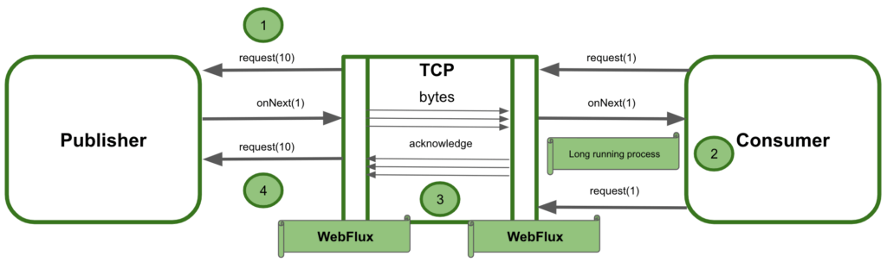
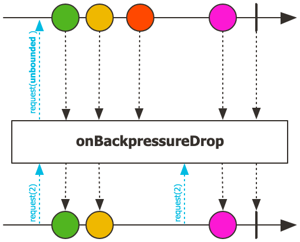
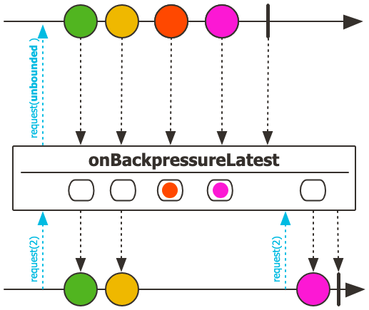

# Part02. Project Reactor
## Chapter08. Backpressure
> - Chapter 8에서는 Publisher부터 전달받은 데이터를 안정적으로 처리하기 위한 수단인 Backpressure에 대해서 알아보자. 
### 8.1. Backpressure란?
- Backpressure는 우리말로 배압 또는 역압이라 한다.
  - 소프트웨어의 세계가 아닌 현실 세계의 작업 현장에서 사용하는 배압이라는 용어는 배관으로 유입되는 가스나 액체 등의 흐름을 제어하기 위해 역으로 가해지는 압력을 의미한다.
- Publisher가 끈임없이 emit하는 무수히 많은 데이터를 적절하게 제어하여 데이터 처리에 과부하가 걸리지 않도록 제어하는 것이 바로 Backpressure의 역할이다.

- Consumer의 처리 속도가 너무 느린 반면 Publisher는 아주 빠른 속도로 데이터를 끊임없이 emit하게 된다면 어떤 일이 발생할까요?
  - 처리되지 않고 대기중인 데이터가 지속적으로 쌓이게 되면 오버플로가 발생하거나 최악의 경우에는 시스템이 다운되는 문제가 발생한다.
### 8.2. Reactor에서의 Backpressure 처리 방식
> Reactor에서 지원하는 Backpressure 처리 방식에는 구체적으로 어떤 것이 있을까요? Reactor에서는 다양한 방식으로 Backpressure를 지원하는데 그 유형을 살펴보자!
#### 8.2.1. 데이터 개수 제어
- 첫 번쨰 방식은 Subscriber가 적절히 처리할 수 있는 수준의 데이터 개수를 Publisher에게 요청하는 것이다.
  - Subscriber가 request() 메서드를 통해서 적절한 데이터 개술르 요청하는 방식이다.
```java
package chapter8;

import lombok.SneakyThrows;
import lombok.extern.slf4j.Slf4j;
import org.reactivestreams.Subscription;
import reactor.core.publisher.BaseSubscriber;
import reactor.core.publisher.Flux;

/**
 * doOnXXXX 예제
 *  - doOnXXXX() Operator의 호출 시점을 알 수 있다.
 */
@Slf4j
public class Example8_1 {
    public static void main(String[] args) {
        Flux.range(1, 5)
            .doOnRequest(data -> log.info("# doOnRequest: {}", data))
            .subscribe(new BaseSubscriber<Integer>() {
                @Override
                protected void hookOnSubscribe(Subscription subscription) {
                    request(1);
                }

                @SneakyThrows
                @Override
                protected void hookOnNext(Integer value) {
                    Thread.sleep(2000L);
                    log.info("# hookOnNext: {}", value);
                    request(1);
                }
            });
    }
}
```
- Subscriber가 데이터의 요청 개수를 조절하는 Backpressure에 대한 예제 코드이다.
  - Reactor에서는 Subscriber가 데이터 요청 개수를 직접 제어하기 위해서 Subscriber 인터페이스의 구현 클래스인 BackSubscriber를 사용할 수 있다.
- 코드 8-1에 대한 설명은 다음과 같다.
  - subscribe() 메서드의 파라미터로 람다 표현식 대신에 BackSubscriber 객체를 전달하는 것을 볼 수 있다.
  - hookOnSubscribe() 메서드는 Subscriber 인터페이스에 정의된 onSubscribe() 메서드를 대신해 구독 시점에 request() 메서드를 호출해서 최초 데이터 요청 개수를 제어하는 역할을 한다.
  - hookOnNext() 메서드는 Subscriber 인터페이스에 정의된 onNext() 메서드를 대신해 Publisher가 emit한 데이터를 전달받아 처리한 후에 Publisher에게 또다시 데이터를 요청하는 역할을 한다. 이때 역시 request() 메서드를 호출해서 데이터 요청 개수를 제어한다.
> SneakyThrows란?
> - throws 나 try-catch 구문을 통해서 Exception 에 대해 번거롭게 명시적으로 예외 처리를 해줘야 하는 경우에 @SneakyThrows 어노테이션을 사용하여 명시적인 예외 처리를 생략할 수 있습니다.
> - 출처 : https://dev-jwblog.tistory.com/130
#### 8.2.2. Backpressure 전략 사용
- Reactor에서 제공하는 Backpressure 전략을 사용하는 것이다.
- Reactor에서는 Backpressure를 위한 다양한 전략을 제공한다.

| 종류        | 설명                                                                               |
|-----------|----------------------------------------------------------------------------------|
| IGNORE 전략 | Backpressure를 적용하지 않는다.                                                          |
| ERROR 전략  | Downstream으로 전달할 데이터가 버퍼에 가득 찰 경우, Exception을 발생시키는 전략                           |
| DROP 전략   | DownStream으로 전달할 데이터가 버퍼에 가득 찰 경우, 버퍼 밖에서 대기하는 먼저 emit된 데이터부터 Drop시키는 전략         |
| LATEST 전략 | Downstream으로 전달할 데이터가 버퍼에 가득 찰경우, 버퍼 밖에서 대기하는 가장 최근에(나중에) emit된 데이터부터 버퍼에 채우는 전략 |
| BUFFER 전략 | Downstream으로 전달할 데이터가 버퍼에 가득 찰경우, 버퍼 안에 있는 데이터부터 Drop시키는 전략                      |

- **IGNORE 전략**
  - IGNORE 전략은 말 그대로 Backpressure를 적용하지 않는 전략이다.
  - IGNORE 전략을 사용할 경우 Downstream에서의 Backpressure 요청이 무시되기 떄문에 IllegalStateException이 발생할 수 있다.
- **ERROR 전략**
  - Error 전략은 Downstream의 데이터 처리 속도가 느려서 Upstream의 emit 속도를 따라가지 못할 경우 IllegalStateException을 발생시킵니다.
  - 이 경우 Publisher는 Error Signal을 Subscriber에게 전송하고 삭제한 데이터는 폐기한다.
  - ```java
    package chapter8;
    
    import lombok.extern.slf4j.Slf4j;
    import reactor.core.publisher.Flux;
    import reactor.core.scheduler.Schedulers;
    import java.time.Duration;

    /**
    * Unbounded request 일 경우, Downstream 에 Backpressure Error 전략을 적용하는 예제
    *  - Downstream 으로 전달 할 데이터가 버퍼에 가득 찰 경우, Exception을 발생 시키는 전략
    */
    @Slf4j
    public class Example8_2 {
      public static void main(String[] args) throws InterruptedException {
        Flux
          .interval(Duration.ofMillis(1L))
          .onBackpressureError()
          .doOnNext(data -> log.info("# doOnNext: {}", data))
          .publishOn(Schedulers.parallel())
          .subscribe(data -> {
            try {
              Thread.sleep(5L);
            } catch (InterruptedException e) {}
            log.info("# onNext: {}", data);
          },
          error -> log.error("# onError", error));

        Thread.sleep(2000L);
      }
    }
- interval() Operator를 사용하여 0부터 1씩 증가한 숫자를 0.0001초에 한 번씩 아주 빠른 속도로 emit하도록 정의했습니다.
- Subscriber가 전달받은 데이터를 처리하는 데 0.0005초 시간이 걸리도록 시뮬레이션했습니다. 이렇게 코드를 구성하면 Publisher에서 데이터를 emit하는 속도와 Subscirber가 전달받은 데이터를 처리하는 속도에 차이가 나기 때문에 Backpressure 전략의 테스트가 가능해집니다.
- ERROR 전략은 적용하기 위해 onBackpressureError() Operator를 사용했다. doOnNext() Operator는 Publisher가 emit한 데이터를 확인하거나 추가적인 동작을 정의하는 용도로 사용되는데 주로 디버깅 용도로 사용할 수 있다.
- publishOn() Operator는 Reactor Sequence 중 일부를 별도의 스레드에서 실행할 수 있도록 해 주는 Operator이다.
> - 결과 : Subscriber에서 데이터를 처리하는 onNext 람다 표현식에서는 0.005초에 한 번씩 로그를 출력하다가 255라는 숫자를 출력하고 OverflowException이 발생하면서 Sequence가 종료되는 것을 확인할 수 있다. 

> - OverflowException은 IllegalStateException을 상속한 하위 클래스라는 것을 기억하자.
- **DROP 전략**
  - DROP 전략은 Publisher가 Downstream으로 전달한 데이터가 버퍼에 가득 찰 경우, 버퍼 밖에서 대기 중인 데이터 중에서 먼저 emit된 데이터부터 Drop시키는 전략이다. 
    - Drop된 데이터는 폐기된다.
  - 
  - ```java
    package chapter8;

    import lombok.extern.slf4j.Slf4j;
    import reactor.core.publisher.Flux;
    import reactor.core.scheduler.Schedulers;

    import java.time.Duration;

    /**
    * Unbounded request 일 경우, Downstream 에 Backpressure Drop 전략을 적용하는 예제
    *  - Downstream 으로 전달 할 데이터가 버퍼에 가득 찰 경우, 버퍼 밖에서 대기하는 먼저 emit 된 데이터를 Drop 시키는 전략
     */
    @Slf4j
    public class Example8_3 {
      public static void main(String[] args) throws InterruptedException {
        Flux
          .interval(Duration.ofMillis(1L))
          .onBackpressureDrop(dropped -> log.info("# dropped: {}", dropped))
          .publishOn(Schedulers.parallel())
          .subscribe(data -> {
            try {
              Thread.sleep(5L);
            } catch (InterruptedException e) {}
            log.info("# onNext: {}", data);
          },
          error -> log.error("# onError", error));
        Thread.sleep(2000L);
      }
    }
  - 첫 번째 Drop 구간에서 Drop이 시작되는 데이터는 숫자 256이고, Drop이 끝나는 데이터는 숫자 1025이다.
    - 이 구간 동안에는 버퍼가 가득 차 있는 상태임을 알 수 있다.
    - 숫자 1025까지 Drop되기 때문에 Subscriber 쪽에서는 숫자 1026부터 전달받아 처리하는 것을 볼 수 있다.
  - 그리고 두 번째 Drop 구간에서 Drop이 시작되는 데이터는 숫자 1218인 것으로 보아 Subscriber 쪽에서는 숫자 1217까지 데이터를 처리한다고 예상할 수 있다.
  - 이처럼 Backpressure DROP 전략을 적용하면 버퍼가 가득 찬 상태에서는 버퍼가 비워질 때까지 데이터를 Drop합니다.
- **LATEST 전략**
  - LATEST 전략은 Publisher가 Downstream으로 전달할 데이터가 버퍼에 가득 찰 경우, 버퍼 밖에서 대기 중인 데이터 중에서 가장 최근에(나중에) emit된 데이터부터 버퍼에 채우는 전략이다.
  - Drop 전략은 버퍼가 가득 찰 경우 버퍼 밖에서 대기 중인 데이터를 하나씩 차례대로 Drop하면서 폐기한다.
    - 이와 달리 LATEST 전략은 **새로운 데이터가 들어오는 시점에 가장 최근의 데이터만 남겨두고 나머지 데이터를 폐기**한다.
  - 
  - ```java
    package chapter8;

    import lombok.extern.slf4j.Slf4j;
    import reactor.core.publisher.Flux;
    import reactor.core.scheduler.Schedulers;
    import java.time.Duration;

    /**
     * Unbounded request 일 경우, Downstream 에 Backpressure Latest 전략을 적용하는 예제
     *  - Downstream 으로 전달 할 데이터가 버퍼에 가득 찰 경우,
     *    버퍼 밖에서 대기하는 가장 나중에(최근에) emit 된 데이터부터 버퍼에 채우는 전략
     */
    @Slf4j
    public class Example8_4 {
      public static void main(String[] args) throws InterruptedException {
        Flux
          .interval(Duration.ofMillis(1L))
          .onBackpressureLatest()
          .publishOn(Schedulers.parallel())
          .subscribe(data -> {
            try {
              Thread.sleep(5L);
            } catch (InterruptedException e) {}
            log.info("# onNext: {}", data);
          },
          error -> log.error("# onError", error));

        Thread.sleep(2000L);
      }
    }
  - 코드 실행 결과를 보면, Subscriber가 숫자 255를 출력하고 곧바로 그다음에 숫자 1037을 출력하는 것을 볼 수 있다.
    - 이는 버퍼가 가득 찼다가 버퍼가 다시 비워지는 시간 동안 emit되는 데이터가 가장 최근에 emit된 데이터가 된 후, 다음 데이터가 emit되면 다시 폐기되는 이 과정을 반복하기 때문이다.
> DROP 전략과 LATEST 전략이 헷갈리는 분들이 있다면 한 가지만 기억하자. 현재 emit된 데이터를 나라고 가정한다면 DROP 전략은 나 자신을 폐기하는 것이고, LATEST 전략은 자기가 최신 데이터라고 주장하는 누군가가 내 앞에 있다면 나를 폐기하는게 아니라 내 앞에 있는 누군가를 폐기하는 것이라고 기억하면 된다. 
- **BUFFER 전략**
  - 컴퓨터 시스템에서 사용되는 버퍼의 일반적인 기능은 입출력을 수행하는 장치들간의 속도 차이를 조절하기 위해 입출력 장치 중간에 위치해서 데이터를 어느 정도 쌓아 두었다가 전송하는 것이다.
    - 이를 버퍼링이라고 한다.(먹는 과자 버터링이 아니다.)
  - Backpressure BUFFER 전략도 이와 비슷한 기능을 한다.
    - Backpressure BUFFER 전략은 버퍼의 데이터를 폐기하지 않고 버퍼링을 하는 전략도 지원하지만, 버퍼가 가득 차면 버퍼 내의 데이터를 폐기하는 전략, 그리고 버퍼가 가득차면 에러를 발생시키는 전략도 지원한다.
  - Backpressure DROP 전략과 LATEST 전략은 버퍼가 가득 찼을 때 버퍼가 비워질 때까지 버퍼 바깥쪽에 있는 데이터를 폐기하는 방식이다.
    - 그런데 이와 달리 BUFFER 전략에서의 데이터 폐기는 BUFFER가 가득 찼을 때 BUFFER 바깥쪽이 아닌 버퍼 안에 있는 데이터를 폐기하는 것을 의미한다.
    - BUFFER 전략 중에서 데이터를 폐기하는 전략에는 DROP_LATEST 전략과 DROP_OLDEST 전략 이렇게 두 가지가 있다.
      - DROP_LATEST 전략
        - BUFFER DROP_LATEST 전략은 Publisher가 Downstream으로 전달할 데이터가 버퍼에 가득 찰 경우, **가장 최근에(나중에) 버퍼 안에 채워진 데이터를 Drop**하여 폐기한 후, 이렇게 확보된 공간에 emit된 데이터를 채우는 전략이다.
      - DROP_OLDEST 전략
        - BUFFER DROP_OLDEST 전략은 Publisher가 Downstream으로 전달할 데이터가 버퍼에 가득 찰 경우, 버퍼 안에 채워진 데이터 중에서 가장 오래된 데이터를 Drop하여 폐기한 후 , 확보된 공간에 emit된 데이터를 채우는 전략이다.
          - 즉, BUFFER DROP_LATEST 전략과 정반대되는 전략이라고 생각하면 된다.
> ### 기억하기
> - Backpressure는 Publisher가 끊임없이 emit하는 무수히 많은 데이터를 적절하게 제어하여 데이터 처리에 있어 과부하가 걸리지 않도록 제어하는 데이터 처리 방식이다.
> - Reactor에서 지원하는 Backpressure 처리 방식에는 데이터 요청 개수를 제어하는 방식, Backpressure 전략을 사용하는 방식 등이 있다.
> - Backpressure IGNORE 전략은 Backpressure를 적용하지 않는 전략이다.
> - Backpressure ERROR 전략은 Downstream의 데이터 처리 속도가 느려서 Upstream의 emit 속도를 따라기지 못할 경우 에러를 발생시키는 전략이다.
> - Backpressure DROP 전략은 Publisher가 Downstream으로 전달할 데이터가 버퍼에 가득 찰 경우, 버퍼 밖에서 대기 중인 데이터 중에서 먼저 emit된 데이터부터 Drop하는 전략이다.
>   - Backpressure LATEST wjsfirdms Publish가 Downstream으로 전달할 데이터가 버퍼에 가득 찰 경우, 버퍼 밖에서 대기 중인 데이터 중에서 가장 최근에(나중에) emit된 데이터부터 버퍼에 채우는 전략이다.
> - Backpressure BUFFER 전략은 버퍼의 데이터를 폐기하지 않고 버퍼링을 하는 전략, 버퍼가 가득 차면 버퍼 내의 데이터를 폐기하는 전략, 버퍼가 가득 차면 에러를 발생시키는 전략 등으로 구분할 수 있다.
>   - Backpressure BUFFER DROP_LATEST 전략은 Publisher가 Downstream으로 전달할 데이터가 버퍼에 가득 찰 경우, 가장 최근에(나중에) 버퍼 안에 채워진 데이터를 Drop하는 전략이다. 
>   - Backpressure BUFFER DROP_OLDEST 전략은 Publisher가 Downstream으로 전달할 데이터가 버퍼에 가득 찰 경우, 버퍼 안에 채워진 데이터 중에서 가장 오래된 데이터를 Drop하는 전략이다.

