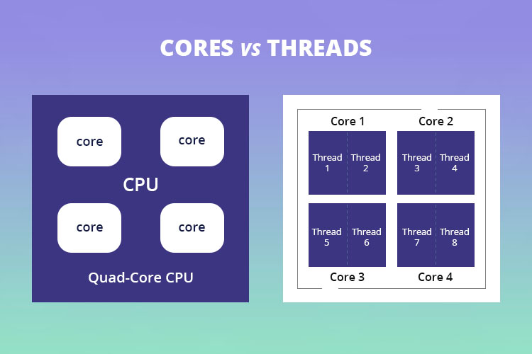

# Part02. Project Reactor
## Chapter10. Scheduler
> - Chapter 10에서는 Reactor Sequence에서 사용되는 스레드를 관리하는 Scheduler에 대해 알아보자. 
### 10.1. 스레드(Thread)의 개념 이해
- Reactor에서 사용되는 Scheduler는 Reactor Sequence에서 사용되는 **스레드를 관리해 주는 관리자** 역할을 한다.
  - 따라서 Reactor의 Scheduler에 대한 이야기를 하기 전에 스레드에 대해서 먼저 간단하게 살펴보자.
- 컴퓨터 시스템에서 스레드는 크게 **물리적인 스레드(Physical Thread)와 논리적인 스레드(Logical Thread)** 로 구분한다.
  - 물리적인 스레드를 이해하기 위해서는 CPU의 코어(Core)가 무엇인지 알아야 한다.
- 코어는 CPU의 명령어를 처리하는 반도체 유닛이다.
  - 코어라는 용어는 컴퓨터를 구매할 때 컴퓨터 사양을 확인하다 보면 쉽게 접하게 되는 용어로, 일반적으로 코어의 개수가 많으면 더 많은 수의 명령어를 더 빠르게 병렬로 처리할 수 있다.

- **물리적인 스레드(Physical Thread)**
  - 위 그림은 '쿼드코어 8 스레드'를 그림으로 표현한 것이다.
    - 그림을 보면 하나의 코어는 두 개의 스레드를 포함하고 있는데. 이 두 개의 스레드는 물리적인 코어를 논리적을 나눈 것을 의미하며, 이렇게 물리적인 코어를 논리적으로 나눈 코어를 물리적인 스레드라고 한다.
  - '논리적인'이라는 용어와 '물리적인'이라는 용어가 뒤섞여 있어 혼란스러운 분들은 하드웨어와 관련된 스레드는 물리적인 스레드라고 기억해도 무방하다.
- **논리적인 스레드(Logical Thread)**
  - 논리적인 스레드는 소프트웨어적으로 생성되는 스레드를 의미하며, Java 프로그래밍에서 사용되는 스레드는 바로 이러한 논리적인 스레드라고 볼 수 있다.
  - 논리적인 스레드는 우리가 흔히들 프로그램이라고 부르는 프로세스 내에서 실행되는 세부 작업의 단위가 된다.
    - 논리적인 스레드는 이론적으로 메모리가 허용하는 범위 내에서 얼마든지 만들 수 있지만 물리적인 스레드의 가용 범위 내에서 실행될 수 있다.
- 물리적인 스레드는 **병렬성(Parallelism)** 과 관련이 있으며, 논리적인 스레드는 **동시성(Concurrency)** 과 관련이 있다.
- 병렬성은 물리적인 스레드가 실제로 동시에 실행되기 때문에 여러 작업을 동시에 처리함을 의미하며, 반면에 동시성은 용어 자체의 의미 때문에 동시에 실행된다고 생각할 수 있지만 동시에 실행되는 것처럼 보이는 것을 의미한다.
- 논리적인 스레드가 정해진 갯수의 물리적인 스레드를 아주 빠른 속도로 번갈아 가며 사용하면서 마치 동시에 실행되는 것처럼 보이는 동시성을 가지게 된다.
  - 그러나 이는 물리적인 스레드의 총 개수보다 더 많은 논리적인 스레드가 동시에 실행되는 것이 아니라, 인간의 눈으로는 쫓아갈 수 없는 아주 짧은 어느 순간에 최대한 많이 실행된다 하더라도 물리적인 스레드의 개수 내에서 실행된다는 의미와 같다.
> #### 기억하기
> - **스레드의 개념**
>   - CPU의 코어는 물리적은 스레드를 의미하며, 이 물리적인 스레드는 논리적은 코어라고도 부른다.
>   - 물리적인 스레드는 병렬성과 관련이 있으며, 논리적인 스레드는 동시성과 관련이 있다.
### 10.2. Scheduler란?
- Reactor에서의 Scheduler는 운영체제에서 사용되는 Scheduler의 의미와 비슷하다고 볼 수 있다.
  - 운영체제 레벨에서의 Scheduler는 실행되는 프로그램인 프로세스를 선택하고 실행하는 등 프로세스의 라이프 사이클을 관리해 주는 관리자 역할은 한다.
- 이와 유사하게 Reactor의 Scheduler는 비동기 프로그래밍은 위해 사용되는 스레드를 관리해 주는 역할을 한다.
  - 즉, Scheduler를 사용하여 어떤 스레드에서 무엇을 처리할지 제어한다.
- 일반적으로 Java 프로그래밍에서 멀티스레드를 완벽하게 제어하는 것은 쉬운 일이 아니다.
  - 스레드 간의 경쟁 조건(Race Condition) 등을 신중하게 고려해서 코드를 작성해야 하는데, 이로 인해 코드의 복잡도가 높아지고 결과적으로 예상치 못한 오류가 발생할 가능성이 높다.
- Reactor에서는 Scheduler를 통해 이러한 문제를 최소화할 수 있다.
  - Scheduler를 사용하면 코드 자체가 매우 간결해지고, Scheduler가 스레드의 제어를 대신해 주기 때문에 개발자가 직접 스레드를 제어해야 하는 부담에서 벗어날 수 있다.
### 10.3. Scheduler를 위한 전용 Operator
- Reactor에서 Scheduler는 Scheduler 전용 Operator를 통해 사용할 수 있다.
- 우리가 이전의 몇 개 챕터에서 한 번씩 사용했던 subscribeOn() Operator와 publishOn() Operaot가 바로 Scheduler 전용 Operator이다.
  - 그리고 Operator의 파라미터로 적절한 Scheduler를 전달하면 해당 Scheduler의 특성에 맞는 스레드가 Reactor Sequence에 할당된다.
- 일반적으로 Reactor에서 스레드를 관리하기 위해 subscribeOn()과 publishOn()을 가장 많이 사용하지만, 그 외에 parallel()이라는 특별한 Operator도 있다.
- **subscribeOn()**
  - subscribeOn() Operator는 그 이름처럼 구독이 발생한 직후 실행될 스레드를 지정하는 Operator이다.
  - 구독이 발생하면 원본 Publisher(Original Publisher 또는 Source Publisher)가 데이터를 최초로 emit하게 되는데, subscribeOn() Operator는 구독 시점 직후에 실행되기 때문에 원본 Publisher의 동작을 수행하기 위한 스레드라고 볼 수 있다.
  - ```java
    import lombok.extern.slf4j.Slf4j;
    import reactor.core.publisher.Flux;
    import reactor.core.scheduler.Schedulers;

    /**
      * subscribeOn() 기본 예제
      *  - 구독 시점에 Publisher의 실행을 위한 쓰레드를 지정한다
     */
    @Slf4j
    public class Example10_1 {
      public static void main(String[] args) throws InterruptedException {
        Flux.fromArray(new Integer[] {1, 3, 5, 7})
          .subscribeOn(Schedulers.boundedElastic())
          .doOnNext(data -> log.info("# doOnNext: {}", data))
          .doOnSubscribe(subscription -> log.info("# doOnSubscribe"))
          .subscribe(data -> log.info("# onNext: {}", data));

        Thread.sleep(500L);
      }
    }
    ```
  - 코드 10-1은 subscribeOn()을 사용하여 스레드를 제어하는 예제 코드이다.
    - subscribeOn() Operator를 추가했기 때문에 구독이 발생한 직후에 원본 Publisher의 동작을 처리하기 위한 스레드를 할당한다.(5번 라인 코드 10-1에서의 원본 Publisher는 원본 Flux를 의미하며 원본 Flux의 동작은 원본 데이터 소스를 emit하는 것이다.)
    - doOnNext() Operator를 사용해 원본 Flux에서 emit되는 데이터를 로그로 출력한다.(6번 라인)
    - doOnSubscribe() Operator를 사용해 구독이 발생한 시점에 추가적인 어떤 처리가 필요할 경우 해당 처리 동작을 추가할 수 있는데, 여기서는 구독이 발생한 시점에 실해되는 스레드가 무엇인지 확인한다.(7번 라인)
  - 실행 결과
    - ```text
      18:41:17.851 [main] INFO com.itvillage.rxjavachris.example.reactiveprogrammingdeeply.Test - # doOnSubscribe
      18:41:17.857 [boundedElastic-1] INFO com.itvillage.rxjavachris.example.reactiveprogrammingdeeply.Test - # doOnNext: 1
      18:41:17.859 [boundedElastic-1] INFO com.itvillage.rxjavachris.example.reactiveprogrammingdeeply.Test - # onNext: 1
      18:41:17.859 [boundedElastic-1] INFO com.itvillage.rxjavachris.example.reactiveprogrammingdeeply.Test - # doOnNext: 3
      18:41:17.859 [boundedElastic-1] INFO com.itvillage.rxjavachris.example.reactiveprogrammingdeeply.Test - # onNext: 3
      18:41:17.859 [boundedElastic-1] INFO com.itvillage.rxjavachris.example.reactiveprogrammingdeeply.Test - # doOnNext: 5
      18:41:17.859 [boundedElastic-1] INFO com.itvillage.rxjavachris.example.reactiveprogrammingdeeply.Test - # onNext: 5
      18:41:17.859 [boundedElastic-1] INFO com.itvillage.rxjavachris.example.reactiveprogrammingdeeply.Test - # doOnNext: 7
      18:41:17.860 [boundedElastic-1] INFO com.itvillage.rxjavachris.example.reactiveprogrammingdeeply.Test - # onNext: 7
      ```
    - 실행 결과를 보면 doOnSubscribe()에서의 동작은 main 스레드에서 실행되는데, 그 이유는 예제 코드의 최초 실행 스레드가 main 스레드이기 때문이다.
    - subscribeOn()을 추가하지 않았다면 원본 Flux의 처리 동작은 여전히 main 스레드에서 실행되겠지만, subscribeOn()에서 Scheduler를 지정했기 떄문에 구독이 발생한 직후부터는 원본 Flux의 동작을 처리하는 스레드가 바뀌게 된다.
    - 따라서 doOnNext()에서의 동작은 boundedElastic-1 스레드에서 실행되고, 이후에 Operator 체인상에서 특별히 다른 Scheduler를 지정하지 않았기 때문에 Subscriber에서 데이터를 전달받아 처리하는 동작 역시 boundedElastic-1 스레드에서 실행된다.
- **publishOn()**
  - Publisher가 Reactor Sequnece에서 발생하는 Signal을 Downstream으로 전송하는 주체이다.
    - 그런 관점에서 publishOn()이라는 Operator는 Downstream으로 Signal을 전송할 때 실행되는 스레드를 제어하는 역할을 하는 Operator라고 할 수 있다.
  - publishOn() Operator는 코드상에서 publishOn()을 기준으로 아래쪽인 Downstream의 실행 스레드를 변경한다.
    - 그리고 subscribeOn()과 마찬가지로 파라미터로 Scheduler를 지정함으로써 해당 Scheduler의 특성을 가진 스레드로 변경할 수 있다.
  - ```java
    import lombok.extern.slf4j.Slf4j;
    import reactor.core.publisher.Flux;
    import reactor.core.scheduler.Schedulers;

    /**
      * publishOn() 기본 예제
      *  - Operator 체인에서 Downstream Operator의 실행을 위한 쓰레드를 지정한다.
    */
    @Slf4j
    public class Example10_2 {
      public static void main(String[] args) throws InterruptedException {
        Flux.fromArray(new Integer[] {1, 3, 5, 7})
          .doOnNext(data -> log.info("# doOnNext: {}", data))
          .doOnSubscribe(subscription -> log.info("# doOnSubscribe"))
          .publishOn(Schedulers.parallel())
          .subscribe(data -> log.info("# onNext: {}", data));

        Thread.sleep(500L);
      }
    }
    ```
  - 7번 라인에서 publishOn() Operator를 사용했기 때문에 Downstream으로 데이터를 emit하는 스레드를 변경한다.
  - 실행결과
    - ```text
      18:55:36.976 [main] INFO com.itvillage.rxjavachris.example.reactiveprogrammingdeeply.Test - # doOnSubscribe
      18:55:36.981 [main] INFO com.itvillage.rxjavachris.example.reactiveprogrammingdeeply.Test - # doOnNext: 1
      18:55:36.988 [main] INFO com.itvillage.rxjavachris.example.reactiveprogrammingdeeply.Test - # doOnNext: 3
      18:55:36.988 [parallel-1] INFO com.itvillage.rxjavachris.example.reactiveprogrammingdeeply.Test - # onNext: 1
      18:55:36.988 [parallel-1] INFO com.itvillage.rxjavachris.example.reactiveprogrammingdeeply.Test - # onNext: 3
      18:55:36.988 [main] INFO com.itvillage.rxjavachris.example.reactiveprogrammingdeeply.Test - # doOnNext: 5
      18:55:36.988 [main] INFO com.itvillage.rxjavachris.example.reactiveprogrammingdeeply.Test - # doOnNext: 7
      18:55:36.988 [parallel-1] INFO com.itvillage.rxjavachris.example.reactiveprogrammingdeeply.Test - # onNext: 5
      18:55:36.988 [parallel-1] INFO com.itvillage.rxjavachris.example.reactiveprogrammingdeeply.Test - # onNext: 7
      ```
    - 코드 10-1과 마찬가지로, 코드 10-2의 최초 실행 스레드 역시 main 스레드이기 때문에 doOnSubscrbie()는 main 스레드에서 실행되었습니다.
    - doOnNext()의 경우, subscribeOn() Operator를 사용하지 않았기 때문에 여전히 main 스레드에서 실행된다.
    - 그런데 onNext()의 경우, 7번 라인에서 publishOn() Operator를 추가했기 때문에 publishOn()을 기준으로 Downstream의 실행 스레드가 변경되어 parallel-1 스레드에서 실행되었다.
  - > publishOn() Operator는 해당 publishOn()을 기준으로 Downstream의 실행 스레드를 변경한다는 사실을 기억하자.
- **parallel()**
  - 물리적인 스레드는 병렬성을 가지고, 논리적인 스레드는 동시성을 가진다고 했다.
    - subscribeOn Operator와 publishOn() Operator의 경우, 동시성을 가지는 논리적인 스레드에 해당되지만 parallel() Operator는 병렬성을 가지는 물리적인 스레드에 해당된다.
  - parallel()의 경우 라운드 로빈(Round Robin) 방식으로 CPU 코어 개수만큼의 스레드를 병렬로 실행한다.
    - 여기서 말하는 CPU 코어 개수는 물리적인 코어의 개수를 의미하는 것이 아니라 논리적인 코어(물리적인 스레드)의 개수를 의미한다.
  - 예를 들어 컴퓨터가 4코어 8스레드의 CPU라면 총 8개의 스레드를 병렬로 실행하는 것이다.
  - ```java
    import lombok.extern.slf4j.Slf4j;
    import reactor.core.publisher.Flux;
    import reactor.core.scheduler.Schedulers;

    /**
      * parallel() 기본 사용 예제
      * - parallel()만 사용할 경우에는 병렬로 작업을 수행하지 않는다.
      * - runOn()을 사용해서 Scheduler를 할당해주어야 병렬로 작업을 수행한다.
      * - **** CPU 코어 갯수내에서 worker thread를 할당한다. ****
     */
    @Slf4j
    public class Example10_3 {
      public static void main(String[] args) throws InterruptedException {
        Flux.fromArray(new Integer[]{1, 3, 5, 7, 9, 11, 13, 15, 17, 19})
          .parallel()
          .parallel(4)
          .runOn(Schedulers.parallel())
          .subscribe(data -> log.info("# onNext: {}", data));

        Thread.sleep(100L);
      }
    }
    ```
  - 원본 Flux가 총 10개의 숫자를 emit하는데 parallel() Operator를 추가함으로써 이 10개의 숫자를 병렬로 처리한다.
  - 그런데 parallel() Operator만 추가한다고 해서 emit되는 데이터를 병렬로 처리하지는 않는다.
    - parallel() Operator는 emit되는 데이터를 CPU의 논리적인 코어(물리적인 스레드) 수에 맞게 사전에 골고루 분배하는 역할만 하며, 실제로 병렬 작업을 수행할 스레드의 할당은 runOn() Operator가 담당한다.
  - > Reactor에서는 라운드 로빈 방식으로 CPU의 논리적인 코어 수에 맞게 데이터를 그룹화한 것을 'rail'이라고 한다.
  - ```text
    19:17:42.372 [parallel-2] INFO com.itvillage.rxjavachris.example.reactiveprogrammingdeeply.Test - # onNext: 3
    19:17:42.372 [parallel-4] INFO com.itvillage.rxjavachris.example.reactiveprogrammingdeeply.Test - # onNext: 7
    19:17:42.381 [parallel-4] INFO com.itvillage.rxjavachris.example.reactiveprogrammingdeeply.Test - # onNext: 15
    19:17:42.381 [parallel-2] INFO com.itvillage.rxjavachris.example.reactiveprogrammingdeeply.Test - # onNext: 11
    19:17:42.382 [parallel-2] INFO com.itvillage.rxjavachris.example.reactiveprogrammingdeeply.Test - # onNext: 19
    19:17:42.372 [parallel-1] INFO com.itvillage.rxjavachris.example.reactiveprogrammingdeeply.Test - # onNext: 1
    19:17:42.372 [parallel-3] INFO com.itvillage.rxjavachris.example.reactiveprogrammingdeeply.Test - # onNext: 5
    19:17:42.385 [parallel-1] INFO com.itvillage.rxjavachris.example.reactiveprogrammingdeeply.Test - # onNext: 9
    19:17:42.385 [parallel-1] INFO com.itvillage.rxjavachris.example.reactiveprogrammingdeeply.Test - # onNext: 17
    19:17:42.385 [parallel-3] INFO com.itvillage.rxjavachris.example.reactiveprogrammingdeeply.Test - # onNext: 13
    ```
> #### 기억하기
> - **Scheduler를 위한 전용 Operator**
>   - Reactor에서의 Scheduler는 비동기 프로그래밍을 위해 사용되는 스레드를 관리해 주는 역할을 한다.
>   - subscribeOn() Operator는 구독이 발생한 직후에, 실행될 스레드를 지정하는 Operator이다.
>   - publishOn() Operator는 Downstream으로 Signal을 전송할 때 실행되는 스레드를 제어하는 역할을 하는 Operator이다.
>   - parallel() Operator는 라운드 로빈(Round Robin) 방식으로 CPU 코어 개수만큼의 스레드를 병렬로 실행한다.