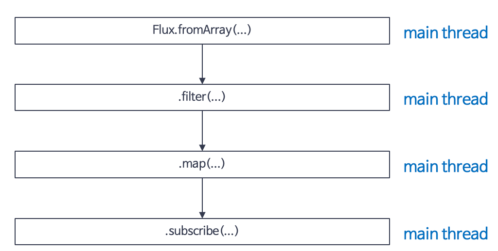
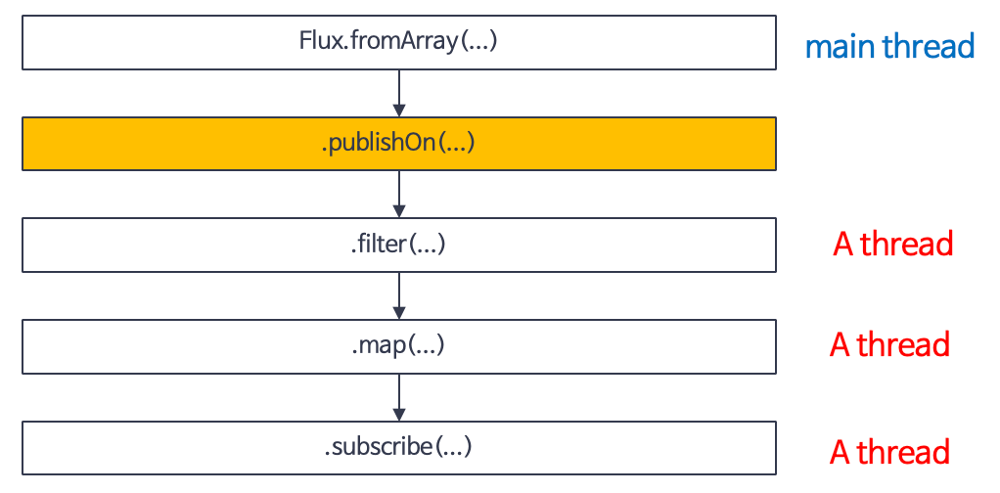
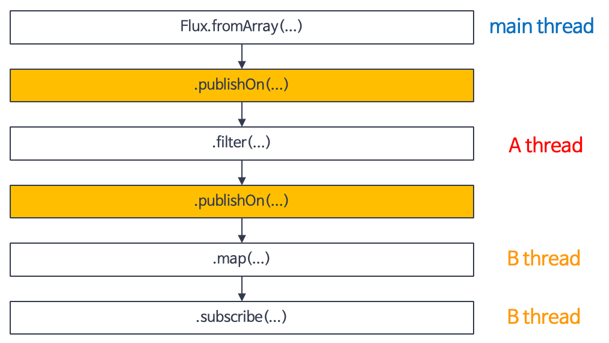
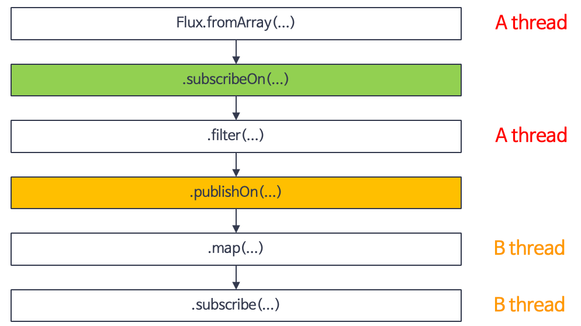

# Part02. Project Reactor
## Chapter10. Scheduler
> - Chapter 10에서는 Reactor Sequence에서 사용되는 스레드를 관리하는 Scheduler에 대해 알아보자. 
### 10.1. 스레드(Thread)의 개념 이해
- Reactor에서 사용되는 Scheduler는 Reactor Sequence에서 사용되는 **스레드를 관리해 주는 관리자** 역할을 한다.
  - 따라서 Reactor의 Scheduler에 대한 이야기를 하기 전에 스레드에 대해서 먼저 간단하게 살펴보자.
- 컴퓨터 시스템에서 스레드는 크게 **물리적인 스레드(Physical Thread)와 논리적인 스레드(Logical Thread)** 로 구분한다.
  - 물리적인 스레드를 이해하기 위해서는 CPU의 코어(Core)가 무엇인지 알아야 한다.
- 코어는 CPU의 명령어를 처리하는 반도체 유닛이다.
  - 코어라는 용어는 컴퓨터를 구매할 때 컴퓨터 사양을 확인하다 보면 쉽게 접하게 되는 용어로, 일반적으로 코어의 개수가 많으면 더 많은 수의 명령어를 더 빠르게 병렬로 처리할 수 있다.

- **물리적인 스레드(Physical Thread)**
  - 위 그림은 '쿼드코어 8 스레드'를 그림으로 표현한 것이다.
    - 그림을 보면 하나의 코어는 두 개의 스레드를 포함하고 있는데. 이 두 개의 스레드는 물리적인 코어를 논리적을 나눈 것을 의미하며, 이렇게 물리적인 코어를 논리적으로 나눈 코어를 물리적인 스레드라고 한다.
  - '논리적인'이라는 용어와 '물리적인'이라는 용어가 뒤섞여 있어 혼란스러운 분들은 하드웨어와 관련된 스레드는 물리적인 스레드라고 기억해도 무방하다.
- **논리적인 스레드(Logical Thread)**
  - 논리적인 스레드는 소프트웨어적으로 생성되는 스레드를 의미하며, Java 프로그래밍에서 사용되는 스레드는 바로 이러한 논리적인 스레드라고 볼 수 있다.
  - 논리적인 스레드는 우리가 흔히들 프로그램이라고 부르는 프로세스 내에서 실행되는 세부 작업의 단위가 된다.
    - 논리적인 스레드는 이론적으로 메모리가 허용하는 범위 내에서 얼마든지 만들 수 있지만 물리적인 스레드의 가용 범위 내에서 실행될 수 있다.
- 물리적인 스레드는 **병렬성(Parallelism)** 과 관련이 있으며, 논리적인 스레드는 **동시성(Concurrency)** 과 관련이 있다.
- 병렬성은 물리적인 스레드가 실제로 동시에 실행되기 때문에 여러 작업을 동시에 처리함을 의미하며, 반면에 동시성은 용어 자체의 의미 때문에 동시에 실행된다고 생각할 수 있지만 동시에 실행되는 것처럼 보이는 것을 의미한다.
- 논리적인 스레드가 정해진 갯수의 물리적인 스레드를 아주 빠른 속도로 번갈아 가며 사용하면서 마치 동시에 실행되는 것처럼 보이는 동시성을 가지게 된다.
  - 그러나 이는 물리적인 스레드의 총 개수보다 더 많은 논리적인 스레드가 동시에 실행되는 것이 아니라, 인간의 눈으로는 쫓아갈 수 없는 아주 짧은 어느 순간에 최대한 많이 실행된다 하더라도 물리적인 스레드의 개수 내에서 실행된다는 의미와 같다.
> #### 기억하기
> - **스레드의 개념**
>   - CPU의 코어는 물리적은 스레드를 의미하며, 이 물리적인 스레드는 논리적은 코어라고도 부른다.
>   - 물리적인 스레드는 병렬성과 관련이 있으며, 논리적인 스레드는 동시성과 관련이 있다.
### 10.2. Scheduler란?
- Reactor에서의 Scheduler는 운영체제에서 사용되는 Scheduler의 의미와 비슷하다고 볼 수 있다.
  - 운영체제 레벨에서의 Scheduler는 실행되는 프로그램인 프로세스를 선택하고 실행하는 등 프로세스의 라이프 사이클을 관리해 주는 관리자 역할은 한다.
- 이와 유사하게 Reactor의 Scheduler는 비동기 프로그래밍은 위해 사용되는 스레드를 관리해 주는 역할을 한다.
  - 즉, Scheduler를 사용하여 어떤 스레드에서 무엇을 처리할지 제어한다.
- 일반적으로 Java 프로그래밍에서 멀티스레드를 완벽하게 제어하는 것은 쉬운 일이 아니다.
  - 스레드 간의 경쟁 조건(Race Condition) 등을 신중하게 고려해서 코드를 작성해야 하는데, 이로 인해 코드의 복잡도가 높아지고 결과적으로 예상치 못한 오류가 발생할 가능성이 높다.
- Reactor에서는 Scheduler를 통해 이러한 문제를 최소화할 수 있다.
  - Scheduler를 사용하면 코드 자체가 매우 간결해지고, Scheduler가 스레드의 제어를 대신해 주기 때문에 개발자가 직접 스레드를 제어해야 하는 부담에서 벗어날 수 있다.
### 10.3. Scheduler를 위한 전용 Operator
- Reactor에서 Scheduler는 Scheduler 전용 Operator를 통해 사용할 수 있다.
- 우리가 이전의 몇 개 챕터에서 한 번씩 사용했던 subscribeOn() Operator와 publishOn() Operaot가 바로 Scheduler 전용 Operator이다.
  - 그리고 Operator의 파라미터로 적절한 Scheduler를 전달하면 해당 Scheduler의 특성에 맞는 스레드가 Reactor Sequence에 할당된다.
- 일반적으로 Reactor에서 스레드를 관리하기 위해 subscribeOn()과 publishOn()을 가장 많이 사용하지만, 그 외에 parallel()이라는 특별한 Operator도 있다.
- **subscribeOn()**
  - subscribeOn() Operator는 그 이름처럼 구독이 발생한 직후 실행될 스레드를 지정하는 Operator이다.
  - 구독이 발생하면 원본 Publisher(Original Publisher 또는 Source Publisher)가 데이터를 최초로 emit하게 되는데, subscribeOn() Operator는 구독 시점 직후에 실행되기 때문에 원본 Publisher의 동작을 수행하기 위한 스레드라고 볼 수 있다.
  - ```java
    import lombok.extern.slf4j.Slf4j;
    import reactor.core.publisher.Flux;
    import reactor.core.scheduler.Schedulers;

    /**
      * subscribeOn() 기본 예제
      *  - 구독 시점에 Publisher의 실행을 위한 쓰레드를 지정한다
     */
    @Slf4j
    public class Example10_1 {
      public static void main(String[] args) throws InterruptedException {
        Flux.fromArray(new Integer[] {1, 3, 5, 7})
          .subscribeOn(Schedulers.boundedElastic())
          .doOnNext(data -> log.info("# doOnNext: {}", data))
          .doOnSubscribe(subscription -> log.info("# doOnSubscribe"))
          .subscribe(data -> log.info("# onNext: {}", data));

        Thread.sleep(500L);
      }
    }
    ```
  - 코드 10-1은 subscribeOn()을 사용하여 스레드를 제어하는 예제 코드이다.
    - subscribeOn() Operator를 추가했기 때문에 구독이 발생한 직후에 원본 Publisher의 동작을 처리하기 위한 스레드를 할당한다.(5번 라인 코드 10-1에서의 원본 Publisher는 원본 Flux를 의미하며 원본 Flux의 동작은 원본 데이터 소스를 emit하는 것이다.)
    - doOnNext() Operator를 사용해 원본 Flux에서 emit되는 데이터를 로그로 출력한다.(6번 라인)
    - doOnSubscribe() Operator를 사용해 구독이 발생한 시점에 추가적인 어떤 처리가 필요할 경우 해당 처리 동작을 추가할 수 있는데, 여기서는 구독이 발생한 시점에 실해되는 스레드가 무엇인지 확인한다.(7번 라인)
  - 실행 결과
    - ```text
      18:41:17.851 [main] INFO com.itvillage.rxjavachris.example.reactiveprogrammingdeeply.Test - # doOnSubscribe
      18:41:17.857 [boundedElastic-1] INFO com.itvillage.rxjavachris.example.reactiveprogrammingdeeply.Test - # doOnNext: 1
      18:41:17.859 [boundedElastic-1] INFO com.itvillage.rxjavachris.example.reactiveprogrammingdeeply.Test - # onNext: 1
      18:41:17.859 [boundedElastic-1] INFO com.itvillage.rxjavachris.example.reactiveprogrammingdeeply.Test - # doOnNext: 3
      18:41:17.859 [boundedElastic-1] INFO com.itvillage.rxjavachris.example.reactiveprogrammingdeeply.Test - # onNext: 3
      18:41:17.859 [boundedElastic-1] INFO com.itvillage.rxjavachris.example.reactiveprogrammingdeeply.Test - # doOnNext: 5
      18:41:17.859 [boundedElastic-1] INFO com.itvillage.rxjavachris.example.reactiveprogrammingdeeply.Test - # onNext: 5
      18:41:17.859 [boundedElastic-1] INFO com.itvillage.rxjavachris.example.reactiveprogrammingdeeply.Test - # doOnNext: 7
      18:41:17.860 [boundedElastic-1] INFO com.itvillage.rxjavachris.example.reactiveprogrammingdeeply.Test - # onNext: 7
      ```
    - 실행 결과를 보면 doOnSubscribe()에서의 동작은 main 스레드에서 실행되는데, 그 이유는 예제 코드의 최초 실행 스레드가 main 스레드이기 때문이다.
    - subscribeOn()을 추가하지 않았다면 원본 Flux의 처리 동작은 여전히 main 스레드에서 실행되겠지만, subscribeOn()에서 Scheduler를 지정했기 떄문에 구독이 발생한 직후부터는 원본 Flux의 동작을 처리하는 스레드가 바뀌게 된다.
    - 따라서 doOnNext()에서의 동작은 boundedElastic-1 스레드에서 실행되고, 이후에 Operator 체인상에서 특별히 다른 Scheduler를 지정하지 않았기 때문에 Subscriber에서 데이터를 전달받아 처리하는 동작 역시 boundedElastic-1 스레드에서 실행된다.
- **publishOn()**
  - Publisher가 Reactor Sequnece에서 발생하는 Signal을 Downstream으로 전송하는 주체이다.
    - 그런 관점에서 publishOn()이라는 Operator는 Downstream으로 Signal을 전송할 때 실행되는 스레드를 제어하는 역할을 하는 Operator라고 할 수 있다.
  - publishOn() Operator는 코드상에서 publishOn()을 기준으로 아래쪽인 Downstream의 실행 스레드를 변경한다.
    - 그리고 subscribeOn()과 마찬가지로 파라미터로 Scheduler를 지정함으로써 해당 Scheduler의 특성을 가진 스레드로 변경할 수 있다.
  - ```java
    import lombok.extern.slf4j.Slf4j;
    import reactor.core.publisher.Flux;
    import reactor.core.scheduler.Schedulers;

    /**
      * publishOn() 기본 예제
      *  - Operator 체인에서 Downstream Operator의 실행을 위한 쓰레드를 지정한다.
    */
    @Slf4j
    public class Example10_2 {
      public static void main(String[] args) throws InterruptedException {
        Flux.fromArray(new Integer[] {1, 3, 5, 7})
          .doOnNext(data -> log.info("# doOnNext: {}", data))
          .doOnSubscribe(subscription -> log.info("# doOnSubscribe"))
          .publishOn(Schedulers.parallel())
          .subscribe(data -> log.info("# onNext: {}", data));

        Thread.sleep(500L);
      }
    }
    ```
  - 7번 라인에서 publishOn() Operator를 사용했기 때문에 Downstream으로 데이터를 emit하는 스레드를 변경한다.
  - 실행결과
    - ```text
      18:55:36.976 [main] INFO com.itvillage.rxjavachris.example.reactiveprogrammingdeeply.Test - # doOnSubscribe
      18:55:36.981 [main] INFO com.itvillage.rxjavachris.example.reactiveprogrammingdeeply.Test - # doOnNext: 1
      18:55:36.988 [main] INFO com.itvillage.rxjavachris.example.reactiveprogrammingdeeply.Test - # doOnNext: 3
      18:55:36.988 [parallel-1] INFO com.itvillage.rxjavachris.example.reactiveprogrammingdeeply.Test - # onNext: 1
      18:55:36.988 [parallel-1] INFO com.itvillage.rxjavachris.example.reactiveprogrammingdeeply.Test - # onNext: 3
      18:55:36.988 [main] INFO com.itvillage.rxjavachris.example.reactiveprogrammingdeeply.Test - # doOnNext: 5
      18:55:36.988 [main] INFO com.itvillage.rxjavachris.example.reactiveprogrammingdeeply.Test - # doOnNext: 7
      18:55:36.988 [parallel-1] INFO com.itvillage.rxjavachris.example.reactiveprogrammingdeeply.Test - # onNext: 5
      18:55:36.988 [parallel-1] INFO com.itvillage.rxjavachris.example.reactiveprogrammingdeeply.Test - # onNext: 7
      ```
    - 코드 10-1과 마찬가지로, 코드 10-2의 최초 실행 스레드 역시 main 스레드이기 때문에 doOnSubscrbie()는 main 스레드에서 실행되었습니다.
    - doOnNext()의 경우, subscribeOn() Operator를 사용하지 않았기 때문에 여전히 main 스레드에서 실행된다.
    - 그런데 onNext()의 경우, 7번 라인에서 publishOn() Operator를 추가했기 때문에 publishOn()을 기준으로 Downstream의 실행 스레드가 변경되어 parallel-1 스레드에서 실행되었다.
  - > publishOn() Operator는 해당 publishOn()을 기준으로 Downstream의 실행 스레드를 변경한다는 사실을 기억하자.
- **parallel()**
  - 물리적인 스레드는 병렬성을 가지고, 논리적인 스레드는 동시성을 가진다고 했다.
    - subscribeOn Operator와 publishOn() Operator의 경우, 동시성을 가지는 논리적인 스레드에 해당되지만 parallel() Operator는 병렬성을 가지는 물리적인 스레드에 해당된다.
  - parallel()의 경우 라운드 로빈(Round Robin) 방식으로 CPU 코어 개수만큼의 스레드를 병렬로 실행한다.
    - 여기서 말하는 CPU 코어 개수는 물리적인 코어의 개수를 의미하는 것이 아니라 논리적인 코어(물리적인 스레드)의 개수를 의미한다.
  - 예를 들어 컴퓨터가 4코어 8스레드의 CPU라면 총 8개의 스레드를 병렬로 실행하는 것이다.
  - ```java
    import lombok.extern.slf4j.Slf4j;
    import reactor.core.publisher.Flux;
    import reactor.core.scheduler.Schedulers;

    /**
      * parallel() 기본 사용 예제
      * - parallel()만 사용할 경우에는 병렬로 작업을 수행하지 않는다.
      * - runOn()을 사용해서 Scheduler를 할당해주어야 병렬로 작업을 수행한다.
      * - **** CPU 코어 갯수내에서 worker thread를 할당한다. ****
     */
    @Slf4j
    public class Example10_3 {
      public static void main(String[] args) throws InterruptedException {
        Flux.fromArray(new Integer[]{1, 3, 5, 7, 9, 11, 13, 15, 17, 19})
          .parallel()
          .parallel(4)
          .runOn(Schedulers.parallel())
          .subscribe(data -> log.info("# onNext: {}", data));

        Thread.sleep(100L);
      }
    }
    ```
  - 원본 Flux가 총 10개의 숫자를 emit하는데 parallel() Operator를 추가함으로써 이 10개의 숫자를 병렬로 처리한다.
  - 그런데 parallel() Operator만 추가한다고 해서 emit되는 데이터를 병렬로 처리하지는 않는다.
    - parallel() Operator는 emit되는 데이터를 CPU의 논리적인 코어(물리적인 스레드) 수에 맞게 사전에 골고루 분배하는 역할만 하며, 실제로 병렬 작업을 수행할 스레드의 할당은 runOn() Operator가 담당한다.
  - > Reactor에서는 라운드 로빈 방식으로 CPU의 논리적인 코어 수에 맞게 데이터를 그룹화한 것을 'rail'이라고 한다.
  - ```text
    19:17:42.372 [parallel-2] INFO com.itvillage.rxjavachris.example.reactiveprogrammingdeeply.Test - # onNext: 3
    19:17:42.372 [parallel-4] INFO com.itvillage.rxjavachris.example.reactiveprogrammingdeeply.Test - # onNext: 7
    19:17:42.381 [parallel-4] INFO com.itvillage.rxjavachris.example.reactiveprogrammingdeeply.Test - # onNext: 15
    19:17:42.381 [parallel-2] INFO com.itvillage.rxjavachris.example.reactiveprogrammingdeeply.Test - # onNext: 11
    19:17:42.382 [parallel-2] INFO com.itvillage.rxjavachris.example.reactiveprogrammingdeeply.Test - # onNext: 19
    19:17:42.372 [parallel-1] INFO com.itvillage.rxjavachris.example.reactiveprogrammingdeeply.Test - # onNext: 1
    19:17:42.372 [parallel-3] INFO com.itvillage.rxjavachris.example.reactiveprogrammingdeeply.Test - # onNext: 5
    19:17:42.385 [parallel-1] INFO com.itvillage.rxjavachris.example.reactiveprogrammingdeeply.Test - # onNext: 9
    19:17:42.385 [parallel-1] INFO com.itvillage.rxjavachris.example.reactiveprogrammingdeeply.Test - # onNext: 17
    19:17:42.385 [parallel-3] INFO com.itvillage.rxjavachris.example.reactiveprogrammingdeeply.Test - # onNext: 13
    ```
> #### 기억하기
> - **Scheduler를 위한 전용 Operator**
>   - Reactor에서의 Scheduler는 비동기 프로그래밍을 위해 사용되는 스레드를 관리해 주는 역할을 한다.
>   - subscribeOn() Operator는 구독이 발생한 직후에, 실행될 스레드를 지정하는 Operator이다.
>   - publishOn() Operator는 Downstream으로 Signal을 전송할 때 실행되는 스레드를 제어하는 역할을 하는 Operator이다.
>   - parallel() Operator는 라운드 로빈(Round Robin) 방식으로 CPU 코어 개수만큼의 스레드를 병렬로 실행한다.
### 10.4. publishOn()과 subscribeOn()의 동작 이해
- 원본 Publisher의 동작과 나머지 동작을 역할에 맞게 분리하고자 subscribeOn()과 publishOn() Operator를 함께 사용하는 경우도 흔히 볼 수 있다.
- 그렇다면 이 두 개의 Operator를 함께 사용하면 실행 스레드는 어떻게 동작할까?
  - Operator를 어떤 식으로 사용하느냐에 따라서 실행 스레드의 동작이 조금씩 달라질 수 있다.
    - 따라서 두 개의 Operator를 함께 사용할 경우의 동작 과정을 살펴보자.
      

  - publishOn()과 subscribeOn()을 사용하지 않을 경우 Operator 체인에서 실행되는 스레드의 동작 과정을 보여주는 예시이다.
  - 보다시피 별도의 Scheduler를 추가하지 않아 Operator 체인상의 최초 스레드는 main 스레드가 되며, Subscriber가 데이터를 전달받아서 처리하는 과정까지 모두 main 스레드에서 실행된다.
```java
import lombok.extern.slf4j.Slf4j;
import reactor.core.publisher.Flux;


/**
 * subscribeOn()과 publishOn()의 동작 과정 예
 *  - subscribeOn()과 publishOn()을 사용하지 않은 경우
 *      - Sequence의 Operator 체인에서 최초의 쓰레드는 subscribe()가
 *        호출되는 scope에 있는 쓰레드이다.
 */
@Slf4j
public class Example10_5 {
    public static void main(String[] args) {
        Flux
            .fromArray(new Integer[] {1, 3, 5, 7})
            .doOnNext(data -> log.info("# doOnNext fromArray: {}", data))
            .filter(data -> data > 3)
            .doOnNext(data -> log.info("# doOnNext filter: {}", data))
            .map(data -> data * 10)
            .doOnNext(data -> log.info("# doOnNext map: {}", data))
            .subscribe(data -> log.info("# onNext: {}", data));
    }
}
```
- 코드 10-5는 publishOn()과 subscribeOn()을 사용하지 않을 경우의 동작 과정을 코드로 구현한 예제 코드인데, Operator 체인의 각 단계별로 실행되는 스레드를 확인하기 위해 세 개의 doOnNext() Operator를 사용하였습니다.
##### 실행결과
```text
13:51:40.422 [main] INFO com.itvillage.rxjavachris.example.reactiveprogrammingdeeply.Test - # doOnNext fromArray: 1
13:51:40.424 [main] INFO com.itvillage.rxjavachris.example.reactiveprogrammingdeeply.Test - # doOnNext fromArray: 3
13:51:40.424 [main] INFO com.itvillage.rxjavachris.example.reactiveprogrammingdeeply.Test - # doOnNext fromArray: 5
13:51:40.424 [main] INFO com.itvillage.rxjavachris.example.reactiveprogrammingdeeply.Test - # doOnNext filter: 5
13:51:40.424 [main] INFO com.itvillage.rxjavachris.example.reactiveprogrammingdeeply.Test - # doOnNext map: 50
13:51:40.424 [main] INFO com.itvillage.rxjavachris.example.reactiveprogrammingdeeply.Test - # onNext: 50
13:51:40.424 [main] INFO com.itvillage.rxjavachris.example.reactiveprogrammingdeeply.Test - # doOnNext fromArray: 7
13:51:40.424 [main] INFO com.itvillage.rxjavachris.example.reactiveprogrammingdeeply.Test - # doOnNext filter: 7
13:51:40.424 [main] INFO com.itvillage.rxjavachris.example.reactiveprogrammingdeeply.Test - # doOnNext map: 70
13:51:40.424 [main] INFO com.itvillage.rxjavachris.example.reactiveprogrammingdeeply.Test - # onNext: 70
```
- 코드 10-5의 실행 결과는 예상했던 대로 별도의 Scheduler를 추가하지 않았기 때문에 새 개의 doOnNext() Operator가 모두 main 스레드에서 실행되었다.


- 위 그림은 publishOn() 하나만 사용할 경우 Operator 체인에서 실행디는 스레드의 동작 과정을 보여준다.
- Operator 체인에 publishOn()을 추가하면 publishOn()에서 지정한 해당 Scheduler 유형의 스레드가 실행된다.
  - 위 그림을 보면 publishOn() 이후의 실행 스레드는 모두 A 스레드이다.
```java
import lombok.extern.slf4j.Slf4j;
import reactor.core.publisher.Flux;
import reactor.core.scheduler.Schedulers;


/**
 * subscribeOn()과 publishOn()의 동작 과정 예
 *  - 하나의 publishOn()만 사용한 경우
 *      - publishOn() 아래 쪽 Operator들의 실행 쓰레드를 변경한다.
 *
 */
@Slf4j
public class Example10_6 {
  public static void main(String[] args) throws InterruptedException {
    Flux
            .fromArray(new Integer[] {1, 3, 5, 7})
            .doOnNext(data -> log.info("# doOnNext fromArray: {}", data))
            .publishOn(Schedulers.parallel())
            .filter(data -> data > 3)
            .doOnNext(data -> log.info("# doOnNext filter: {}", data))
            .map(data -> data * 10)
            .doOnNext(data -> log.info("# doOnNext map: {}", data))
            .subscribe(data -> log.info("# onNext: {}", data));

    Thread.sleep(500L);
  }
}
```
- 코드 10-6는 하나의 publishOn만 Operator 체인에 추가한 예제 코드이다.
- 위 그림의 설명대로 publishOn() 다음에 사용되는 Operator 체인의 실행 스레드가 main 스레드가 아닌 다른 스레드로 변경되는지 코드 실행 결과를 확인해보자.
##### 실행결과
```text
13:58:57.993 [main] INFO com.itvillage.rxjavachris.example.reactiveprogrammingdeeply.Test - # doOnNext fromArray: 1
13:58:57.996 [main] INFO com.itvillage.rxjavachris.example.reactiveprogrammingdeeply.Test - # doOnNext fromArray: 3
13:58:57.997 [main] INFO com.itvillage.rxjavachris.example.reactiveprogrammingdeeply.Test - # doOnNext fromArray: 5
13:58:57.997 [main] INFO com.itvillage.rxjavachris.example.reactiveprogrammingdeeply.Test - # doOnNext fromArray: 7
13:58:57.997 [parallel-1] INFO com.itvillage.rxjavachris.example.reactiveprogrammingdeeply.Test - # doOnNext filter: 5
13:58:57.997 [parallel-1] INFO com.itvillage.rxjavachris.example.reactiveprogrammingdeeply.Test - # doOnNext map: 50
13:58:57.997 [parallel-1] INFO com.itvillage.rxjavachris.example.reactiveprogrammingdeeply.Test - # onNext: 50
13:58:57.997 [parallel-1] INFO com.itvillage.rxjavachris.example.reactiveprogrammingdeeply.Test - # doOnNext filter: 7
13:58:57.997 [parallel-1] INFO com.itvillage.rxjavachris.example.reactiveprogrammingdeeply.Test - # doOnNext map: 70
13:58:57.997 [parallel-1] INFO com.itvillage.rxjavachris.example.reactiveprogrammingdeeply.Test - # onNext: 70
```
- 실행 결과를 보면 publishOn() 이후에 추가된 Operator 체인은 모두 parallel-1 스레드에서 실행되었다.


- publishOn()을 두 번 사용할 경우 Operator 체인에서 실행되는 스레드의 동작 과정을 보여준다.
> publishOn() Operator 체인상에서 한 개 이상을 사용할 수 있다.
- 첫 번째 publishOn()을 추가했을 때 filter() Operator는 A 스레드에서 실행되고, 두 번째 publishOn()을 추가하게 되면 이후의 Operator 체인은 B 스레드에서 실행되는 것을 볼 수 있다.
```java
import lombok.extern.slf4j.Slf4j;
import reactor.core.publisher.Flux;
import reactor.core.scheduler.Schedulers;


/**
 * subscribeOn()과 publishOn()의 동작 과정 예
 *  - 두 개의 publishOn()을 사용한 경우
 *      - 다음 publishOn()을 만나기 전까지 publishOn() 아래 쪽 Operator들의 실행 쓰레드를 변경한다.
 *
 */
@Slf4j
public class Example10_7 {
    public static void main(String[] args) throws InterruptedException {
        Flux
            .fromArray(new Integer[] {1, 3, 5, 7})
            .doOnNext(data -> log.info("# doOnNext fromArray: {}", data))
            .publishOn(Schedulers.parallel())
            .filter(data -> data > 3)
            .doOnNext(data -> log.info("# doOnNext filter: {}", data))
            .publishOn(Schedulers.parallel())
            .map(data -> data * 10)
            .doOnNext(data -> log.info("# doOnNext map: {}", data))
            .subscribe(data -> log.info("# onNext: {}", data));

        Thread.sleep(500L);
    }
}
```
##### 실행결과
```text
13:59:16.960 [main] INFO com.itvillage.rxjavachris.example.reactiveprogrammingdeeply.Test - # doOnNext fromArray: 1
13:59:16.963 [main] INFO com.itvillage.rxjavachris.example.reactiveprogrammingdeeply.Test - # doOnNext fromArray: 3
13:59:16.963 [main] INFO com.itvillage.rxjavachris.example.reactiveprogrammingdeeply.Test - # doOnNext fromArray: 5
13:59:16.964 [main] INFO com.itvillage.rxjavachris.example.reactiveprogrammingdeeply.Test - # doOnNext fromArray: 7
13:59:16.965 [parallel-2] INFO com.itvillage.rxjavachris.example.reactiveprogrammingdeeply.Test - # doOnNext filter: 5
13:59:16.967 [parallel-2] INFO com.itvillage.rxjavachris.example.reactiveprogrammingdeeply.Test - # doOnNext filter: 7
13:59:16.967 [parallel-1] INFO com.itvillage.rxjavachris.example.reactiveprogrammingdeeply.Test - # doOnNext map: 50
13:59:16.967 [parallel-1] INFO com.itvillage.rxjavachris.example.reactiveprogrammingdeeply.Test - # onNext: 50
13:59:16.967 [parallel-1] INFO com.itvillage.rxjavachris.example.reactiveprogrammingdeeply.Test - # doOnNext map: 70
13:59:16.967 [parallel-1] INFO com.itvillage.rxjavachris.example.reactiveprogrammingdeeply.Test - # onNext: 70
```
- 두 개의 publishOn() Operator를 사용한 실행 결과이다.
- 첫 번째 publishOn()을 추가함으로써 filter() Operator는 parallel-2 스레드에서 실행되었다.
  - 그리고 두 번째 publishOn()을 추가함으로써 map Operator부터는 parallel-1 스레드에서 실행되었다.


- subscribeOn()과 publishOn()을 함께 사용할 경우 Operator 체인에서 실행되는 스레드의 동작 과정을 보여준다.
- **subscribeOn() Operator는 구독이 발생한 직후에, 실행될 스레드를 지정하는 Operator이다.**
- 그렇기 때문에 fromArray() Operator는 A 스레드에서 실행된다.
  - 그리고 별도의 publishOn()이 추가되지 않았기 때문에 filter() Operator는 여전히 A 스레드에서 실행된다.
  - 마지막으로 publishOn()이 추가된 이후의 Operator 체인은 B 스레드에서 실행된다.
```java
import lombok.extern.slf4j.Slf4j;
import reactor.core.publisher.Flux;
import reactor.core.scheduler.Schedulers;


/**
 * subscribeOn()과 publishOn()의 동작 과정 예
 *  - subscribeOn()과 publishOn()을 함께 사용한 경우
 *      - subscribeOn()은 구독 직후에 실행될 쓰레드를 지정하고, publishOn()을 만나기 전까지 쓰레드를 변경하지 않는다.
 *
 */
@Slf4j
public class Example10_8 {
    public static void main(String[] args) throws InterruptedException {
        Flux
            .fromArray(new Integer[] {1, 3, 5, 7})
            .subscribeOn(Schedulers.boundedElastic())
            .doOnNext(data -> log.info("# doOnNext fromArray: {}", data))
            .filter(data -> data > 3)
            .doOnNext(data -> log.info("# doOnNext filter: {}", data))
            .publishOn(Schedulers.parallel())
            .map(data -> data * 10)
            .doOnNext(data -> log.info("# doOnNext map: {}", data))
            .subscribe(data -> log.info("# onNext: {}", data));

        Thread.sleep(500L);
    }
}
```
#### 실행결과
```text
17:42:10.851 [boundedElastic-1] INFO com.itvillage.rxjavachris.example.reactiveprogrammingdeeply.Test - # doOnNext fromArray: 1
17:42:10.855 [boundedElastic-1] INFO com.itvillage.rxjavachris.example.reactiveprogrammingdeeply.Test - # doOnNext fromArray: 3
17:42:10.855 [boundedElastic-1] INFO com.itvillage.rxjavachris.example.reactiveprogrammingdeeply.Test - # doOnNext fromArray: 5
17:42:10.855 [boundedElastic-1] INFO com.itvillage.rxjavachris.example.reactiveprogrammingdeeply.Test - # doOnNext filter: 5
17:42:10.855 [boundedElastic-1] INFO com.itvillage.rxjavachris.example.reactiveprogrammingdeeply.Test - # doOnNext fromArray: 7
17:42:10.856 [parallel-1] INFO com.itvillage.rxjavachris.example.reactiveprogrammingdeeply.Test - # doOnNext map: 50
17:42:10.856 [boundedElastic-1] INFO com.itvillage.rxjavachris.example.reactiveprogrammingdeeply.Test - # doOnNext filter: 7
17:42:10.856 [parallel-1] INFO com.itvillage.rxjavachris.example.reactiveprogrammingdeeply.Test - # onNext: 50
17:42:10.856 [parallel-1] INFO com.itvillage.rxjavachris.example.reactiveprogrammingdeeply.Test - # doOnNext map: 70
17:42:10.856 [parallel-1] INFO com.itvillage.rxjavachris.example.reactiveprogrammingdeeply.Test - # onNext: 70
```
- publishOn() 이전까지의 Operator 체인은 subscribe()에서 지정한 boundedElastic-1 스레드에서 실행되고, publishOn() 이후의 Operator 체인은 parallel-1 스레드에서 실행된다.
- 이처럼 subscribe() Operator와 publishOn() Operator를 함께 사용하면 원본 Publisher에서 데이터를 emit하는 스레드와 emit된 데이터를 가공 처리하는 스레드를 적절하게 분리할 수 있음을 기억하자.
> ### 기억하기
> - publishOn()과 subscribeOn()의 특징
>   - publishOn() Operator는 한개 이상 사용할 수 있으며, 실행 스레드를 목적에 맞게 적절하게 분리할 수 있다.
>   - subscribeOn() Operator와 publishOn() Operator를 함께 사용해서 원본 Publisher에서 데이터를 emit하는 스레드와 emit된 데이터를 가공 처리하는 스레드를 적절하게 분리할 수 있다.
>   - subscribeOn() Operator 체인상에서 어떤 위치에 있든 간에 구독 시점 직후, 즉 Publisher가 데이터를 emit 하기 전에 실행 스레드를 변경한다.
### 10.5. Scheduler의 종류
- **Schedulers.immediate()**
  - Schedulers.immediate()은 별도의 스레드를 추가적으로 생성하지 않고, 현재 스레드에서 작업을 처리하고자 할 때 사용할 수 있다.
  - ```java
    import lombok.extern.slf4j.Slf4j;
    import reactor.core.publisher.Flux;
    import reactor.core.scheduler.Schedulers;


    /**
     * Schedulers.immediate() 예
     *  - 별도의 쓰레드를 할당하지 않고, 현재 쓰레드에서 실행된다.
     *
    */
    @Slf4j
    public class Example10_9 {
      public static void main(String[] args) throws InterruptedException {
        Flux
          .fromArray(new Integer[] {1, 3, 5, 7})
          .publishOn(Schedulers.parallel())
          .filter(data -> data > 3)
          .doOnNext(data -> log.info("# doOnNext filter: {}", data))
          .publishOn(Schedulers.immediate())
          .map(data -> data * 10)
          .doOnNext(data -> log.info("# doOnNext map: {}", data))
          .subscribe(data -> log.info("# onNext: {}", data));

        Thread.sleep(200L);
      }
    }
    ```
    - Schedulers.immediate()은 추가 스레드를 생성하지 않고, 현재 스레드를 그래도 사용하여 작업을 처리한다고 했는데, 6번 라인에서 Schedulers.parallel()을 사용했기 때문에 parallel-xx 스레드가 현재 스레드가 된다. 
  - ```text
    17:51:37.971 [parallel-1] INFO com.itvillage.rxjavachris.example.reactiveprogrammingdeeply.Test - # doOnNext filter: 5
    17:51:37.984 [parallel-1] INFO com.itvillage.rxjavachris.example.reactiveprogrammingdeeply.Test - # doOnNext map: 50
    17:51:37.984 [parallel-1] INFO com.itvillage.rxjavachris.example.reactiveprogrammingdeeply.Test - # onNext: 50
    17:51:37.984 [parallel-1] INFO com.itvillage.rxjavachris.example.reactiveprogrammingdeeply.Test - # doOnNext filter: 7
    17:51:37.984 [parallel-1] INFO com.itvillage.rxjavachris.example.reactiveprogrammingdeeply.Test - # doOnNext map: 70
    17:51:37.984 [parallel-1] INFO com.itvillage.rxjavachris.example.reactiveprogrammingdeeply.Test - # onNext: 70
    ```
    - 실행 결과를 보면 map() Operator에서의 처리 작업과 Subscriber에서의 처리 작업이 별도의 추가 스레드가 아닌 parallel-1이라는 현재 스레드에서 실행된 것을 확인할 수 있다.
    - > 그런데 '현재 스레드에서 작업을 처리하고 싶으면 9번 라인의 두 번째 publishOn() Operator를 아예 빼 버리면 되지 굳이 Schedulers.immediate()을 사용할 필요가 있을까?'라는 생각을 할 수 있다. <br/>
        코드 10-9가 어떤 API들 중에서 공통의 역할을 하는 API이고, 해당 API의 파라미터로 Scheduler를 전달할 수 있다고 가정하자. <br/>
        이 경우 이 API를 사용하는 입장에서 map() 이후의 Operator 체인 작업은 원래 실행되던 스레드에서 실행하게 하고 싶을 때도 있을 것이다. 즉, Scheduler가 필요한 API가 있긴 한데 별도의 스레드를 추가 할당하고 싶지 않을 경우에 Schedulers.immediate()을 사용할 수 있다.
- **Schedulers.single()**
  - Schedulers.single()은 스레드 하나만 생성해서 Scheduler가 제거되기 전까지 재사용하는 방식이다.
  - ```java
    import lombok.extern.slf4j.Slf4j;
    import reactor.core.publisher.Flux;
    import reactor.core.scheduler.Schedulers;


    /**
     * Schedulers.single() 예
     *  - Scheduler가 제거될 때까지 동일한 쓰레드를 재사용한다.
     *
    */
    @Slf4j
    public class Example10_10 {
      public static void main(String[] args) throws InterruptedException {
        doTask("task1")
          .subscribe(data -> log.info("# onNext: {}", data));

        doTask("task2")
          .subscribe(data -> log.info("# onNext: {}", data));

        Thread.sleep(200L);
      }

      private static Flux<Integer> doTask(String taskName) {
        return Flux.fromArray(new Integer[] {1, 3, 5, 7})
                .publishOn(Schedulers.single())
                .filter(data -> data > 3)
                .doOnNext(data -> log.info("# {} doOnNext filter: {}", taskName, data))
                .map(data -> data * 10)
                .doOnNext(data -> log.info("# {} doOnNext map: {}", taskName, data));
      }
    }
    ```
    - 15번 라인에서 Schedulers.single()을 사용했기 때문에 doTask()를 두 번 호출하더라고 첫 번째 호출에서 이미 생성된 스레드를 재사용하게 된다.
  - ```text
    18:00:26.220 [single-1] INFO com.itvillage.rxjavachris.example.reactiveprogrammingdeeply.Test - # task1 doOnNext filter: 5
    18:00:26.228 [single-1] INFO com.itvillage.rxjavachris.example.reactiveprogrammingdeeply.Test - # task1 doOnNext map: 50
    18:00:26.228 [single-1] INFO com.itvillage.rxjavachris.example.reactiveprogrammingdeeply.Test - # onNext: 50
    18:00:26.228 [single-1] INFO com.itvillage.rxjavachris.example.reactiveprogrammingdeeply.Test - # task1 doOnNext filter: 7
    18:00:26.228 [single-1] INFO com.itvillage.rxjavachris.example.reactiveprogrammingdeeply.Test - # task1 doOnNext map: 70
    18:00:26.228 [single-1] INFO com.itvillage.rxjavachris.example.reactiveprogrammingdeeply.Test - # onNext: 70
    18:00:26.230 [single-1] INFO com.itvillage.rxjavachris.example.reactiveprogrammingdeeply.Test - # task2 doOnNext filter: 5
    18:00:26.230 [single-1] INFO com.itvillage.rxjavachris.example.reactiveprogrammingdeeply.Test - # task2 doOnNext map: 50
    18:00:26.230 [single-1] INFO com.itvillage.rxjavachris.example.reactiveprogrammingdeeply.Test - # onNext: 50
    18:00:26.230 [single-1] INFO com.itvillage.rxjavachris.example.reactiveprogrammingdeeply.Test - # task2 doOnNext filter: 7
    18:00:26.230 [single-1] INFO com.itvillage.rxjavachris.example.reactiveprogrammingdeeply.Test - # task2 doOnNext map: 70
    18:00:26.230 [single-1] INFO com.itvillage.rxjavachris.example.reactiveprogrammingdeeply.Test - # onNext: 70
    ```
    - 실행 결과를 보면 doTask()가 두 번 호출되었지만 single-1이라는 하나의 스레드에서 처리되었다.
    - 이처럼 Schedulers.single()을 통해 하나의 스레드를 재사용하면서 다수의 작업을 처리할 수 있는데, 하나의 스레드로 다수의 작업을 처리해야 되므로 지연 시간이 짧은 작업을 처리하는 것이 효과적이다.
- **Schedulers.newSingle()**
  - Schedulers.single()이 하나의 스레드를 재사용하는 반면에, Schedulers.newSingle()을 호출할 때마다 매번 새로운 스레드 하나를 생성한다.
  - ```java
    import lombok.extern.slf4j.Slf4j;
    import reactor.core.publisher.Flux;
    import reactor.core.scheduler.Schedulers;


    /**
     * Schedulers.newSingle() 예
     *  - 호출할 때 마다 매번 하나의 쓰레드를 새로 생성한다.
     *
    */
    @Slf4j
    public class Example10_11 {
      public static void main(String[] args) throws InterruptedException {
        doTask("task1")
          .subscribe(data -> log.info("# onNext: {}", data));

        doTask("task2")
          .subscribe(data -> log.info("# onNext: {}", data));

        Thread.sleep(200L);
      }

      private static Flux<Integer> doTask(String taskName) {
        return Flux.fromArray(new Integer[] {1, 3, 5, 7})
                .publishOn(Schedulers.newSingle("new-single", true))
                .filter(data -> data > 3)
                .doOnNext(data -> log.info("# {} doOnNext filter: {}", taskName, data))
                .map(data -> data * 10)
                .doOnNext(data -> log.info("# {} doOnNext map: {}", taskName, data));
      }
    }
    ```
      - Schedulers.newSingle() 메서드의 첫 번째 파라미터에는 생성할 스레드의 이름을 지정하고, 두 번째 파라미터는 이 스레드를 데몬(Daemon) 스레드로 동작하게 할지 여부를 결정한다.
        - > #### 데몬(Daemon) 스레드
          > - 데몬 스레드는 보조 스레드라고도 불리는데, 주 스레드가 종료되면 자동으로 종료되는 특성이 있다.
          > - 코드 10-11에서는 Schedulers.newSingle()의 두 번째 파라미터 값을 'true'로 설정해서 main 스레드가 종료되면 자동으로 종료되도록 설정했다.
  - ```text
    18:08:35.930 [new-single-1] INFO com.itvillage.rxjavachris.example.reactiveprogrammingdeeply.Test - # task1 doOnNext filter: 5
    18:08:35.929 [new-single-2] INFO com.itvillage.rxjavachris.example.reactiveprogrammingdeeply.Test - # task2 doOnNext filter: 5
    18:08:35.940 [new-single-1] INFO com.itvillage.rxjavachris.example.reactiveprogrammingdeeply.Test - # task1 doOnNext map: 50
    18:08:35.940 [new-single-1] INFO com.itvillage.rxjavachris.example.reactiveprogrammingdeeply.Test - # onNext: 50
    18:08:35.940 [new-single-1] INFO com.itvillage.rxjavachris.example.reactiveprogrammingdeeply.Test - # task1 doOnNext filter: 7
    18:08:35.940 [new-single-1] INFO com.itvillage.rxjavachris.example.reactiveprogrammingdeeply.Test - # task1 doOnNext map: 70
    18:08:35.940 [new-single-1] INFO com.itvillage.rxjavachris.example.reactiveprogrammingdeeply.Test - # onNext: 70
    18:08:35.940 [new-single-2] INFO com.itvillage.rxjavachris.example.reactiveprogrammingdeeply.Test - # task2 doOnNext map: 50
    18:08:35.943 [new-single-2] INFO com.itvillage.rxjavachris.example.reactiveprogrammingdeeply.Test - # onNext: 50
    18:08:35.943 [new-single-2] INFO com.itvillage.rxjavachris.example.reactiveprogrammingdeeply.Test - # task2 doOnNext filter: 7
    18:08:35.943 [new-single-2] INFO com.itvillage.rxjavachris.example.reactiveprogrammingdeeply.Test - # task2 doOnNext map: 70
    18:08:35.943 [new-single-2] INFO com.itvillage.rxjavachris.example.reactiveprogrammingdeeply.Test - # onNext: 70
    ```
    - 실행 결과를 보면, doTask() 메서드를 호출할 때마다 새로운 스레드 하나를 생성해서 각각의 작업을 처리하는 것을 볼 수 있다.
- **Schedulers.boundedElastic()**
  - Schedulers.boundedElastic()은 **ExecutorService 기반의 스레드 폴(Thread Pool)을 생성한 후, 그 안에서 정해진 수만큼의 스레드를 사용하여 작업을 처리하고 작업이 종료된 스레드는 반납하여 재사용하는 방식**이다.
  - 기본적으로 CPU 코어 수 x 10만큼의 스레드를 생성하며, 풀에 있는 모든 스레드가 작업을 처리하고 있다면 이용 가능한 스레드가 생길 때까지 최대 100,000개의 작업이 큐에서 대기할 수 있다.
  - 우리가 여태껏 살펴본 대부분의 예제 코드는 fromArray() 같은 Operator의 데이터 소스로 적은 수의 데이터를 수둉으로 전달했다.
    - 하지만 실제로는 데이터베이스를 통한 질의나 HTTP 요청 같은 Blocking I/O 작업을 통해 전달받은 데이터를 데이터 소스로 사용하는 경우가 많다.
  - Schedulers.boundedElastic()은 바로 이러한 Blocking I/O 작업을 효과적으로 처리하기 위한 방식이다.
  - 실행 시간이 긴 Blocking I/O 작업이 포함된 경우, 다른 Non-Blocking 처리에 영향을 주지 않도록 전용 스레드를 할당해서 **Blocking I/O 작업을 처리하기 때문에 처리 시간을 효율적으로 사용**할 수 있다.
- **Schedulers.parallel()**
  - Schedulers.boundedElastic()이 Blocking I/O 작업에 최적화되어 있는 반면에, **Schedulers.parallel()은 Non-Blocking I/O에 최적화**되어 있는 Scheduler로서 CPU 코어 수만큼의 스레드를 생성한다.
- **Schedulers.fromExecutorService()**
  - Schedulers.fromExecutorService()는 기존에 이미 사용하고 있는 ExecutorService로부터 Scheduler를 생성하는 방식이다.
  - ExecutorService로부터 직접 생성할 수도 있지만 Reactor에서는 이 방식을 권장하지 않는다.
- **Schedulers.newXXXX()**
  - Schedulers.single(), Schedulers.boundedElastic(), Schedulers.parallel()은 Reactor에서 제공하는 디폴트 Scheduler 인스턴스를 사용한다.
    - 하지만 필요하다면 Schedulers.newSingle(), Schedulers.newBoundedElastic(), Schedulers.newParallel() 메서드를 사용해서 새로운 Scheduler 인스턴스를 생성할 수 있다.
  - 즉, 스레드 이름, 생성 가능한 디폴트 스레드의 개수, 스레드의 유휴 시간, 데몬 스레드로의 동작 여부 등을 직접 지정해서 커스텀 스레드 풀을 새로 생성할 수 있다.
> ### 기억하기
> - **Scheduler의 종류**
>   - Schedulers.immediate()은 별도의 스레드를 추가적으로 생성하지 않고, 현재 스레드에서 작업을 처리한다.
>   - Schedulers.single()은 스레드 하나만 생성해서 Schedulers가 제거되기 전까지 재사용한다.
>   - Schedulers.boundedElastic()은 ExecutorService 기반의 스레드 풀(Thread Pool)을 생성한 후, 그 안에서 정해진 수만큼의 스레드를 사용하여 작업을 처리하고 작업이 종료된 스레드는 반납하여 재사용한다.
>   - Schedulers.boundedElastic()은 Blocking I/O 작업에 최적화되어 있다.
>   - Schedulers.parallel()은 Non-Blocking I/O에 최적화되어 있는 Scheduler로서 CPU 코어 수만큼의 스레드를 생성한다.
>   - Schedulers.newSingle(), Schedulers.newBoundedElastic(), Schedulers.newParallel() 메서드를 사용해서 새로운 Scheduler 인스턴스를 생성할 수 있다.