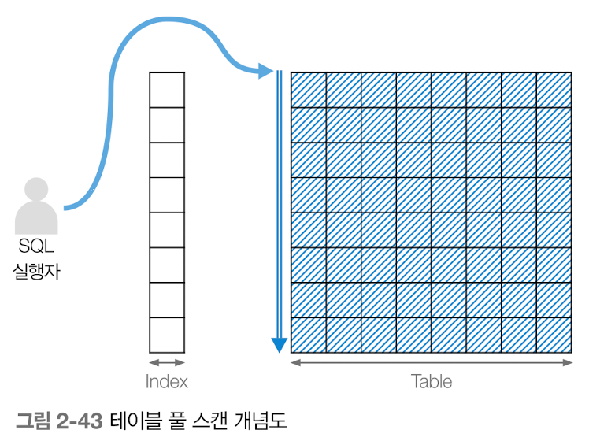
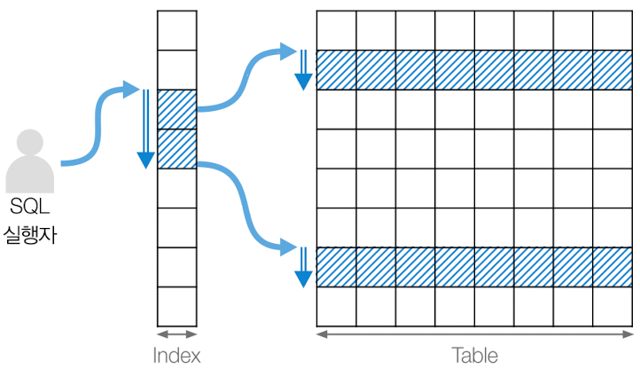
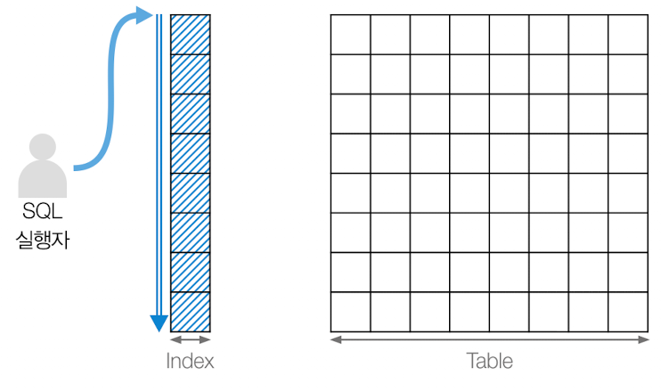
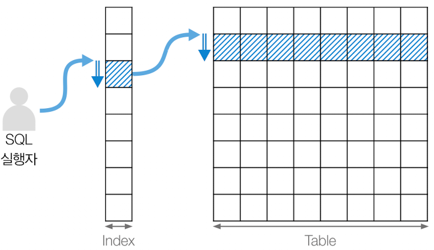
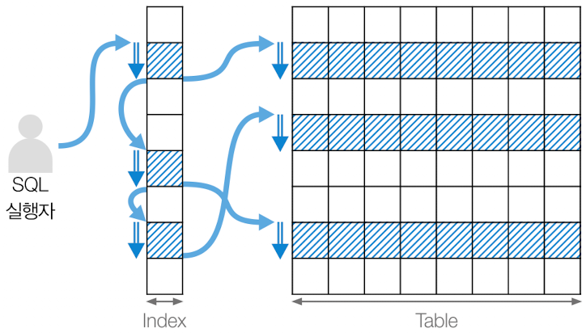
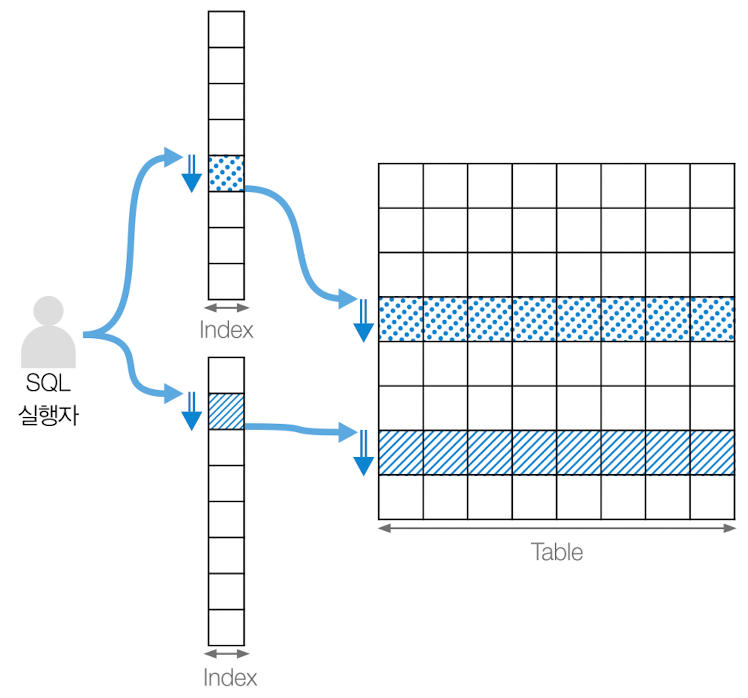
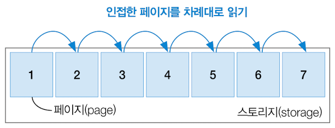
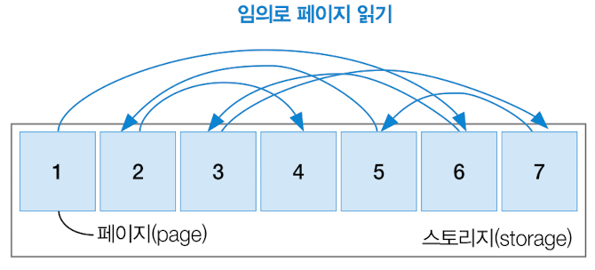
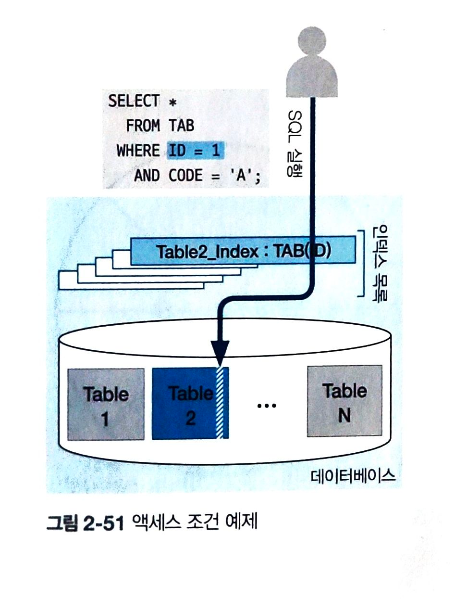
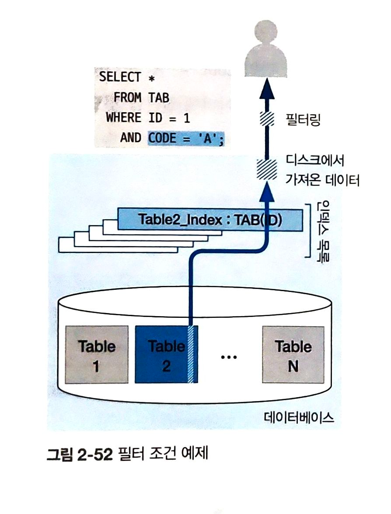

# 2장. SQL 튜닝 용어를 직관적으로 이해하기
- SQL 튜닝에 앞서 기본적으로 알아야 할 용어를 짚고 넘어가자.
- 튜닝을 수행하는 과정에서 DBMS의 전반적인 구조와 메커니즘에 기반을 둔 종합적 사고를 필요한 만큼 현업에서 통용되는 기본적인 용어는 반드시 알고 있어야 한다.

## 2.3. 개념적인 튜닝 용어
- 2.3절엥서는 오브젝트들을 스캔하는 유형, 디스크 접근 방식 등 쿼리 튜닝과 관련된 용어를 설명한다.

### 2.3.1. 기초 용어
### 오브젝트 스캔 유형
- 오브젝트 스캔 유형은 테이블 스캔(table scan)과 인덱스 스캔(index scan)으로 구분한다.
  - 테이블 스캔은 인덱스를 거치지 않고 바로 디스크에 위치한 테이블 데이터에 접근하는 유형이며, 인덱스 스캔은 인덱스로 테이블 데이터를 찾아가는 유형이다.
- 테이블 스캔 유형으로는 테이블 풀 스캔 방식이 있으며, 인덱스 스캔 유형으로는 인덱스 범위 스캔, 인덱스 풀 스캔, 인덱스 고유 스캔, 인덱스 루스 스캔, 인덱스 병합 스캔 방식이 있다.

#### 테이블 풀 스캔
- 테이블 풀 스캔(table full scan)은 인덱스를 거치지 않고 테이블로 바로 직행하여 처음부터 끝까지 데이터를 훑어보는 방식이다.
  - **WHERE** 절의 조건문을 기준으로 활용한 인덱스가 없거나 전체 데이터 대비 대량의 데이터가 필요할 때 테이블 풀 스캔을 수행할 수 있다.
  - 다만 테이블 풀 스캔은 보통 처음부터 끝까지 데이터를 검색하므로 성능 측면에서는 부정적으로 해석된다.
  - 테이블 풀 스캔은 인덱스 없이 사용하는 유일한 방식임을 기억하자.
    

#### 인덱스 범위 스캔
- 인덱스 범위 스캔(index range scan)은 말 그대로 인덱스를 범위 기준으로 스캔한 뒤 스캔 결과를 토대로 테이블의 데이터를 찾아가는 방식이다.
  - SQL 문에서 BETWEEN ~ AND 구문이나 <, >, LIKE 구문 등 비교 연산 및 구문에 포함될 경우 인덱스 범위 스캔으로 수행한다.
- 좁은 범위를 스캔할 때는 성능적으로 매우 효율적인 방법이지만 넓은 범위를 스캔할 때는 비효율적인 방식이라고 할 수 있다.
  

#### 인덱스 풀 스캔
- 인덱스 풀 스캔(index full scan)은 말 그대로 인덱스를 처음부터 끝까지 수행하는 방식이다.
  - 단, 테이블에 접근하지 않고 인덱스로 구성된 열 정보만 요구하는 SQL 문에서 인덱스 풀 스캔이 수행된다.
  - 인덱스는 테이블보다 상대적으로 적은 양을 차지하므로 테이블 풀 스캔 방식보다는 인덱스 풀 스캔 방식이 성능상 유리하다.
  - 그러나 인덱스라는 오브젝트의 전 영역을 모두 검색하는 방식인 만큼 검색 범위를 최대한 줄이는 방향으로 SQL 튜닝을 해야 한다.
  

#### 인덱스 고유 스캔
- 인덱스 고유 스캔(index unique scan)은 기본 키나 고유 인덱스로 테이블에 접근하는 방식으로, 인덱스를 사용하는 스캔 방식 중 가장 효율적인 스캔 방법이다.
  - WHERE 절에 = 조건으로 작성하며, 해당 조인 열이 기본 키 또는 고유 인덱스의 선두 열로 설정되었을떄 활용한다.
  

#### 인덱스 루스 스캔
- 인덱스 루스 스캔(index loose scan)은 인덱스의 필요한 부분들만 골라 스캔하는 방식이다.
  - 인덱스 범위 스캔처럼 넓은 범위에 전부 접근하지 않고, WHERE 절 조건문 기준으로 필요한 데이터와 필요하지 않는 데이터를 구분한 뒤 불필요한 인덱스 키는 무시한다.
- 인덱스 루스 스캔은 보통 GROUP BY 구문이나 MAX(), MIN() 함수가 포함되면 작동한다.
  - 이미 오름차순으로 정렬된 인덱스에서 최댓값이나 최솟값이 필요한 경우가 이에 해당한다.
  

#### 인덱스 병합 스캔
- 인덱스 병합 스캔(index merge scan)은 테이블 내에 생성된 인덱스들을 통합해서 스캔하는 방식이다.
  - WHERE 문 조건절의 열들이 서로 다른 인덱스로 존재하면 옵티마이저가 해당하는 인덱스를 가져와서 모두 활용하는 방식을 취합니다.
  - 통합하는 방법으로는 결합(union)과 교차(intersection) 방식이 있으며 이들 방식은 모두 실행 계획으로 출력된다.
- 인덱스 병합 스캔은 물리적으로 존재하는 개별 인덱스를 각각 수행하므로 인덱스에 접근하는 시간이 몇 배로 걸립니다.
  - 따라서 별개로 생성된 인덱스들은 보통 하나의 인덱스로 통합하여 SQL 튜닝을 수행하거나, SQL 문 자체를 독립된 하나의 인덱스만 수행하도록 변경할 수 있다.

---

### 디스크 접근 방식
- MySQL은 원하는 데이터를 찾으려고 데이터가 저장된 스토리지(storage)의 페이지(page)에 접근한다.
  - 여기서 페이지란 데이터를 검색하는 최소 단위로, 페이지 단위로 데이터 읽고 쓰기를 수행할 수 있다.
  - 서로 연결된 페이지를 차례대로 읽을 수도 있고, 여기저기 원하는 페이지를 임의로 열어보면서 데이터를 읽을 수도 있다.
    - 전자를 시퀀셜 액세스라 하고 후자를 랜덤 액세스라 한다.
#### 시퀀셜 액세스
- 시퀀셜 액세스(sequential access)는 물리적으로 인접한 페이지를 차례대로 읽는 순차 접근 방식으로, 보통 테이블 풀 스캔에서 활용한다.
  - 데이터를 찾고자 이동하는 디스크 헤더(disk header)의 움직임을 최소화하여 작업 시간과 리소스 점유 비용을 줄일 수 있다.
  - 테이블 풀 스캔일 때는 인접한 페이지를 여러 개 읽는 다중 페이지 읽기(multi-page read) 방식으로 수행한다.
- 다음은 스토리지에 있는 7개 페이지를 차례대로 읽고 있음을 보여준다.
  - 읽는 페이지 순서는 1 -> 2 -> 3 -> 4 -> 5 -> 6 -> 7
    

#### 랜덤 액세스
- 랜덤 액세스(random access)는 물리적으로 떨어진 페이지들에 임의로 접근하는 임의 접근 방식으로, 페이지가 위치한 물리적인 위치를 고려하지 않고 접근한다.
  - 페이지에 접근하는 디스크 헤더가 정해진 순서 없이 이동하는 만큼 디스크의 물리적인 움직임이 필요하고 다중 페이지 읽기가 불가능하기 때문에, 데이터의 접근 수행 시간이 오래 걸린다.
  - 따라서 최소한의 페이지에 접근할 수 있도록 접근 범위를 줄이고 효율적인 인덱스를 활용할 수 있도록 튜닝해야 한다.
- 다음은 스토리지에 있는 7개 페이지를 임의대로 읽고 있음을 보여준다.
  - 읽는 페이지 순서는 1 -> 6 -> 3 -> 7 -> 5 -> 2 -> 4
  

### 조건 유형
- SQL 문의 WHERE 절 조건문 기준으로 데이터가 저장된 디스크에 접근하게 된다.
  - 이때 필요한 데이터에 엑세스하는 조건문으로 데이터를 가져오고, 가져온 데이터에서 다시 한번 출력할 데이터만 추출한다.
  - 이때 맨 처음 디스크에서 데이터를 검색하는 조건을 액세스 조건이라 하고, 디스크에서 가져온 데이터에서 추가로 추출하거나 가공 및 연산하는 조건을 필터 조건이라고 한다.

#### 액세스 조건
- 디스크에 있는 데이터에 어떻게 접근할 것인지를 다루는 액세스 조건(access condition)은 SQL 튜닝에서 가장 중요한 핵심 사항이다.
  - WHERE 절 조건문으로 필요한 데이터만 골라 가져오는 방식은 이전 단락의 오브젝트 스캔 유형에서 이미 설명했듯이 테이블에 직접 접근할지, 인덱스를 어떻게 활용할 것인지에 관한 문제이다.
  - 그러나 SQL 조건문이 복잡하고 다양할 만큼 실제 데이터를 가져오기 위해 활용하는 SQL 문의 조건절에는 한계가 있다.
  - 따라서 옵티마이저는 WHERE 절 특정 조건문을 이용해 소량의 데이터를 가져오고, 인덱스를 통해 시간 방비를 줄이는 조건절을 선택하여, 스토리지 엔진의 데이터에 접근하고 MySQL 엔진으로 데이터를 가져온다.
- 다음 그림에서 WHERE 절에 ID = 1과 CODE = 'A' 조건문이 있지만, ID 열로 생성된 인덱스(Table2_index)를 활용해서 TABLE2 테이블의 일부 데이터에 접근하는 것을 알 수 있다.
  - 즉, ID = 1 조건문이 액세스 조건인 것이다.
  - 만약 CODE = 'A' 조건물을 액세스 조건으로 삼아 데이터에 접근한다면 인덱스 활용 없이 대량의 데이터에 접근할 것으로 예측할 수 있다.
    

#### 필터 조건
- 필터 조건(filter condition)은 액세스 조건을 이용해 MySQL 엔진으로 가져온 데이터를 기준으로, 추가로 불필요한 데이터를 제거하거나 가공하는 조건이다.
  - 액세스 조건으로 가져온 데이터를 대상으로 필터 조건인 CODE = 'A를 적용해 필터링 작업을 한다.
  - 만약 필터 조건에 따라 필터링할 데이터가 없다면 매우 훌륭한 SQL 문이고, 필터 조건으로 필터링되어 제거된 데이터가 다수 존재한다면 상대적으로 비효율적인 SQ 문일 것이다.
    - 그 이유는 스토리지 엔진에서 MySQL 엔진으로 데이터를 전달하는 오버헤드가 있으며, 필터 조건으로 제거될 데이터라면 스토리지 엔진의 데이터에 접근하는 과정에서 같이 제외되는 편이 성능적으로 효율적이기 때문이다.
- 이때, 필터 조건으로 제거되는 데이터 비율을 확인하고 특정 SQL 문의 튜닝이 필요한지 판단할 수 있다.
  - 해당 비율은 실행 계획의 filtered 항목에서 확인할 수 있다.
    
---
### 2.3.2. 응용 용어
### 선택도
- 선택도(selectivity)란 테이블의 특정 열을 기준으로 해당 열의 조건절(WHERE 절 조건문)에 따라 선택되는 데이터 비율을 의미한다.
  - 만약 해당 열에 중복되는 데이터가 많다면 **'선택도가 높다'** 고 평가할 수 있으며, 실제로 조건절에 따라 대량의 데이터가 선택될 것이다.
  - 한편 해당 열에 중복되는 데이터가 적다면 **'선택도가 낮다'** 고 평가할 수 있으며, 조건절에 따라 매우 적은 양의 데이터가 선택될 것이다.
- 낮은 선택도가 오히려 대용량 데이터에서 원하는 데이터만 골라내는 능력이라는 것을 우회적으로 알 수 있다.
  - 따라서 낮은 선택도를 가지는 열은 데이터를 조회하는 SQL 문에서 원하는 데이터를 빨리 찾기 위한 인덱스 열을 생성할 때 주요 고려대상이 된다.
- 선택도를 계산하는 수식은 다음과 같다.
  - 데이터에 접근하고자 특정 열에 대한 조건문을 작성하고, 해당 조건문에 포함되는 열의 선택도를 산출한다. 
  - > 선택도 = 선택한 데이터 건수 / 전체 데이터 건수
- 그러나 선택하는 조건절의 데이터 건수를 매번 계산할 수 없고 데이터의 삭제와 수정, 삽입이 수시로 발생하는 만큼, 보통은 중복이 제거된 데이터의 건수를 활용하여 선택도를 일반화한다.
  - > 변형된 선택도 = 1 / DISTINCT(COUNT 열명)

| 학번    | 이름   | 성별  |
|-------|------|-----|
| 10001 | 홍길동  | 남   |
| 10002 | 신사임당 | 여   |
| 10003 | 이순신  | 남   |
| 10004 | 유관순  | 여   |
| ...   | ...  | ... |
| 10100 | 유재석  | 남   |  
- 실제 학생 테이블에서 기본적인 선택도 수식을 활용하여 계산해보자.
  - 이 테이블에는 총 100건의 데이터가 저장되어 있다.
> 학번 열의 선택도 = 1 / 100 = 0.01
- 저장된 데이터는 총 100건으로, 기본 키에 해당하는 학번 데이터도 마찬가지로 100건이다.
  - 즉, 어떤 학번을 선택하더라도 항상 하나의 유일한 값을 출력하는 0.01의 선택도를 가진다.
  - 다시 말해 학번은 0.01의 낮은 선택도를 가진다고 할 수 있다.
```sql
  SELECT COUNT(*)                    -- 전체 데이터 건수 구하기
    FROM 학생;
  => 100
  
  SELECT COUNT(DISTINCT 학번)         -- 학번 데이터에서 중복을 제외한 개수 구하기
    FROM 학생;
  => 100

  SELECT 1 / COUNT(DISTINCT 학번)     -- 선택도 구하기
    FROM 학생;
  => 0.01
```
> 성별 열의 선택도 = 50 / 100 = 0.5
- 이번에는 성별 열에서 '여' 조건에 대한 선택도를 구하는 예제를 살펴보자.
  - 총 100건의 데이터 중 여성에 해당되는 데이터는 50건이라고 가정한다면, 성별은 0.5의 상대적으로 높은 선택도를 산출하게 된다. 
```sql
  SELECT COUNT(*)                    -- 전체 데이터 건수 구하기
    FROM 학생;
  => 100
  
  SELECT COUNT(DISTINCT 성별)         -- 성별 데이터에서 중복을 제외한 개수 구하기
    FROM 학생;
  => 2

  SELECT 1 / COUNT(DISTINCT 성별)     -- 선택도 구하기
    FROM 학생;
  => 0.5
```

### 카디널리티
- 카디널리티(cardinality)의 사전적 정의는 '하나의 데이터 유형으로 정의되는 데이터 행의 개수'로, 여기서는 전체 데이터에 접근한 뒤 출력될 것이라 예상되는 데이터 건수를 가리킨다.
  - 현업에서는 전체 행에 대한 특정 열의 중복 수치를 나타내는 지표로 자주 활용된다.
- 카디널리티를 정확하게 계산하려면 앞서 다른 선택도라는 개념이 필요하다.
  - 카디널리티는 전체 데이터 건수에 해당 열의 선택도를 곱하여 계산할 수 있다.
> 카디널리티 = 전체 데이터 건수 x 선택도
- 전체 데이터가 100건인 데이블에서 기본 키가 학번인 열을 대상으로 카디널리티를 구한다고 가정하자.
  - 학번 열의 카디널리티는 100 x 0.01 = 1건으로 모든 학번의 데이터값이 고유한 만큼 1건의 데이터만 출력되리라 예측할 수 있다.
- 그러나 우리는 MySQL에서 계산하는 방식으로 카디널리티를 정의하고자 한다.
  - 즉, 중복을 제외한 유일한 데이터 값의 수로 계산한다.
  - 따라서 특정 열에 중복된 값이 많다면 카디널리티가 낮다고 할 수 있으며, 해당 열을 조회하면 상당수의 데이터를 거르지 못한 채 대량의 데이터가 출력되리라 예측할 수 있다.
- 한편, 특정 열에 중복되는 값이 적다면 카디널리티가 높다고 평가할 수 있으며, 그만큼 많은 데이터를 제거한 뒤 소수의 데이터만 출력되리라 예상할 수 있다.
  - **즉, 중복도가 높으면 카디널리티가 낮고 중복도가 낮으면 카디널리티가 높다.**
  
### 힌트
- 우리는 데이터베이스에게 힌트를 전달함으로써 의도대로 작동하도록 도울 수 있다.
  - 즉, 데이터를 빨리 찾을 수 있게 추가 정보를 전달하는게 힌트이다.
#### 학생 테이블
| 학번       | 이름   | 전공코드 |
|----------|------|------|
| 10001    | 홍길동  | CS   |
| 10002    | 신사임당 | MK   |
| 10003    | 이순신  | PH   |
| 10004    | 유관순  | MS   |
| 10005    | 유재석  | AR   |  
| ...      | ...  | ...  |
| 10100000 | 이순신  | CS   |  
#### 학생_IDX01 인덱스
| 이름   | 위치       |
|------|----------|
| 강감찬  | 23129 위치 |
| 신사임당 | 10002 위치 |
| 유관순  | 10003 위치 |
| ...  | ...      |
#### 학생_IDX01 인덱스
| 전공코드 | 위치          |
|------|-------------|
| AR   | 10005 위치    |
| CS   | 10001 위치    |
| CS   | 10010000 위치 |
| ...  | ...         |

```sql
  SELECT 학번, 전공코드
    FROM 학생
   WHERE 이름 = '유재석';
```
- 다음 쿼리는 학생의 이름으로 학번과 전공코드 데이터를 조회하는 SQL 문이다.
  - '유재석'이라는 이름의 학생 정보를 가져오므로, 학생 열로 구성된 학생_IDX01 인덱스를 이용하면 데이블을 처음부터 끝까지 찾지 않아도 원하는 데이터를 빠르게 찾을 수 있다.
---
- 따라서 우리는 학생_IDX01 인덱스를 활용하여 길을 찾아 달라는 힌트를 쿼리에 직접 작성할 수 있다.
  - 인덱스를 사용하겠다는 힌트는 USE INDEX 키워드를 사용하며, 크게 두 가지 사항을 명시적으로 작성하여 힌트를 사용한다.
- 첫 번째는 다음과 같이 /*! */ 형태의 주석처럼 힌트를 명시하는 방법이다.
```sql
  SELECT 학번, 전공코드
    FROM 학생 /*! USE INDEX (학생_IDX01) */
   WHERE 이름 = '유재석';
```
- 두 번째는 다음과 같이 주석 표기 없이 쿼리의 일부로 작성하는 방법이다.
```sql
  SELECT 학번, 전공코드
    FROM 학생 /*! USE INDEX (학생_IDX01) */
   WHERE 이름 = '유재석';
```
#### 주요 힌트 목록
| 힌트            | 설명                              | 활용도 |
|---------------|---------------------------------|-----|
| STRAIGHT_JOIN | FROM 절에 작성된 테이블 순으로 조인을 유도하는 힌트 | 높음  |
| USE INDEX     | 특정 인덱스를 사용하도록 유도하는 힌트           | 높음  |
| FORCE INDEX   | 특정 인덱스를 사용하도록 강하게 유도하는 힌트       | 낮음  |
| IGNORE INDEX  | 특정 인덱스를 사용하지 못하도록 유도하는 힌트       | 중간  |
> #### 강력하지 않은 힌트
> 명시적으로 힌트를 작성해도 옵티마이저는 무조건 힌트를 참고하지 않습니다. 옵티마이저가 비효율적이라고 예측하면 사용자가 작성된 힌트는 무시될 수 있다.

> #### 힌트 사용 시 고려사항
> - 힌트가 적용된 서비스 환경에서는 데이터 건수가 수시로 급변할 수 있고, 테이블이나 인덱스/뷰 등에 변화가 생기면 SQL 문 실행 시 오류가 발생할 가능성도 있다.
>   - 이때는 SQL 문에 힌트를 작성하면 별도로 관리해야 한다.
> ##### (첫째 날)
> ```sql
> SELECT 학번, 전공코드
>   FROM 학생 /*! USE INDEX (학생_IDX01) */
>  WHERE 이름 = ?;
> ```
> - SQL 문에 학생_IDX01이라는 인덱스를 사용할 것이라는 USE INDEX 힌트를 작성하는 쿼리이다.
> ##### (둘째 날)
> ```sql
>  ALTER TABLE 학생 DROP INDEX 학생_IDX01;
> ```
> - 담당자가 학생_IDX01 인덱스를 불필요한 인덱스라고 삭제하는 쿼리이다.
> ##### (둘째 날: 인덱스 삭제 후)
> ```sql
> SELECT 학번, 전공코드
>   FROM 학생 /*! USE INDEX (학생_IDX01) */
>  WHERE 이름 = ?;
>  
> /* ERROR 1176 (42000): Key '학생_IDX01' doesn't exist in table '학생' */
> ```
> - SQL 문에 작성된 인덱스가 삭제되었으므로 해당 SQL 문을 실행하지 못하고 오류 메시지를 출력하는 쿼리이다.
>   - 즉, 운영 서비스상 에러가 발생해 서비스 장애로 이어진다.
>   - MySQL과 MariaDB에서는 작성된 힌트의 오브젝트가 존재하지 않으면 에러가 발생하는데, 이는 상용 DBMS인 오라클과는 다른 방식임을 인지해야 한다.
> - 한편 오라클의 경우 힌트가 부적절하게 작성되었거나 존재하지 않는 오브젝트를 명시하더라고 해당 힌트를 무시하고 SQL 문을 실행한다.

---
### 콜레이션
- 콜레이션(collation)은 특정 문자셋으로 데이터베이스에 저장된 값을 비교하거나 정렬하는 작업의 규칙을 의미한다.
#### 콜레이션의 대소관계 비교
| utf8_bin | utf8_general_ci |
|----------|-----------------|
| A        | A               |
| B        | a               |
| a        | B               |
| b        | b               |
- 이들 콜레이션은 데이터베이스 단위, 테이블 단위, 심지어 열 단위까지 세세하게 설정할 수 있다.
  - 만약 학생 테이블의 콜레이션이 utf8_general_ci로 설정되어 있다면, 학번 열과 전공 코드 열에 콜레이션이 명시되어 있지 않더라도 학생 테이블의 콜레이션인 utf8_general_ci가 적용된다.
  - 이때 만약 이름 열에 콜레이션 utf8_bin을 명시했따면 상위테이블의 콜레이션을 무시하고 utf8_bin으로 설정된다.
- **즉, 이름 열은 콜레이션 utf8_bin이고 학번 열과 전공코드 열은 콜레이션 utf8_general_ci이 된다.**
> #### 캐릭터셋 vs 콜레이션
> 데이터를 저장하는 방식에 대한 캐릭터셋과 데이터 정렬에 대한 콜레이션을 다음과 같이 간단히 비교해보자.

| 캐릭터셋(character set)                | 콜레이션(collation)                           |
|------------------------------------|-------------------------------------------|
| 데이터를 저장을 어떻게 할 것인가?                | 데이터 정렬을 어떻게 할 것인가?                        |
| - 영문 + 숫자                          | - a와 A 간의 대소관계 정의                         |
| - 중국어                              | - a와 b 간의 대소관계 정의                         |
| - 다국어                              | ...                                       |
| - 예) utf8(다국어), utf8mb4(다국어 + 이모지) | - 예) utf8_general_ci, utf8_bin(다국어 + 이모지) |
---
### 통계정보
- 옵티마이저는 통계정보를 기반을 두고 SQL 문의 실행 계획을 수립한다.
  - 통계정보는 데이터 베이스 관리자(DBA)가 맡은 역할이긴 하지만, 쿼리를 수행하는 역할자 또한 통계정보가 현재 최신으로 관리되는지, 오래된 통계정보 때문에 SQL 문이 엉뚱한 방향으로 수행되지는 않는지를 확인할 수 있다.
- MySQL은 시스템 변수를 통해 활용할 통계정보의 수준을 정의할 수 있다.
  - 기본적으로 테이블 통계정보와 인덱스 통계정보, 선택적인 열 통계정보를 토대로 어떤 인덱스를 활용해 데이터 베이스에 엑세스할 것인지, 어떤 테이블을 드라이빙 테이블로 선택할지 등을 결정한다.
  - 따라서 통계정보의 최신성 유지 및 관리가 매우 중요하다.
### 히스토그램
- 히스토그램(histgram)은 테이블의 열값이 어떻게 분포되어 있는지를 확인하는 통계정보이다.
  - 옵티마이저가 실행 계획을 최적화하고자 참고하는 정보로, 잘못된 히스토그램 정보가 있다면 잘못된 샐행 계획으로 SQL 문이 수행될 수 있다.
  - 만약 특정 열값들의 통계정보가 히스토그램으로 수집되지 않았다면, 중복이 제거된 열값의 개수(COUNT(DISTINCT 열명))로 대략적인 열값의 분포를 예측하고 실행 계획을 수립한다.
- MySQL에서 내부적으로 열의 분포를 저장할 때는 높이균형 히스토그램(height balanced histogram) 방식을 사용한다.
  - 즉, 저장된 데이터값의 종류가 수백, 수천, 수만 개 이상이므로 이 데이터값들을 그룹화하고, 정해진 양동이(bucket)(= 이후 버킷으로 표기)만큼 분리해서 열의 통계정보 데이터를 저장한다.