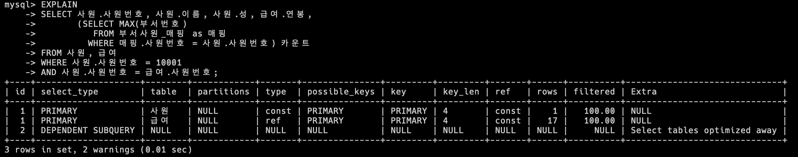
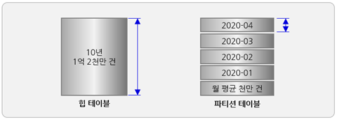

# 3장. SQL 튜닝의 실행 계획 파헤치기

## 3.2. 실행 계획 수행
### 3.2.1. 기본 실행 계획 수행
- 실행 계획을 확인하는 키워드로는 EXPLAIN, DESCRIBE, DESC가 있다.

### 3.2.2. 기본 실행 계획 항목 분석
- 이전 단락에서 EXPLAIN 키워드로 실행 계획을 조회하면 id, select_type, table, type, key 등의 정보가 출력되었다.
#### id
- 실행 순서를 표시하는 숫자이다.
  - SQL 문이 수행되는 차례를 ID로 표기한 것으로, 조인할 때는 똑같은 ID가 표시된다.
  - 즉, ID의 숫자가 작을수록 먼저 수행된 것이고 ID가 같은 값이라면 두 개 테이블의 조인이 이루어졌다고 해석할 수 있다.
- 첫번째 행과 두 번째 행의 ID 값이 똑같이 1으므로, 처음 조인이 발생했으리라 해석할 수 있다.
  - 세 번째 행의 ID 값이 2인 것으로 미루어 보아 ID가 1인 첫 번째 행과 두 번째 행의 조인이 이루어진 뒤에 세 번째 행이 수행된 것이라고 짐작할 수 있다.
  - 
#### select_type
- SQL 문을 구성하는 SELECT 문의 유형을 출력하는 항목이다.
  - SELECT 문이 단순히 FROM 절에 위치한 것인지, 서브쿼리인지, UNION 절로 묶이 SELECT 문인지 등의 정보를 제공한다.
- **SIMPLE**
  - UNION이나 내부 쿼리가 없는 SELECT 문이라는 걸 의미하는 유형이다.
  - 말 그대로 단순한 SELECT 구문으로만 작성된 경우를 가리킨다.
- **PRIMARY**
  - 서브쿼리가 포함된 SQL 문이 있을 때 첫 번째 SEELCT 무에 해당하는 구문에 표시되는 유형이다.
    - 즉, 서브쿼리를 감싸는 외부 쿼리이거나, UNION이 포함된 SQL 문엥서 첫 번째로 SELECT 키워드가 작성된 구문에 표시된다.
- **SUBQUERY**
  - 독립적으로 수행되는 서브쿼리를 의미한다.
- **DERIVED**
  - FROM 절에 작성된 서브쿼리라는 의미이다.
    - 즉, FROM 절의 별도 임시 테이블인 인라인 뷰를 말한다.
- **UNION**
  - UNION 및 UNION ALL 구문으로 합쳐진 SELECT 문에서 첫 번째 SELECT 구문을 제외한 이후의 SELECT 구문에 해당하는 걸 나타낸다.
  - 이때 UNION 구문의 첫 번째 SELECT 절은 PRIMARY 유형으로 출력된다.
- **UNION RESULT**
  - UNION ALL이 아닌 UNION 구문으로 SELECT 절을 결합했을 때 출력된다.
    - UNION은 출력 결과에 중복이 없는 유일한(uniqueness) 속성을 가지므로 각 SELECT 절에서 데이터를 가져와 정렬하여 중복 체크하는 과정을 거친다.
    - 따라서 UNION RESULT는 별도의 메모리 또는 디스크에 임시 테이블을 만들어 중복을 제거하겠다는 의미로 해석할 수 있다.
    - 한편 UNION 구문으로 결합되기 전의 각 SELECT 문이 중복되지 않는 결과가 보장될 때는 UNION 구문보다는 UNION ALL 구문으로 변경하는 SQL 튜닝을 수행한다.
- **DEPENDENT SUBQUERY**
  - UNION 또는 UNION ALL을 사용하는 서브쿼리가 메인 테이블의 영향을 받는 경우로, UNION으로 연결된 단위 쿼리들 중에서 처음으로 작성한 단위 쿼리에 해당되는 경우이다.
- **DEPENDENT UNION**
  - UNION 또는 UNION ALL을 사용하는 서브쿼리가 메인 테입르의 영향을 받는 경우로, UNION으로 연결된 단위 쿼리 중 첫 번째 단위 쿼리를 제외하고 두 번쨰 단위 쿼리에 해당되는 경우이다.
- **UNCACHEABLE SUBQUERY**
  - 말 그대로 메모리에 상주하여 재활용되어야 할 서브쿼리가 재사용되지 못할 때 출력되는 유형이다.
    1. 해당 서브쿼리 안에 사용자 정의 함수나 사용자 변수가 포함된 경우
    2. RAND(), UUID() 함수등을 사용하여 매번 조회 시마다 결과가 달라지는 경우
  - 만약 자주 호출되는 SQL 문이라면 메모리에 서브쿼리 결과가 상주할 수 있도록 변경하는 방향으로 SQL 튜닝을 검토해볼 수 있다.
  - 다음 RAND() 함수는 0~1 사이의 소수점 기준으로 17자리 숫자를 출력(예. 0.24538510340223)하는 함수
    - 앞에서 설명한 대로 매번 출력값이 달라지는 RAND() 함수 떄문에 서브쿼리 (SELECT ROUND(RAND() * 100000))는 메모리에 캐시되지 못한다.
- **MATERIALIZED**
  - IN 절 구문에 연결된 서브쿼리가 임시 테이블을 생성한 뒤, 조인이나 가공 작업을 수행할 때 출력되는 유형이다.
    - 즉, IN 절의 서브쿼리를 임시 테이블로 만들어서 조인 작업을 수행하는 것이다.
#### table
- 말 그대로 테이블 명을 표시하는 항목이다.
  - 실행 계획 정보에서 테이블명이나 테이블 별칭(alias)를 출력하며, 서브쿼리나 임시 테이블을 만들어서 별도의 작업을 수행할 때는 <subquery#>나 <derived#>라고 출력된다.
#### partitions
- 실행 계획의 부가 정보로, 데이터가 저장된 논리적인 영역을 표시하는 항목이다.
  - 사전에 정의한 전체 파티션 중 특정 파티션에 선택적으로 접근하는 것이 SQL 성능 측면에서 유리하다.
  - 만약 너무 많은 영역의 파티션에 접근하는 것으로 출력된다면 파티션 정의를 튜닝해봐야 할 것이다.
    
#### type
- 테이블의 데이터를 어떻게 찾을지에 관한 정보를 제공하는 항목이다.
  - 테이블을 처음부터 끝까지 전부 확인할지 아니면 인덱스를 통해 바로 데이터를 찾아갈지 등을 해석할 수 있다.
- **system**
  - 테이블에 데이터가 없거나 한 개만 있는 경우로, 성능상 최상의 type이다.
- **const**
  - 조회되는 데이터가 단 1건일 때 출력되는 유형으로, 성능상 매우 유리한 방식이다.
  - 고유 인덱스나 기본 키를 사용하여 단 1건의 데이터에만 접근하면 되므로 속도나 리소스 사용 측면에서 지향해야 할 타입이다.
- **eq_ref**
  - 조인이 수행될 때 드리븐 테이블의 데이터에 접근하며 고유 인덱스 또는 기본 키로 단 1건의 데이터를 조회하는 방식이다.
    - 드라이빙 테이블과의 조인 키가 드리븐 테이블에 유일하므로 조인이 수행될 때 성능상 가장 유리한 경우라고 할 수 있다.
- **ref**
  - 위 eq_ref 유형과 유사한 방식으로, 조인을 수행할 때 드리븐 테이블의 데이터 접근 범위가 2개 이상일 경우를 의미한다.
    - 즉, 드라이빙 테이블과 드리븐 테이블이 조인을 수행하면 일대다 관계가 되므로, 드라이빙 테이블의 1개 값이 드리븐 테이블에서는 2개 이상의 데이터로 존재한다.
    - 이때 기본 키나 고유 인덱스를 활용하면 2개 이상의 데이터가 검색되거나, 유일성이 없는 비고유 인덱스를 사용하게 된다.
  - 드리븐 테이블의 데이터양이 많지 않을 때는 성능 저하를 크게 우려하지 않아도 되지만, 데이터양이 많다면 접근해야 할 데이터 범위가 넓어져 성능 저하의 원인이 되는지 확인해야 한다.
  - 한편으로는 =, <, > 등의 연산자를 사용해 인덱스로 생성된 열을 비교할 때도 출력된다.
- **ref_or_null**
  - ref 유형과 유사하지만 IS NULL 구문에 대해 인덱스를 활용하도록 최적화된 방식이다.
  - MySQL과 MariaDB는 NULL에 대해서도 인덱스를 활용하여 검색할 수 있으며, 이때 NULL은 가장 앞쪽에 정렬된다.
  - 테이블에서 검색할 NULL 데이터양이 적다면 ref_of_null 방식을 활용했을 때 효율적인 SQL 문이 될 것이나, 검색할 NULL 데이터양이 많다면 SQL 튜닝의 대상이 될 것이다.
- **range**
  - 테이블 내의 연속된 데이터 범위를 조회하는 유형으로 =, <>, >, >=, <, <=, IS NULL, <=>, BETWEEN 또는 IN 연산을 통해 범위 스캔을 수행하는 방식이다.
  - 주어진 데이터 범위 내에서 행 단위로 스캔하지만, 스캔할 범위가 넓으면 성능 저하의 요인이 될 수 있으므로 SQL 튜닝 검토 대상이 된다.
- **fulltext**
  - 텍스트 검색을 빠르게 처리하기 위해 전문 인덱스(full text index)를 사용하여 데이터에 접근하는 방식이다.
- **index_merge**
  - 말 그대로 결합된 인덱스들이 동시에 사용되는 유형이다.
    - 즉, 특정 테이블에 생성된 두 개 이상의 인덱스가 병합되어 동시에 적용된다.
    - 이때 전문 인덱스는 제외된다.
- **index**
  - type 항목의 index 유형은 인덱스 풀 스캔을 의미한다.
    - 즉, 물리적인 인덱스 블록(block)을 처음부터 끝까지 훑는 방식을 말한다.
    - 이때 데이터를 스캔하는 대상이 인덱스라는 점이 다를 뿐, 이어서 설명할 ALL 유형(테이블 풀 스캔 방식)과 유사하다.
  - 인덱스는 보통 테이블보다 크기가 작으므로 테이블 풀 스캔 방식보다는 빠를 가능성이 높다.
- **ALL**
  - 테이블을 처음부터 끝까지 읽는 테이블 풀 스캔 방식에 해당되는 유형이다.
  - ALL 유형은 활용할 수 있는 인덱스가 없거나 인덱스를 활용하는 게 오히려 비효율적이라고 옵티마이저가 판단했을 때 선택된다.
  - ALL 유형일 떄는 인덱스를 새로 추가하거나 기존 인덱스를 변경하여 인덱스를 활용하는 방식으로 SQL 튜닝을 할 수 있으나, 전체 테이블 중 10~20% 이상 분량의 데이터를 조회할 때는 ALL 유형이 오히려 성능상 유리할 수 있다.
#### possible_keys
- 옵티마이저가 SQL 문을 최적화하고자 사용할 수 있는 인덱스 목록을 출력한다.
  - 다만 실제 사용한 인덱스가 아닌, 사용할 수 있는 후보군의 기본 키와 인덱스 목록만 보여주므로 SQL 튜닝의 효용성은 없다.
#### key
- 옵티마이저가 SQL 문을 최적화하고자 사용한 기본 키(PK) 또는 인덱스 명을 의미한다.
  - 어느 인덱스로 데이터를 검색했는지 확인할 수 있으므로, 비효율적인 인덱스를 사용했거나 인덱스 자체를 사용하지 않았다면 SQL 튜닝의 대상이 된다.
#### key_len
- 인덱스를 사용할 때는 인덱스 전체를 사용하거나 일부 인덱스만 사용한다.
  - key_len은 이렇게 사용한 인덱스의 바이트(bytes) 수를 의미한다.
  - UTF-8 캐릭터셋 기준으로 INT 데이터 유형은 단위당 4바이트, VARCHAR 데이터 유형은 단위당 3바이트임을 인지하고 key_len을 이해해보자.
#### ref
- reference의 약자로, 테이블 조인을 수행할 때 어떤 조건으로 해당 테이블에 액세스되었는지를 알려주는 정보이다.
#### rows
- SQL 문을 수행하고자 접근하는 데이터의 모든 행(row) 수를 나타내는 예측 항목이다.
  - 즉, 디스크에서 데이터 파일을 읽고 메모리에서 처리해야 할 행 수를 예상하는 값이고, 수시로 변동되는 MySQL의 통계정보를 참고하여 산출하는 값이므로 수치가 정확하지는 않다.
#### filtered
- SQL 문을 통해 DB 엔진으로 가져온 대상으로 필터 조건에 따라 어느 정도의 비율로 데이터를 제거했는지를 의미하는 항목이다.
  - 예를 들어 DB 엔진으로 100건의 데이터를 가져왔다고 가정한다면, 이후 WHERE 절의 사원번호 between 1 and 10 조건으로 100건의 데이터가 10건으로 필터링 된다.
    - 이처럼 100건에서 10건으로 필터링 되었으므로 filtered에는 10이라는 정보가 출력될 것이다.
    - 이때 단위는 %이다.
#### extra
- SQL 문을 어떻게 수행할 것인지에 관한 추가 정보를 보여주는 항목이다.
  - 이러한 부가적인 정보들은 세미콜론(;)으로 구분하여 여러 가지 정보를 나열할 수 있으면 30여 가지 항목으로 정리할 수 있다.
- **Distinct**
  - 중복이 제거되어 유일한 값을 찾을 때 출력되는 정보이다.
  - 중복 제거가 포함 되는 distinct 키워드나 union 구문이 포함된 경우 출력된다. 
- **Using where**
  - 실행 계획에서 자주 볼 수 있는 extra 정보이다.
  - WHERE 절의 필터 조건을 사용해 MySQL 엔진으로 가져온 데이터를 추출할 것이라는 의미로 이해할 수 있다.
- **Using temporary**
  - 데이터의 중간 결과를 저장하고자 임시 테이블을 생성하곘다는 의미이다.
    - 데이터를 가져와 저장한 뒤에 정렬 작업을 수행하거나 중복을 제거하는 작업 등을 수행한다.
    - 보통 DISTINCT, GROUP BY, ORDER BY 구문이 포함된 경우 Useing temporary 정보가 출력된다.
  - 임시 테이블을 메모리에 생성하거나, 메모리 영역을 초과하여 디스크에 임시 테이블을 생성하면 Using temporary는 성능 저하의 원인이 될 수 있다.
    - 따라서 이 항목의 정보가 출력되는 쿼리는 SQL 튜닝의 대상이 될 수 있다.
- **Using index**
  - 물리적인 데이터 파일을 읽지 않고 인덱스만을 읽어서 SQL 문의 요청사항을 처리할 수 있는 경우를 의미한다.
    - 일명 커버링 인덱스(covering index) 방식이라고 부르며, 인덱스로 구성된 열만 SQL 문에서 사용할 경우 이방식을 활용한다.
    - 물리적으로도 테이블보다 인덱스가 작고 정렬되어 있으므로 적은 양의 데이터에 접근할 때 성능 측면에서 효율적이다.
- **Using filesort**
  - 정렬이 필요한 데이터를 메모리에 올리고 정렬 작업을 수행한다는 의미이다.
    - 보통 이미 정렬된 인덱스를 사용하면 추가적인 정렬작입어 필요 없지만, 인덱스를 사용하지 못할 때는 정렬을 위해 메모리 영역에 데이터를 올리게 된다.
    - Using filesort는 추가적인 정렬 작업이므로 인덱스를 활용하도록 SQL 튜닝 검토대상이 될 수 있다.
- **Using join buffer**
  - 조인을 수행하기 위해 중간 데이터 결과를 저장하는 조인 버퍼를 사용한다는 의미이다.
    - 즉, 드라이빙 테이블의 데이터에 먼저 접근한 결과를 조인 버퍼에 담고 난 뒤, 조인 버퍼와 드리븐 테이블 간에 서로 일치하는 조인 키값을 찾는 과정을 수행한다.
    - 이러한 조인 버퍼를 활용하는 일련의 과정이 존재하면 Using join buffer 정보가 출력된다.
- **Using union/ Using intersect/ Using sort_union**
  - 앞서 실행 계획의 type 항목에서는 두 개 이상의 인덱스가 병합되어 데이터에 접근하는 경우를 나타내는 index_merge 유형을 설명했다.
    - 이처럼 인덱스가 병합되어 실행되는 SQL 문의 extra 항목에는 인덱스를 어떻게 병합했는지에 관한 상세 정보가 출력된다.
  - Using union
    - 인덱스들을 합집합처럼 모두 결합하여 데이터에 접근한다는 뜻이다.
    - 보통 SQL 문이 OR 구문으로 작성된 경우에 해당한다.
  - Using intersect
    - 인덱스들을 교집합처럼 추출하는 방식이다.
    - SQL 문이 AND 구문으로 작성된 경우에 확인할 수 있는 extra 정보이다.
  - Using sort_union
    - 기본적으로 Using union과 유사하지만, WHERE 절의 OR 구문이 동등조건이 아닐 때 확인할 수 있는 extra 정보이다.
- **Using index condition**
  - MySQL 엔진에서 인덱스로 생성된 열의 필터 조건에 따라 요청된 데이터만 필터링하는 Using where 방식과 달리, 필터 조건을 스토리지 엔진으로 전달하여 필터링 작업에 대한 MySQL 엔진의 부하를 줄이는 방식이라고 이해하면 된다.
  - 이는 스토리지 엔진의 데이터 결과를 MySQL 엔진으로 전송하는 데이터양을 줄여 성능 효율을 높일 수 있는 옵티마이저의 최적화 방식이다.
- **Using index condition(BKA)**
  - type 정보의 Using index condition 유형과 비슷하나, 데이터를 검색하기 위해 배치 키 액세스를 사용하는 방식이다.
- **Using index for group-by**
  - SQL 문에 Group by 구문이나 Distinct 구문이 포함될 때는 인덱스로 정렬 작업을 수행하여 최적화한다.
  - 이때 Using index for group-by는 인덱스로 정렬 작업ㅇ르 수행하는 인덱스 루스 스캔일 때 출력되는 부가 정보이다.
- **Not exists**
  - 하나의 일치하는 행을 찾으면 추가로 행을 더 검색하지 않아도 될 떄 출력되는 유형이다.
    - 해당 메커니즘은 왼쪽 외부 조인 또는 오른쪽 외부 조인에서 테이블에 존재하지 않는 데이터를 명시적으로 검색할 때 발생한다.
  - 예를 들어, SELECT * FROM t1 LEFT JOIN t2 on (...) WHERE t2.not_null_column IS NULL; 이라는 SQL 문에서 t1과 t2 테이블의 조건에 일치하는 데이터가 없는 경우에는 그 값이 NULL이 될 수 있으므로, 일치하는 행을 하나 찾았으니 검색을 중지하게 된다.
    - 이때, Not exists가 출력된다.

### 3.2.3. 좋고 나쁨을 판단하는 기준
- 실행 계획을 수행하여 출력된 정보를 살펴보았을 때, SQL 튜닝 대상인 실행 계획과 튜닝이 필요하지 않은 실행 계획을 명확히 선을 그어 구분하기란 어려운 작업이다.
  - 하지만 그간의 SQL 튜닝 경험을 바탕으로 나름의 기준을 수립하고 각자의 상황에 맞게 검토 대상을 추출할 수는 있다.
  - 어느 쪽이 좋다 또는 나쁘다고 늘 단언하기는 어렵지만, SQL 튜닝 대상을 검토할 때 아래 기준을 참조할 수는 있다.
#### select_type 항목의 판단 기준
| 좋음      |               | 나쁨            |
|---------|---------------|---------------|
| SIMPLE  |               | DEPENDENT *   |
| PRIMARY | <=======> | UNCACHEABLE * |
| DERIVED |               |               |
#### type 항목의 판단 기준
| 좋음     |               | 나쁨    |
|--------|---------------|-------|
| system |               | index |
| const  | <=======> | all   |
| eq_ref |               |       |
#### extra 항목의 판단 기준
| 좋음          |               | 나쁨              |
|-------------|---------------|-----------------|
|       |               | Using filesort  |
| Using index | <=======> | Using temporary |

### 3.2.4. 확장된 실행 계획 수행
