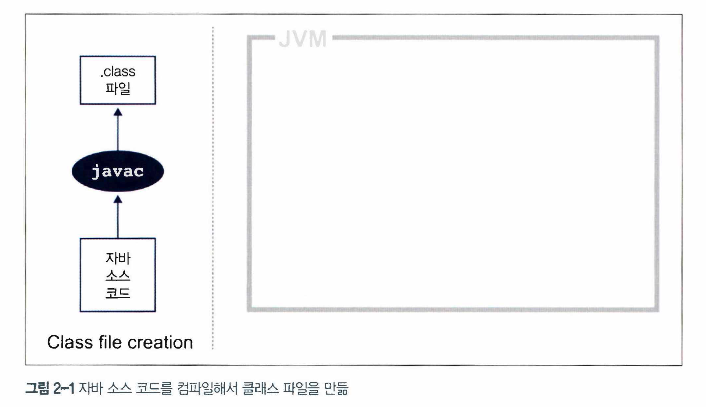
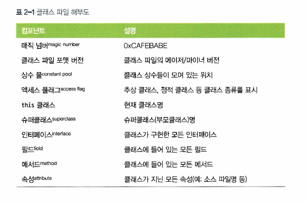
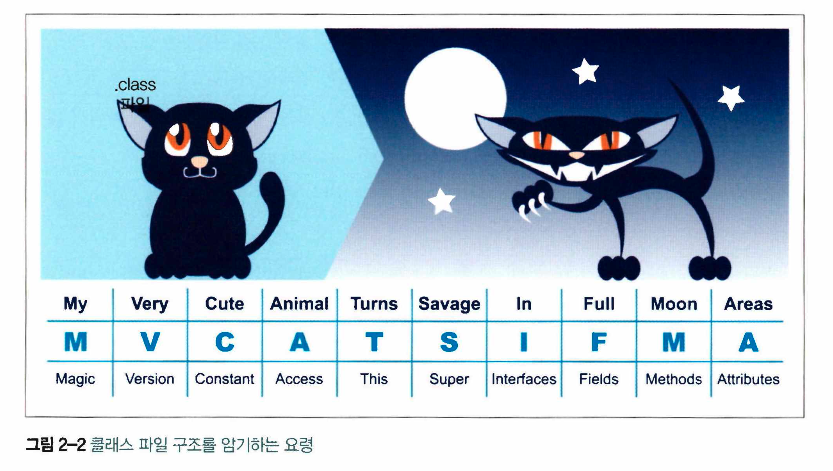
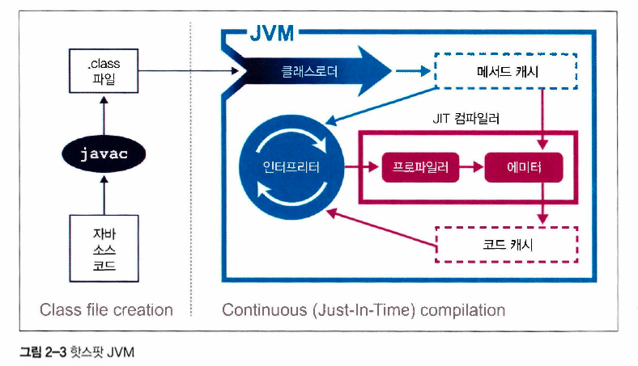

# Chapter 2. JVM 이야기

성능에 관심 있는 개발자라면 기본적인 JVM 기술 스택의 구조를 이해해야 합니다.   
JVM 기술을 이해하면 더 좋은 소프트웨어를 개발할 수 있고 성능 이슈를 탐구할 때 필요한 이론적 배경지식을 갖추게 됩니다.

## 2.1 인터프리팅과 클래스로딩
자가 가상 머신을 규정한 명세서에 따르면 JVM은 스택 기반의 해석 머신입니다.   
레지스터는 없지만 일부 결과를 실행 스택에 보관하며, 이 스택의 맨 위에 쌓인 값을 가져와 계산을 합니다.

JVM 인터르피터의 기본 로직은 평가 스택을 이용해 중간값들을 담아두고 가장 마지막에 실행된 명령어와 독립적으로 프로그램을 구성하는 옵코드를 하나씩 순서대로 처리하는 'while 루프 안의 switch문'입니다.

java HelloWorld 명령을 내려 자바 애플리케이션을 실행하면 OS는 가상 머신 프로세스(자바 바이너리)를 구동합니다.   
자바 가상 환경이 구성되고 스택 머신이 초기화된 다음, 실제로 유저가 작성한 HelloWolrd 클래스 파일이 실행됩니다.

우리도 알다시피 애플리케이션의 진입점은 HelloWorld.class에 있는 main() 메서드입니다.   
제어권을 이 클래스로 넘기려면 가상 머신이 실행이 되기 전에 이 클래스를 로드해야 합니다.

여기서 자바 클래스로딩 매커니즘이 관여합니다.   
자바 프로세스가 새로 초기화되면 사슬처럼 줄지어 연결된 클래스로더가 차례차례 작동합니다.   
제일 먼저 부트스트랩 클래스가 기지개를 켜며 자바 런타임 코어 클래스를 로드합니다.   
런타임 코어 클래스는 자바 8 이전까지는 rt.jar 파일에서 가져오지만, 자바 9 이후부터는 런타임이 모듈화되고 클래스로딩 개념 자체가 많이 달라졌습니다.

부트스트랩 클래스로더의 주 임무는 다른 클래스로더가 나머지 시스템에 필요한 클래스를 로드할 수 있게 최소환의 필수 클래스만 로드하는 것입니다.

그 다음, 확장 클래스로더가 생깁니다.   
부트스트랩 클래스로더를 자기 부모로 설정하고 필요할 때 클래스로딩 작업을 부모에게 넘깁니다.

끝으로, 애플리케이션 클래스로더가 생성되고 지정된 클래스패스에 위치한 유저 클래스를 로드합니다.

자바는 프로글매 실행 중 처음 보는 새 클래스를 디펜던시(dependency)에 로드합니다.   
클래스를 찾지 못한 클래스로더는 기본적으로 자신의 부모 클래스로더에게 대신 룩업을 넘깁니다.   

보통 환경에서는 자바는 클래스를 로드할 때 런타임 환경에서 해당 클래스를 나타내는 Class 객체를 만듭니다.

## 2.2 바이트코드 실행
자바 소스 코드는 실행되기까지 꽤 많은 변환 과정을 거칩니다.   
첫 단계는 자바 컴파일러 javac를 이용해 컴파일하는 것으로, 보통 전체 빌드 프로세스의 한 부분으로 수행합니다.   


javac가 하는 일은 자바 소스 코드를 바이트코드로 가득 찬 .class 파일로 바꾸는 겁니다.   
위 그림애서 보다시피 소스 코드 번역 작업은 매우 간단합니다.   
javac는 컴파일하는 동안 최적화는 거의 하지 않기 때문에 그 결과로 생성된 바이트코드는 쉽게 해독할 수 있습니다.

바이트코드는 특정 컴퓨터 아키텍처에 특정하지 않은 **중간 표현형(IR : ntermediate Representation)** 입니다.   
컴퓨터 아키텍처의 지배를 받지 않으므로 이식성이 좋아 개발을 마친(즉, 컴파일된) 소프트웨어는 JVM 지원 플랫폼 어디서건 실행할 수 있고 자바 언어에 대해서도 추상화되어 있습니다.

컴파일러가 생성한 클래스 파일은 VM 명세서에 아주 명확히 잘 정의된 구조(아래 그림)를 갖추고 있습니다.


모든 클래스 파일은 0xCAFEBABE라는 매직 넘버, 즉 이파일이 클래스 파일임을 나타내는 4바이트 16진수로 시작합니다.   
그다음 4바이트는 클래스 파일을 컴파일할 때 꼭 필요한 메이저,마이너 버전 숫자입니다.   
클래스를 실행하는 대상 JVM이 컴파일한 JVM보다 버전이 낮으면 안되겠죠?   
메이저/마이너 버전은 클래스로더의 호환성 보장을 위해 검사하고 호환되지 않는 버전의 클래스 파일을 만나면 런타임에 UnsupportedClassVersionError 예외가 납니다.   
런타임 버전이 컴파일된 클래스 파일 버전보다 낮으면 안 되니까요.

상수 풀에는 코드 곳곳에 등장하는 상숫값(예: 클래스명, 인터페이스명, 필드명 등)이 있습니다.   
JVM은 코드를 실행할 때 런타임에 배치된 메모리 대신, 이 상수 풀 테이블을 찾아보고 필요한 값을 참조합니다.

액세스 플래그는 클래스에 적용한 수정자를 결정합니다.   
플래그 첫 부분은 일반 프로퍼티로 public 클래스인지, 그다음이 상속이 금지된 final 클래스인지를 나타냅니다.   
또 이 클래스 파일이 인터페이스인지, 추상 클래스인지도 액세스 플래그로 표시합니다.   
플래그 끝부분은 클래스 파일이 소스 코드에 없는 합성 클래스인지 애너테이션 타입인지, ENUM인지를 각각 나태냅니다.

this 클래스, 슈퍼클래스, 인터페이스 엔트리는 클래스에 포함된 타입 계층을 나타내며 각각 상수 풀을 가리키는 인덱스로 표시합니다.   
필드와 메서드는 시그니처 비슷한 구조를 정의하고 여기에 수정자도 포함되어 있습니다.   
속성 세트는 더 복잡하고 크기가 고정되지 않은 구조를 나타내는 데 쓰입니다.   
예를 들어 메서드는 Code 속성으로 특정 메서드와 연관된 바이트코드를 나타냅니다.



```java
public class HelloWorld {
    public static void main(String[] args) {
            for (int i = 0; i < 10; i++) {
            System. out. println("HeUo World");
        }
    }
}
```

자바 SDK에는 클래스 파일 내부를 볼 수 있는 javap라는 역어셈블러가 있습니다.   
javap -c HelloWorld 명령을 실행하면 HelloWorld 클래스 파일을 확인할 수 있습니다.

```class
public class HelloWorld {
    public HelloWorld();

        Code:
            0：aload_0
            1:invokespecial #1 // Method java/lang/Object."<init>":()V=
            4:return
    public static void main(java.lang.String[]);
        Code:
            0：iconst_0
            1：istore_l
            2：iload_l
            3：bipush 10
            5：if_icmpge 22
            8：getstatic #2 // Field java/lang/System.out
            11：ldc #3 // String Hello World
            13:invokevirtual #4 // Method java/io/PrintStream.println
            16:iinc 1,1
            19： goto 2
            22:return
}
```
HelloWorld.class 파일을 구성하는 바이트코드가 어떻게 배치됐는지에 대한 내용입니다.   
javap -v 옵션을 추가하면 클래스 파일 헤터 전체 정보, 상수 풀 세부 정보 등 좀 더 자세한 내용까지 볼 수 있습니다.   
소스 파일에는 메서드가 main() 하나뿐이지만 컴파일 후 변환된 클래스 파일에는 javac가 클래스 파일에 디폴트 생성자를 자동 추가하므로 메서드는 총 2개 생성됩니다.

제일 먼저 생성자에서 this 레퍼런스를 스택 상단에 올려놓는 aload_0 명령이 실행됩니다.   
그 다음, invokespecial 명령이 호출되면 슈퍼생성자들을 호출하고 객체를 생성하는 등 특정 작업을 담당하는 인스턴스 메서드를 실행합니다.   
HelloWorld 클래스는 디폴트 생성자를 오버라이드한 코드가 없으므로 Object 디폴트 생성자가 매치됩니다.

다음은 main() 메서드입니다.   
iconst_0으로 정수형 상수 0을 평가 스택에 푸시하고 istore_1으로 이 상숫값을 오프셋 1에 위치한 지역 변수에 스토어합니다.   
지역 변수 오프셋은 0부터 시작하며, 인스턴스 메서드에서 0번째 엔트리는 무조건 this입니다.   
그리고 오프셋 1의 변수를 스택으로 다시 로드(iload_1) 한 뒤, 상수 10을 푸시(bipush10) 다음 if_icmpge로 둘을 비교합니다.

처음 몇 차례는 이 비교 테스트가 실패할 테니 8번 명령으로 넘어갑니다.   
여기서 System.out의 정적 메서드를 해석(getstatic #2)하고 상수 풀에서 "Hello World"라는 스트링을 로드한 다음, invokevirtual 명령으로 이 클래스에 속한 인스턴스 메서드를 실행합니다.   
정숫값은 하나 증가(iinc 1, 1)되고 goto를 만나 다시 2번 명령으로 되돌아갑니다.

이 과정이 if_icmpge 테스트가 성공할 때(i>=10일 경우)까지 반복되다가 마지막에 22번 명령으로 제어권이 넘어가 메서드가 반환됩니다.

## 2.3 핫스팟 입문
1999년 4월, 썬 마이크로시스템즈는 성능 관점에서 자바에 가장 큰 변화를 가져왔습니다.   
바로 자바의 요체인 핫스팟 가상 머신입니다.   



언어 및 플랫폼 설계 과정에는 추구하는 바를 끊임없이 저울질하며 결정을 내려야 할 일이 따릅니다.   
'제로 코스트(비용이 들지 않는) 추상화' 사상에 근거한 '기계에 가까운' 언어와 개발자의 생산성에 무게를 두고 엄격한 저수준 제어라는 '일을 대행하는' 언어 사이에서 갈등을 겪게 됩니다. 

> C++ 코드는 제로-오버헤드 원칙을 준수합니다.   
> 사용하지 않는 것에는 대가를 치르지 않습니다.   
> 즉, 여러분이 사용하는 코드보다 더 나은 코드를 건네줄 수는 없습니다.   
> - 비야네 스트롭스트룹
 
제로-오버헤드 원칙은 이론적으로 그럴싸하지만, 결국 컴퓨터와 OS가 실제로 어떻게 작동해야 하는지 언어 유저(개발자)가 아주 세세한 저수준까지 일러주어야 한다는 것입니다.

뿐만 아니라 이런 언어로 작성한 소스 코드를 빌드하면 플랫폼에 특정한 기계어로 컴파일됩니다.(이것을 사전(AOT : Ahead-of-Time) 컴파일이라고 합니다.)   
확실히 인터프리터, 가상 머신, 이식성 레이어 같은 대안 실행 모델은 대부분 제로-오버헤드가 아니기 때문입니다.

자바는 이러한 제로-오버헤드 추상화 철학을 한번도 동조한 적이 없습니다.   
오히려 핫스팟은 프로그램의 런타임 동작을 분석하고 성능에 가장 유리한 방향으로 영리한 최적화를 적용하는 가상 머신입니다.   
핫스팟 VM의 목표는 개발자가 억지로 VM 틀에 맞게 프로그램을 욱여넣는 대신, 자연스럽게 자바 코드를 작성하고 바람직한 설계 원리에 따르도록 하는 것입니다.

### 2.3.1 JIT 컴파일이란?
자바 프로그램은 바이트코드 인터프리터가 가상화한 스택 머신에서 명렁어를 실행하며 시작됩니다.   
CPU를 추상화한 구조라서 다른 플랫폼에서도 클래스 파일을 문제없이 실행할 수 있지만, 프로그램이 성능을 최대로 내려면 네이티브 기능을 활용해 CPU에서 직접 프로그램을 실행시켜야 합니다.

이를 위해 핫스팟은 프로그램 단위(메서드와 루프)를 인터프리티드 바이트코드에서 네이티브 코드로 컴파일합니다.   
바로 **JIT(Just-In-Time : 적시, 그때그때 하는) 컴파일** 이라고 알려진 기술 입니다.

핫스팟은 인터프리티드 모드로 실행하는 동안 애플리케이션을 모니터링하면서 가장 자주 실행되는 코드 파트를 발견해 JIT 컴파일을 수행합니다.   
이렇게 분석을 하는 동안 미리 프로그래밍한 추적 정보가 취합되면서 더 정교하게 최적화를 할 수 있습니다.

JIT 방식으로 컴파일하면 무엇보다 컴파일러가 해석 단계에서 수집한 추적 정보를 근거로 최적화를 결정합니다.   
그렇기에 상황별로 수집한 다양한 정보를 토대로 핫스팟이 더 올바른 방향으로 최적화할 수 있습니다.

## 2.4. JVM 메모리 관리
C, C++, 오브젝티브-C 개발자는 메모리 할당/해제 작업을 직접 수행합니다.   
메모리와 객체 수명을 사람이 관리하면 좀 더 확정적인 성능을 낼 수 있고 리소스 수명을 객체 생성/삭제와 직접 결부시킬 수 있는 장점이 있지만, 그만큼 개발자가 메모리를 정확하게 계산해서 처리해야 하는 막중한 책임이 수반됩니다.

그러나 실제로 메모리 관리 용어나 패턴조차 제대로 모르는 개발자가 태반이고 나중에 등장한 스마트 포인터를 도입해 어느 정도 성과를 거두긴 했지만, 자바 탄생 무렵엔 부실한 메모리 관리 탓에 애플리케잉션 에러가 나는 일이 비일비재 했습니다.

자바는 가비지 수집(Garbage Collection)이라는 프로세스를 이용해 힙 메모리를 자동 관리하는 방식으로 해결합니다.   
가비지 수집이란, JVM이 더 많은 메모리를 할당해야 할 때 불필요한 메모리를 회수하거나 재사용하는 불확정적 프로세스입니다.

## 2.5. 스레딩과 자바 메모리 모델(JMM)
자바는 1.0부터 멀티스레드 프로그래밍을 기본 지원했습니다.   
자바 개발자가 얼마든지 실행 스레드를 새로 만들 수 있습니다.

```java
Thread t = new Thread (() -> {System.out.println("Hello World!")});
t.start();
```

그런데 원래 자바 환경 자체가 JVM처럼 멀티스레드 기반인 까닭에 자바 프로그램이 작동하는 방식은 어쩔 수 없이 한층 더 복잡해졌습니다.

주류 JVM 구현체에서 자바 애플리케이션 스레드는 각각 정확히 하나의 전용 OS 스레드에 대응됩니다.   
공유 스레드 풀을 이용해 전체 애플리케이션 스레드를 실행하는 방안도 있지만, 쓸데없이 복잡도만 가중시킬 뿐, 만족할 만한 수준의 성능은 나오지 않는 거로 밝혀졌습니다.

1990년대 후반부터 자바의 멀티스레드 방식은 다음 세 가지 기본 설계 원칙에 기반합니다.
- 자바 프로세스의 모든 스레드는 가비지가 수집되는 하나의 공용 힙을 가진다.
- 한 스레드가 생성한 객체는 그 객체를 참조하는 다른 스레드가 액세스할 수 있다.
- 기본적은 객체는 변경 가능하다. 즉, 객체 필드에 할당된 값은 프로그래머가 애써 final 키워드로 불변 표시하지 않는 한 바뀔 수 있다.

## 2.6 구현체 종류

## 2.7 JVM 모니터링과 툴링
JVM은 성숙한 실행 플랫폼으로, 실행 중인 애플리케이션을 인스트루먼테이션(instrumentation), 모니터링, 관측하는 다양한 기술을 제공합니다.
- 자바 관리 확장(JMX : Java Management Extentions)
- 자바 에이전트(Java Agent)
- JVM 툴 인터페이스(JVMTI : JVM Tool Interface)
- 서버서빌리티 에이전트(SA : Serviceability Agent)

JMX는 JVM 그 위에서 동작하는 애플리케이션을 제어하고 모니터링하는 강력한 범용 툴입니다.   
어느 클라이언트 애플리케이션처럼 메서드를 호출하고 매개변수를 바꿀 수 있습니다.   

자바 에이전트는 자바 언어로 작성된 툴 컴포넌트로 java.lang.instrument 인터페이스로 메서드 바이트코드를 조작합니다.   
에이전트 JAR 파일에서 매니페스트(manifest.mf)는 필수입니다.   

자바 인스트루먼테이션 API로도 부족하면 JVMTI를 대신 사용할 수 있습니다.

마지막으로 SA는 자바 객체, 핫스팟 자료 구조 모두 표출 가능한 API와 툴을 모아놓은 것입니다.   
SA를 사용하면 대상 JVM에서 코드를 실행할 필요가 없습니다.   
핫스팟 SA는 심볼 룩업 같은 기본형을 이용하거나 프로세스 메모리를 읽는 방식으로 디버깅합니다.

### 2.7.1 VisualVM
VisualVM은 JVM 어태치 메커니즘을 이용해 실행 프로세스를 실시간 모니터링합니다.   
프로세스가 로컬인지, 원격인지에 따라 작동 방식이 조금 다릅니다.


