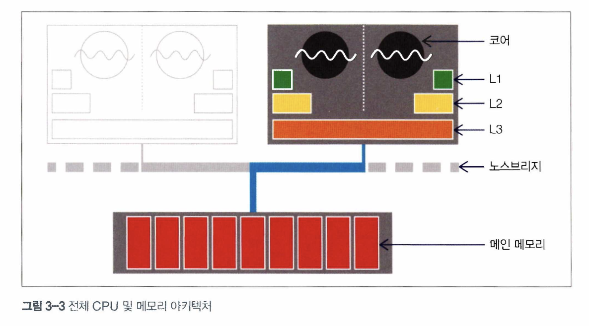

# Chapter 3. 하드웨어와 운영체제

하드웨어는 최신 컴퓨터의 저렴해진 '트랜지스터 가격' 이점을 극대화하기 위해 점점 더 복잡해졌고, 그 위에서 작동하는 소프트웨어 역시 새로운 기능을 발전시키는 과정에서 복잡도를 더했습니다.   
그 결과, 소프트웨어는 강력한 파워를 자유자재로 구사할 수 있을 정도로 발전했지만, 성능 향상을 꾀하려면 복잡한 기반 기술에 의지해야 할 수밖에 없게 됐습니다.

자바 언어는 컴퓨팅 파워가 향상되면서 많은 혜택을 받았습니다.   
언어 및 런타일 설계가 프로세서가 강력해지는 시류와 잘 맞아 떨어졌지만, 성능을 진지하게 고민하는 자바 프로그래머는 가용 리소스를 최대한 활용할 수 있또록 자바 플랫폼의 근간 원리와 기술을 잘 알고 있어야 합니다.   

## 3.1 최신 하드웨어 소개
아직도 많은 대학교의 하드웨어 아키텍처 수업은 너무 간단하고 고전적인 하드웨어 내용을 강의하는 경우가 허다합니다.   
하드웨어를 레지스터 기반으로 산술, 로직, 로그, 스토어 연산을 수행하는 '지극히 뻔한' 머신으로 바라보는 거죠.   
그러다 보니 학계는 CPU에게 실제로 일을 시키는 C 프로그래밍이야말로 진리의 원천인 양 지나치게 강조하는 편이지만 요즘 이런 생각은 맞지 않습니다.

## 3.2. 메모리

클론 속도가 증가하면 초당 더 많은 명령어를 처리할 수 있기 떄문에 무어의 법칙에 따라 개수가 급증한 트랜지스터는 처음엔 클록 속도를 높이는 데 쓰였습니다.      

하지만 클론 속도가 증가함에 따라 다른 문제가 생겼습니다.   
칩이 빨라질수록 데이터도 더 빨리 움직여야 하는데, 시간이 갈수록 프로세스 코어의 데이터 수요을 메인 메모리가 맞추기 어려워졌습니다.


결국 클록 속도가 올라가도 데이터가 도착할 떄까지 CPU는 놀면서 기다려야 하니 아무 소용이 없게 됐습니다.

### 3.2.1 메모리 캐시

그래서 CPU 캐시가 고안됐습니다.   
CPU 캐시는 CPU에 있는 메모리 영역입니다.   
레지스터보다 느리지만 메인 메모리보다는 훨씬 빠르기에 자주 엑세스하는 메모리 위치는 CPU가 메인 메모리를 재참조하지 않게 사본을 떠서 CPU 캐시에 보관하자는 아이디어입니다.

요즘 CPU에는 액세스 빈도가 높은 캐시일수록 프로세스 코어와 더 가까이 위치하는 식으로 여러 캐시 계층이 있습니다.   
CPU와 가장 가까운 캐시가 L1(레벨 1캐시), 그다음 L2 식으로 명명합니다.   
프로세스 아키텍처에 따라 캐시 개수 및 설정 상태는 제각각이지만, 일반적으로 각 실행 코어에 전용 프라이빗 캐시 L1, L2를 두고, 일부 또는 전체 코어가 공유하는 L3 캐시를 둡니다.


이렇게 캐시 아키텍처를 이용해 액세스 시간을 줄이고 코어가 처리할 데이터를 계속 채워 넣습니다.   
클록 속도와 액세스 시간의 차이 때문에 최신 CPU는 더 많은 예산을 캐시에 투자합니다.



위 그림은 완성된 설계도입니다.   
CPU 코어마다 전용 L1, L2 캐시가 있고 모든 코어가 공유하는 L3 캐시가 있습니다.   
메인 메모리는 노스브리지(Northbridge) 컴포넌트를 거쳐 액세스하고 이 버스를 관통함으로써 메인 메모리 엑세스 시간이 확 줄어듭니다.

이렇게 캐시 아키텍처를 추가한 덕분에 프로세서 처리율은 현저히 개선됐지만, 또 다른 새로운 고민거리가 시작됐습니다.   
메모리에 있는 데이터를 어떻게 캐시로 가져오고 캐시한 데이터를 어떻게 메모리에 다시 써야 할지 결정해야 했습니다.   
이 문제는 보통 캐시 일관성 프로토콜이라는 방법으로 해결합니다.

프로세서의 가장 저수준에서 MESI라는 프로토콜이 자주 눈에 뜁니다.
- Modified(수정) : 데이터가 수정된 상태 
- Exclusive(배타) : 이 캐시에만 존재하고 메인 메모리 내용과 동일한 상태
- Shared(공유) : 둘 이상의 캐시에 데이터가 들어 있고 메모리 내용과 동일한 상태
- Invalid(무효) : 다른 프로세스가 데이터를 수정하여 무효한 상태

요는, 멀티 프로세서가 동시에 공유 상태에 있을 수 있다는 것입니다.   
하지만, 어느 한 프로세서가 배타나 수정 상태로 바뀌면 다른 프로세서는 모두 강제로 무효 상태가 됩니다.


이 프로토콜에서는 프로세서가 상태를 바꾸겠다는 의사를 브로드캐스팅합니다.   
공유 메모리 버스를 통해 전기 신호를 보내면 다른 프로세서가 이를 알아차립니다.


프로세서가 처음 나왔을 당시에는 매번 캐시 연산 결과를 바로 메모리에 기록했습니다.   
이를 동시 기록(write-through)이라고 하며, 메모리 대역폭을 너무 많이 소모하는 등 효율이 낮아 요즘은 거의 사용하지 않습니다.   
그 이후 출시된 프로세서는 후기록(write-back) 방식을 채택하여 캐시 블록을 교체해도 프로세서가 변경된 캐시 블록만 메모리에 기록하므로 메인 메모리로 되돌아가는 트래픽이 뚝 떨어집니다.

캐시 기술 덕분에 데이터를 신속하게 메모리에서 쓰고 읽을 수 있게 됐습니다.   
메모리 대역폭 측면에서 그 효고랄 나타낼 수 있는데, 이론적으로 가능한 최대 전송률(burst rate)은 다음 인자에 따라 달라집니다.
- 메모리 클록 주파수
- 메모리 버스 폭(보통 64비트)
- 인터페이스 개수(요즘은 대부분 2개)

DDR RAM(DDR은 Double Data Rate(이중 데이터 전솔률)의 약자로 클록 신호 양단에서 통신함)은 최대 전송률이 2배입니다.   
2015년 상용 하드웨어에 이 공식을 적용하면 이론적인 최대 쓰기 속도는 8~12GB/s에 달합니다.

```java
public class Caching {
    
    private final int ARR_SIZE = 2 * 1024 * 1024;
    private final int[] testData = new int[ARR_SIZE];
    
    private void run() {
        System.err.println("Start： "+ System.currentTimeMillis());
        
        for (int i = 0; i < 15_000; i++) {
            touchEveryLine();
            touchEveryItem();
        }
        
        System.err.println("Warmup Finished： "+ System.currentTimeMiUis());
        System.err.println("Item Line");
        for (int i = 0; i < 100; i++) {
            long t0 = System.nanoTime();
            touchEveryLine();
            
            long tl = System.nanoTime();
            touchEveryItem();
            
            long t2 = System.nanoTime();
            long elItem = t2 - tl;
            long elLine = tl - t0;
            double diff = elItem - elLine;
            
            System.err.println(elItem + " " + elLine + " " + (100 * diff / elLine));
        }
    }
    
    private void touchEveryItem() {
        for (int i = 0; i < testData.length; i++)
            testData[i]++;
    }
    
    private void touchEveryLine() {
        for (int i = 0; i < testData.length; i += 16)
            testData[i]++;
    }
    
    public static void main(String[] args) {
        Caching c = new Caching();
        c.run();
    }
}

```

소스 코드만 보면 당연히 touchEveryItem() 메서드가 touchEveryLine () 메서드보다 16배 더 많이 일을 할 것 같지만, 여기서 포인트는 섣부른 직감만으로 JVM 성능 문제를 잘못 판단하기 쉽다는 사실입니다.


위 그래프튼 각 함수를 100회 실행한 결과입니다.   
시간 경과에 따른 패턴이 서로 비슷합니다.   
'16배 더 일을 많이 하리라'는 예상은 보기 좋게 빗나갔습니다.

외려 가장 지배적인 영향을 미치는 곳은 메모리 버스를 예열시키는 부분입니다.   
touchEveryItem(), touchEveryLine() 두 메서드를 이용해 배열 콘텐츠를 메인 메모리에서 캐시로 퍼 나르는 코드죠.

자바 성능을 논할 때는 객체 할당률에 대한 애플리케이션 민감도가 아주 중요합니다.

## 3.3. 최신 프로세서의 특성
흔히 하드웨어 엔지니어들은 신기능이 무어의 법칙에 따라 '트랜스터 예산을 쏟아부은' 결과라고 합니다.   
메모리 캐시는 점점 증가한 트랜지스터를 가장 확실하게 활용하는 분야지만, 지난 수년간 여러 가지 다른 기술도 등장했습니다.

### 3.3.1 변환 색인 버퍼(TLB)
**변환 색인 버퍼(TLB: Translation Lookaside Buffer)**는 여러 캐시에서 아주 긴요하게 쓰이는 장치입니다.   
가상 메모리 주소를 물리 메모리 주소로 매핑하는 페이지 테이블의 캐시 역할을 수행합니다.   
덕분에 가상 주소를 참조해 물리 주소에 액세스하는 빈번한 작업속도가 매우 빨라집니다.

TLB가 없으면 L1 캐시에 페이지 테입르이 있어도 가상 주소 룩업에 16사이클이나 걸리기 떄문에 성능이 제대로 나오지 않습니다.   
모든 최신 칩에서 TLB는 사실상 필연입니다.

### 3.3.2 분기 예측과 추측 실행
분기 예측은 최신 프로세서의 고급 기법 중 하나로, 프로세서가 조건 분기하는 기준값을 평가하느랴 대기하는 현상을 방지합니다.    
요즘 나온 프로세서는 다단계 명령 파이프라인을 이용해 CPU 1사이클도 여러 개별 단계로 나누어 실행하므로 여러 명령이 동시 실행 중일 수도 있습니다.

이런 모델에서 조건문을 다 평가하기 전까지 분기 이후 다음 명령을 알 수 없는게 문제입니다.   
그 결과, 분기문 뒤에 나오는 다단계 파이프라인을 비우는 동안 프로세서는 여러 사이클(실제로는 최대 20회) 동안 멎게 됩니다.

이런 일이 발생하지 않도록 프로세서는 트랜지스터를 아낌없이 활용해 가장 발생 가능성이 큰 브랜치를 미리 결정하는 휴리스틱을 형성합니다.   
마치 도박이라도 하듯 미리 추측한 결과를 바탕으로 파이프라인을 채우는 겁니다.       
운 좋게 추측이 맞아떨어지면 아무 일도 없었던 것처럼 CPU는 다음 작업을 진행하고, 틀리면 부분적으로 실행한 명령을 모두 폐기한 후 파이프라인을 비우는 대가를 치룹니다.

### 3.3.3 하드웨어 메모리 모델
> "어떻게 하면 서로 다른 여러 CPU가 일관되게 동일한 메모리 주소를 액세스할 수 있을까?"

이 질문의 답은 하드웨어에 따라 다르지만, JIT 컴파일러인 javac와 CPU는 일반적으로 코드 실행 순서를 바꿀 수 있습니다.   
물론 코드 실행 순서를 바꿔도 현재 스레드가 바라보는 결과는 아무런 영향이 없다는 전제가 필요합니다.

```java
myInt = otherInt; 
intChanged = true;
```
 
두 할당문 사이에 다른 코드는 없으니 실행 스레드 입장에서 이들이 어떤 순서로 오든 상관없습니다.   
그래서 실행 환경은 명령 순서를 자유롭게 바꿀 수 있습니다.

그러나 이 변수들을 바라보는 다른 스레드 입장에서 실행 순서가 달라지면 intChanged는 true로 보여도 myInt는 옛날 값을 읽을 가능성이 있습니다.


JVM은 프로세서 타입별로 상이한 메모리 액세스 일관성을 고려하여 명시적으로 약한 모델로 설계됐습니다.   
따라서 멀티스레드 코드가 제대로 작동하게 하려면 락과 volatile을 정확히 알고 사용해야 합니다.

## 3.4. 운영체제
OS의 주 임무는 여러 실행 프로세스가 공유하는 리소스 액세스를 관장하는 일입니다.      
모든 리소스는 한정돼 있고 프로세스는 저마다 리소스를 더 차지하려고 덤벼들기 때문에 리소스 양을 보고 골고루 나누어 줄 중앙 시스템이 있어야 합니다.   
한정된 리소스 가운데서도 메모리와 CPU 시간은 가장 중요한 쌍벽입니다.

메모리 관리 유닛(MMU: Memory Management Unit)을 통한 가상 주소 방식과 페이지 테스블은 메모리 액세스 제어의 핵심으로서, 한 프로세스가 소유한 메모리 영역을 다른 프로세스가 훼손하지 못하게 합니다.

TLB는 물리 메모리 주소 룩업 시간을 줄이는 하드웨어 기능입니다.   
아무래도 버퍼를 사용하면 소프트웨어가 메모리에 액세스하는 성능이 향상되지만, MMU는 개발자가 세부를 파악해서 직접 손대기엔 너무 저수준 영역이므로 대신 OS 액세스 스케줄러를 자세히 살펴보겠습니다.    
CPU 액세스를 제어하는 OS 액세스 스케줄러는 유저 입장에서 훨씬 시각적인 OS 커널 요소입니다.

### 3.4.1. 스케줄러
프로세스 스케줄러는 CPU 액세스를 통제합니다.   
이때 실행 큐(run queue/실행 대상이지만 CPU 차례를 기다려야 하는 스레드 혹은 프로세스 대기 장소)라는 큐를 이용합니다.   
최신 시스템은 거의 향상 가능한 수준보다 더 많은 스레드/프로세스로 가득하기 때문에 CPU 경합을 해소할 장치가 절실합니다.

스케줄러는 인터럽트에 응답하고 CPU 코어를 관리합니다.


위 그름에서 OS 스케줄러는 스레드를 시스템 단일 코어로 분주히 나릅니다.   
스케줄러는 할당 시간 끝 무렵에 실행 큐로 스레드를 되돌려서 큐의 맨 앞으로 가 다시 실행될 때까지 대기시킵니다.

스레드가 자신이 할당받은 시간을 자발적으로 포기하려면 sleep() 메서드로 잠들 시간을 설정하거나 wait() 메서드로 대기 조건을 명시합니다.

스케줄러의 움직임을 확인하는 가장 쉬운 방법은 OS가 스케줄링 과정에서 발생시킨 오버헤드를 관측하는 겁니다.   
아래 코드는 1밀리초씩 총 1,000회 스레드를 재웁니다.    
스레드는 한번 잠 들 때마다 실행 큐 맨 뒤로 가고 새로 시간을 할당받을 때까지 기다리므로 이 코드의 총 실행 시간을 보면 여느 프로세스에서 스케줄링 오버헤드가 얼마나 될지 짐작할 수 있습니다.

```java
long start = System. currentTimeMillis(); 
for (int i= 0; 1<1_000; i++) { 
    Thread. sleep (1);
}
long end =System.currentTimeMillis(); 
System.out.printin("Millis elapsed: " + (end - start) / 4000.0);
```

### 3.4.2. 시간 문제
POSIX(이식 가능 운영체제 인터페이스) 같은 업계 표준이 있어도 OS는 저마다 다르게 작동합니다.

OpenJDK에서 이 함수에는 실제로 작업을 수행하고 자바 System.currentTimeMillis() 메서드의 반환값을 공급하는 OS에 특정한 호출이 있습니다.

윈도우는 물리 타이밍 하드웨어에 따라 달라지는 시스템 클록의 '실 정확도'라는 개념이 있어서 자바에서 타이밍 콜을 해도 그 작동 방식은 윈도우가 위치한 머신에 따라 달라집니다.

### 3.4.3. 컨텍스트 교환
**컨텍스트 교환(Context Switch)** 은 OS 스케줄러가 현재 실행 중인 스레드/태스크를 없애고 대기 중인 다른 스레드/태스크로 대체하는 프로세스입니다.

유저 스레드 사이에 발생하든, 유저 모드에서 커널 모드로 바뀌면서(모드 교환(mode switch)이라고도 합니다) 일어나든 컨텍스트 교환은 비싼 작업입니다.


## 3.5. 단순 시스템 모델
## 3.6.


