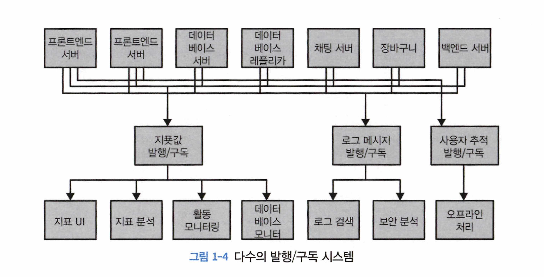

# Chapter 1. 카프카 시작하기
모든 기업은 데이터로 움직인다.    
데이터의 모든 부분은 의미가 있으며, 그 다음 처리되어야 하는 작업과 같이 뭔가 중요한 정보를 담고 있다.    
이것이 무엇인지 알기 위해서는 데이터를 생성된 곳에서 분석할 수 있는 곳으로 옮겨야 한다.

이러한 작업을 더 빠르게 해낼수록 조직은 더 유연해지고 민첩해진다.    
우리가 데이터를 이동시키는 작업에 더 적은 노력을 들일수록 핵심 비즈니스에 더욱 집중할 수 있다.    
데이터가 중심이되는 기업에서 파이프라인이 중요한 핵심적은 요소가 되는 이유는 바로 이것 때문이다.

## 1.1 발행/구독 메시지 전달
발행/구독 메시지 전달 패턴의 특징은 전송자(발행하는 쪽)가 데이터(메시지)를 보낼 때 직접 수신자(구독하는 쪽)로 보내지 않는다는 것이다.    
대신, 전송자(쓰는 쪽)는 어떤 형태로든 메시지를 분류해서 보내고, 수신자(읽는 쪽)는 이렇게 분류된 메시지를 구독한다.    
발행/구독 시스템에는 대개 발행된 메시지를 전달받고 중계해주는 중간 지점을 하는 브로커가 있다.

### 1.1.1 초기의 발행/구독 시스템
발행/구독 패턴을 따르는 많은 사례들은 비슷한 형태로 시작한다.   
즉, 가운데 간단한 메시지 큐나 프로세스 간 통신 채널을 놓는 것이다.    
예를 들어, 모니터링 지표를 보내야 하는 애플리케이션을 개발했다고 치면, 아래 그림과 같이 애플리케이션에서 지표를 대시보드 형태로 보여주는 앱으로 연결을 생성하고 그 연결을 통해 지표를 전송한다.    
    
모니터링을 시작하는 시점에서는 단순한 문제에 걸맞는 단순한 해법이라고 할 수 있겠지만, 오래가지 않아서 좀 더 장기간에 걸쳐 지푯값을 분석하고자 하면 해당 대시보드가 잘 작동하지 않는다는 걸 알게된다.

시간이 좀 더 흐르면 이러한 서버들에서 지표를 가져다 여러 목적으로 활용하는 더 많은 애플리케이션이 추가되어 아래와 같은 아키텍처가 되는데, 이렇게 되면 연결을 추적하는 것은 더 힘들어진다.   
    
이러한 방식에서 발생하는 기술 부채는 명백하기 때문에 다소 개선의 필요가 있다.    
모든 애플리케이션으로부터 지표를 받는 하나의 애플리케이션을 만들고 이 지푯값들을 필요로 하는 어느 시스템이든 질의할 수 있도록 해주는 서버를 제공하면 된다.

이렇게 하면 아래와 같이 복잡성이 줄어든 아키텍처를 만들 수 있다.    

### 1.1.2 개별 메시지 큐 시스템
지표를 다루는 것과 동시에 로그 메시지에 대해서도 비슷한 작업을 해줘야 한다.     
또한 프론트엔드 웹사이트에서의 사용자 활동을 추적해서 이 정보를 기계 학습 개발자에게 제공하거나 관리자용 보고서를 생성하는 데 사용할 수도 있는데, 비슷한 시스템을 구성함으로써 정보의 발행자와 구독자를 분리할 수 있다.

    
1-2 그림에 묘사된 포인트 투 포인트 연결을 활용하는 방식보다 해당 그림이 더 바람직하지만 여기는 중복이 많다.    
이렇게 되면 버그도 한계도 제각각인 다수의 데이터 큐 시스템을 유지 관리해야 한다.    
여기에 메시지 교환을 필요로 하는 사례가 추가로 생길 수 있다.    
비즈니스가 확장됨에 따라 함께 확장되는, 일반화된 유형의 데이터를 발행하고 구독할 수 있는 중앙 집중화된 시스템이 필요하다.

## 1.2 카프카 입문
아파치 카프카는 위에서 설명한 것과 같은 문제를 해결하기 위해 고안된 메시지 발행/구독 시스템이다.    
분산 커밋 로그 혹은 분산 스트리밍 플랫폼이라 불리기도 한다.    
파일 시스템이나 데이터베이스 커밋 로그는 모든 트랜잭션 기록을 지속성 있게 보존함으로써 시스템의 상태를 일관성있게 복구할 수 있도록 고안되었다.   
이와 유사하게 카프카에 저장된 데이터는 순서를 유지한 채로 지속성 있게 보관되며 결정적으로 읽을 수 있다.    
또한 확장시 성능을 향상시키고 실패가 발생하더라도 데이터 사용에는 문제가 없도록 시스템 안에서 데이터를 분산시켜 저장할 수 있다.

### 1.2.1 메시지와 배치
카프카에서 데이터의 기본 단위는 메시지다.    
데이터베이스 쪽 배경을 가진 사람의 눈에 카프카의 메시지는 데이터베이스의 로우나 레크드와 비슷해 보일 수도 있지만, 카프카 입장에서 메시지는 단순히 바이트의 배열일 뿐이기에 여기에 포함된 데이터에는 특정한 형식이나 의미가 없다.

키값에서 일정한 해시값을 생성한 뒤 이 값을 토픽의 파티션 수로 나눴을 때 나오는 나머지 값에 해당하는 파티션에 메시지를 저장하여 같은 키값을 가진 메시지는 (파티션 수가 변하지 않는 한) 항상 같은 파티션에 저장된다.

### 1.2.2 스키마
### 1.2.3 토픽과 파티션
### 1.2.4 프로듀서와 컨슈머
### 1.2.5 브로커와 클러스터
### 1.2.6 다중 클러스터

