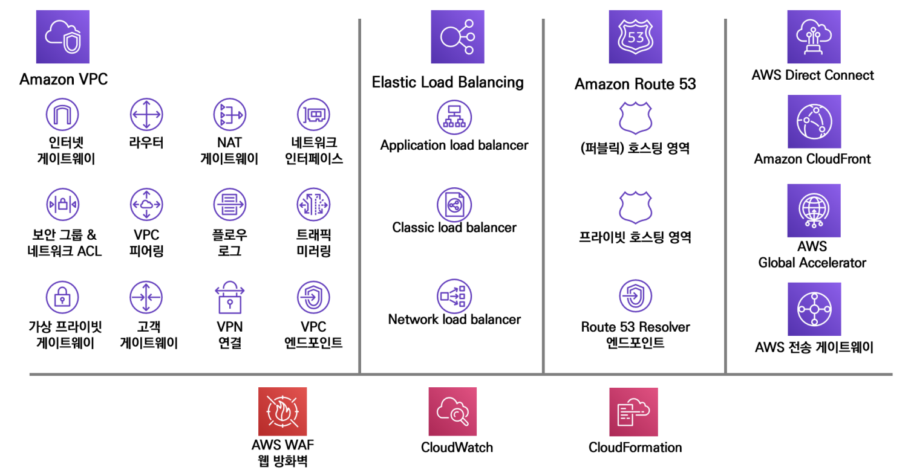
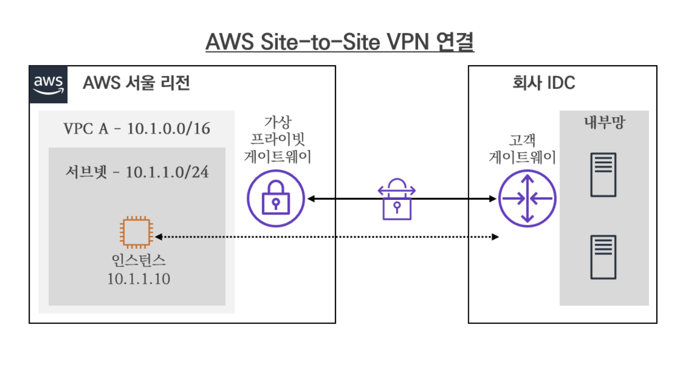
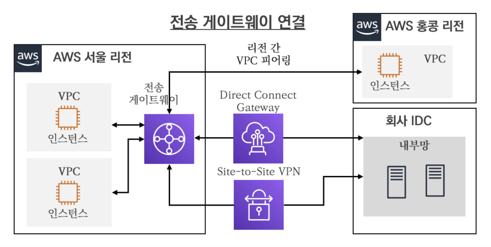

# 01장 AWS 인프라
## 02. AWS Network 소개
- 네트워크 서비스를 중심으로 AWS Network 관련 주요 제품(서비스)에 대해서 알아보자.

### 1.2.1. AWS VPC - 리소스 격리
- VPC는 Virtual Private Cloud 의 약자로 AWS 클라우드 내 논리적으로 독립된 섹션을 제공하여, 사용자가 정의한 가상 네트워크상에서 다양한 AWS 리소스를 실행할 수 있게 지원한다.
- 한마디로 독립된 가상의 클라우드 네트워크라고 볼 수 있다.

### 1.2.2. AWS VPN - 가상 사설망
- VPN(Virtual Private Network)은 공용 인터넷을 통해 까상의 사설 네트워크를 구성하여 프라이빗 통신을 제공한다.
  - 이를 통해 데이터 암호화, 전용 연결 등 여러 보안 요구사항들을 충족할 수 있다.
  - AWS 에서 제공하는 관리형 VPN 서비스에는 Site-to-Site VPN 과 클라이언트 VPN 을 제공한다.

  
### 1.2.3. ELB - 로드 벨런서
- ELB 는 Elastic Load Balancing 의 약자로 AWS에서 제공하는 로드 밸런싱(부하 분산) 기술이다.
- 로드 밸런서는 서비스 대상 시스템(예: EC2 인스턴스)에 데이터를 분산하여 전달하는 역할을 수행한다.

### 1.2.4. AWS PrivateLink - 프라이빗 연결
- AWS PrivateLink 는 퍼블릭 인터넷에 데이터가 노출되지 않도록 하고 내부 네트워크를 통해 AWS 서비스와 온프레미스 간에 안전한 비공개 연결을 제공한다.

### 1.2.5. Route 53 - 도메인 네임 시스템
- Route 53은 AWS 에서 제공하는 관리형 DNS 서비스이다.
  - Route 53을 통하여 도메인 이름 구매를 대행하고, 구매한 도메인 주소에 대한 호스팅 영역 설정을 통해서 도메인 질의(Query)에 대한 응답을 처리할 수 있다.
  - 추가로 Route 53 Resolver 기능을 통하여 하이브리드 클라우드 환경에서 온프레미스(On-Premises)와 AWS 간 도메인 질의가 가능하게 한다.

### 1.2.6. AWS 전송 게이트웨이 - 네트워크 확장
- AWS 전송 게이트웨이는 VPC 나 온프레미스(On-Premises) 등의 네트워크를 단일 지점으로 연결할 수 있는 라우팅 서비스이다.

### 1.2.7. AWS Direct Connect - AWS 전용 연결
- Direct Connect 는 데이터 센터, 본사 사무실 또는 코로케이션(Co-Location) 환경과 같은 장소에서 AWS와의 전용 네트워크 연결을 제공하는 전용선 서비스이다.

### 1.2.8. AWS CloudFront - CDN(콘텐츠 전송/캐시)
- CloudFront 는 AWS 에서 제공하는 CDN 서비스이다.
  - CloudFront 는 전 세계 42개국 84개 도시에서 216개의 엣지 POP 을 두고 AWS 글로벌 네트워크를 통하여 콘텐츠를 캐싱하여 서비스를 제공한다. 

### 1.2.9. AWS Global Accelerator - 글로벌 전송
- AWS Global Accelerator 는 로컬 또는 글로벌 사용자를 대상으로 애플리케잉션의 가용성과 성능을 개선할 수 있는 서비스이다.
  - AWS 의 글로벌 네트워크를 통해 사용자에서 애플리케이션으로 이어진 경로를 최적화하여 트래픽의 성능을 개선한다.

### 1.2.10. 네트워크 보안
- AWS 의 네트워크 기반의 보안 기능으로 보안 그룹, 네트워크 ACL, 웹 방화벽이 있다.

---