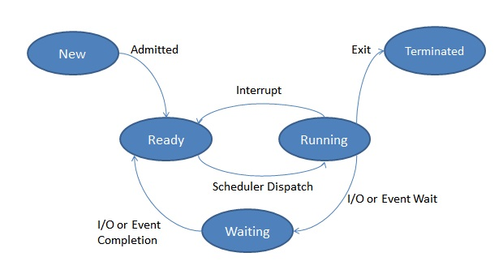

# Chapter 10 프로세스와 스레드
## 10-2. 프로세스 상태와 계층 구조
- 프로세스는 모두 저마다의 상태가 있다.
  - 운영체제는 이런 프로세스의 상태를 PCB에 기록하여 관리한다.
  - 그리고 많은 운영체제는 동시에 실행되는 수많은 프로세스를 계층적으로 관리한다.

### 프로세스 상태
- 컴퓨터를 사용할 때 여러 프로세스들이 빠르게 번갈아 가면서 실행된다.
  - 그 과정에서 하나의 프로세스는 여러 상태를 거치며 실행된다.
  - 그리고 운영체제는 프로세스의 상태를 PCB를 통해 인식하고 관리한다.
  - 프로세스의 상태를 표현하는 방식은 운영체제마다 조금씩 차이가 있지만, 프로세스가 가질 수 있는 대표적인 상태는 아래와 같다.

#### 생성 상태(new)
- 프로세스를 생성 중인 상태를 **생성 상태** 라고 한다. 
- 이제 막 메모리에 적재되어 PCB를 할당받을 상태를 뜻한다.
- 생성 상태를 거쳐 실행할 준비가 완료된 프로세스는 곧바로 실행되지 않고 준비 상태가 되어 CPU의 할당을 기다린다.

#### 준비 상태(ready)
- 당장이라도 CPU는 할당 받아 실행할 수 있지만, 아직 자신의 차례가 아니기에 기다리고 있는 상태이다.
- 준비 상태 프로세스는 차례가 되면 CPU를 할당받아 실행 상태가 된다.

#### 실행 상태(running)
- CPU를 할당받아 실행 중인 상태를 의미한다.
- 실행 상태인 프로세스는 할당된 일정 시간 동안만 CPU를 사용할 수 있따.
- 이때 할당된 시간을 모두 사용한다면(타이머 인터럽트가 발생하면) 다시 준비 상태가 되고, 실행 도중 입출력장치를 사용하여 입출력장치의 작업이 끝날 때까지 기다려야 한다면 대기 상태가 된다.

#### 대기 상태(blocked)
- 프로세스는 실행 도중 입출력장치를 사용하는 경우가 있다.
  - 입출력 작업은 CPU에 비해 처리 속도가 느리기에, 입출력 작업을 요청한 프로세스는 입출력장치가 입출력을 끝낼 때까지(입출력 완료 인터럽트를 받을 때까지) 기다려야 한다.
  - 이렇게 입출력 장치의 작업을 기다리는 상태를 **대기 상태(blocked)** 이라 한다.
  - 입출력 작업이 완료되면 해당 프로세스는 다시 준비 상태로 CPU 할당을 기다린다.

#### 종료 상태(terminated)
- 프로세스가 종료된 상태이다.
- 프로세스가 종료되면 운영체제는 PCB와 프로세스가 사용한 메모리를 정리한다.

#### 프로세스 상태 다이어그램(process state diagram)

- 위와 같은 도표를 프로세스 상태 다이어 그램이라 한다.
- 이처럼 컴퓨터 내의 여러 프로세스는 생성, 준비, 실행, 대기, 종료 상태를 거치며 실행된다.
- 운영체제는 이 상태를 PCB에 기록하며 프로세스들을 관리하는 것이다.
> 이미지 출처 : https://scanftree.com/operating-system/process-state

> #### 여기서 잠깐) 대기 상태의 일반적인 정의
> - 프로세스가 대기 상태가 되는 이유에 입출력 작업만 있는 것은 아니다.
> - 조금 더 일반적으로 표현자마녀 특정 이벤트가 일어나길 기다릴 때 프로세스는 대기 상태가 된다.
> - 다만, 프로세스가 대기 상태가 되는 대부분의 원인이 입출력 작업이기 때문에 '프로세스가 입출력 작업을 하면 대기 상태가 된다'고 생각해도 무방하다.

### 프로세스 계층 구조
- 프로세스는 실행 도중 시스템 호출을 통해 다른 프로세스를 생성할 수 있다.
  - 이때 새 프로세르를 생성한 프로세스를 **부모 프로세스(parent process)** , 부모 프로세스에 의해 생성된 프로세스를 **자식 프로세스(child process)** 라고 한다.
- 부모 프로세스와 자식 프로세스는 엄연히 다른 프로세스이기에 각기 다른 PID를 가진다.
  - 일부 운영체제에서는 자식 프로세스의 PCB에 부모 프로세스의 PID인 **PPID(Parent PID)** 가 기록되기도 한다.
- 부모 프로세스로부터 생성된 자식 프로세스는 실행 과정에서 또 다른 자식 프로세스를 생성할 수 있고, 그 자식 프로세스는 실행 과정에서 또 다른 자식 프로세스를 생성할 수 있다.
  - 많은 운영체제는 이처럼 프로세스가 프로세스를 낳는 계층적인 구조로써 프로세스들을 관리한다.
  - 컴퓨터가 부팅될 때 실행되는 최초의 프로세스가 자식 프로세스들을 생성하고, 생성된 자식 프로세스들이 새로운 프로세스들을 낳는 형식으로 여러 프로세스가 동시에 실행되는 것이다.

> #### 여기서 잠깐) 최초의 프로세스
> - Q: 모든 프로세스의 가장 위에 있는 최초의 프로세스는 무엇일까?
> - A: 최초의 프로세스는 유닉스 운영체제에서는 int, 리눅스 운영체제에서는 systemd, macOS에서는 launchd라고 한다.
>   - 최초의 프로세스 PID 항상 1번이며, 모든 프로세스 최상단에 있는 부모 프로세스이다.
>   - pstree 명령어는 프로세스 계층 구조를 보여주는 명령어이다.
>     - 리눅스에서 pstree 명령어를 입력하면 systemd가 최상단에 있다는 것을 확인할 수 있고, macOS에서 pstree 명령어를 입력하면 launched가 최상단에 있는 것을 확인할 수 있다.

### 프로세스 생성 기법
- 부모 프로세스가 자식 프로세스를 어떻게 만들어 내고, 자식 프로세스는 어떻게 자신만의 코드를 실행하는지 더 자세히 알아 보자.
- 결론부터 말하면, 부모 프로세스를 통해 생성된 자식 프로세스들은 **복제와 옷 갈아입기** 를 통해 실행된다.
  - 조금 더 정확하게, 부모 프로세스는 **fork** 를 통해 자신의 복사본을 자식 프로세스로 생성해내고, 만들어진 복사본(자식 프로세스)은 **exec** 을 통해 자신의 메모리 공간을 다른 프로그램으로 교체한다.
    - fork와 exec는 시스템 호출이다.
    - 부모 프로세스는 fork 시스템 호출을 통해 자신의 복사본을 자식 프로세스로 생성한다.
      - 즉, fork는 자기 자신 프로세스의 복사본을 맏느는 시스템 호출이다.
      - 자식 프로세스는 부모 프로세스의 복사본이기 때문에 부모 프로세스의 자원들, 이를테면 메모리 내의 내용, 열린 파일의 목록 등이 자식 프로세스에 상속된다.(복사된 자식 프로세스라 할지라도 PID 값이나 저장된 메모리 위치는 다르다.)
    - fork를 통해 복사본이 만들어진 뒤에 자식 프로세스는 exec 시스템 호출을 통해 새로운 프로그램으로 전환된다.
    - exec는 자신의 메모리 공간을 새로운 프로그램으로 덮어쓰는 시스템 호출이다.
      - 다시 말해 새로운 프로그램 내용으로 전환하여 실행하는 시스템 호출이다.
    - 메모리 공간에 새로운 프로그램 내용이 덮어 써진다는 점에서 이는 자식 프로세스가 새로운 옷을 갈아입었다고 볼 수 있다.
      - exec를 호출하면 코드 영역과 데이터 영역의 내용이 실행할 프로그램의 내용으로 바뀌고, 나머지 영역은 초기화된다.
- 정리하면 부모가 자식 프로세스를 실행하며 프로세스 계층 구조를 이루는 과정은 fork과 exec가 반복되는 과정이라 볼 수 있다.
  - 쉽게 말해 부모 프로세스로부터 자식 프로세스가 복사되고, 자식 프로세스는 새로운 프로그램으로 옷을 갈아입고, 또 그 자식 프로세스로부터 자식 프로세스가 복사되고, 옷을 갈아입는 방식으로 여러 프로세스가 계층적으로 실행되는 것이다.
- 부모 프로세스가 자식 프로세스를 fork한 뒤에 부모 프로세스, 자식 프로세스 누구도 exec를 호출하지 않는 경우도 있다.
  - 이 경우 부모 프로세스와 자식 프로세스는 같은 코드를 병행하여 실행하는 프로세스가 된다.
---
